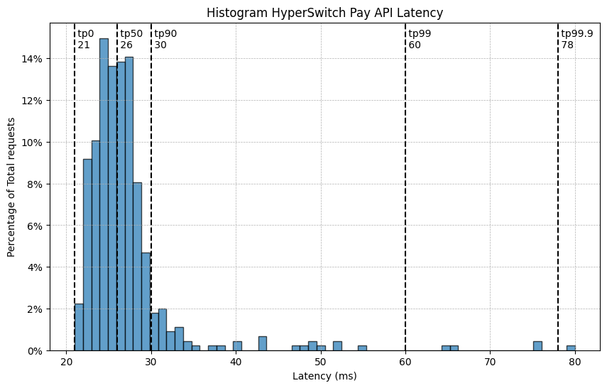
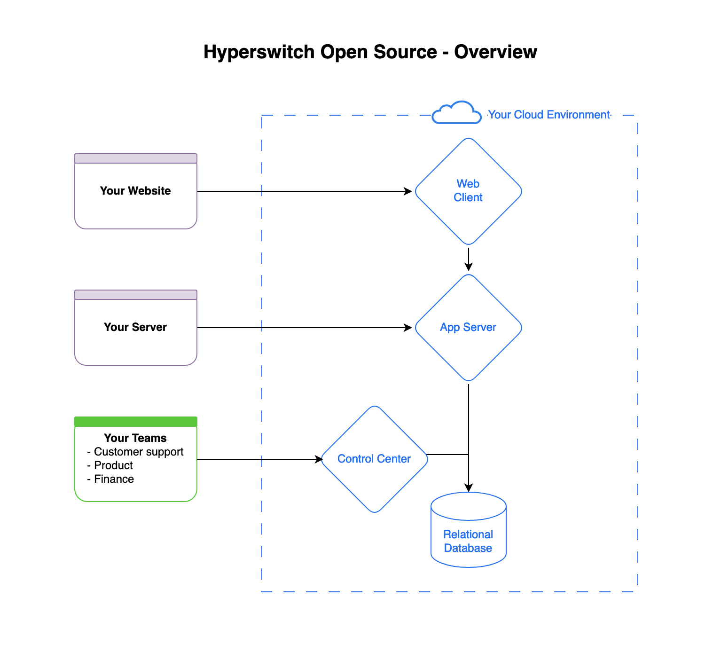
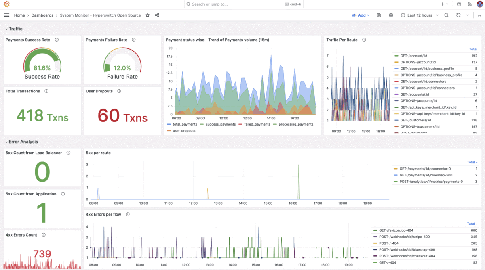
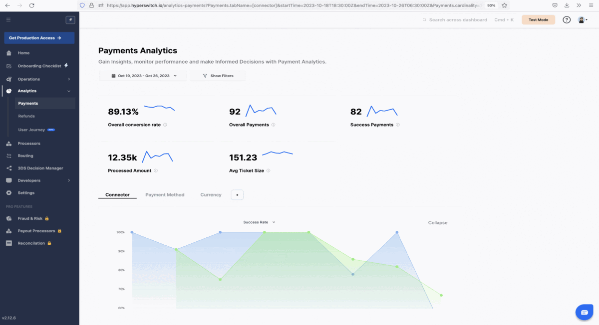
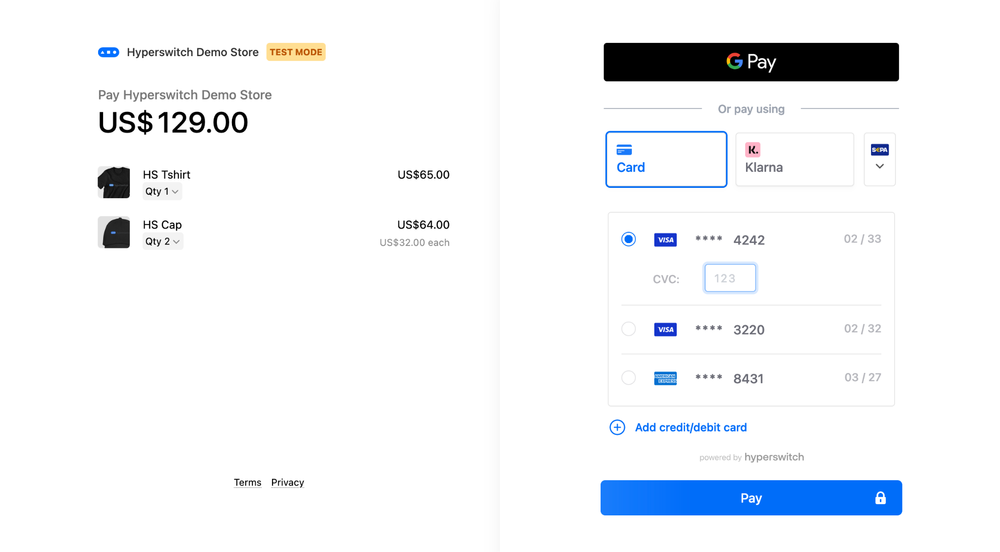

# 👋 Hello world



## Hyperswitch and the payments ecosystem

Hyperswitch is a unified API to connect with dozens of different payment processors, each with very different internal APIs and SDKs. In other words, our payment switch is a set of payments domain abstractions, built over the capabilities of leading payment processors, wallets, Buy Now Pay Later (BNPL) providers and banks.

Hyperswitch can simplify your payment integrations and allow you to take full control of your payments.

Using Hyperswitch, you can:

* ⬇️ **Reduce dependency** on a single processor like Stripe or Braintree
* 🧑‍💻 **Reduce Dev effort** to add & maintain integrations by 90%&#x20;
* 🚀 **Improve success rates** with seamless failover and auto-retries
* 💸 **Reduce processing fees** with smart routing
* 🎨 **Customize payment flows** with full visibility and control
* 🌐 **Increase business reach** with local/alternate payment methods

The current payment landscape is extremely diverse, with 500+ payment processors, 200+ wallets, 130+ bank transfer options, local payment solutions and so on. Over the years, this has increased the number of fintech layers, resulting in more latency and cost associated with each transaction. In addition to this, connecting and maintaining multiple payment integrations requires a lot of development effort.

The payment ecosystem is:

* Dominated by closed systems and walled gardens
* Ever increasing diversity
* Becoming expensive for businesses

These problems can only be solved by open systems and this is what Hyperswitch is all about:

> A community led, open payments switch to enable access to the best payments infrastructure for every digital business.

## What to expect


**Do you prefer a Fully Managed Solution ?**\
We also offer a Hyperswitch Cloud Hosted solution which comes with out-of-the-box PCI compliance and carries the all features as the open source offering.\
\
[Click here](https://opensource.hyperswitch.io/hyperswitch-cloud/quickstart) to get started quickly.


An infrastructure solution that's super lightweight and scalable

Hyperswitch is optimized for sub 30 ms application overhead (and getting better) and falls within 5% of the payment processor's latency. The application can absorb any shock resulting from unusual traffic spikes and uses a distributed key-value store for high frequency write operations

One click cloud deployment

Hyperswitch supports one-click kubernetes deployment through CDK scripts. The deployment includes an app server, a control center and a web client

Full visibility and control

You can monitor system health by exporting your AWS Cloudwatch metrics to Grafana and stream application logs from Hyperswitch to Loki/Kibana for storing and viewing logs

Simplified payment operations

Hyperswitch provides a control center to handle all your payment operations like adding payment processors, managing payment routing and viewing analytics

Mobile responsive &#x26; PCI Compliant Web Checkout

Finally, you can self-host your own PCI compliant web checkout and integrate it with your web&#x20;

app. Our web client is highly customizable and blends right in with your web app

## Join the movement

It doesn’t matter if you don’t come from a technical or a payments background (though it’s okay if you do too!) We made this guide to make Payments Infrastructure accessible to as many people as possible. The only prerequisite is that you know how to use a few dev tools and know some basic coding.

A Payments Switch allows you to connect with any Payment processing entity and enable any payment method without having to repeat the development or design effort multiple times. This can be achieved by a single integration with Hyperswitch. A lot of people have a misconception that you need to master all kinds of hard-to-get stuff to drive payment or even understand it.  But as you’ll see, those people are wrong. Here are a few things you _absolutely don’t need_ to run your own payments stack:

| Myth                     | Truth                                                                                                                            |
| ------------------------ | -------------------------------------------------------------------------------------------------------------------------------- |
| Lots of Compliance needs | Just a self assessment for PCI compliance if you process less than 6 million transactions a year. 1-month long process otherwise |
| Lots of complexity       | A single dashboard to view and review all your payment metrics                                                                   |
| Lots of Expense          | Flexibility to work with any payment processor to get best prices and cut down of multiple layers in between                     |

We are a small community of payment infrastructure enthusiasts that believe that payments should be a basic utility like water or electricity. We launched in Jan '2023 and we have released successive versions of the product, offering a feature-rich payments solution.

Our Parent entity, Juspay, is South-Asia's largest payment experience and Orchestration provider, processing more than 70 Million transactions every day. Launched in 2012, Juspay works with some of the largest enterprises and banks like Amazon, Google, Flipkart, HDFC to name a few.

<figure><picture><source srcset=".gitbook/assets/Screenshot 2023-12-01 at 3.48.33 PM.png" media="(prefers-color-scheme: dark)"></picture><figcaption></figcaption></figure>
