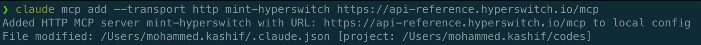
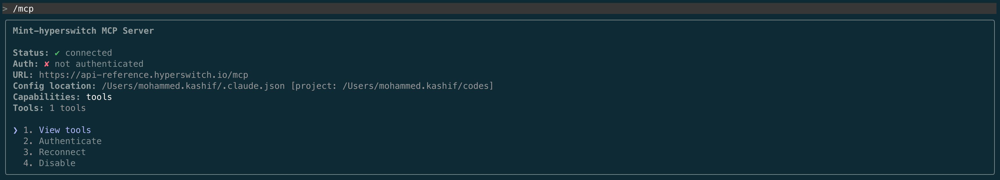

# Setup MCP Server


This MCP server is only meant for product exploration while using sandbox environment.\
**DO NOT USE Hyperswitch API Key from the PRODUCTION ENVIRONMENT.**


**Prerequisites**: Ensure you have an MCP client installed (Cursor, Claude Desktop, Cline, etc.)

**MCP URL:** `https://api-reference.hyperswitch.io/mcp`

### Step 1: Configure the HyperSwitch-Mintlify MCP server

HyperSwitch's Mintlify MCP server lets your AI client search HyperSwitch docs and safely explore Sandbox APIs as tools (e.g., create a payment and get a 3DS/redirect URL).

#### Recommended: Claude Code

Add it via CLI:
```bash
claude mcp add --transport http mint-hyperswitch https://api-reference.hyperswitch.io/mcp
```
On successfully adding this, you should see this output in CLI:



Run `claude` and verify if MCP was configured properly using `/mcp`. You should see an output similar to:



#### For configuring other MCP clients (Cursor / Claude Desktop / etc.)

Follow Mintlify's [client-specific setup guide](https://www.mintlify.com/docs/ai/model-context-protocol?_gl=1*1m5cmfd*_gcl_au*MTY1NjU2NDE1LjE3NjY0NzY1MzE.#example:-connect-to-the-mintlify-mcp-server) using the same MCP: `https://api-reference.hyperswitch.io/mcp`


### Step 2: Make your first payment

Paste below prompt in your AI client after replacing with your sandbox `API_KEY`:

```bash
Make a 100 EUR payment via Hyperswitch V1 in sandbox.
Sandbox API key: <YOUR_SANDBOX_API_KEY>
```

#### **Output:**&#x20;

You can head on to payment section in [Hyperswitch Control Center](https://app.hyperswitch.io/dashboard/payments) and verify the payment with the time stamp and status as `REQUIRES_CUSTOMER_ACTION` (depending on the flow you selected - 3DS vs No3DS).


Responses from AI tools can be incorrect, use with caution.\
and reach out to us on [slack](https://inviter.co/hyperswitch-slack) for any questions or further support.

