# Component Interaction Diagrams

**Purpose**: Visual documentation of component interactions and data flow within Hyperswitch architecture.

**Last Updated**: April 2026

## Overview

This document provides detailed interaction diagrams showing how different components of Hyperswitch communicate and process data throughout various payment flows.

## Table of Contents

1. [High-Level Architecture](#high-level-architecture)
2. [Payment Flow Interactions](#payment-flow-interactions)
3. [System Component Communications](#system-component-communications)
4. [Data Flow Patterns](#data-flow-patterns)
5. [Security Boundaries](#security-boundaries)

---

## High-Level Architecture

### System Context Diagram

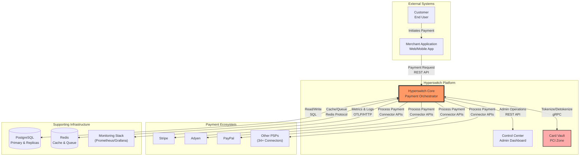

### Component Overview

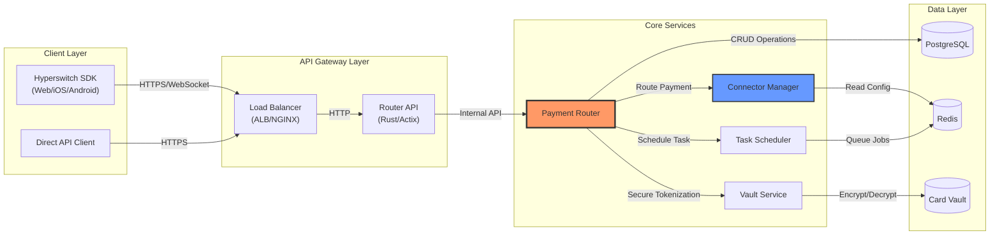

---

## Payment Flow Interactions

### Standard Payment Flow

```mermaid
sequenceDiagram
    participant C as Customer
    participant M as Merchant App
    participant SDK as Hyperswitch SDK
    participant API as Router API
    participant CACHE as Redis Cache
    participant DB as PostgreSQL
    participant ROUTER as Payment Router
    participant SMART as Smart Router
    participant CONN as Connector Manager
    participant PSP as Payment Processor
    participant VAULT as Card Vault

    C->>M: Initiate Checkout
    M->>SDK: Load Payment Form
    SDK->>API: POST /sessions
    API->>CACHE: Fetch Merchant Config
    CACHE-->>API: Config Data
    API->>DB: Validate API Key
    DB-->>API: Key Valid
    API->>DB: Create Payment Intent
    DB-->>API: Payment Intent ID
    API-->>SDK: Session Token + Methods
    SDK-->>C: Display Payment Options
    
    C->>SDK: Enter Card Details
    SDK->>VAULT: Tokenize Card (PCI)
    VAULT-->>SDK: Payment Method Token
    
    C->>SDK: Confirm Payment
    SDK->>API: POST /payments/{id}/confirm
    API->>ROUTER: Process Payment
    ROUTER->>CACHE: Get Routing Rules
    CACHE-->>ROUTER: Active Rules
    ROUTER->>SMART: Determine Connector
    SMART-->>ROUTER: Selected Connector
    
    ROUTER->>CONN: Execute Payment
    CONN->>PSP: API Call (e.g., Stripe)
    PSP-->>CONN: Authorization Response
    CONN-->>ROUTER: Connector Response
    
    ROUTER->>DB: Update Payment Status
    DB-->>ROUTER: Acknowledged
    
    ROUTER->>API: Payment Result
    API-->>SDK: Confirmation
    SDK-->>M: Payment Complete
    M-->>C: Order Confirmation
    
    Note over API,PSP: Async Webhook Processing
    PSP->>CONN: Webhook Notification
    CONN->>API: POST /webhooks/{psp}
    API->>DB: Update Payment Status
    API->>M: Merchant Webhook
```

### 3D Secure Authentication Flow

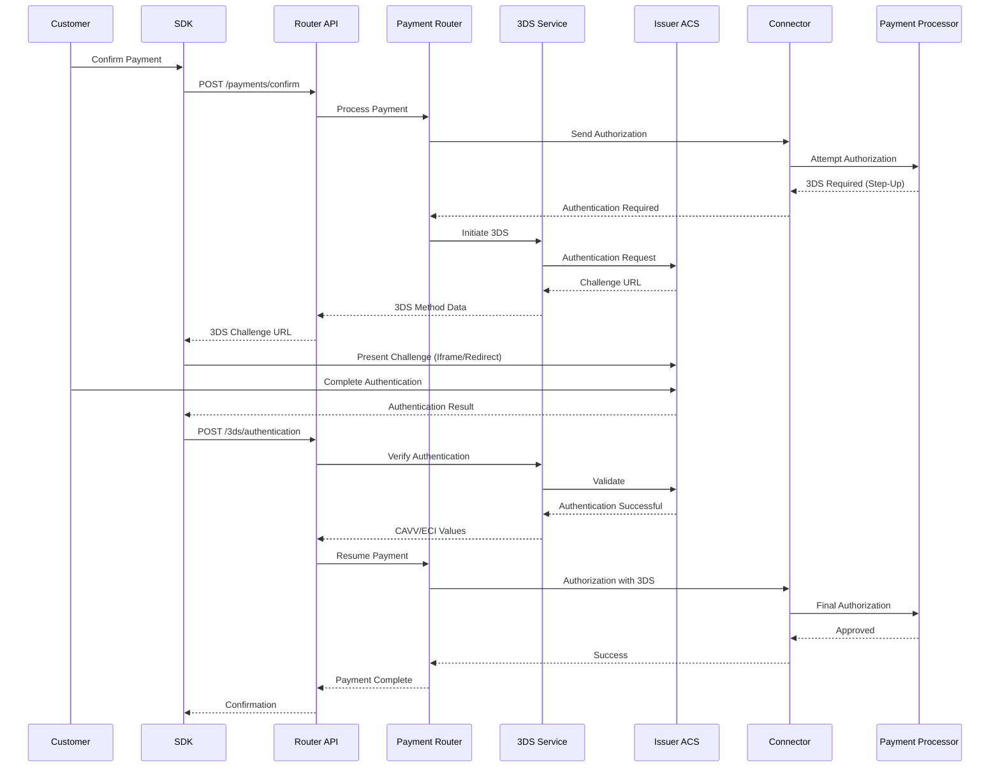

### Smart Routing Decision Flow

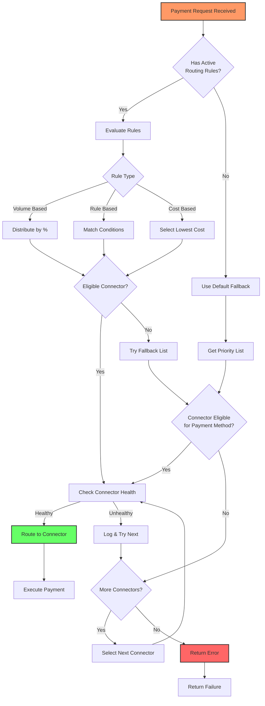

---

## System Component Communications

### Router Internal Architecture

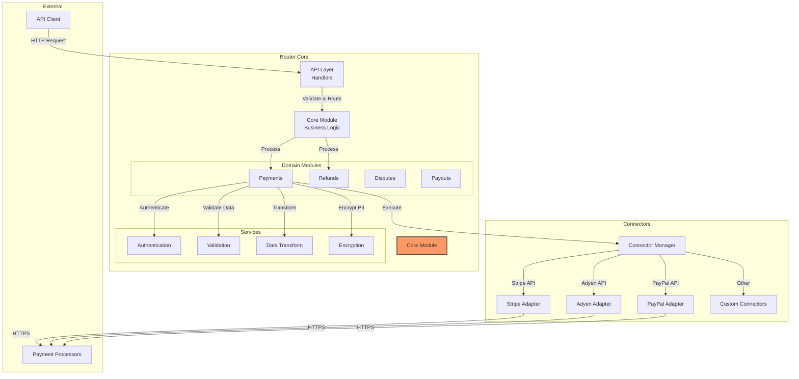

### Scheduler Job Processing

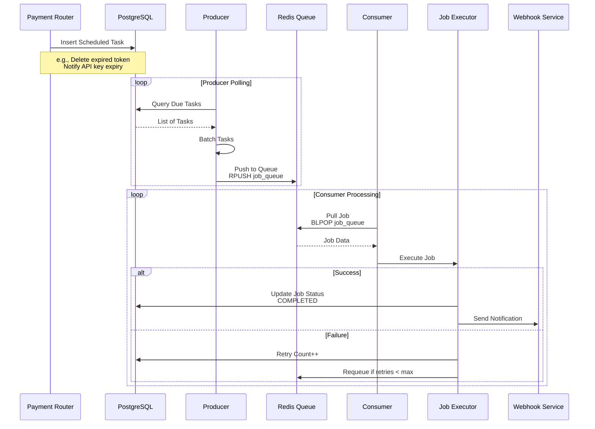

### Vault Service Interactions

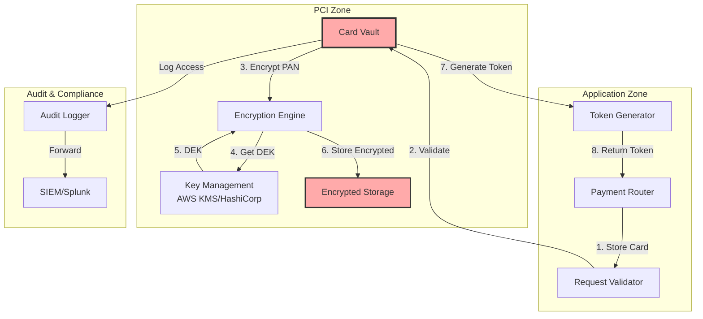

---

## Data Flow Patterns

### Write Path (Payment Creation)

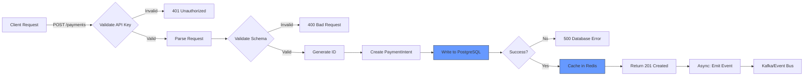

### Read Path (Payment Status)

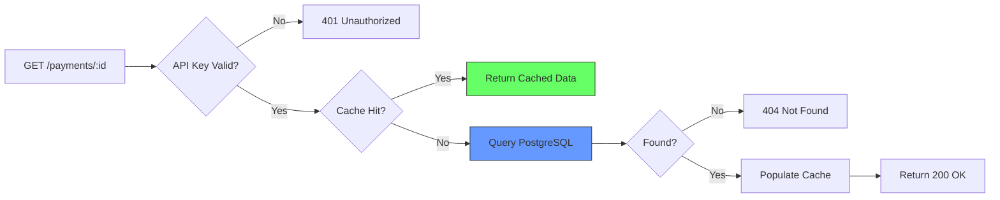

### Webhook Processing Flow

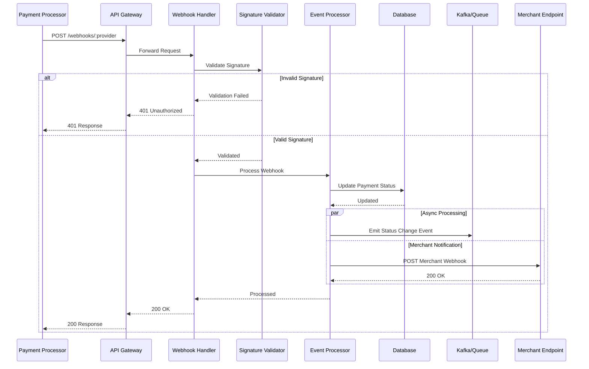

---

## Security Boundaries

### Network Security Zones

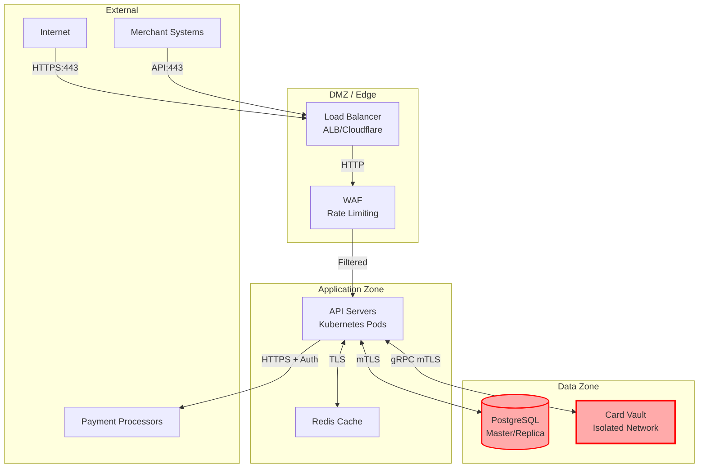

### Authentication Flow

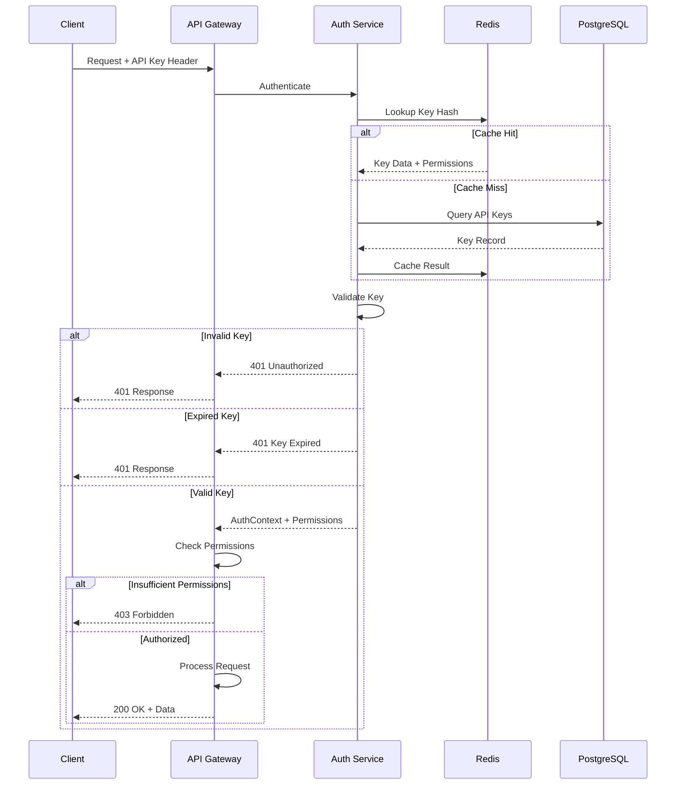

---

## Deployment Architecture

### Kubernetes Deployment Pattern

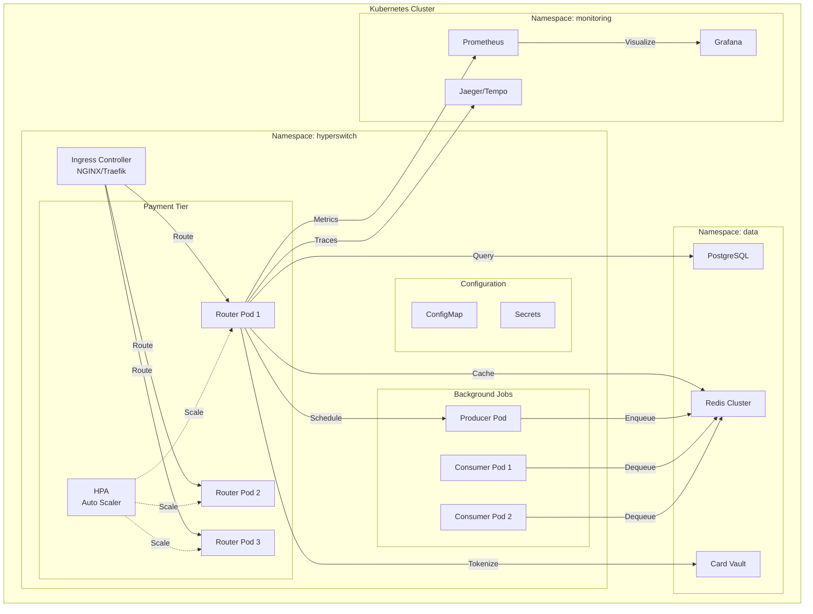

---

## Key Design Decisions

### Stateless Architecture

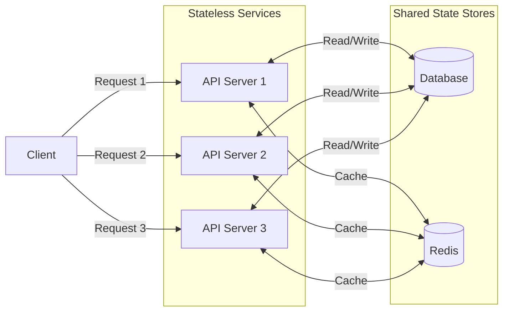

**Benefits:**
- Horizontal scaling without sticky sessions
- Easy rolling updates and rollbacks
- Fault tolerance (any pod can handle any request)
- Simplified deployment architecture

### Async Processing Pattern

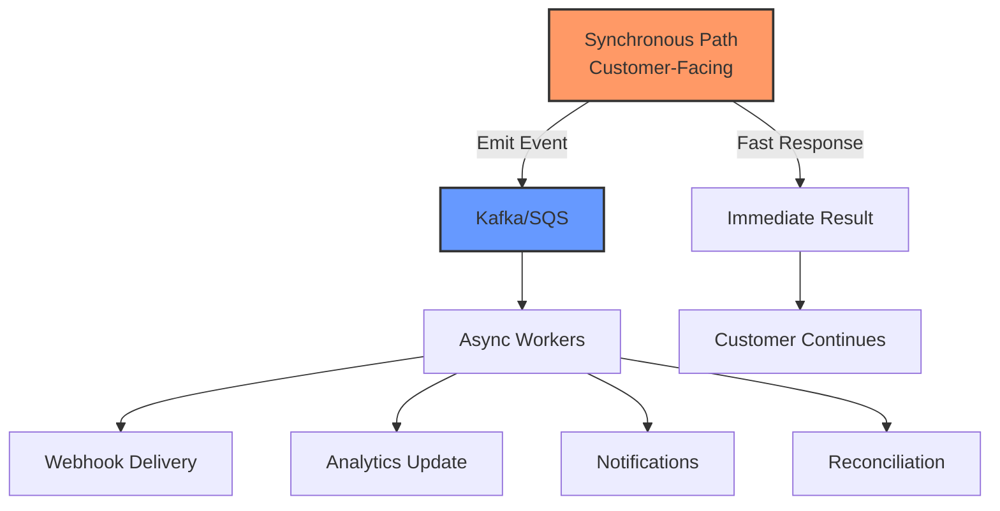

---

## Tools for Viewing Diagrams

These diagrams use **Mermaid** syntax and can be viewed in:
- GitHub/GitLab Markdown preview
- VS Code with Mermaid extension
- [Mermaid Live Editor](https://mermaid.live)
- [Notion](https://notion.so) (Mermaid block)
- [Obsidian](https://obsidian.md) (with plugin)

## Contributing

When adding new diagrams:
1. Follow existing naming conventions
2. Use consistent styling
3. Include explanatory text
4. Test in Mermaid Live Editor
5. Update this table of contents

---

**Document Owner**: Architecture Team  
**Review Frequency**: Quarterly  
**Last Review**: April 2026  
**Next Review**: July 2026