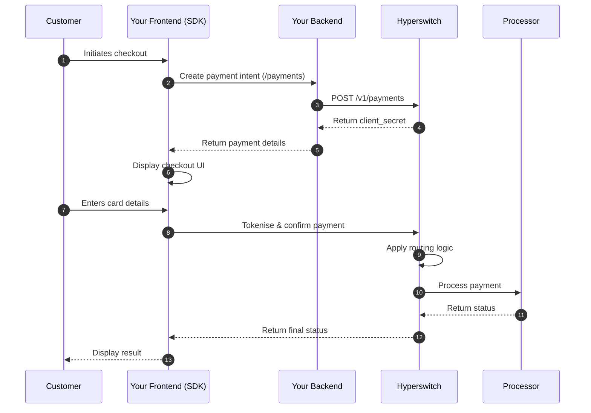

# Payment Suite

## TL;DR

Juspay Hyperswitch enables engineering teams to design payment architectures that balance compliance, performance, and control through four modular components: SDK, orchestration engine, connectors, and vault.

---

## What is the Payment Suite?

Juspay Hyperswitch is built for engineering teams that want granular control over their payment infrastructure. Rather than locking you into a single integration pattern, it provides a modular ecosystem that adapts to your compliance posture, performance requirements, and internal engineering capabilities.

The Payment Suite breaks payments into four independent building blocks. Each block can be Hyperswitch-managed, self-hosted by your team, or sourced from a third-party provider. This flexibility lets you design an architecture that meets your specific needs—whether you want rapid implementation or full infrastructure ownership.

### The Four Core Components

| Component | Purpose | Ownership Options |
|-----------|---------|-------------------|
| **SDK (Frontend)** | Securely captures payment information in your frontend | Hyperswitch, self-hosted, or third-party |
| **Intelligent Routing & Orchestration (Backend)** | Manages payment lifecycle, routing logic, and post-payment operations | Hyperswitch or self-hosted |
| **Acquirer & Processor Connectivity (Connectors)** | Translates transactions to processor-specific formats | Hyperswitch, self-hosted, or third-party |
| **Vault (Card Data Storage)** | Securely stores card data for recurring payments | Hyperswitch, self-hosted, or external vault |

> **Need external vault integration?** See the [external vault setup guide](https://docs.hyperswitch.io/explore-hyperswitch/workflows/vault/connect-external-vaults-to-hyperswitch-orchestration).

---

## Which integration model should I choose?

Your integration choice depends on one question: who controls payment execution?

### Model 1: Client-Side Checkout (SDK-Driven)

**Tokenise post-payment | SDK-initiated execution**

Use this model when you want:
- Dynamic, frontend-driven payment experiences
- Minimal backend orchestration logic
- SDK-triggered payment confirmation
- Rapid checkout implementation

#### Prerequisites

- [ ] Hyperswitch account with API key
- [ ] SDK installed in your frontend application
- [ ] At least one connector configured in your Hyperswitch dashboard

#### How it works

1. Your backend calls the [`/payments`](https://api-reference.hyperswitch.io/v1/payments/payments--create) API to create a payment intent
2. The [Checkout SDK](https://docs.hyperswitch.io/explore-hyperswitch/payment-experience/payment) loads in your frontend
3. The SDK securely collects payment details
4. The SDK triggers payment confirmation
5. The SDK communicates with the Hyperswitch backend
6. Hyperswitch applies [routing logic](https://docs.hyperswitch.io/explore-hyperswitch/workflows/intelligent-routing), sends the request to the configured processor, manages authorisation and capture, then returns the final payment status

---

### Model 2: Server-to-Server (Backend-Driven)

**Tokenise pre-payment | Backend-controlled execution**

Use this model when you want:
- Granular control over transaction timing
- Backend-driven orchestration logic
- Tokenised credentials before execution
- Decoupled vaulting from transaction processing

#### Prerequisites

- [ ] Hyperswitch account with API key
- [ ] Backend server capable of making API calls
- [ ] At least one connector configured

#### Step 1: Tokenise the payment method

Tokenise payment credentials using either:
- [Vault SDK](https://docs.hyperswitch.io/explore-hyperswitch/payment-experience/payment-method/web) for frontend collection
- Backend call to [`/payment-methods`](https://api-reference.hyperswitch.io/v2/payment-methods/payment-method--create-v1) for server-side tokenisation

Hyperswitch securely stores the credentials and returns a `payment_method_id` for future use.

#### Step 2: Trigger payment execution

**Option A: Hyperswitch Orchestration (Recommended)**

Process via Hyperswitch by calling `/payments` API. This enables:
- Intelligent [routing logic](https://docs.hyperswitch.io/explore-hyperswitch/workflows/intelligent-routing)
- Automatic connector selection
- [Smart retries](https://docs.hyperswitch.io/explore-hyperswitch/workflows/smart-retries) and failover
- Full authorisation and capture lifecycle management

**Option B: Proxy API (Incremental Migration)**

Use the `/proxy` API when:
- You want to keep your existing PSP integration
- You need Hyperswitch as a passthrough layer
- You're incrementally migrating to full orchestration

In proxy mode:
- Your existing integration contract remains unchanged
- Hyperswitch forwards requests to your configured processor
- You can progressively enable routing features

---

## How do the integration models compare?

| Aspect | Client-Side Checkout | Server-to-Server |
|--------|----------------------|------------------|
| **Execution control** | SDK-initiated | Backend-controlled |
| **Tokenisation timing** | Post-payment | Pre-payment |
| **Implementation speed** | Faster | More complex |
| **Backend requirements** | Minimal | Full orchestration |
| **Best for** | Rapid checkout, frontend-driven | Complex logic, full control |

---

## Error Handling

| Error Code | Common Causes | Resolution |
|------------|---------------|------------|
| `payment_method_not_found` | Invalid or expired payment method ID | Re-collect payment details |
| `routing_failed` | No eligible connector for transaction | Check connector configuration |
| `authentication_failed` | 3DS authentication declined | Ask customer to retry or use different card |
| `insufficient_funds` | Card has insufficient balance | Ask customer to use different payment method |

---

## What's next?

- [Set up your first payment](/explore-hyperswitch/payment-orchestration/quickstart)
- [Configure intelligent routing](/explore-hyperswitch/workflows/intelligent-routing)
- [Implement saved payment methods](/explore-hyperswitch/payment-orchestration/quickstart/tokenization-and-saved-cards)
- [Set up recurring payments](/about-hyperswitch/payment-suite-1/payments-cards/recurring-payments)

---

## Related Features

- [Smart retries](/explore-hyperswitch/workflows/smart-retries) — Automatically retry failed payments across connectors
- [Vault solutions](/explore-hyperswitch/workflows/vault) — Secure card storage options
- [Recurring payments](/about-hyperswitch/payment-suite-1/payments-cards/recurring-payments) — Subscription and MIT support