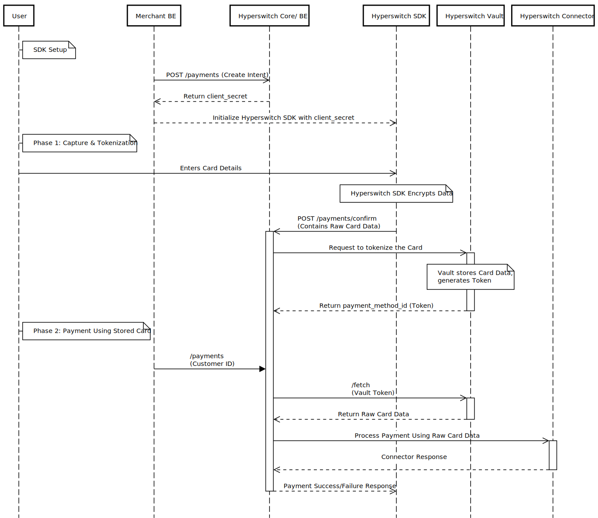

# Using Hyperswitch SDK with Hyperswitch Vault

In this approach, the Hyperswitch SDK is used on the frontend to capture card details. Card data is securely sent to the Hyperswitch backend and stored in Hyperswitch Vault. Payment orchestration, routing, and connector logic are handled entirely by the Hyperswitch backend.

The merchant uses the Hyperswitch Dashboard to configure connectors, routing rules, and orchestration logic. All payment requests are initiated using vault tokens, and raw card data never reaches merchant systems. Since card details are handled entirely by Hyperswitch, merchants are not required to be PCI DSS compliant for card data handling.&#x20;

* **The Workflow:**&#x20;
  * **Client:** The Hyperswitch SDK collects card details.
  * **Secure Transmission:** When the user selects to save the card and clicks on payment button, the SDK encrypts and sends the card data directly to Hyperswitch Backend.
  * **Vaulting:** Hyperswitch's internal vault  stores the card data securely and generates a `payment_method_id` (a token).
  * **Orchestration:** Hyperswitch Backend uses this `payment_method_id` to retrieve the card data internally and sends it securely to the selected Connector (e.g., Stripe, Adyen).
  * **Response:** The connector responds to HS, which relays the success/failure to the SDK.

<figure><figcaption></figcaption></figure>

* **Integration Documentation :**&#x20;
  * **Unified Checkout :**[ Integration guide](https://docs.hyperswitch.io/explore-hyperswitch/merchant-controls/integration-guide)
  * **Primary Guide:**[ Unified Checkout: Saving Payment Methods](https://docs.hyperswitch.io/explore-hyperswitch/payment-orchestration/quickstart/tokenization-and-saved-cards/save-a-payment-method)

