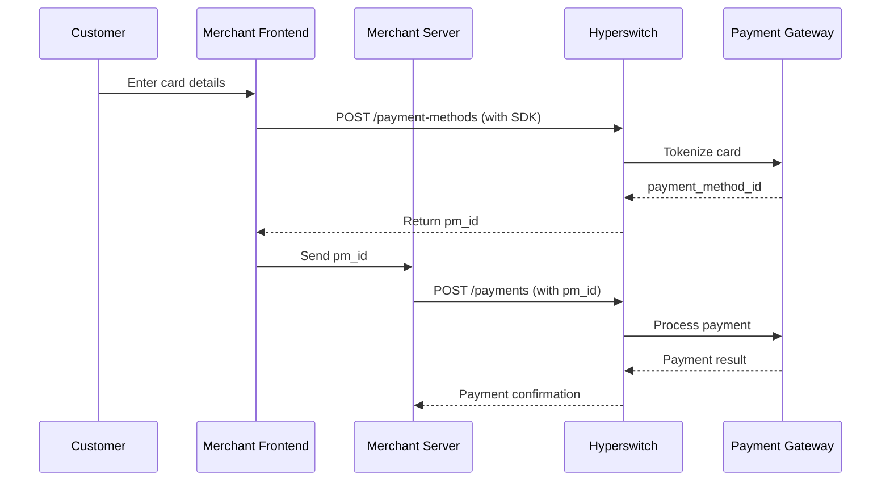

# Payment Method (Card)

Hyperswitch provides flexible payment processing with multiple flow patterns to accommodate different business needs. The system supports one-time payments, saved payment methods, and recurring billing through a comprehensive API design.


### PCI Compliance Note

Hyperswitch handles sensitive card data vaulting and tokenization, reducing your PCI DSS compliance scope. When using the Payment Method SDK or `/payment-methods` API, card data never touches your servers—only the tokenized `payment_method_id` does.


## Quick Start

### Prerequisites

- [Hyperswitch account](https://app.hyperswitch.io/) with API keys
- At least one connector configured (see [Connectors Integration](../connectors/))
- Your server capable of making HTTPS requests

### Integration Pattern

The Payment Method flow uses a **two-step pattern**:

1. **Credential Capture & Vaulting** → Get a `payment_method_id`
2. **Transaction Execution** → Use the ID for payments



## API Reference

### Create Payment Method

Tokenize and vault card details to get a reusable `payment_method_id`.

**Endpoint:** `POST /v1/payment_methods`

**Authentication:** API Key in header `api-key: your_api_key`

**Request:**

```bash
curl -X POST https://api.hyperswitch.io/v1/payment_methods \
  -H "Content-Type: application/json" \
  -H "api-key: your_api_key" \
  -d '{
    "customer_id": "cust_12345",
    "card": {
      "number": "4242424242424242",
      "exp_month": "12",
      "exp_year": "2025",
      "cvc": "123"
    },
    "metadata": {
      "nickname": "Personal Visa"
    }
  }'
```

**Response:**

```json
{
  "payment_method_id": "pm_abc123xyz",
  "customer_id": "cust_12345",
  "status": "active",
  "card": {
    "last4": "4242",
    "brand": "visa",
    "exp_month": "12",
    "exp_year": "2025"
  },
  "created_at": "2024-01-15T10:30:00Z",
  "metadata": {
    "nickname": "Personal Visa"
  }
}
```

### Create Payment Using Payment Method

Use the `payment_method_id` to process a payment without re-collecting card details.

**Endpoint:** `POST /v1/payments`

**Request:**

```bash
curl -X POST https://api.hyperswitch.io/v1/payments \
  -H "Content-Type: application/json" \
  -H "api-key: your_api_key" \
  -d '{
    "amount": 1000,
    "currency": "USD",
    "customer_id": "cust_12345",
    "payment_method_id": "pm_abc123xyz",
    "confirm": true,
    "return_url": "https://your-site.com/payment-complete"
  }'
```

**Response:**

```json
{
  "payment_id": "pay_xyz789",
  "status": "succeeded",
  "amount": 1000,
  "currency": "USD",
  "payment_method_id": "pm_abc123xyz",
  "connector": "stripe"
}
```

## Testing

### Test Card Numbers

Use these test cards in sandbox environment to simulate different scenarios:

| Card Number | Brand | Scenario |
|-------------|-------|----------|
| `4242424242424242` | Visa | Successful payment |
| `4000000000000002` | Visa | Card declined |
| `4000000000000127` | Visa | Incorrect CVC |
| `4000000000000069` | Visa | Expired card |
| `4000000000000119` | Visa | Processing error |
| `5555555555554444` | Mastercard | Successful payment |
| `378282246310005` | Amex | Successful payment |

### Sandbox vs Production

- **Sandbox Base URL:** `https://api.hyperswitch.io`
- **Production Base URL:** `https://api.hyperswitch.io` (use live API keys)

Always test thoroughly in sandbox before going live.

## Error Handling

### Common Error Codes

| Error Code | HTTP Status | Description | Resolution |
|------------|-------------|-------------|------------|
| `card_declined` | 402 | Card was declined | Ask customer to use different card |
| `expired_card` | 402 | Card has expired | Ask customer to update card details |
| `incorrect_cvc` | 402 | CVC check failed | Ask customer to check CVC |
| `insufficient_funds` | 402 | Card has insufficient funds | Ask customer to use different card |
| `payment_method_not_found` | 404 | Invalid payment_method_id | Check ID and retry |
| `payment_method_expired` | 400 | Stored payment method expired | Create new payment method |
| `processing_error` | 500 | Temporary gateway error | Retry with idempotency key |
| `idempotency_error` | 409 | Duplicate request | Use unique idempotency key |

### Idempotency

For safe retries, include an `Idempotency-Key` header:

```bash
curl -X POST https://api.hyperswitch.io/v1/payments \
  -H "Content-Type: application/json" \
  -H "api-key: your_api_key" \
  -H "Idempotency-Key: unique-key-123" \
  -d '{...}'
```

## SDK Examples

### JavaScript (Frontend)

```javascript
import Hyperswitch from '@hyperswitch/sdk';

const hyper = Hyperswitch('pk_test_your_key');

// Collect card details and create payment method
const { paymentMethodId, error } = await hyper.createPaymentMethod({
  card: {
    number: cardNumberElement,
    exp_month: '12',
    exp_year: '2025',
    cvc: cvcElement
  },
  billing: {
    name: 'John Doe'
  }
});

// Send paymentMethodId to your server
const response = await fetch('/api/create-payment', {
  method: 'POST',
  body: JSON.stringify({ payment_method_id: paymentMethodId, amount: 1000 })
});
```

### Python (Backend)

```python
import requests

headers = {
    "Content-Type": "application/json",
    "api-key": "your_api_key"
}

# Create payment method
payment_method = requests.post(
    "https://api.hyperswitch.io/v1/payment_methods",
    headers=headers,
    json={
        "customer_id": "cust_12345",
        "card": {
            "number": "4242424242424242",
            "exp_month": "12",
            "exp_year": "2025",
            "cvc": "123"
        }
    }
).json()

# Use for payment
payment = requests.post(
    "https://api.hyperswitch.io/v1/payments",
    headers=headers,
    json={
        "amount": 1000,
        "currency": "USD",
        "customer_id": "cust_12345",
        "payment_method_id": payment_method["payment_method_id"],
        "confirm": True
    }
).json()
```

## Webhook Events

Subscribe to webhooks to receive real-time updates on payment method lifecycle:

| Event | Description |
|-------|-------------|
| `payment_method.created` | New payment method vaulted |
| `payment_method.attached` | Payment method linked to customer |
| `payment_method.detached` | Payment method removed from customer |
| `payment_method.updated` | Payment method details updated |
| `payment_method.expiring` | Card expiring soon (30 days) |

**Webhook Payload Example:**

```json
{
  "event": "payment_method.created",
  "data": {
    "payment_method_id": "pm_abc123xyz",
    "customer_id": "cust_12345",
    "card": {
      "last4": "4242",
      "brand": "visa"
    }
  }
}
```

## Payment Method Lifecycle

The `payment_method_id` is a unique identifier combining:
- **Customer ID** + **Payment Instrument**

| Customer ID | Payment Instrument | Result |
|-------------|-------------------|--------|
| Same | Same card | Same `payment_method_id` |
| Same | Different cards | Different IDs |
| Different | Same card | Different IDs |

### Expiration Handling

- Expired payment methods return `payment_method_expired` error
- Webhook `payment_method.expiring` sent 30 days before expiry
- Customers should add new payment method when card expires

### Deletion

```bash
curl -X DELETE https://api.hyperswitch.io/v1/payment_methods/pm_abc123xyz \
  -H "api-key: your_api_key"
```

## Security Best Practices

1. **Never store raw card data** on your servers
2. **Use HTTPS** for all API calls
3. **Validate webhooks** using signature verification
4. **Implement idempotency** for payment creation
5. **Use test cards** in development environment

## FAQ

**Q: Can I reuse a payment_method_id across customers?**
A: No. Each `payment_method_id` is tied to a specific customer.

**Q: How long is a payment_method_id valid?**
A: Until the card expires or the payment method is deleted.

**Q: What happens when a card expires?**
A: The `payment_method_id` becomes invalid. Create a new one with updated card details.

**Q: Can I update card details without creating a new payment_method_id?**
A: Yes, use the Update Payment Method API for expiry date updates.

**Q: Is PCI compliance required if I use this API?**
A: Significantly reduced scope since card data never touches your servers.

---

## Related Documentation

- [Payments API Reference](../payments-cards/)
- [Connectors Integration](../../explore-hyperswitch/connectors/)
- [Webhooks Configuration](../webhooks/)
