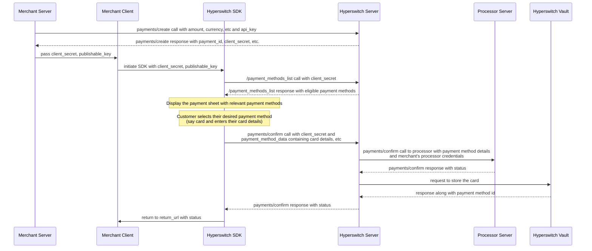
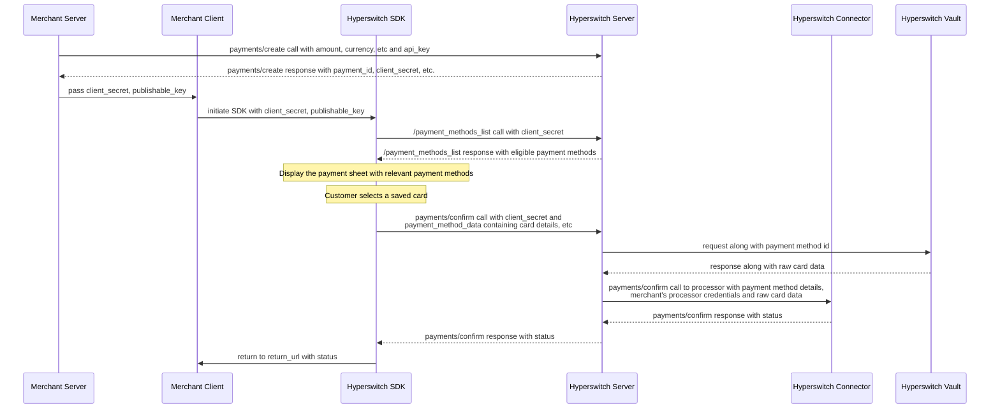

# Hyperswitch SDK + Hyperswitch Vault Setup

In this approach, the Hyperswitch SDK is used on the frontend to capture card details. Card data is securely sent to the Hyperswitch backend and stored in Hyperswitch Vault. Payment orchestration, routing, and connector logic are handled entirely by the Hyperswitch backend.

The merchant uses the Hyperswitch Dashboard to configure connectors, routing rules, and orchestration logic. All payment requests are initiated using vault tokens, and raw card data never reaches merchant systems. Since card details are handled entirely by Hyperswitch, merchants are not required to be PCI DSS compliant for card data handling.&#x20;

#### **Understanding Payment and Vault flow**

#### **Vaulting :**

*Caption: The vaulting flow shows how card details are securely stored in the Hyperswitch Vault. The merchant server creates a payment, the SDK collects card details from the customer, and after successful authorization with the processor, the card is tokenized and stored for future use.*

**1. Create Payment (Server-Side)**\
The merchant server creates a payment by calling the Hyperswitch [`payments/create`](https://api-reference.hyperswitch.io/v1/payments/payments--create) API with transaction details such as amount and currency. Hyperswitch responds with a `payment_id` and `client_secret`, which are required for client-side processing.

**2. Initialize SDK (Client-Side)**\
The merchant client initializes the Hyperswitch SDK using the `client_secret` and `publishable_key`. The SDK fetches eligible payment methods from Hyperswitch and renders a secure payment UI.

**3. Collect Card Details**\
The customer selects a card payment method and enters their card details directly within the SDK-managed interface, ensuring sensitive data never passes through merchant systems.

**4. Authorize and Store Card**\
The SDK submits a `payments/confirm` request to Hyperswitch. Hyperswitch authorizes the payment with the processor and securely stores the card in the Hyperswitch Vault, generating a reusable `payment_method_id`.

**5. Return Status**\
The final payment and vaulting status is returned to the SDK, which redirects the customer to the merchant's configured `return_url`.

#### **Payment Using Stored Card :**

*Caption: The stored card payment flow shows how a customer can reuse a previously saved card. Hyperswitch retrieves the raw card data from the Vault and sends it to the processor for authorization, without requiring the customer to re-enter their card details.*

**1. Create Payment (Server-Side)**\
The merchant server initiates the payment by calling the [`payments/create`](https://api-reference.hyperswitch.io/v1/payments/payments--create) API and receives a `client_secret` for client-side confirmation.

**2. Initialize SDK and Fetch Saved Cards**\
The merchant client initializes the Hyperswitch SDK. The SDK requests eligible payment methods from Hyperswitch, including any saved cards associated with the customer.

**3. Customer Selects a Saved Card**\
The SDK displays the saved cards in the payment UI. The customer selects a saved card without re-entering card details.

**4. Retrieve Card Data and Authorize**\
The SDK sends a `payments/confirm` request with the selected `payment_method_id`. Hyperswitch securely retrieves the card data from the Hyperswitch Vault and submits the authorization request to the processor via the Hyperswitch Connector.

**5. Return Status**\
The processor returns the authorization result to Hyperswitch, which forwards the final status to the SDK. The customer is redirected to the merchant's `return_url` with the payment outcome.

* **Integration Documentation :**
  * **Unified Checkout :** [Integration guide](https://docs.hyperswitch.io/explore-hyperswitch/merchant-controls/integration-guide)
  * [Create Payment API](https://api-reference.hyperswitch.io/v1/payments/payments--create)
  * [Unified Checkout: Saving Payment Methods](https://docs.hyperswitch.io/explore-hyperswitch/payment-orchestration/quickstart/tokenization-and-saved-cards/save-a-payment-method)
