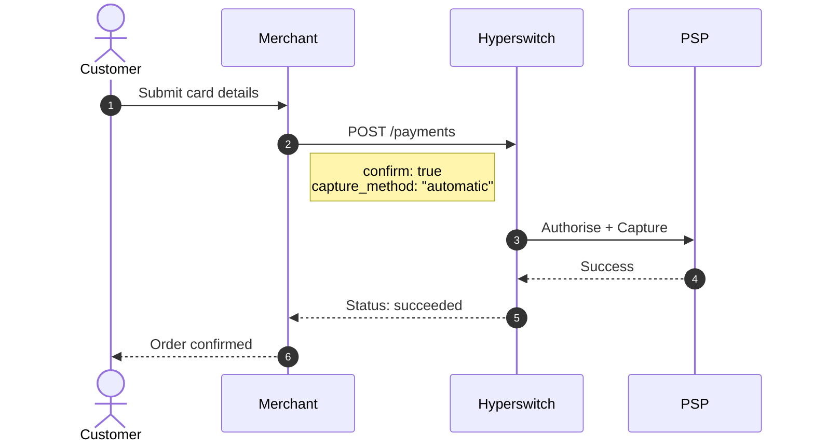
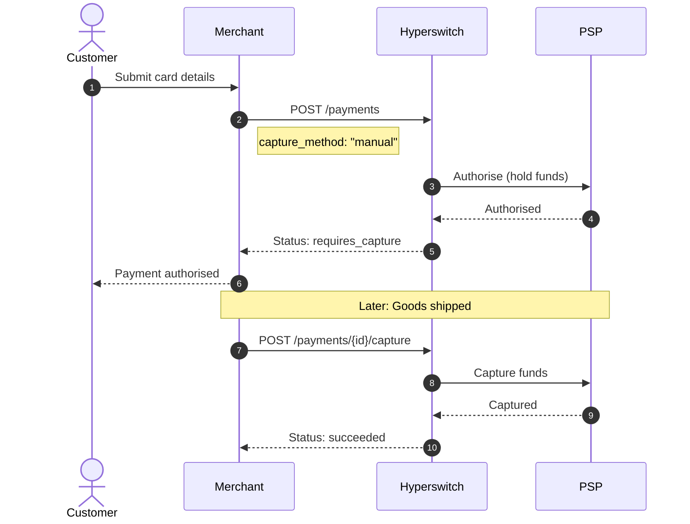
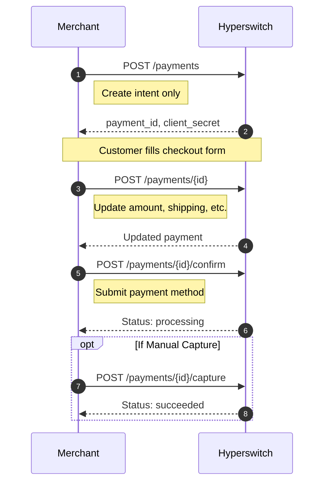
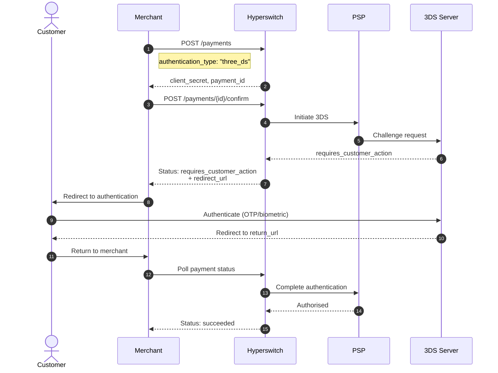
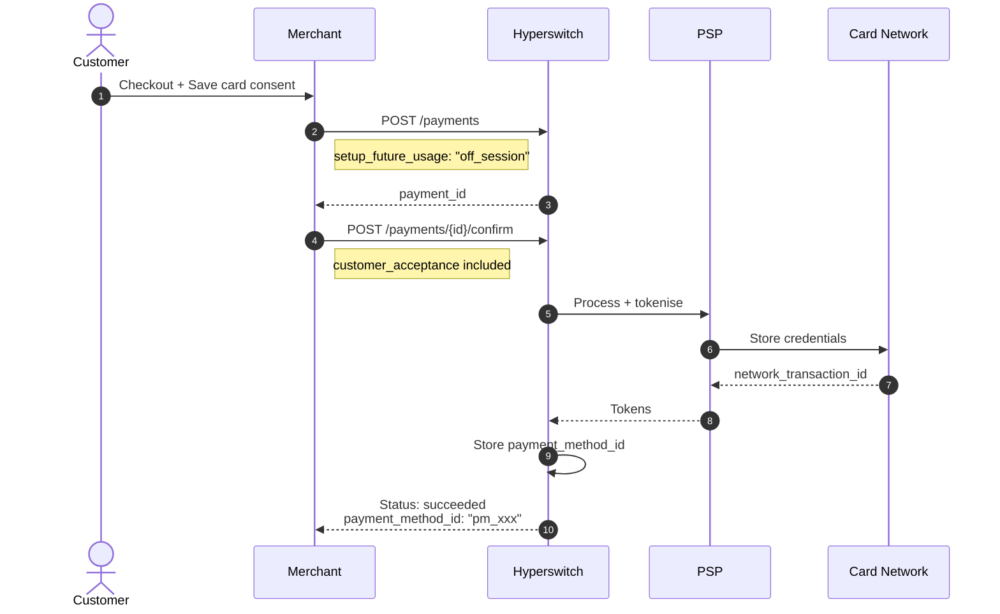
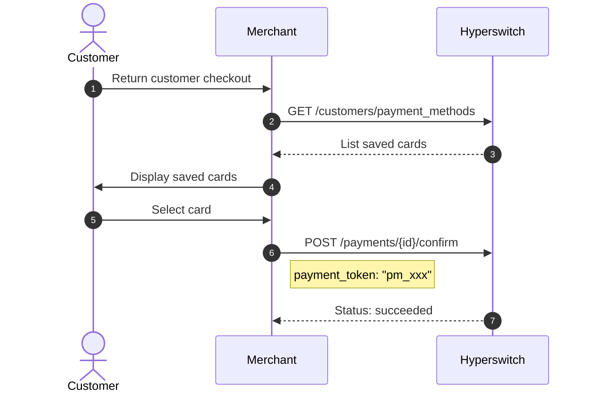
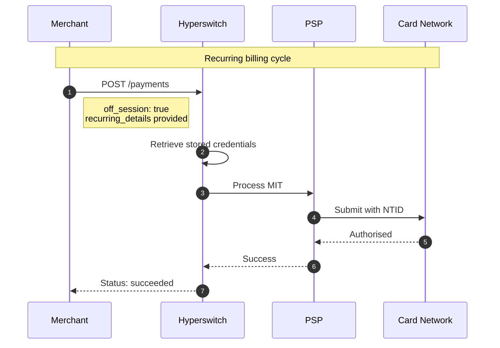
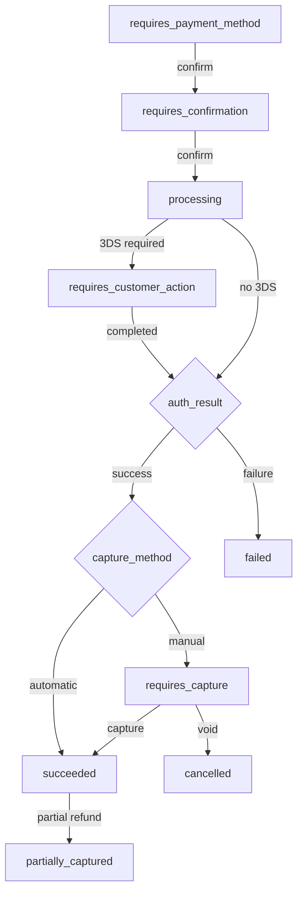

# Payments (Cards)

> **TL;DR** — Hyperswitch offers flexible card payment flows: instant capture for immediate processing, manual capture for deferred charging, 3DS authentication for enhanced security, and recurring payments for subscriptions. Choose your pattern based on business requirements and compliance needs.

## Overview

Hyperswitch provides flexible payment processing with multiple flow patterns to accommodate different business needs. The system supports one-time payments, saved payment methods, and recurring billing through a comprehensive API design.

### Key Capabilities

| Capability | Description | Best For |
|------------|-------------|----------|
| **Instant Capture** | Authorise and capture in one step | E-commerce, digital goods |
| **Manual Capture** | Authorise now, capture later | Physical goods, pre-orders |
| **3DS Authentication** | Customer verification challenge | High-value transactions, compliance |
| **Recurring Payments** | Stored credentials for future charges | Subscriptions, memberships |


**Integration Path Selection**

This guide covers **server-to-server API integration**. If you require client-side SDK handling, refer to the [SDK Payments guide](../../learn-more/sdk-payment-flows.md).


---

## One-Time Payment Patterns

### 1. Instant Payment (Automatic Capture)

Process and capture funds in a single API call. This is the most straightforward pattern for immediate payment finalisation.

#### When to Use

- Digital goods delivery
- Immediate order fulfilment
- Low-risk transactions

#### Required Parameters

| Parameter | Value | Description |
|-----------|-------|-------------|
| `confirm` | `true` | Confirm payment immediately |
| `capture_method` | `"automatic"` | Capture funds automatically |
| `payment_method` | Card object | Card details or token |

#### API Flow



#### Code Example

```bash
curl --location 'https://sandbox.hyperswitch.io/payments' \
--header 'Content-Type: application/json' \
--header 'Accept: application/json' \
--header 'api-key: <your_api_key>' \
--data-raw '{
    "amount": 6540,
    "currency": "USD",
    "confirm": true,
    "capture_method": "automatic",
    "customer_id": "customer_123",
    "payment_method": "card",
    "payment_method_data": {
        "card": {
            "card_number": "4242424242424242",
            "card_exp_month": "12",
            "card_exp_year": "2030",
            "card_holder_name": "John Doe",
            "card_cvc": "123"
        }
    },
    "return_url": "https://example.com/payment/return"
}'
```

**Final Status:** `succeeded`

---

### 2. Two-Step Manual Capture

Reserve funds during checkout and capture only when ready to fulfil. This pattern is essential for businesses with shipping delays.

#### When to Use

- Physical goods requiring shipping
- Pre-order campaigns
- Risk assessment before fulfilment

#### API Flow



#### Step 1: Authorise Payment

```bash
curl --location 'https://sandbox.hyperswitch.io/payments' \
--header 'Content-Type: application/json' \
--header 'api-key: <your_api_key>' \
--data-raw '{
    "amount": 10000,
    "currency": "USD",
    "confirm": true,
    "capture_method": "manual",
    "customer_id": "customer_123",
    "payment_method": "card",
    "payment_method_data": {
        "card": {
            "card_number": "4242424242424242",
            "card_exp_month": "12",
            "card_exp_year": "2030",
            "card_cvc": "123"
        }
    }
}'
```

**Response Status:** `requires_capture`

#### Step 2: Capture Funds

```bash
curl --location 'https://sandbox.hyperswitch.io/payments/pay_xxxxxxxxxxxx/capture' \
--header 'Content-Type: application/json' \
--header 'api-key: <your_api_key>' \
--data-raw '{
    "amount_to_capture": 10000
}'
```

**Response Status:** `succeeded`

#### Capture Options

| Capture Type | Endpoint | Use Case |
|--------------|----------|----------|
| Full Capture | `/capture` with full amount | Standard fulfilment |
| Partial Capture | `/capture` with reduced amount | Partial shipment |
| Multiple Captures | Multiple `/capture` calls | Split shipments |

Read more: [Manual Capture Guide](./payments-cards/manual-capture/)

---

### 3. Fully Decoupled Flow

Break the payment journey into discrete steps for complex checkout experiences.

#### When to Use

- Headless checkout implementations
- Multi-step forms with save/resume
- B2B portals with approval workflows

#### API Flow



#### Step-by-Step Implementation

**Step 1: Create Payment Intent**

```bash
curl --location 'https://sandbox.hyperswitch.io/payments' \
--header 'Content-Type: application/json' \
--header 'api-key: <your_api_key>' \
--data-raw '{
    "amount": 5000,
    "currency": "USD",
    "confirm": false,
    "customer_id": "customer_123",
    "return_url": "https://example.com/payment/return"
}'
```

**Step 2: Update Payment (Optional)**

```bash
curl --location 'https://sandbox.hyperswitch.io/payments/pay_xxxxxxxxxxxx' \
--header 'Content-Type: application/json' \
--header 'api-key: <your_api_key>' \
--data-raw '{
    "amount": 5500,
    "shipping": {
        "address": {
            "line1": "123 Main St",
            "city": "San Francisco",
            "state": "CA",
            "zip": "94105",
            "country": "US"
        }
    }
}'
```

**Step 3: Confirm Payment**

```bash
curl --location 'https://sandbox.hyperswitch.io/payments/pay_xxxxxxxxxxxx/confirm' \
--header 'Content-Type: application/json' \
--header 'api-key: <your_api_key>' \
--data-raw '{
    "payment_method": "card",
    "payment_method_data": {
        "card": {
            "card_number": "4242424242424242",
            "card_exp_month": "12",
            "card_exp_year": "2030",
            "card_cvc": "123"
        }
    }
}'
```

---

### 4. 3D Secure Authentication Flow

Implement Strong Customer Authentication (SCA) for enhanced security and regulatory compliance.

#### When to Use

- High-value transactions
- Regulatory compliance (PSD2 in Europe)
- Fraud risk mitigation

#### Required Parameters

| Parameter | Value | Description |
|-----------|-------|-------------|
| `authentication_type` | `"three_ds"` | Enable 3DS flow |
| `return_url` | Valid URL | Redirect after authentication |

#### API Flow



#### Status Progression

```
requires_confirmation → processing → requires_customer_action → succeeded
```

#### Implementation Example

```bash
curl --location 'https://sandbox.hyperswitch.io/payments' \
--header 'Content-Type: application/json' \
--header 'api-key: <your_api_key>' \
--data-raw '{
    "amount": 100000,
    "currency": "EUR",
    "confirm": true,
    "authentication_type": "three_ds",
    "customer_id": "customer_123",
    "payment_method": "card",
    "payment_method_data": {
        "card": {
            "card_number": "4242424242424242",
            "card_exp_month": "12",
            "card_exp_year": "2030",
            "card_cvc": "123"
        }
    },
    "return_url": "https://example.com/3ds/return"
}'
```

Read more: [3DS Decision Manager](../../explore-hyperswitch/workflows/3ds-decision-manager.md)

---

## Recurring Payments and Payment Storage

### Saving Payment Methods

Store customer payment credentials securely for future transactions while reducing PCI DSS scope.

#### Required Parameters

| Parameter | Value | Description |
|-----------|-------|-------------|
| `setup_future_usage` | `"off_session"` or `"on_session"` | Intent for future usage |
| `customer_id` | Valid customer ID | Associate with customer |

#### Understanding `setup_future_usage`

| Value | Use When | Example |
|-------|----------|---------|
| `on_session` | Customer present for future transactions | Express checkout, wallet |
| `off_session` | Customer not present for future transactions | Subscriptions, auto-billing |

#### API Flow



#### CIT with Immediate Charge

```bash
curl --location 'https://sandbox.hyperswitch.io/payments' \
--header 'Content-Type: application/json' \
--header 'api-key: <your_api_key>' \
--data-raw '{
    "amount": 6540,
    "currency": "USD",
    "confirm": false,
    "customer_id": "customer_123",
    "setup_future_usage": "off_session",
    "description": "First month subscription"
}'
```

Then confirm with customer acceptance:

```bash
curl --location 'https://sandbox.hyperswitch.io/payments/pay_xxxxxxxxxxxx/confirm' \
--header 'Content-Type: application/json' \
--header 'api-key: <your_api_key>' \
--data-raw '{
    "payment_method": "card",
    "payment_method_data": {
        "card": {
            "card_number": "4242424242424242",
            "card_exp_month": "12",
            "card_exp_year": "2030",
            "card_cvc": "123"
        }
    },
    "customer_acceptance": {
        "acceptance_type": "online",
        "accepted_at": "2024-01-15T10:30:00Z",
        "online": {
            "ip_address": "192.168.1.1",
            "user_agent": "Mozilla/5.0..."
        }
    }
}'
```

**Response includes:** `payment_method_id` for future MIT transactions.

---

### Using Saved Payment Methods

Retrieve and use stored payment methods for returning customers.

#### API Flow



#### List Saved Payment Methods

```bash
curl --location 'https://sandbox.hyperswitch.io/customers/customer_123/payment_methods' \
--header 'Accept: application/json' \
--header 'api-key: <your_api_key>'
```

#### Confirm with Saved Card

```bash
curl --location 'https://sandbox.hyperswitch.io/payments/pay_xxxxxxxxxxxx/confirm' \
--header 'Content-Type: application/json' \
--header 'api-key: <your_api_key>' \
--data-raw '{
    "payment_token": "pm_xxxxxxxxxxxx"
}'
```

---

### Merchant-Initiated Transactions (MIT)

Process recurring charges without customer interaction using stored credentials.

#### Required Parameters

| Parameter | Value | Description |
|-----------|-------|-------------|
| `off_session` | `true` | Indicates MIT flow |
| `recurring_details` | Object | Stored credential reference |

#### MIT Options

| Option | Field | Description |
|--------|-------|-------------|
| 1 | `payment_method_id` | Hyperswitch-generated token |
| 2 | `processor_payment_token` | PSP-issued token |
| 3 | `network_transaction_id` + card data | Card scheme identifier |
| 4 | `network_transaction_id` + network token | Tokenised credentials |

#### API Flow



#### MIT Implementation

```bash
curl --location 'https://sandbox.hyperswitch.io/payments' \
--header 'Content-Type: application/json' \
--header 'api-key: <your_api_key>' \
--data-raw '{
    "amount": 6540,
    "currency": "USD",
    "confirm": true,
    "off_session": true,
    "customer_id": "customer_123",
    "recurring_details": {
        "type": "payment_method_id",
        "data": "pm_xxxxxxxxxxxx"
    },
    "description": "Monthly subscription charge"
}'
```

Read more: [Recurring Payments Guide](./payments-cards/recurring-payments.md)

---

## Status Reference

### Payment Status Lifecycle



### Terminal States

| Status | Description | Action Required |
|--------|-------------|-----------------|
| `succeeded` | Payment completed successfully | None |
| `failed` | Payment failed | Retry or alternative |
| `cancelled` | Payment voided/abandoned | None |
| `partially_captured` | Partial amount captured | None |

### Non-Terminal States

| Status | Description | Next Step |
|--------|-------------|-----------|
| `requires_payment_method` | Awaiting payment details | Submit payment method |
| `requires_confirmation` | Awaiting confirmation | Call confirm endpoint |
| `processing` | In progress | Poll for status |
| `requires_customer_action` | Customer intervention needed | Redirect customer |
| `requires_capture` | Authorised, awaiting capture | Call capture endpoint |

---

## PCI Compliance

### Storing `payment_method_id`

The `payment_method_id` is a token representing the payment instrument (payment token, network token, or processor token). Storing this token significantly reduces your PCI DSS scope compared to storing raw card numbers.

**Key Points:**
- Hyperswitch securely stores sensitive card details
- You receive a token for future reference
- Handle tokens with the same security as customer data
- Consult a PCI QSA for specific compliance obligations

---

## Q&A

### What is the difference between `capture_method: automatic` and `manual`?

**Automatic capture** processes the authorisation and capture in a single step. Funds are transferred immediately upon approval. **Manual capture** only authorises (holds) funds initially. You must call the capture endpoint separately to complete the transfer. Use manual capture when there is a delay between order placement and fulfilment.

### How do I handle 3DS authentication failures?

When 3DS authentication fails, the payment status becomes `failed`. You should:
1. Check the error response for specific failure reasons
2. Offer the customer alternative payment methods
3. Consider retrying without 3DS if your risk assessment allows

### Can I save a payment method without charging the customer?

Yes. Use the **Zero Dollar Authorisation** flow by setting `amount: 0` and `setup_future_usage: "off_session"`. This validates the card without charging it.

### What happens if I void an authorised payment?

Voiding releases the held funds back to the customer's card. The payment status becomes `cancelled`. You can only void payments in `requires_capture` status; captured payments must be refunded instead.

### How do I route MIT payments to different processors?

Enable **Connector-Agnostic MIT** routing by calling the toggle endpoint:

```bash
curl --location 'https://sandbox.hyperswitch.io/account/{merchant_id}/business_profile/{profile_id}/toggle_connector_agnostic_mit' \
--header 'Content-Type: application/json' \
--header 'api-key: <your_api_key>' \
--data '{"enabled": true}'
```

---

## See Also

- [Manual Capture Details](./payments-cards/manual-capture/)
- [Recurring Payments Guide](./payments-cards/recurring-payments.md)
- [Saved Card Management](./payments-cards/saved-card/)
- [SDK Payment Flows](../../learn-more/sdk-payment-flows.md)
- [API Reference](https://api-reference.hyperswitch.io/)
