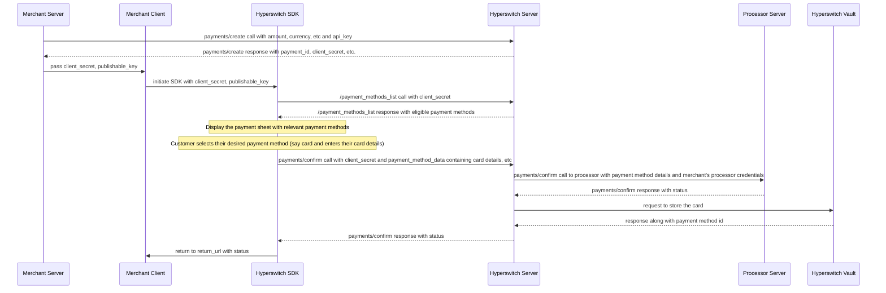
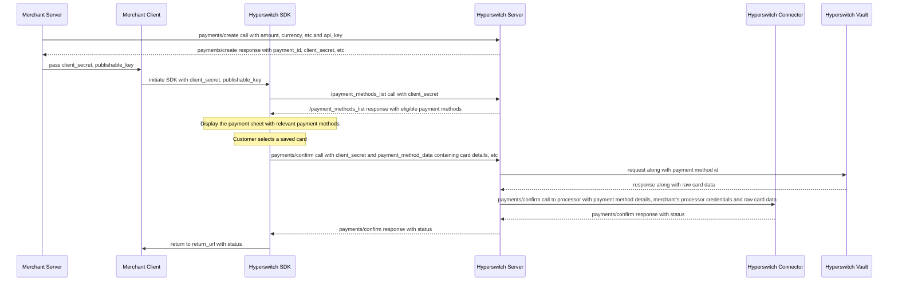

# Saved Card

In this approach, the Hyperswitch SDK is used on the frontend to capture card details. Card data is securely sent to the Hyperswitch backend and stored in Hyperswitch Vault. Payment orchestration, routing, and connector logic are handled entirely by the Hyperswitch backend.

The merchant uses the Hyperswitch Dashboard to configure connectors, routing rules, and orchestration logic. All payment requests are initiated using vault tokens, and raw card data never reaches merchant systems. Since card details are handled entirely by Hyperswitch, merchants are not required to be PCI DSS compliant for card data handling.&#x20;

#### **New User (Payments SDK)**



*Caption: The new user payment flow with card vaulting. The merchant creates a payment, the SDK collects card details, Hyperswitch authorizes the payment with the processor, and securely stores the card in the vault, returning a reusable payment method ID for future transactions.*


##### **1. Create Payment (Server-Side)**

The merchant server creates a payment by calling the Hyperswitch [`payments/create`](https://api-reference.hyperswitch.io/v1/payments/payments--create) API with transaction details such as amount and currency. Hyperswitch responds with a `payment_id`, `customer_id` and `client_secret`, which are required for client-side processing.

```json
curl --location 'https://sandbox.hyperswitch.io/payments' \
--header 'Content-Type: application/json' \
--header 'Accept: application/json' \
--header 'api-key: <enter your Hyperswitch API key here>' \
--data-raw '{
    "amount": 6540,
    "currency": "USD",
    "profile_id": <enter the relevant profile id>,
    "customer_id": "customer123",
    "description": "Its my first payment request",
    "return_url": "https://example.com", //
}'
```


Note - In case the merchant does not pass the customer ID, then the transaction is treated as a Guest customer checkout &#x20;


##### **2. Initialize SDK (Client-Side)**

The merchant client initializes the Hyperswitch SDK using the `client_secret` and `publishable_key`. The SDK fetches eligible payment methods from Hyperswitch and renders a secure payment UI.

```js
// Fetches a payment intent and captures the client secret
async function initialize() {
  const response = await fetch("/create-payment", {
    method: "POST",
    headers: { "Content-Type": "application/json" },
    body: JSON.stringify({currency: "USD",amount: 100}),
  });
  const { clientSecret } = await response.json();

  // Initialise Hyperloader.js
  var script = document.createElement('script');
  script.type = 'text/javascript';
  script.src = "https://beta.hyperswitch.io/v1/HyperLoader.js";

  let hyper;
  script.onload = () => {
      hyper = window.Hyper("YOUR_PUBLISHABLE_KEY",{
      customBackendUrl: "YOUR_BACKEND_URL",
      //You can configure this as an endpoint for all the api calls such as session, payments, confirm call.
      })
      const appearance = {
          theme: "midnight",
      };
      const widgets = hyper.widgets({ appearance, clientSecret });
      const unifiedCheckoutOptions = {
          layout: "tabs",
          wallets: {
              walletReturnUrl: "https://example.com/complete",
              //Mandatory parameter for Wallet Flows such as Googlepay, Paypal and Applepay
          },
      };
      const unifiedCheckout = widgets.create("payment", unifiedCheckoutOptions);
      unifiedCheckout.mount("#unified-checkout");
  };
  document.body.appendChild(script);
}
```

##### **3. Collect Card Details**

The customer selects a card payment method and enters their card details directly within the SDK-managed interface, ensuring sensitive data never passes through merchant systems.

##### **4. Authorize and Store Card**

The SDK submits a [`payments/confirm`](https://api-reference.hyperswitch.io/v1/payments/payments--confirm) request to Hyperswitch. Hyperswitch authorizes the payment with the processor and securely stores the card in the Hyperswitch Vault, generating a reusable `payment_method_id`.

#### **5. Return Status**

The final payment and vaulting status is returned to the SDK, which redirects the customer to the merchant's configured `return_url`.

#### **Returning or Repeat User (Payments SDK)**



*Caption: The returning user payment flow with saved cards. The merchant creates a payment, the SDK fetches and displays saved payment methods, the customer selects a saved card, and Hyperswitch retrieves the vaulted card data to authorize the payment with the processor.*

#### **1. Create Payment (Server-Side)**

The merchant server initiates the payment by calling the [`payments/create`](https://api-reference.hyperswitch.io/v1/payments/payments--create) API with transaction details such as amount and currency. Hyperswitch responds with a `payment_id` , `customer_id` and `client_secret`, which are required for client-side processing.

```json
curl --location 'https://sandbox.hyperswitch.io/payments' \
--header 'Content-Type: application/json' \
--header 'Accept: application/json' \
--header 'api-key: <enter your Hyperswitch API key here>' \
--data-raw '{
    "amount": 6540,
    "currency": "USD",
    "profile_id": <enter the relevant profile id>,
    "customer_id": "customer123",
    "description": "Its my first payment request",
    "return_url": "https://example.com", //
}'
```


Note - The merchant needs to pass the same customer ID for the SDK to fetch the saved customer payment methods and display them
\
In case the merchant is not using the SDK then they need to use the List Customer Saved Payment Methods API to fetch the stored payment methods against a customer&#x20;


##### **2. Initialize SDK and Fetch Saved Cards**

The merchant client initializes the Hyperswitch SDK. The SDK requests eligible payment methods from Hyperswitch, including any saved cards associated with the customer.

```js
// Fetches a payment intent and captures the client secret
async function initialize() {
  const response = await fetch("/create-payment", {
    method: "POST",
    headers: { "Content-Type": "application/json" },
    body: JSON.stringify({currency: "USD",amount: 100}),
  });
  const { clientSecret } = await response.json();

  // Initialise Hyperloader.js
  var script = document.createElement('script');
  script.type = 'text/javascript';
  script.src = "https://beta.hyperswitch.io/v1/HyperLoader.js";

  let hyper;
  script.onload = () => {
      hyper = window.Hyper("YOUR_PUBLISHABLE_KEY",{
      customBackendUrl: "YOUR_BACKEND_URL",
      //You can configure this as an endpoint for all the api calls such as session, payments, confirm call.
      })
      const appearance = {
          theme: "midnight",
      };
      const widgets = hyper.widgets({ appearance, clientSecret });
      const unifiedCheckoutOptions = {
          layout: "tabs",
          wallets: {
              walletReturnUrl: "https://example.com/complete",
              //Mandatory parameter for Wallet Flows such as Googlepay, Paypal and Applepay
          },
      };
      const unifiedCheckout = widgets.create("payment", unifiedCheckoutOptions);
      unifiedCheckout.mount("#unified-checkout");
  };
  document.body.appendChild(script);
}
```

##### **3. Customer Selects a Saved Card**

The SDK displays the saved cards in the payment UI, customer enters the CVV.

##### **4. Retrieve Card Data and Authorize**

The SDK sends a [`payments/confirm`](https://api-reference.hyperswitch.io/v1/payments/payments--confirm) request with the selected `payment_method_id`. Hyperswitch securely retrieves the card data from the Hyperswitch Vault and submits the authorization request to the processor via the Hyperswitch Connector.

##### **5. Return Status**

The processor returns the authorization result to Hyperswitch, which forwards the final status to the SDK. The customer is redirected to the merchant's `return_url` with the payment outcome.


#### Integration Guide :&#x20;

[Unified Checkout ](https://docs.hyperswitch.io/~/revisions/DXTxY8PvOykOfdbFcGmW/explore-hyperswitch/payment-experience/payment/web)

[Payments API](https://api-reference.hyperswitch.io/v1/payments/payments--create)
