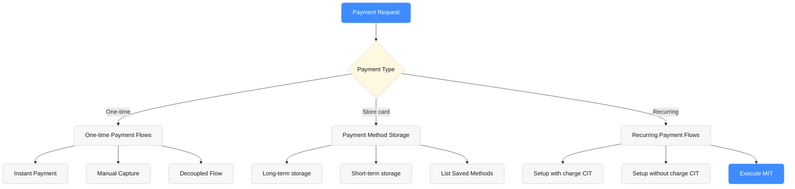
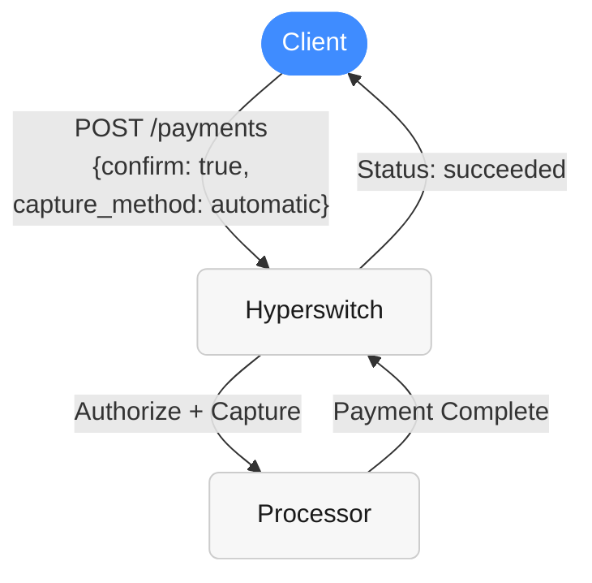
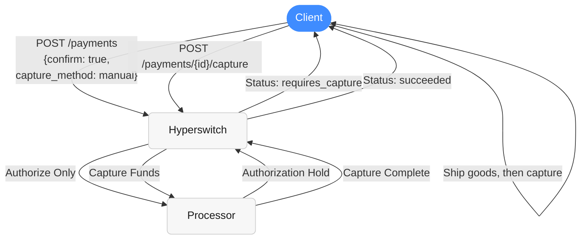
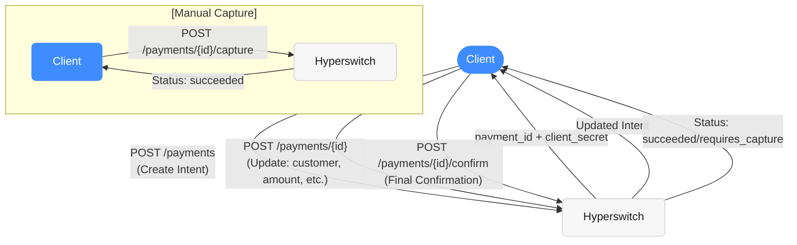
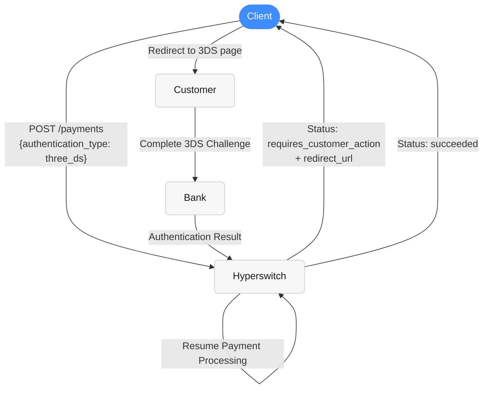
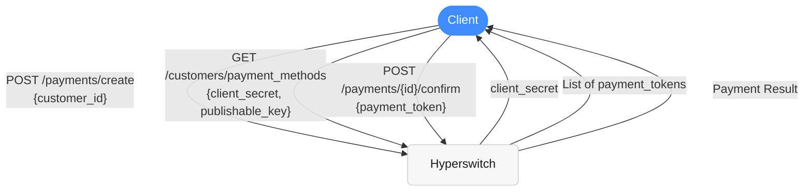
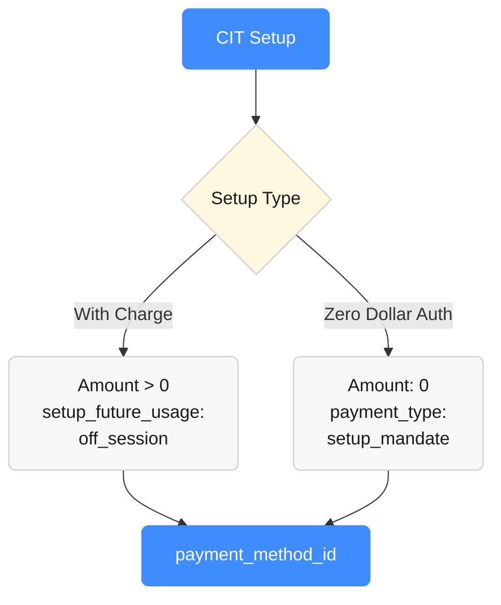
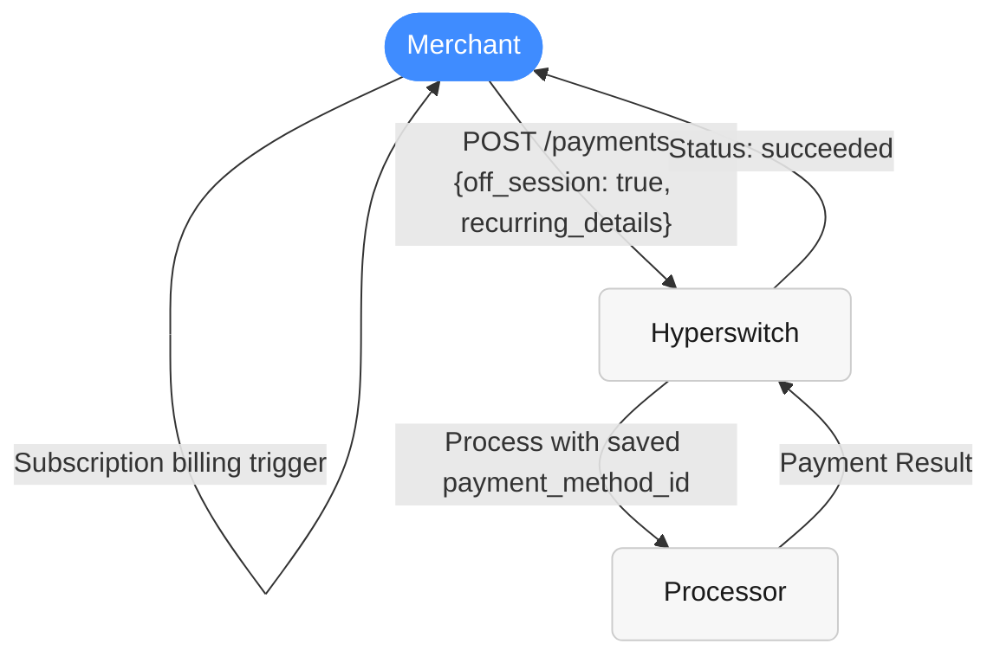

# Payments (cards)

Hyperswitch provides flexible payment processing with multiple flow patterns to accommodate different business needs. The system supports one-time payments, saved payment methods, and recurring billing through a comprehensive API design.


#### Integration Path

#### Client-Side SDK Payments (Tokenise Post Payment)

Refer to Payments (Cards) section  if your flow requires the SDK to initiate payments directly. In this model, the SDK handles the payment trigger and communicates downstream to the Hyperswitch server and your chosen Payment Service Providers (PSPs). This path is ideal for supporting dynamic, frontend-driven payment experiences.




*Caption: Overview of payment request types in Hyperswitch. The system branches into one-time payments, payment method storage, and recurring payment flows, each with their own sub-flows and options.*

#### One-Time Payment Patterns

##### 1. Instant Payment (Automatic Capture)

**Use Case:** Simple, immediate payment processing

**Endpoint:** `POST /payments`



*Caption: The instant payment flow for automatic capture. The client sends a single confirm request to Hyperswitch, which authorizes and captures funds at the processor in one step, returning a succeeded status immediately.*

**Required Fields:**

* `confirm: true`
* `capture_method: "automatic"`
* `payment_method`

**Final Status:** `succeeded`

##### 2. Two-Step Manual Capture

**Use Case:** Deferred capture (e.g., ship before charging)



*Caption: The two-step manual capture flow. The client first authorizes the payment, receives a requires_capture status, ships goods, and then calls the capture endpoint to complete the transaction.*

**Flow:**

1. **Authorize:** `POST /payments` with `capture_method: "manual"`
2. **Status:** `requires_capture`
3. **Capture:** `POST /payments/{payment_id}/capture`
4. **Final Status:** `succeeded`

Read more - [here](https://docs.hyperswitch.io/~/revisions/2M8ySHqN3pH3rctBK2zj/about-hyperswitch/payment-suite-1/payments-cards/manual-capture)

##### 3. Fully Decoupled Flow

**Use Case:** Complex checkout journeys with multiple modification steps. Useful in headless checkout or B2B portals where data is filled progressively.



*Caption: The fully decoupled payment flow. The client creates a payment intent, optionally updates it multiple times with additional data, confirms it, and optionally captures it in a separate step for manual capture scenarios.*

**Endpoints:**

* **Create:** `POST /payments`
* **Update:** `POST /payments/{payment_id}`
* **Confirm:** `POST /payments/{payment_id}/confirm`
* **Capture:** `POST /payments/{payment_id}/capture` (if manual)

##### 4. 3D Secure Authentication Flow

**Use Case:** Enhanced security with customer authentication



*Caption: The 3D Secure authentication flow. When 3DS is required, the client receives a redirect URL, the customer completes authentication with their bank, and Hyperswitch resumes processing before returning the final status.*

**Additional Fields:**

* `authentication_type: "three_ds"`

**Status Progression:** `processing` → `requires_customer_action` → `succeeded`

Read more - [link](https://docs.hyperswitch.io/~/revisions/9QlGypixZFcbkq8oGjaF/explore-hyperswitch/workflows/3ds-decision-manager)

#### Recurring payments and Payment storage

##### 1. Saving Payment Methods

**During Payment Creation:**

* Add `setup_future_usage: "off_session"` or `"on_session"`
* Include `customer_id`
* **Result:** `payment_method_id` returned on success

##### **Understanding `setup_future_usage`:**

* **`on_session`**: Use when the customer is actively present during the transaction. This is typical for scenarios like saving card details for faster checkouts in subsequent sessions where the customer will still be present to initiate the payment (e.g., card vaulting for e-commerce sites).
* **`off_session`**: Use when you intend to charge the customer later without their active involvement at the time of charge. This is suitable for subscriptions, recurring billing, or merchant-initiated transactions (MITs) where the customer has pre-authorized future charges.

##### 2. Using Saved Payment Methods



*Caption: Using saved payment methods. The client creates a payment with a customer_id, retrieves the list of saved payment methods, and confirms the payment using the selected payment token.*

**Steps:**

1. **Initiate:** Create payment with `customer_id`
2. **List:** Get saved cards via `GET /customers/payment_methods`
3. **Confirm:** Use selected `payment_token` in confirm call

#### PCI Compliance and `payment_method_id`

Storing `payment_method_id` (which is a token representing the actual payment instrument, which could be a payment token, network token, or payment processor token) significantly reduces your PCI DSS scope. Hyperswitch securely stores the sensitive card details and provides you with this token. While you still need to ensure your systems handle `payment_method_id` and related customer data securely, you avoid the complexities of storing raw card numbers. Always consult with a PCI QSA to understand your specific compliance obligations.

#### Recurring Payment Flows

##### 3. Customer-Initiated Transaction (CIT) Setup



*Caption: Customer-Initiated Transaction (CIT) setup flow. The setup can be done either with a charge (amount > 0 with setup_future_usage: off_session) or as a zero-dollar authorization (amount: 0 with payment_type: setup_mandate). Both result in a payment_method_id for future use.*

Read more - [link](https://docs.hyperswitch.io/~/revisions/j00Urtz9MpwPggJzRCsi/about-hyperswitch/payment-suite-1/payments-cards/recurring-payments)

##### 4. Merchant-Initiated Transaction (MIT) Execution



*Caption: Merchant-Initiated Transaction (MIT) execution flow. When a subscription billing trigger occurs, the merchant creates a payment with off_session: true and recurring details, and Hyperswitch processes it using the saved payment_method_id without customer involvement.*

Read more - [link](https://docs.hyperswitch.io/~/revisions/j00Urtz9MpwPggJzRCsi/about-hyperswitch/payment-suite-1/payments-cards/recurring-payments)

#### Status Flow Summary

```mermaid
%%{
  init: {
    'theme': 'base',
    'themeVariables': {
      'fontFamily': "'Inter', sans-serif",
      'background': '#ffffff00',
      'primaryColor': '#F7F7F7',
      'primaryBorderColor': '#CCCCCC',
      'primaryTextColor': '#1A1A1A',
      'lineColor': '#999999',
      'edgeLabelBackground': '#ffffff00'
    }
  }
}%%
stateDiagram-v2
  [*] --> RequiresConfirmation
  RequiresConfirmation --> Processing : confirm=true
  Processing --> RequiresCustomerAction : 3DS needed
  RequiresCustomerAction --> Processing : 3DS complete
  Processing --> RequiresCapture : manual capture
  RequiresCapture --> Succeeded : capture API call
  RequiresCapture --> PartiallyCaptured : partial capture
  Processing --> Succeeded : automatic capture
  Processing --> Failed : payment failed
  PartiallyCaptured --> [*]
  Succeeded --> [*]
  Failed --> [*]

  classDef default  fill:#F7F7F7,stroke:#CCCCCC,color:#1A1A1A,rx:6
  classDef accent   fill:#3F8CFF,stroke:#3F8CFF,color:#ffffff,rx:6
  classDef decision fill:#FFF8E1,stroke:#CCCCCC,color:#1A1A1A
```

*Caption: The complete payment status lifecycle in Hyperswitch. Payments start at RequiresConfirmation, move to Processing when confirmed, and can branch into 3DS authentication, manual capture, automatic capture, or failure states before reaching terminal states.*

#### Notes

* **Terminal States:** `succeeded`, `failed`, `cancelled`, `partially_captured` are terminal states requiring no further action
* **Capture Methods:** System supports `automatic` (funds captured immediately), `manual` (funds captured in a separate step), `manual_multiple` (funds captured in multiple partial amounts via separate steps), and `scheduled` (funds captured automatically at a future predefined time) capture methods.
* **Authentication:** 3DS authentication automatically resumes payment processing after customer completion
* **MIT Compliance:** Off-session recurring payments follow industry standards for merchant-initiated transactions
