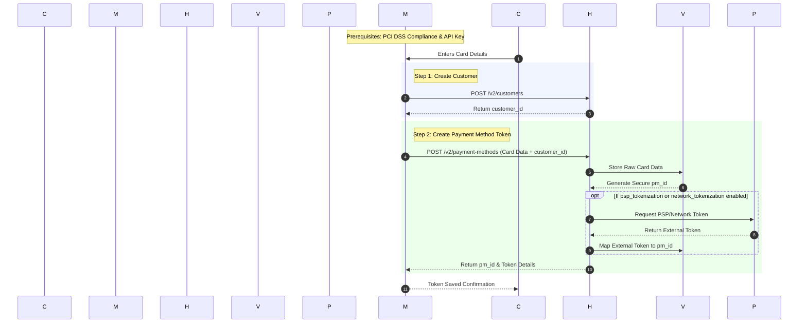

# S2S Vault flow

The Payment method SDK allows you to securely collect payment information and give customers the option to save their payment details for future transactions. By vaulting these details during the initial checkout phase.

#### **Key Features**

* **Full Token Management** – Create, retrieve, update, and delete payment tokens directly from your server.
* **PSP and Network Tokenization** – Generate both PSP tokens and network tokens through a single API.
* **Secure Storage** – Store tokens safely in Hyperswitch's Vault.
* **Reduced Frontend Complexity** – Shift tokenization processes to the backend, minimizing frontend dependencies.

#### Understanding Payment and Vault Flow

*Caption: The server-to-server vault tokenization flow. The customer enters card details into the merchant's checkout, the merchant creates a customer and payment method via Hyperswitch APIs, and the card data is securely stored in Hyperswitch's Vault. If PSP or network tokenization is enabled, Hyperswitch also retrieves and maps external tokens for future payments.*

#### **Vaulting :**

**1. Create Customer (Server-Side)**

Your server begins by calling the Hyperswitch [`/v2/customers`](https://api-reference.hyperswitch.io/v1/customers/customers--create) API to register the customer. Hyperswitch creates a profile and returns a unique `customer_id` that will be associated with the payment method.

**2. Collect Card Details**

The customer enters their card details directly into your application's checkout interface. In this server-side flow, your system initially captures the raw card data before securely forwarding it to Hyperswitch.

**3. Create Payment Method (Server-Side)**

Your server makes a [`/v2/payment-methods`](https://api-reference.hyperswitch.io/v1/payment-methods/paymentmethods--create) request to Hyperswitch, passing the collected raw card data along with the `customer_id` generated in step 1.

**4. Vault and Tokenize**

Hyperswitch receives the request, securely stores the raw card data in the Vault, and generates a secure token. If PSP or Network tokenization is enabled, Hyperswitch automatically communicates with the external provider to retrieve a token and maps it to payment method ID.

**5. Return Payment Credentials**

Hyperswitch returns the `payment_method_id` in the response. You can use this payment method ID for future payments for this customer without handling sensitive card data again.

#### **Payment :** 

To charge the customer you will have to call the [create and confirm](https://api-reference.hyperswitch.io/v2/payments/payments--create-and-confirm-intent) API and pass the `payment_method_id` along with `confirm` as `true`


All Vault API (V2) requests require authentication using specific API keys generated from your Vault Merchant account. These keys are distinct from your standard payment processing keys.

To generate your Vault API keys, follow these steps:

1. **Access Dashboard:** Log into the Hyperswitch Dashboard.
2. **Navigate to Vault:** In the left-hand navigation menu, select Vault.
3. **Generate Key:** Navigate to the API Keys section and click the Create New API Key button.
4. **Secure Storage:** Copy the generated key and store it securely. You must use this key to authenticate all Vault API (V2) calls.


**Integration Documentation -**

* [S2S Vault Tokenization](https://docs.hyperswitch.io/~/revisions/TGn71uwTlQJmyyiYgHpt/explore-hyperswitch/payments-modules/vault/server-to-server-vault-tokenization)
* [Create Payment API](https://api-reference.hyperswitch.io/v1/payments/payments--create)
* [Payment Create and Confirm API](https://api-reference.hyperswitch.io/v2/payments/payments--create-and-confirm-intent)
