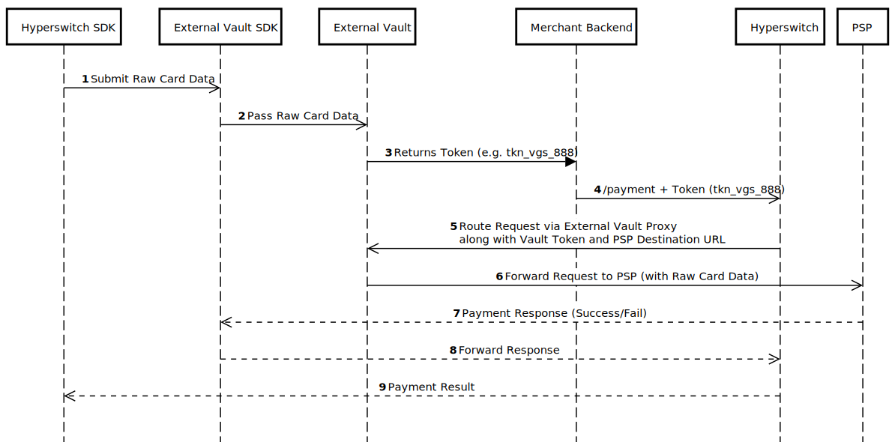

# Using External SDK and Vault

In this approach, card data is captured and tokenized using an external vault SDK. Hyperswitch backend receives vault tokens and handles orchestration, routing, retries, and PSP communication via connectors.

The merchant configures connectors and orchestration logic in the Hyperswitch Dashboard. Hyperswitch does not participate in card capture or storage.

**The Workflow:**

* **Client:** The External Vault SDK (embedded iFrame/library) captures the card data on the user's device.
* **Direct Tokenization:** The SDK sends the Card data directly to the External Vault, bypassing the merchant's backend entirely.
* **Token Handoff:** The External Vault returns a token (e.g., tkn\_vgs\_888) to the, which is passed to the Merchant Backend.
* **Hyperswitch Request:** The Merchant Backend calls Hyperswitch, passing the tkn\_vgs\_888 (instead of a Raw Card Data) in the payment\_method\_data.
* **Detokenization/Forwarding:**
  * Hyperswitch recognizes the token provider.
  * It constructs the payment request for the Connector (e.g., Stripe).
  * It routes this request through the External Vault's Proxy. The Vault injects the real PAN into the message right before it hits Stripe.

<figure><figcaption></figcaption></figure>

**Integration Documentation :**&#x20;

* **Unified Checkout :**[ Integration guide](https://docs.hyperswitch.io/explore-hyperswitch/merchant-controls/integration-guide)
* **Primary Guide:**[ Unified Checkout: Saving Payment Methods](https://docs.hyperswitch.io/explore-hyperswitch/payment-orchestration/quickstart/tokenization-and-saved-cards/save-a-payment-method)
