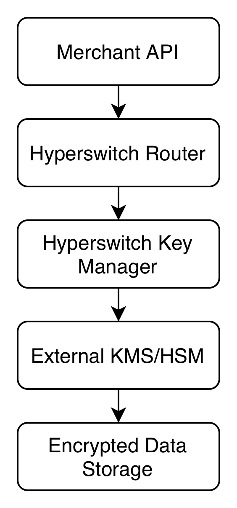
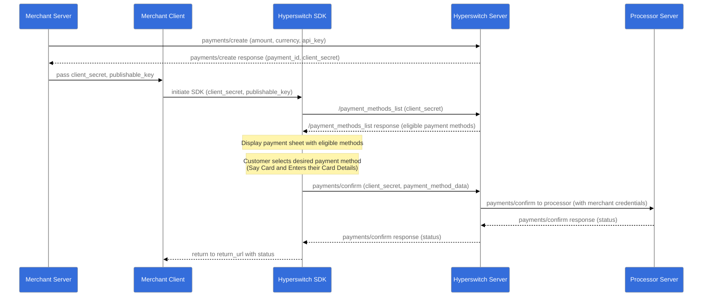
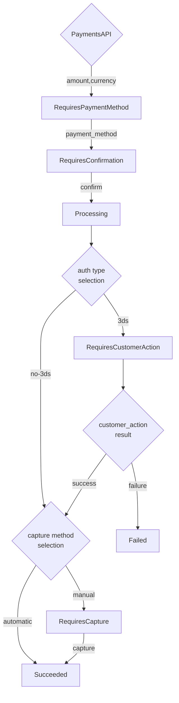
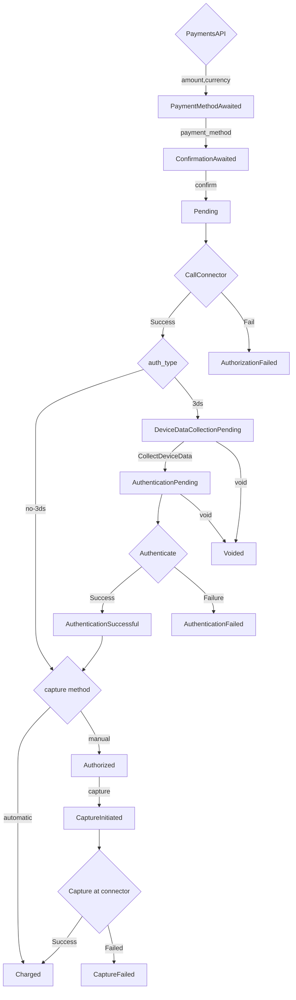

<!-- truth manifest; hyperswitch 5fb7e5598eadd8ed5fa42822427107f271a1e112; spec crates/openapi/src/routes/payments.rs@5fb7e5598eadd8ed5fa42822427107f271a1e112
     symbols: PaymentsResponse.payment_link = crates/api_models/src/payments.rs:7813-7814, struct PaymentsResponse at :7444
     symbols: PaymentLinkResponse.link = crates/api_models/src/payments.rs:13099-13100
     symbols: PaymentLinkResponse.secure_link, Option<String> with no skip_serializing_if, so it serializes as null rather than being omitted = crates/api_models/src/payments.rs:13101-13102
     symbols: react-native-inappbrowser-reborn is imported by the Android sources, so a missing peer fails the native build = react-native-hyperswitch packages/@juspay-tech/react-native-hyperswitch/android/src/main/java/io/hyperswitch/react/HyperActivity.kt:9-10
     symbols: CustomerSavedPaymentMethodsSession getters and confirm functions = react-native-hyperswitch packages/@juspay-tech/react-native-hyperswitch/src/types/savedPaymentMethods/index.ts:65-75
     symbols: PaymentLinkResponse.payment_link_id = crates/api_models/src/payments.rs:13103-13104
     symbols: PaymentsRequest.payment_link = crates/api_models/src/payments.rs:1461
     symbols: PaymentsRequest.payment_link_config = crates/api_models/src/payments.rs:1464
     symbols: session_tokens.vault_details carries the vault SDK authorization = crates/router/src/core/payments/update_context.rs:277-281
     symbols: Web SDK source = hyperswitch-web@e8e869329c44aa769efe3df89f98e4fd51de6d04
     symbols: hyper.initPaymentMethodSession = hyperswitch-web src/hyper-loader/Hyper.res:841
     symbols: hyper instance exposes 14 members, elements, widgets, confirmPayment, initPaymentSession, initPaymentMethodSession among them = hyperswitch-web src/hyper-loader/Hyper.res:827-842
     symbols: initPaymentSession returns 2 members, getCustomerSavedPaymentMethods and updateIntent; confirmWithCustomerDefaultPaymentMethod and confirmWithLastUsedPaymentMethod are attached to the object getCustomerSavedPaymentMethods resolves to = hyperswitch-web src/hyper-loader/PaymentSession.res:51-66; src/hyper-loader/PaymentSessionMethods.res:263,429,623-648
     symbols: useWalletSession returns walletSession, isGooglePayEligible, isApplePayEligible, loading, load; the launch methods are on the nullable handle load resolves to = react-native-hyperswitch packages/@juspay-tech/react-native-hyperswitch/src/context/HyperElements.tsx:181-190
     symbols: paymentMethodSession exposes createCardForm, update, on, deinit, fields = hyperswitch-web src/hyper-loader/PaymentMethodSession.res:1074-1080
     symbols: cardForm exposes create, on, tokenize, deinit, update, fields = hyperswitch-web src/hyper-loader/PaymentMethodSession.res:1065-1072
     symbols: cardCvc mounted alone routes tokenize to flow update = hyperswitch-web src/hyper-loader/PaymentMethodSession.res:976-981
     symbols: cardNumber mounted routes tokenize to flow save = hyperswitch-web src/hyper-loader/PaymentMethodSession.res:971-973
     symbols: no field, or cardExpiry alone, returns incomplete_field_set = hyperswitch-web src/hyper-loader/PaymentMethodSession.res:939-949,970,974-975
     symbols: 14 element names accepted by elements.create, card, cardNumber, cardExpiry, cardCvc, paymentMethodCollect, googlePay, payPal, applePay, klarna, expressCheckout, paze, samsungPay, paymentMethodsManagement, payment; anything else warns Unknown Key and creates nothing = hyperswitch-web src/hyper-loader/Elements.res:399-414
     symbols: getPaymentMode maps 15 strings including paymentMethodsSDK, which elements.create does not accept; the create validation is the gate, not this map = hyperswitch-web src/Types/CardThemeType.res:106-120
     symbols: useWalletSession throws outside HyperElements = react-native-hyperswitch packages/@juspay-tech/react-native-hyperswitch/src/context/HyperElements.tsx:163-171
     symbols: isGooglePaySupported, isApplePaySupported, isWalletSupported, isPlatformPaySupported report device support, not per-payment eligibility = react-native-hyperswitch packages/@juspay-tech/react-native-hyperswitch/src/session/PlatformPaySupport.ts:5-19
     symbols: confirmWithCustomerDefaultPaymentMethod is declared optional on CustomerSavedPaymentMethodsSession = react-native-hyperswitch packages/@juspay-tech/react-native-hyperswitch/src/types/savedPaymentMethods/index.ts:72-74
     symbols: React Native SDK source = react-native-hyperswitch@8fc8e88552689fedadcd39ee602fe9f137f16b56
     symbols: @juspay-tech/react-native-hyperswitch version 1.3.4 = react-native-hyperswitch packages/@juspay-tech/react-native-hyperswitch/package.json
     symbols: Hyperswitch.init is loadHyper = react-native-hyperswitch packages/@juspay-tech/react-native-hyperswitch/src/index.ts:20-56
     symbols: HyperswitchConfiguration publishableKey, platformPublishableKey, profileId, environment, customEndpoints = react-native-hyperswitch packages/@juspay-tech/react-native-hyperswitch/src/types/definitions.ts:27-33
     symbols: HyperswitchEnvironment PROD, SANDBOX, INTEG with PROD the default = react-native-hyperswitch packages/@juspay-tech/react-native-hyperswitch/src/types/definitions.ts:19; src/index.ts:28
     symbols: PaymentSessionConfiguration.sdkAuthorization = react-native-hyperswitch packages/@juspay-tech/react-native-hyperswitch/src/types/definitions.ts:35-37
     symbols: 6 peerDependencies, @sentry/react-native, react, react-native, react-native-inappbrowser-reborn, react-native-svg, react-native-webview = react-native-hyperswitch packages/@juspay-tech/react-native-hyperswitch/package.json
     symbols: GooglePayButton, ApplePayButton, CardCVCElement, PaymentElement, HyperElements, usePaymentSession, useWalletSession, useElements = react-native-hyperswitch packages/@juspay-tech/react-native-hyperswitch/src/index.ts:60-83
     symbols: isPlatformPaySupported, isGooglePaySupported, isApplePaySupported, isWalletSupported = react-native-hyperswitch packages/@juspay-tech/react-native-hyperswitch/src/index.ts:72-77
     symbols: walletSession isWalletEligible, isGooglePayEligible, isApplePayEligible, launchWallet, launchGooglePay, launchApplePay = react-native-hyperswitch packages/@juspay-tech/react-native-hyperswitch/src/session/WalletSession.ts:13-45
     symbols: paymentSession presentPaymentSheet, getCustomerSavedPaymentMethods, getWalletSession, updateIntent = react-native-hyperswitch packages/@juspay-tech/react-native-hyperswitch/src/types/definitions.ts:63-74
     symbols: 8 optional React Native companion packages, click-to-pay, netcetera-3ds, trident-3ds, samsung-pay, paypal, scancard, vault, payment-methods = react-native-hyperswitch packages/@juspay-tech/, one package.json each
     symbols: Web headless getCustomerSavedPaymentMethods, getCustomerDefaultSavedPaymentMethodData, confirmWithCustomerDefaultPaymentMethod, confirmWithLastUsedPaymentMethod = hyperswitch-docs integration-guide/payment-experience/pay-then-vault/web/headless-sdk.md
     derived: 15000 ms wallet session bootstrap bound = WALLET_SESSION_TIMEOUT_MS passed to withTimeout around getWalletSession, sources react-native-hyperswitch packages/@juspay-tech/react-native-hyperswitch/src/session/WalletSession.ts:48,50-68,78-86
     absent: SAQ-A boundary for the hosted SDK = checked hyperswitch-docs@670f0412f12a3c199368931f6939362214eb223d self-hosting-space/guides-for-self-hosting/security-and-compliance.md:141-154 plus a repo-wide grep for SAQ, no published Hyperswitch statement of an SAQ-A boundary for the hosted SDK found; the two SAQ-A sentences that exist are scoped to the external-vault model at integration-guide/workflows/vault/self-hosted-orchestration-with-external-or-third-party-pci-vault.md:165 and integration-space/cashier-payments/faqs.md:16
     absent: server-side confirmation of a standalone Web wallet button = checked hyperswitch-web@e8e869329c44aa769efe3df89f98e4fd51de6d04 src/hyper-loader/Hyper.res:483-505, src/Utilities/PaymentBody.res:315-324, src/Components/PayNowButton.res:20-59, no path found that hands the wallet token to the merchant server for confirmation there
     checked: 2026-09-17 -->

# SDK Payment flows


If you're complete beginner to Digital Payments, take a look at this [Payments 101 ](https://hyperswitch.io/blogs/payments-101-for-a-developer)blog to get familiar with terminologies.


### **Payments flow**

There are multiple stages in a Payment flow depending on the payment methods that are involved. Considering an one-time payment method where there was no redirection involved, the following stages form the Payment flow:

**a) Creating a Payment:** When your customer wants to checkout, create a payment by hitting the payments/create endpoint. Fetch and store the payment\_id and client\_secret

**b) Loading the SDK:** After your customer checks out, load the Hyperswitch SDK by initiating it with the client\_secret and publishable\_key

**c) SDK being rendered:** After you initiate the SDK, the SDK makes several API calls involving the /sessions and /payment\_methods endpoints to load relevant payment methods and any saved cards associated with the customer

**d) Customer enters the payment method data:** After the SDK is fully rendered, your customer would choose a payment method and enter the relevant information and click pay

**e) Confirming the payment:** After the customer clicks pay, the SDK calls the payments/confirm endpoint with the customer's payment method details and post response, it displays the payment status

<figure><figcaption></figcaption></figure>

Here's a more detailed version of the payment flow:



### **How does Payment flow vary across Payment methods?**

<table data-full-width="false"><thead><tr><th>Customer Action</th><th>Direct/Redirect flows</th><th>Payment- finalized immediately</th><th>Payment- finalized later</th></tr></thead><tbody><tr><td><strong>Customer action required before payments/ confirm</strong></td><td><strong>Within Hyperswitch SDK</strong></td><td><ul><li>Non 3DS Cards</li></ul></td><td><ul><li>Bank Debits like ACH Debit, BACS Debit, SEPA Debit</li></ul></td></tr><tr><td><strong>Customer action required before payments/ confirm</strong></td><td><strong>3rd party Redirect/SDK</strong></td><td><ul><li>Wallets like Apple Pay, Google pay, Paypal, AliPay</li><li>BNPL like Klarna, Afterpay, Affirm</li></ul></td><td><br></td></tr><tr><td><strong>Customer action required after payments/ confirm</strong></td><td><strong>3rd party Redirect</strong></td><td><ul><li>3DS cards</li><li>Bank Redirects like iDeal, Giropay, eps</li></ul></td><td><ul><li>Bank Transfers like ACH Transfer, SEPA Transfer, BACS Transfer, Multibanco</li><li>Crypto wallets like Cryptopay</li></ul></td></tr></tbody></table>

### **Functionalities provided by Hyperswitch**

<table data-view="cards"><thead><tr><th></th><th></th><th></th><th data-hidden data-card-cover data-type="files"></th><th data-hidden data-card-target data-type="content-ref"></th></tr></thead><tbody><tr><td><strong>Accept online payments</strong></td><td>Get started with accepting one time payments globally on your online store</td><td></td><td><a href="../.gitbook/assets/onlinePayments.jpg">onlinePayments.jpg</a></td><td><a href="../other-features/payment-orchestration/quickstart/">quickstart</a></td></tr><tr><td><strong>Setup mandates &#x26; recurring payments</strong></td><td>Setup payments for a future date or charge your customers on a recurring basis</td><td></td><td><a href="../.gitbook/assets/recurringPayments.jpg">recurringPayments.jpg</a></td><td><a href="../integration-guide/payment-suite/payments/save-a-payment-method/">save-a-payment-method</a></td></tr><tr><td><strong>Manage payouts</strong></td><td>Facilitate payouts for global network of partners and service providers</td><td></td><td><a href="../.gitbook/assets/Payment flow (1) (1).jpg">Payment flow (1) (1).jpg</a></td><td><a href="../other-features/connectors/payouts/">payouts</a></td></tr><tr><td><strong>Save a card during payment</strong></td><td>Learn how you can save your customers' cards in a secure PCI compliant manner</td><td></td><td><a href="../.gitbook/assets/saveCard.jpg">saveCard.jpg</a></td><td><a href="../other-features/tokenization-and-saved-cards/">tokenization-and-saved-cards</a></td></tr><tr><td><strong>Manage payments on your platform / marketplace</strong></td><td>Accept payments from your customers and process payouts to the sellers on your marketplace</td><td></td><td><a href="../.gitbook/assets/marketplace.jpg">marketplace.jpg</a></td><td><a href="../integration-guide/account-management/multiple-accounts-and-profiles/">multiple-accounts-and-profiles</a></td></tr><tr><td><strong>Accept payments on your e-commerce platform</strong></td><td>Give your Wordpress store a lightweight and embedded payment experience with the Hyperswitch WooCommerce plugin</td><td></td><td><a href="../.gitbook/assets/WooComerce.jpg">WooComerce.jpg</a></td><td><a href="../other-features/e-commerce-platform-plugins/woocommerce-plugin/">woocommerce-plugin</a></td></tr><tr><td><strong>Create payment links</strong></td><td>Accept payments for your products through reusable links without writing any code</td><td></td><td><a href="../.gitbook/assets/paymentLinks.jpg">paymentLinks.jpg</a></td><td><a href="../integration-guide/payment-experience/payment/payment-links/">payment-links</a></td></tr></tbody></table>

### Which SDK surface to reach for

The stages above describe the full checkout sheet. Four other surfaces exist, and picking the wrong one costs a rewrite. Each row is the SDK source of truth, not a spec claim.

| You want | Surface | Where it lives |
| --- | --- | --- |
| The whole payment sheet, Hyperswitch renders it | Payment element | `elements.create("payment")` on Web. On React Native, `PaymentElement` embeds the sheet in your screen, while `paymentSession.presentPaymentSheet(...)` presents it as a drop-in |
| One payment method, your own layout around it | Single element | `elements.create("card")` for a whole card form, or `cardNumber`, `cardExpiry` and `cardCvc` mounted separately when you lay the fields out yourself |
| A wallet button on its own, no sheet | Wallet element | One name per call, for example `elements.create("googlePay")`. The others are `applePay`, `payPal`, `samsungPay`, `paze` and `expressCheckout` |
| Saved methods as data, you draw the UI | Headless SDK | `hyper.initPaymentSession(...)` on Web; on React Native `Hyperswitch.init(...)` first, then `initPaymentSession(...)` on what it returns. A saved card with `requires_cvv` still needs the SDK's CVC element |
| Collect and vault a card with no payment attached | Payment method session | `hyper.initPaymentMethodSession(...)` |

`elements.create` accepts 14 names in all. The other three are `paymentMethodCollect`, `klarna` and `paymentMethodsManagement`. Anything else logs an unknown-key warning and creates nothing.

### Take React Native to production

The quickstart gets a sheet on screen. Four things separate that from a production app.

**Install the peer dependencies yourself.** `@juspay-tech/react-native-hyperswitch` declares 6 peer dependencies and bundles none of them: `@sentry/react-native`, `react`, `react-native`, `react-native-inappbrowser-reborn`, `react-native-svg`, `react-native-webview`. Install all six. Missing ones surface early rather than at runtime: `react` and `react-native` fail at module resolution, and the Android sources import `react-native-inappbrowser-reborn` classes directly, so leaving it out fails the native build.

**Add the companion package for the methods the base package does not cover.** Apple Pay and Google Pay are in the base package: it exports `GooglePayButton` and `ApplePayButton` along with the support checks. Eight companion packages ship alongside it, and they are capabilities rather than a list of payment methods: Click to Pay, Samsung Pay and PayPal add methods, Netcetera 3DS and Trident 3DS add authentication, card scanning adds capture, and vault and payment methods add card collection. Pick them from the methods **and** the authentication setup your integration uses; each adds native weight.

**Set the environment explicitly.** `Hyperswitch.init` takes `environment`, one of `PROD`, `SANDBOX` or `INTEG`. It defaults to `PROD`. A sandbox build that forgets the field points at production.

**Create the session on your server.** `initPaymentSession` takes `sdkAuthorization`, not a client secret. Your backend creates the payment and returns that string. The secret API key never reaches the app.

Step-by-step integration, [Expo](../integration-guide/payment-experience/pay-then-vault/mobile/cross-platform/react-native/expo-integration.md) and [customization](../integration-guide/payment-experience/pay-then-vault/mobile/cross-platform/react-native/customization.md) are in the [React Native guide](../integration-guide/payment-experience/pay-then-vault/mobile/cross-platform/react-native/README.md).

### Collect a CVC for a saved card on the Web SDK

Use a payment method session, not the payment sheet. `hyper.initPaymentMethodSession({ sdkAuthorization })` returns a session that exposes `createCardForm`, and the form you build decides what happens on `tokenize()`. The `sdkAuthorization` string comes from your server, the same way it does on React Native; the session reads it to resolve the payment method session and its customer.

* Mount `cardCvc` on its own and `tokenize()` runs the update flow against the saved card, which is the CVC-refresh case.
* Mount `cardNumber` and `tokenize()` runs the save flow, vaulting a new card.
* Mount nothing, or `cardExpiry` alone, and `tokenize()` returns `incomplete_field_set`.

So the CVC-only form is not a mode you switch on. It is what you get by mounting exactly one field. The session also exposes `update`, `on`, `deinit` and `fields`, and the form adds `create`, `on`, `tokenize`, `deinit`, `update` and `fields`.

### Mount a wallet button on its own

Both platforms let you put Apple Pay or Google Pay on a page that has no payment sheet.

On Web, create the element by name: `googlePay`, `applePay`, `payPal`, `samsungPay` or `paze`, or `expressCheckout` for the row of every eligible wallet. The button confirms the payment through the SDK.

On React Native, render `GooglePayButton` or `ApplePayButton`. `isGooglePaySupported`, `isApplePaySupported`, `isWalletSupported` and `isPlatformPaySupported` answer whether the device can present the wallet at all, which is worth checking first because a button for a wallet the device cannot present is a dead button. Whether this payment is eligible is a separate answer, and it comes from the wallet session.

To drive the sheet from your own button, render inside `<HyperElements>` and call `load()` from `useWalletSession()`. The hook throws outside that provider. It returns `{ walletSession, isGooglePayEligible, isApplePayEligible, loading, load }`, where the two eligibility flags are the per-payment answer, and the handle that `load()` resolves to, later also held in `walletSession`, is what carries `launchWallet`, `launchGooglePay` and `launchApplePay`. The handle is nullable, so check it before calling. The wallet session has 15 seconds to bootstrap before it reports a timeout.


**Confirming a standalone wallet button from your server is not documented.** We could not find a path in the Web SDK that hands the wallet token back to your backend for you to confirm there; the standalone buttons confirm through the SDK. If you need server-side confirmation, talk to your Hyperswitch contact before you build against it.


### Get the hosted payment link out of the create response

Send `payment_link: true` on `POST /payments` and the response carries a `payment_link` object. The hosted URL is `payment_link.link`. The object also carries `secure_link`, the URL for the secure variant, and `payment_link_id`.

```json
{
  "payment_id": "pay_mbabizu24mvu3mela5njyhpit4",
  "status": "requires_payment_method",
  "payment_link": {
    "link": "<hosted payment link url>",
    "secure_link": "<secure payment link url>",
    "payment_link_id": "plink_abcdefghijklmnop"
  }
}
```

`secure_link` is always in the response: it carries the secure URL when the profile is configured for secure links, and is `null` when it is not. Send `payment_link_config` on the same request to theme the page. Configuration, theming and custom domains are in [Payment Links](../integration-guide/payment-experience/pay-then-vault/payment-links/README.md).

### What the Headless SDK exposes

The Headless SDK gives you a customer's saved payment methods as data and leaves the UI to you. One piece stays Hyperswitch's: a saved card that comes back with `requires_cvv` is confirmed by passing the id of a mounted `CardCVCElement`, so the CVC is collected in the SDK's element rather than an input of your own. Everything around it is yours to draw.

On Web, `hyper.initPaymentSession({ clientSecret })` returns a session with two members, `getCustomerSavedPaymentMethods` and `updateIntent`. Await `getCustomerSavedPaymentMethods()` and the object it resolves to is the one that carries both the saved method data and the confirm functions, `confirmWithCustomerDefaultPaymentMethod` and `confirmWithLastUsedPaymentMethod`. Call them on that object, not on the session.

On React Native, `Hyperswitch.init(...)` then `initPaymentSession({ sdkAuthorization })` returns a session exposing `presentPaymentSheet`, `getCustomerSavedPaymentMethods`, `getWalletSession` and `updateIntent`. Await `getCustomerSavedPaymentMethods()` for the saved-methods session, which carries three getters, `getCustomerLastUsedPaymentMethodData`, `getCustomerDefaultSavedPaymentMethodData` and `getCustomerSavedPaymentMethodData`, and the confirm functions, `confirmWithCustomerLastUsedPaymentMethod` and `confirmWithCustomerDefaultPaymentMethod`. The declared type marks the default-method one optional, so guard it before calling rather than assuming it is there. Each getter resolves to a payment method or `null`, and its `card` field is itself nullable, so do not assume a card came back.

It only covers already-saved methods. A first-time card still needs a card form, which means an element or the payment sheet.

Per-platform Headless guides: [Web](../integration-guide/payment-experience/pay-then-vault/web/headless-sdk.md), [Android](../integration-guide/payment-experience/pay-then-vault/mobile/android/headless-sdk.md), [iOS](../integration-guide/payment-experience/pay-then-vault/mobile/ios/headless-sdk.md), [React Native](../integration-guide/payment-experience/pay-then-vault/mobile/cross-platform/react-native/headless-sdk.md) and [Flutter](../integration-guide/payment-experience/pay-then-vault/mobile/cross-platform/flutter/headless-sdk.md).

### Questions this page does not answer

* **Where the PCI SAQ-A boundary sits when you use the hosted SDK.** Hyperswitch has not published a statement of that boundary, so this page does not state one. [Security and Compliance](https://docs.hyperswitch.io/self-hosting/guides-for-self-hosting/security-and-compliance) covers how PCI DSS assessment works, SAQ against ROC, and when a QSA is required. Your assessment level is a QSA question.
* **Driving checkout entirely from your backend.** That is [Server to Server Payments](../integration-guide/payment-suite/server-to-server-payments.md), where one call returns the payment together with its payment-method list and the wallet session tokens. That page says which call does it today.
* **Refunding a payment made through the SDK.** The SDK plays no part; see [Refunds](../integration-guide/payment-suite/refunds.md).

### **What are `PaymentIntent` and `PaymentAttempt` objects and how do they work in Hyperswitch?**

Hyperswitch uses the `PaymentIntent` object to track the status of a payment initiated by you. Since, Hyperswitch enables retrying a single payment multiple times across different processors until a successful transaction, we track each of these payment attempts through separate `PaymentAttempt` objects.

While `PaymentIntent` and `PaymentAttempt` have their own state machines, the various states in `PaymentAttempt` are also constrained by their respective mapping to the `PaymentIntent` statuses.

#### **PaymentIntent state machine:**

The following is an abridged version of the `PaymentIntent` state machine flow that covers majority of the above payment use-cases.



#### **PaymentAttempt state machine:**

The following is an abridged version of the `PaymentAttempt` state machine flow that covers majority of the above payment use-cases.


