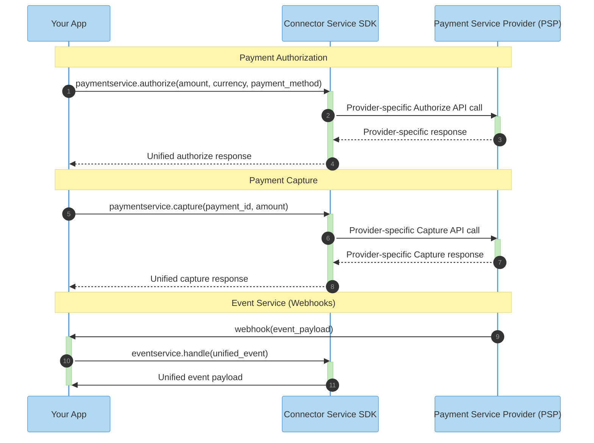

<div align="center">


# Connector Service


**One integration. Any payment processor. Zero lock-in.**


[](https://opensource.org/licenses/Apache-2.0)


*A high-performance payment abstraction library, and part of [Juspay Hyperswitch](https://hyperswitch.io/) — the open-source, composable payments platform with 40,000+ GitHub stars, trusted by leading brands worldwide.*


[GitHub](https://github.com/juspay/hyperswitch) · [Website](https://hyperswitch.io/) · [Documentation](https://docs.hyperswitch.io/)


</div>


---


## 🎯 Why Connector Service?


Integrating multiple payment processors shouldn't require months of engineering effort. Yet every PSP has different APIs, error codes, authentication methods, and idiosyncrasies.


**Connector Service solves this with a unified schema that works across all payment providers.**


| ❌ Without Connector Service | ✅ With Connector Service |
|------------------------------|----------------------------|
| 🗂️ 50+ different API schemas | 📋 Single unified schema |
| ⏳ Months of integration work | ⚡ Hours to integrate |
| 🔗 Brittle, provider-specific code | 🔓 Portable, provider-agnostic code |
| 🚫 Hard to switch providers | 🔄 Change providers in 1 line |


---


## ✨ Features


- **🔌 50+ Connectors** — Stripe, Adyen, Braintree, PayPal, Worldpay, and more
- **🌍 Global Coverage** — Cards, wallets, bank transfers, BNPL, and regional methods
- **🚀 Zero Overhead** — Rust core with native bindings, no overhead
- **🔒 PCI-Compliant by Design** — Stateless, no data storage


---


## 🏗️ Architecture


```
┌─────────────────────────────────────────────────────────────────┐
│                        Your Application                         │
└─────────────────────────────────┬───────────────────────────────┘
                                 │
                                 ▼
┌─────────────────────────────────────────────────────────────────┐
│                      Connector Service SDK                      │
│                 (Type-safe, idiomatic interface)                │
└─────────────────────────────────┬───────────────────────────────┘
                                 │
                                 ▼
         ┌───────────────────────┼───────────────────────┬───────────────────────┐
         ▼                       ▼                       ▼                       ▼
   ┌──────────┐           ┌──────────┐           ┌──────────┐           ┌──────────┐
   │  Stripe  │           │  Adyen   │           │ Braintree│           │ 50+ more │
   └──────────┘           └──────────┘           └──────────┘           └──────────┘
```


### Payment & Capture Flow Sequence



---


## 🚀 Quick Start


### Basic Usage


<!-- tabs:start -->
#### **Node.js**


```javascript
const { PaymentClient, Connector, Currency } = require('@juspay/connector-service-node');


async function main() {
 const client = new PaymentClient('your_api_key');


 const payment = await client.createPayment({
   amount: { value: 1000, currency: Currency.USD }, // $10.00
   connector: Connector.Stripe,
   paymentMethod: {
     card: {
       number: '4242424242424242',
       expMonth: 12,
       expYear: 2030,
       cvv: '123'
     }
   },
   captureMethod: 'automatic'
 });


 console.log('Payment ID:', payment.id);
 console.log('Status:', payment.status);
}


main();
```


#### **Java**


```java
import com.juspay.connectorservice.*;
import com.juspay.connectorservice.types.*;


public class Example {
   public static void main(String[] args) {
       PaymentClient client = PaymentClient.create("your_api_key");


       PaymentRequest request = PaymentRequest.builder()
           .amount(Amount.of(1000, Currency.USD)) // $10.00
           .connector(Connector.STRIPE)
           .paymentMethod(PaymentMethod.card(
               "4242424242424242",
               12, 2030, "123"
           ))
           .captureMethod(CaptureMethod.AUTOMATIC)
           .build();


       Payment payment = client.createPayment(request);


       System.out.println("Payment ID: " + payment.getId());
       System.out.println("Status: " + payment.getStatus());
   }
}
```
<!-- tabs:end -->


---


## 🔄 Switching Providers


One of Connector Service's core benefits: switch payment providers by changing **one line**.


```javascript
// Before: Using Stripe
const payment = await client.createPayment({
   connector: Connector.Stripe,  // ← Change this
   // ... rest stays the same
});


// After: Using Adyen
const payment = await client.createPayment({
   connector: Connector.Adyen,   // ← That's it!
   // ... everything else identical
});
```


No rewriting. No re-architecting. Just swap the connector.


---


## 🌊 Abstracted Payment Flows


Connector Service unifies complex payment operations across all processors:


### Core Payment Operations
| Flow | Description |
|------|-------------|
| **Authorize** | Hold funds on a customer's payment method |
| **Capture** | Complete an authorized payment and transfer funds |
| **Void** | Cancel an authorized payment without charging |
| **Refund** | Return captured funds to the customer |
| **Sync** | Retrieve the latest payment status from the processor |


### Advanced Flows
| Flow | Description |
|------|-------------|
| **Setup Mandate** | Create recurring payment authorizations |
| **Incremental Auth** | Increase the authorized amount post-transaction |
| **Partial Capture** | Capture less than the originally authorized amount |


Each flow uses the same unified schema regardless of the underlying processor's API differences. No custom code per provider.


---


**One integration pattern. Any service category.**


---


## 🛠️ Development


### Prerequisites


- Rust 1.70+
- Protocol Buffers (protoc)


### Building from Source


```bash
# Clone the repository
git clone https://github.com/manojradhakrishnan/connector-service.git
cd connector-service


# Build
cargo build --release


# Run tests
cargo test
```


### Project Structure


```
connector-service/
├── backend/
│   ├── grpc-server/           # gRPC server implementation
│   ├── grpc-api-types/        # Protocol buffer definitions
│   ├── connector-integration/ # Connector implementations
│   ├── composite-service/     # Composite service layer
│   ├── common_utils/          # Shared utilities
│   ├── common_enums/          # Common enums
│   ├── domain_types/          # Domain type definitions
│   ├── interfaces/            # Interface definitions
│   ├── external-services/     # External service clients
│   ├── ffi/                   # Foreign function interface
│   └── ...
├── sdk/
│   ├── java/                  # Java SDK
│   ├── node-ffi-client/       # Node.js FFI client
│   ├── rust/                  # Rust SDK
│   ├── rust-grpc-client/      # Rust gRPC client
│   └── python/                # Python SDK
└── ...
```


---


## 🔒 Security


- **Stateless by design** — No PII or PCI data stored
- **Memory-safe** — Built in Rust, no buffer overflows
- **Encrypted credentials** — API keys never logged or exposed


### Reporting Vulnerabilities


Please report security issues to [security@juspay.in](mailto:security@juspay.in).


---


<div align="center">


**[⬆ Back to Top](#connector-service)**


Made with by [Juspay hyperswitch](https://hyperswitch.io)


</div>

## Test Sync
This is a test to verify docs sync workflow.


Test auto-trigger
