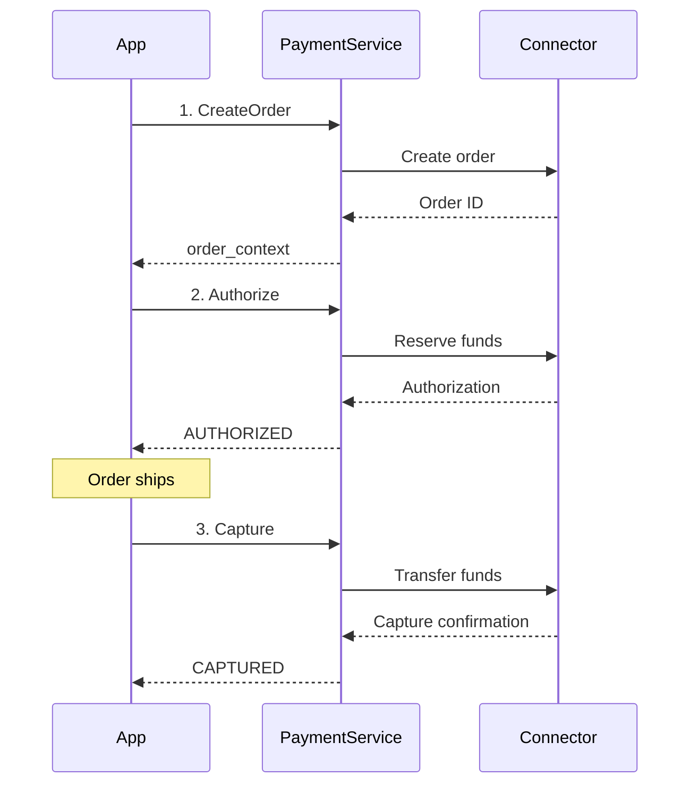
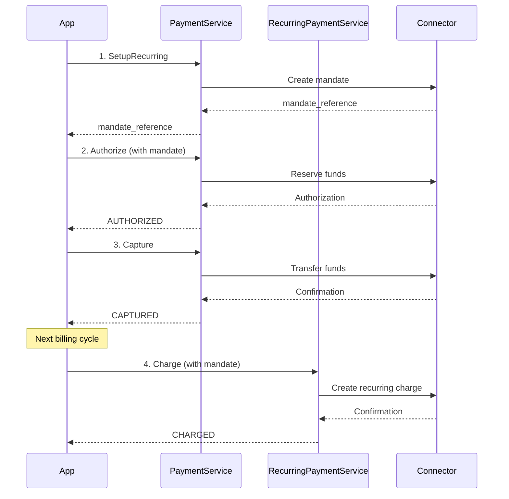
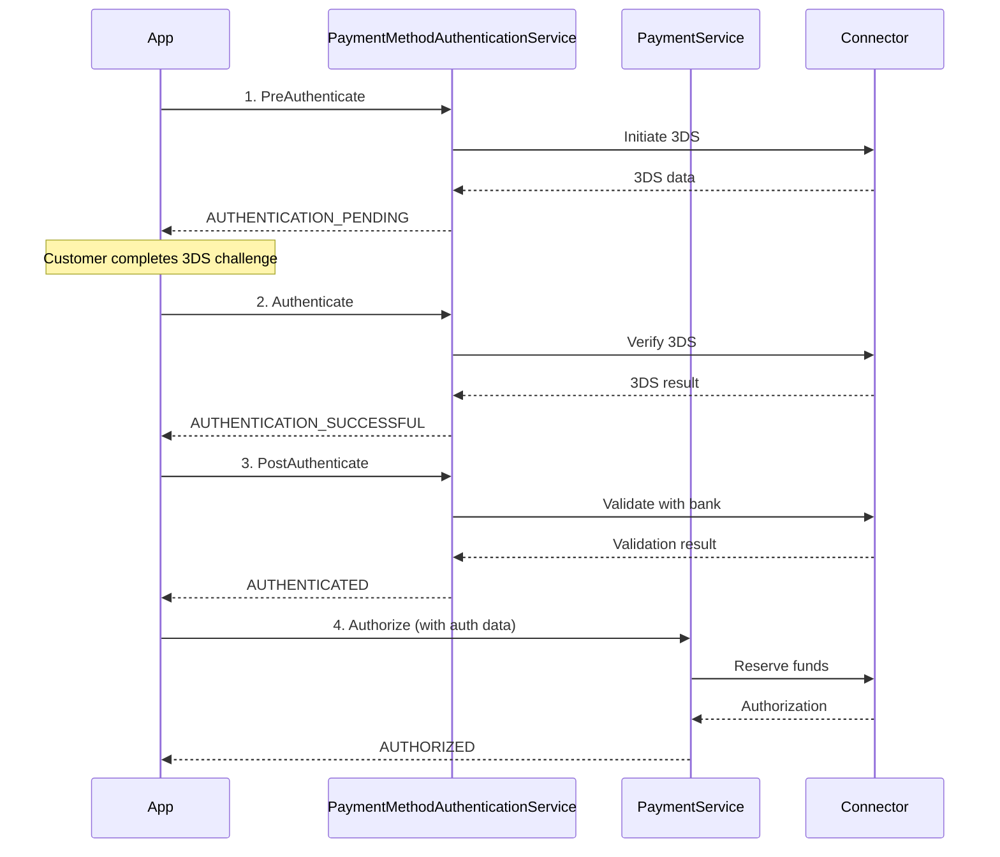
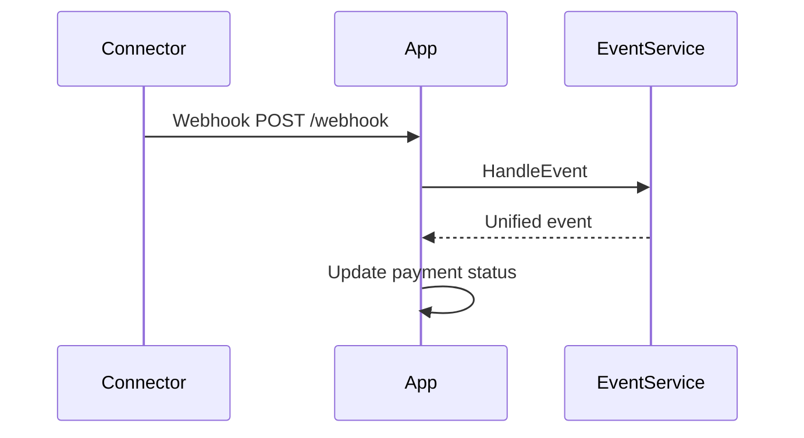

# Connector Service API Reference

<!--
---
title: API Reference
description: Complete reference for the Connector Service gRPC API, including all services, operations, and protocol buffer definitions
last_updated: 2026-03-12
generated_from: backend/grpc-api-types/proto/
auto_generated: true
reviewed_by: engineering
---
-->

## Overview

The Connector Service exposes a unified gRPC API that serves as the primary entry point for processing payments across 110+ payment connectors. This API abstracts away the complexity of individual payment processor implementations, providing a single, consistent interface for all payment operations.

**Key Benefits:**
- **Unified Schema**: One API for 110+ connectors (Stripe, Adyen, Braintree, PayPal, etc.)
- **Type Safety**: Protocol Buffer definitions ensure compile-time type checking
- **Multi-Step Flow Support**: Handle complex operations like 3DS authentication and redirects
- **Webhook Integration**: Unified event handling for asynchronous notifications
- **Zero Lock-in**: Switch providers by changing one parameter

## Architecture

The API is organized into domain-specific services, each handling a particular aspect of payment processing:

```
┌─────────────────────────────────────────────────────────────┐
│                    Your Application                         │
└──────────────────────────┬──────────────────────────────────┘
                           │
                           ▼
┌─────────────────────────────────────────────────────────────┐
│              Connector Service gRPC API                     │
│  ┌──────────────┐ ┌──────────────┐ ┌──────────────┐        │
│  │   Payment    │ │   Recurring  │ │   Merchant   │        │
│  │   Service    │ │   Payment    │ │     Auth     │        │
│  └──────────────┘ └──────────────┘ └──────────────┘        │
│  ┌──────────────┐ ┌──────────────┐ ┌──────────────┐        │
│  │   Refund     │ │   Dispute    │ │    Event     │        │
│  │   Service    │ │   Service    │ │   Service    │        │
│  └──────────────┘ └──────────────┘ └──────────────┘        │
│  ┌──────────────┐ ┌──────────────┐ ┌──────────────┐        │
│  │Payment Method│ │   Customer   │ │     3DS      │        │
│  │   Service    │ │   Service    │ │     Auth     │        │
│  └──────────────┘ └──────────────┘ └──────────────┘        │
└─────────────────────────────────────────────────────────────┘
```

## Services

### Core Payment Services

#### 1. PaymentService
**Purpose**: Process payments from authorization to settlement across all connectors.

**File**: `backend/grpc-api-types/proto/services.proto`

| Operation | RPC Method | Description |
|-----------|------------|-------------|
| **Authorize** | `Authorize` | Reserve funds on a payment method without capturing |
| **Capture** | `Capture` | Finalize an authorized payment and transfer funds |
| **Get** | `Get` | Retrieve current payment status from the processor |
| **Void** | `Void` | Cancel an authorized payment before capture |
| **Reverse** | `Reverse` | Reverse a captured payment before settlement |
| **Refund** | `Refund` | Initiate a refund to customer's payment method |
| **Create Order** | `CreateOrder` | Initialize an order before payment collection |
| **Setup Recurring** | `SetupRecurring` | Create a recurring payment mandate |
| **Incremental Auth** | `IncrementalAuthorization` | Increase authorized amount |
| **Verify Redirect** | `VerifyRedirectResponse` | Validate redirect-based payment responses |
| **Handle Event** | `HandleEvent` | Process payment-related webhook events |

**Usage Pattern**:
```protobuf
// Authorize a payment
rpc Authorize(PaymentServiceAuthorizeRequest) returns (PaymentServiceAuthorizeResponse);

// Capture the authorized payment
rpc Capture(PaymentServiceCaptureRequest) returns (PaymentServiceCaptureResponse);
```

[→ Payment Service Documentation](./services/payment-service/README.md)

---

#### 2. RecurringPaymentService
**Purpose**: Manage recurring payments and subscription billing.

**File**: `backend/grpc-api-types/proto/services.proto`

| Operation | RPC Method | Description |
|-----------|------------|-------------|
| **Charge** | `Charge` | Process a recurring payment using stored mandate |
| **Revoke** | `Revoke` | Cancel an existing recurring payment mandate |

**Usage Pattern**:
```protobuf
// Charge using stored mandate
rpc Charge(RecurringPaymentServiceChargeRequest) returns (RecurringPaymentServiceChargeResponse);

// Revoke mandate
rpc Revoke(RecurringPaymentServiceRevokeRequest) returns (RecurringPaymentServiceRevokeResponse);
```

[→ Recurring Payment Service Documentation](./services/recurring-payment-service/README.md)

---

#### 3. RefundService
**Purpose**: Retrieve and synchronize refund statuses.

**File**: `backend/grpc-api-types/proto/services.proto`

| Operation | RPC Method | Description |
|-----------|------------|-------------|
| **Get** | `Get` | Retrieve refund status from processor |
| **Handle Event** | `HandleEvent` | Process refund-related webhook events |

**Usage Pattern**:
```protobuf
rpc Get(RefundServiceGetRequest) returns (RefundResponse);
rpc HandleEvent(EventServiceHandleRequest) returns (EventServiceHandleResponse);
```

[→ Refund Service Documentation](./services/refund-service/README.md)

---

#### 4. DisputeService
**Purpose**: Manage chargeback disputes and evidence submission.

**File**: `backend/grpc-api-types/proto/services.proto`

| Operation | RPC Method | Description |
|-----------|------------|-------------|
| **Submit Evidence** | `SubmitEvidence` | Upload evidence to dispute chargeback |
| **Get** | `Get` | Retrieve dispute status and evidence state |
| **Defend** | `Defend` | Submit defense with reason code |
| **Accept** | `Accept` | Concede dispute and accept liability |
| **Handle Event** | `HandleEvent` | Process dispute-related webhook events |

**Usage Pattern**:
```protobuf
rpc SubmitEvidence(DisputeServiceSubmitEvidenceRequest) returns (DisputeServiceSubmitEvidenceResponse);
rpc Get(DisputeServiceGetRequest) returns (DisputeResponse);
rpc Defend(DisputeServiceDefendRequest) returns (DisputeServiceDefendResponse);
rpc Accept(DisputeServiceAcceptRequest) returns (DisputeServiceAcceptResponse);
```

[→ Dispute Service Documentation](./services/dispute-service/README.md)

---

### Authentication & Security Services

#### 5. MerchantAuthenticationService
**Purpose**: Generate access tokens and session credentials for secure payment processing.

**File**: `backend/grpc-api-types/proto/services.proto`

| Operation | RPC Method | Description |
|-----------|------------|-------------|
| **Create Access Token** | `CreateAccessToken` | Generate short-lived connector authentication token |
| **Create Session Token** | `CreateSessionToken` | Create session token for payment processing |
| **Create SDK Session Token** | `CreateSdkSessionToken` | Initialize wallet payment sessions (Apple Pay, Google Pay) |

**Usage Pattern**:
```protobuf
rpc CreateAccessToken(MerchantAuthenticationServiceCreateAccessTokenRequest) 
    returns (MerchantAuthenticationServiceCreateAccessTokenResponse);
    
rpc CreateSdkSessionToken(MerchantAuthenticationServiceCreateSdkSessionTokenRequest)
    returns (MerchantAuthenticationServiceCreateSdkSessionTokenResponse);
```

[→ Merchant Authentication Service Documentation](./services/merchant-authentication-service/README.md)

---

#### 6. PaymentMethodAuthenticationService
**Purpose**: Execute 3D Secure authentication flows for fraud prevention.

**File**: `backend/grpc-api-types/proto/services.proto`

| Operation | RPC Method | Description |
|-----------|------------|-------------|
| **Pre-Authenticate** | `PreAuthenticate` | Initiate 3DS flow before payment authorization |
| **Authenticate** | `Authenticate` | Execute 3DS challenge or frictionless verification |
| **Post-Authenticate** | `PostAuthenticate` | Validate authentication results with issuing bank |

**Usage Pattern**:
```protobuf
rpc PreAuthenticate(PaymentMethodAuthenticationServicePreAuthenticateRequest)
    returns (PaymentMethodAuthenticationServicePreAuthenticateResponse);
    
rpc Authenticate(PaymentMethodAuthenticationServiceAuthenticateRequest)
    returns (PaymentMethodAuthenticationServiceAuthenticateResponse);
    
rpc PostAuthenticate(PaymentMethodAuthenticationServicePostAuthenticateRequest)
    returns (PaymentMethodAuthenticationServicePostAuthenticateResponse);
```

[→ Payment Method Authentication Service Documentation](./services/payment-method-authentication-service/README.md)

---

### Support Services

#### 7. PaymentMethodService
**Purpose**: Tokenize and retrieve payment methods securely.

**File**: `backend/grpc-api-types/proto/services.proto`

| Operation | RPC Method | Description |
|-----------|------------|-------------|
| **Tokenize** | `Tokenize` | Tokenize payment method for secure storage |

**Usage Pattern**:
```protobuf
rpc Tokenize(PaymentMethodServiceTokenizeRequest) returns (PaymentMethodServiceTokenizeResponse);
```

[→ Payment Method Service Documentation](./services/payment-method-service/README.md)

---

#### 8. CustomerService
**Purpose**: Create and manage customer profiles at connectors.

**File**: `backend/grpc-api-types/proto/services.proto`

| Operation | RPC Method | Description |
|-----------|------------|-------------|
| **Create** | `Create` | Create customer record in payment processor |

**Usage Pattern**:
```protobuf
rpc Create(CustomerServiceCreateRequest) returns (CustomerServiceCreateResponse);
```

[→ Customer Service Documentation](./services/customer-service/README.md)

---

#### 9. EventService
**Purpose**: Process asynchronous webhook events from payment processors.

**File**: `backend/grpc-api-types/proto/services.proto`

| Operation | RPC Method | Description |
|-----------|------------|-------------|
| **Handle Event** | `HandleEvent` | Process webhook notifications and translate to unified responses |

**Usage Pattern**:
```protobuf
rpc HandleEvent(EventServiceHandleRequest) returns (EventServiceHandleResponse);
```

[→ Event Service Documentation](./services/event-service/README.md)

---

#### 10. CompositePaymentService
**Purpose**: Execute composite flows combining multiple operations.

**File**: `backend/grpc-api-types/proto/composite_service.proto`

| Operation | RPC Method | Description |
|-----------|------------|-------------|
| **Composite Authorize** | `CompositeAuthorize` | Runs composite authorize flow (token + customer + authorize) |
| **Composite Get** | `CompositeGet` | Runs composite get flow (token + sync) |

**Usage Pattern**:
```protobuf
rpc CompositeAuthorize(CompositeAuthorizeRequest) returns (CompositeAuthorizeResponse);
rpc CompositeGet(CompositeGetRequest) returns (CompositeGetResponse);
```

---

#### 11. Health Service
**Purpose**: Health check endpoint for service monitoring.

**File**: `backend/grpc-api-types/proto/health_check.proto`

| Operation | RPC Method | Description |
|-----------|------------|-------------|
| **Check** | `Check` | Check service health status |

**Usage Pattern**:
```protobuf
rpc Check(HealthCheckRequest) returns (HealthCheckResponse);
```

---

## Protocol Buffer Files

### Core Definition Files

| File | Path | Description |
|------|------|-------------|
| **services.proto** | `backend/grpc-api-types/proto/services.proto` | Main service definitions for all payment operations |
| **payment.proto** | `backend/grpc-api-types/proto/payment.proto` | Core data types, enums, request/response messages |
| **payment_methods.proto** | `backend/grpc-api-types/proto/payment_methods.proto` | Payment method definitions (cards, wallets, etc.) |
| **composite_payment.proto** | `backend/grpc-api-types/proto/composite_payment.proto` | Composite operation request/response messages |
| **composite_service.proto** | `backend/grpc-api-types/proto/composite_service.proto` | Composite service definition |
| **sdk_config.proto** | `backend/grpc-api-types/proto/sdk_config.proto` | SDK configuration options |
| **health_check.proto** | `backend/grpc-api-types/proto/health_check.proto` | Health check service definition |

### Example Proto Files

| File | Path | Description |
|------|------|-------------|
| **payment.proto** | `examples/example-hs-grpc/proto/payment.proto` | Example Haskell gRPC client proto |

---

## Key Data Types

### Core Types (payment.proto)

#### Money
```protobuf
message Money {
  int64 minor_amount = 1;  // Amount in minor units (e.g., 1000 = $10.00)
  Currency currency = 2;   // ISO 4217 currency code
}
```

#### PaymentStatus
```protobuf
enum PaymentStatus {
  ATTEMPT_STATUS_UNSPECIFIED = 0;
  STARTED = 1;
  PAYMENT_METHOD_AWAITED = 22;
  AUTHENTICATION_PENDING = 4;
  AUTHENTICATION_SUCCESSFUL = 5;
  AUTHENTICATION_FAILED = 2;
  AUTHORIZING = 9;
  AUTHORIZED = 6;
  AUTHORIZATION_FAILED = 7;
  PARTIALLY_AUTHORIZED = 25;
  CHARGED = 8;
  PARTIAL_CHARGED = 17;
  CAPTURE_INITIATED = 13;
  CAPTURE_FAILED = 14;
  VOID_INITIATED = 12;
  VOIDED = 11;
  VOID_FAILED = 15;
  // ... and more
}
```

#### RefundStatus
```protobuf
enum RefundStatus {
  REFUND_STATUS_UNSPECIFIED = 0;
  REFUND_FAILURE = 1;
  REFUND_MANUAL_REVIEW = 2;
  REFUND_PENDING = 3;
  REFUND_SUCCESS = 4;
  REFUND_TRANSACTION_FAILURE = 5;
}
```

#### DisputeStatus
```protobuf
enum DisputeStatus {
  DISPUTE_STATUS_UNSPECIFIED = 0;
  DISPUTE_OPENED = 1;
  DISPUTE_EXPIRED = 2;
  DISPUTE_ACCEPTED = 3;
  DISPUTE_CANCELLED = 4;
  DISPUTE_CHALLENGED = 5;
  DISPUTE_WON = 6;
  DISPUTE_LOST = 7;
}
```

### Payment Methods (payment_methods.proto)

#### Supported Payment Methods
- **Card Methods**: Credit, Debit, Card Redirect
- **Digital Wallets**: Apple Pay, Google Pay, PayPal, Samsung Pay, WeChat Pay, AliPay
- **UPI**: UPI Collect, UPI Intent, UPI QR
- **Online Banking**: iDEAL, Sofort, Trustly, Giropay, EPS, Blik
- **Bank Transfers**: ACH, SEPA, BACS, PIX, Instant Bank Transfer
- **Direct Debit**: SEPA Direct Debit, BECS, ACH
- **Buy Now Pay Later**: Affirm, Afterpay/Clearpay, Klarna
- **Cash/Voucher**: Boleto, OXXO, 7-Eleven, Alfamart, Indomaret
- **Cryptocurrency**: Generic crypto payments

### Connectors (payment.proto)

The API supports 110+ connectors including:

| Category | Connectors |
|----------|------------|
| **Global** | Stripe, Adyen, Braintree, PayPal, Worldpay, Checkout.com, Cybersource |
| **Regional** | Alipay, WeChat Pay, UPI, PIX, Klarna, Trustly, iDEAL |
| **Enterprise** | JPMorgan, Bank of America, Wells Fargo, Elavon, TSYS |
| **Emerging** | Rapyd, dLocal, Xendit, Volt, Gigadat |

---

## Common Workflows

### 1. E-commerce Checkout (Two-Step Payment)



**Operations Used**:
- `PaymentService.CreateOrder`
- `PaymentService.Authorize`
- `PaymentService.Capture`

---

### 2. Subscription Setup with Recurring Payments



**Operations Used**:
- `PaymentService.SetupRecurring`
- `PaymentService.Authorize`
- `PaymentService.Capture`
- `RecurringPaymentService.Charge`

---

### 3. 3D Secure Authentication Flow



**Operations Used**:
- `PaymentMethodAuthenticationService.PreAuthenticate`
- `PaymentMethodAuthenticationService.Authenticate`
- `PaymentMethodAuthenticationService.PostAuthenticate`
- `PaymentService.Authorize`

---

### 4. Webhook Event Handling



**Operations Used**:
- `EventService.HandleEvent`

---

## Error Handling

All services return structured error information:

```protobuf
message ErrorInfo {
  optional UnifiedErrorDetails unified_details = 1;
  optional IssuerErrorDetails issuer_details = 2;
  optional ConnectorErrorDetails connector_details = 3;
}

message UnifiedErrorDetails {
  optional string code = 1;
  optional string message = 2;
  optional string description = 3;
  optional string user_guidance_message = 4;
}
```

**Error Categories**:
- **Unified Errors**: Standardized error codes across all connectors
- **Issuer Errors**: Card issuer/network specific errors (Visa, Mastercard, etc.)
- **Connector Errors**: Payment processor specific error codes

---

## State Management

Multi-step flows use `ConnectorState` to maintain session continuity:

```protobuf
message ConnectorState {
  optional AccessToken access_token = 1;
  optional string connector_customer_id = 2;
}
```

Pass the `state` from each response to the next request to maintain session context.

---

## Getting Started

1. **Define Your Proto**: Import the proto files from `backend/grpc-api-types/proto/`

2. **Generate Client Code**:
   ```bash
   # Example for Go
   protoc --go_out=. --go-grpc_out=. backend/grpc-api-types/proto/services.proto
   ```

3. **Connect to Service**:
   ```go
   conn, err := grpc.Dial("localhost:50051", grpc.WithInsecure())
   client := NewPaymentServiceClient(conn)
   ```

4. **Make Your First Call**:
   ```go
   resp, err := client.Authorize(ctx, &PaymentServiceAuthorizeRequest{
       Amount: &Money{
           MinorAmount: 1000,
           Currency: Currency_USD,
       },
       PaymentMethod: &PaymentMethod{
           // ... payment details
       },
   })
   ```

---

## Related Documentation

- [Getting Started](../getting-started/README.md) - Quick start guide
- [Domain Schema](./domain-schema/README.md) - Data models and enums
- [Connectors](../connectors/README.md) - Connector-specific documentation
- [SDKs](../sdks/README.md) - Client SDKs and libraries

---

## Proto File Locations

```
backend/grpc-api-types/proto/
├── services.proto              # Main service definitions
├── payment.proto               # Core payment types
├── payment_methods.proto       # Payment method types
├── composite_payment.proto     # Composite operations
├── composite_service.proto     # Composite service
├── sdk_config.proto            # SDK configuration
└── health_check.proto          # Health check service

examples/example-hs-grpc/proto/
└── payment.proto               # Example Haskell client proto
```

---

## Version Information

- **Package**: `types`
- **Syntax**: `proto3`
- **Go Package**: `github.com/juspay/connector-service/backend/grpc-api-types/proto;proto`

---

*Generated from protocol buffer definitions. For the most up-to-date API reference, consult the proto files directly.*