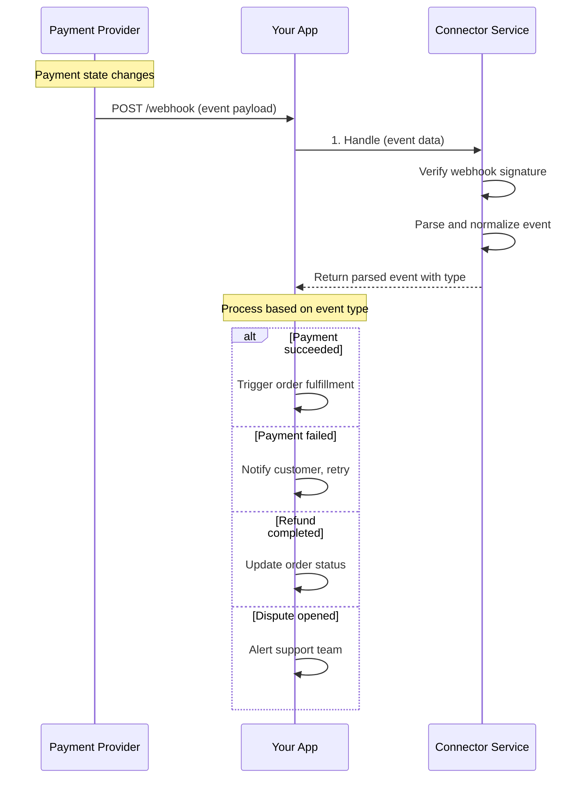
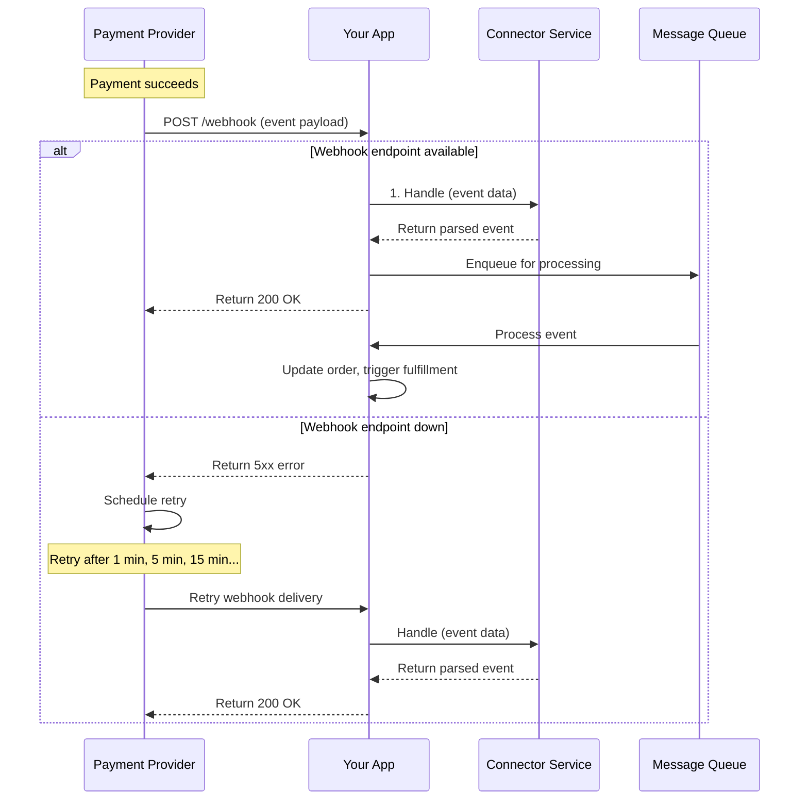

# Event Service

<!--
---
title: Event Service
description: Process asynchronous webhook events from payment processors for real-time state updates
last_updated: 2026-03-05
generated_from: backend/grpc-api-types/proto/services.proto
auto_generated: false
reviewed_by: engineering
reviewed_at: 2026-03-05
approved: true
---
-->

## Overview

The Event Service processes webhook notifications from payment processors. Instead of polling APIs for status updates, this service receives real-time events when payment states change, enabling immediate response to successful payments, failed transactions, refunds, and disputes.

**Business Use Cases:**
- **Real-time order fulfillment** - Trigger shipping when payment succeeds
- **Failed payment handling** - Retry or notify customers immediately
- **Refund tracking** - Update order status when refunds complete
- **Dispute notifications** - Alert teams when chargebacks are filed
- **Reconciliation** - Keep your system in sync with processor state

The service handles events from all supported connectors, normalizing them into a consistent format regardless of the source.

## Operations

| Operation | Description | Use When |
|-----------|-------------|----------|
| [`Handle`](./handle.md) | Process webhook notifications from connectors. Translates connector events into standardized responses for asynchronous payment state updates. | Receiving webhook callbacks from any payment processor |

## Common Patterns

### Webhook Processing Flow

Receive and process webhook events to keep your system synchronized with payment processor state.

**Flow Explanation:**

1. **Receive webhook** - Payment processors send webhook notifications to your configured endpoint when events occur (payment success, failure, refund, dispute, etc.).

2. **Handle** - Forward the raw webhook payload to the Event Service's `Handle` RPC. The service verifies the webhook signature to ensure it's authentic, then parses and normalizes the event into a standard format regardless of which connector sent it.

3. **Process event** - Based on the returned `event_type` and `event_response`, take appropriate action in your system. The response includes the full payment/refund/dispute details so you can update your database and trigger business logic.

**Common Event Types:**
- `PAYMENT_INTENT_SUCCESS` - Payment completed successfully
- `PAYMENT_INTENT_PAYMENT_FAILED` - Payment attempt failed
- `CHARGE_REFUNDED` - Refund was processed
- `DISPUTE_CREATED` - New chargeback filed
- `DISPUTE_CLOSED` - Dispute resolved

---

### Reliable Webhook Processing

Handle webhook delivery failures and ensure events are processed even during outages.

**Flow Explanation:**

1. **Receive webhook** - Your endpoint receives the webhook POST request from the payment processor.

2. **Handle and verify** - Call the `Handle` RPC to verify the webhook signature and parse the event. Return a 200 OK response to the processor immediately to acknowledge receipt.

3. **Queue for processing** - Instead of processing synchronously, enqueue the event in a message queue (Redis, RabbitMQ, SQS, etc.). This prevents timeouts and handles retries if your processing fails.

4. **Process asynchronously** - Workers consume from the queue and process events. This decouples webhook receipt from business logic execution.

**Retry Handling:**
- Return 2xx status to stop retries
- Return 5xx status to trigger processor retry
- Processors typically retry 3-5 times with exponential backoff

---

## Security Considerations

**Webhook Verification:**
The Event Service automatically verifies webhook signatures using the connector's webhook secrets. This ensures events are genuinely from the payment processor and haven't been tampered with.

**Idempotency:**
Payment processors may send the same event multiple times (retries). Use the `merchant_event_id` to deduplicate events in your system.

**Timeout Handling:**
Process webhooks quickly and return 200 OK. If processing takes longer than 10-30 seconds, some processors will retry. Use a queue for heavy processing.

## Next Steps

- [Payment Service](../payment-service/README.md) - Handle payment success/failure events
- [Refund Service](../refund-service/README.md) - Process refund completion events
- [Dispute Service](../dispute-service/README.md) - Handle dispute notification events
