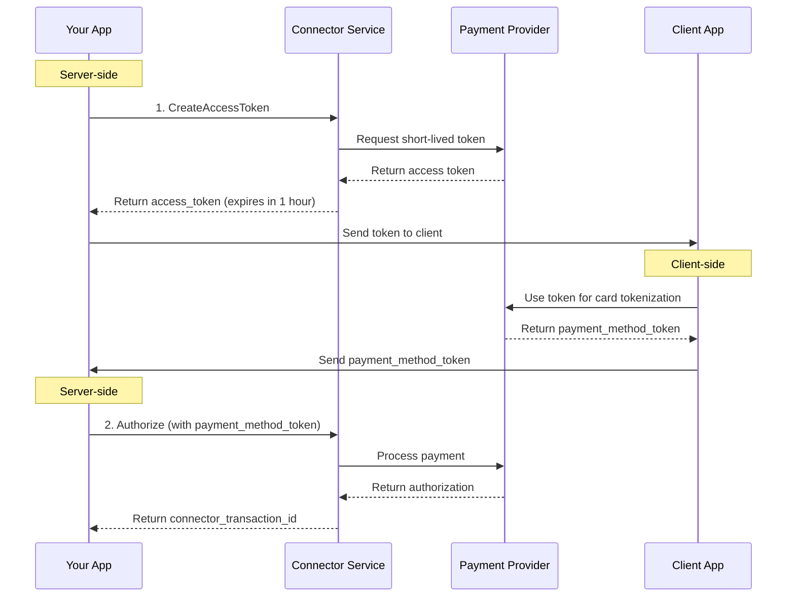
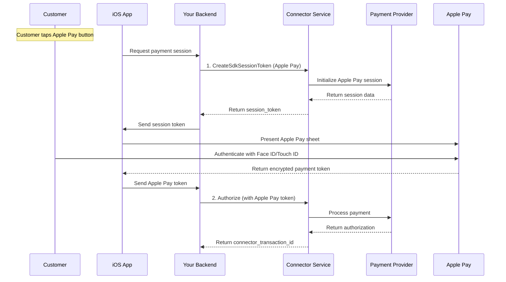

# Merchant Authentication Service

<!--
---
title: Merchant Authentication Service
description: Generate access tokens and session credentials for secure payment processing and SDK initiation
last_updated: 2026-03-05
generated_from: backend/grpc-api-types/proto/services.proto
auto_generated: false
reviewed_by: engineering
reviewed_at: 2026-03-05
approved: true
---
-->

## Overview

The Merchant Authentication Service provides secure authentication mechanisms for payment processing. It generates short-lived access tokens for API access, session tokens for maintaining payment state, and SDK session tokens for wallet payments like Apple Pay and Google Pay.

**Business Use Cases:**
- **Client-side tokenization** - Generate tokens for browser/mobile apps without exposing API keys
- **Session management** - Maintain state across multi-step payment flows
- **Wallet payments** - Initialize Apple Pay, Google Pay sessions
- **Security compliance** - Avoid storing secrets in client applications

The service enables secure payment flows by providing temporary credentials that expire after a short duration, reducing the risk of credential compromise.

## Operations

| Operation | Description | Use When |
|-----------|-------------|----------|
| [`CreateAccessToken`](./create-access-token.md) | Generate short-lived connector authentication token. Provides secure credentials for connector API access without storing secrets client-side. | Client applications need temporary API access |
| [`CreateSessionToken`](./create-session-token.md) | Create session token for payment processing. Maintains session state across multiple payment operations for improved security and tracking. | Multi-step payment flows requiring state persistence |
| [`CreateSdkSessionToken`](./create-sdk-session-token.md) | Initialize wallet payment sessions for Apple Pay, Google Pay, etc. Sets up secure context for tokenized wallet payments with device verification. | Enabling Apple Pay, Google Pay checkout options |

## Common Patterns

### Secure Client-Side Payment Flow

Generate temporary tokens for client applications to process payments without exposing long-lived API credentials.

**Flow Explanation:**

1. **CreateAccessToken** - Your server calls this RPC to generate a short-lived access token (typically 1 hour). This token has limited scope and can be safely sent to client applications (browsers, mobile apps) without exposing your main API credentials.

2. **Client tokenization** - The client uses this token to interact directly with the payment processor for operations like card tokenization. The temporary token limits exposure if the client is compromised.

3. **Server-side payment** - After the client obtains a payment method token, it sends it to your server. You then use your secure credentials to authorize the payment, keeping the sensitive payment processing on your trusted infrastructure.

---

### Apple Pay Integration

Initialize Apple Pay sessions for seamless mobile checkout.

**Flow Explanation:**

1. **CreateSdkSessionToken** - When a customer chooses Apple Pay, your backend calls this RPC with payment details (amount, merchant ID). The connector initializes an Apple Pay session with Apple's servers and returns session data.

2. **Present payment sheet** - Your iOS app uses the session token to present the native Apple Pay sheet. The customer authenticates using Face ID, Touch ID, or passcode.

3. **Process payment** - After customer authentication, Apple returns an encrypted payment token. Your backend receives this token and calls the Payment Service's `Authorize` RPC to complete the transaction.

---

## Security Best Practices

**Token Expiration:**
- Access tokens expire quickly (1 hour typical)
- Don't cache tokens long-term
- Generate new tokens for each session

**Scope Limitation:**
- Tokens have limited permissions
- Cannot perform sensitive operations
- Designed for specific use cases

**Server-Side Authorization:**
- Always process payments server-side
- Never authorize payments from client
- Use tokens only for tokenization/UI

## Next Steps

- [Payment Service](../payment-service/README.md) - Process payments after authentication
- [Payment Method Service](../payment-method-service/README.md) - Tokenize payment methods
