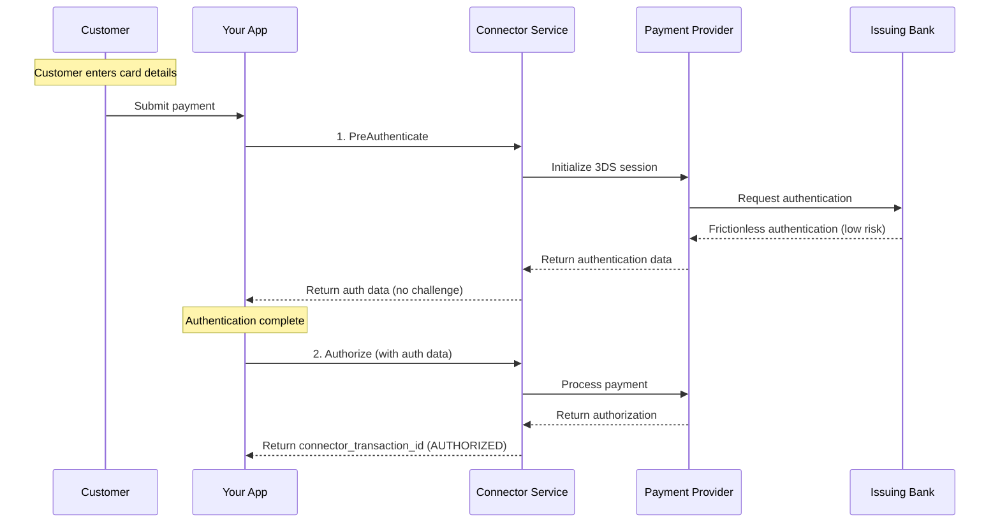
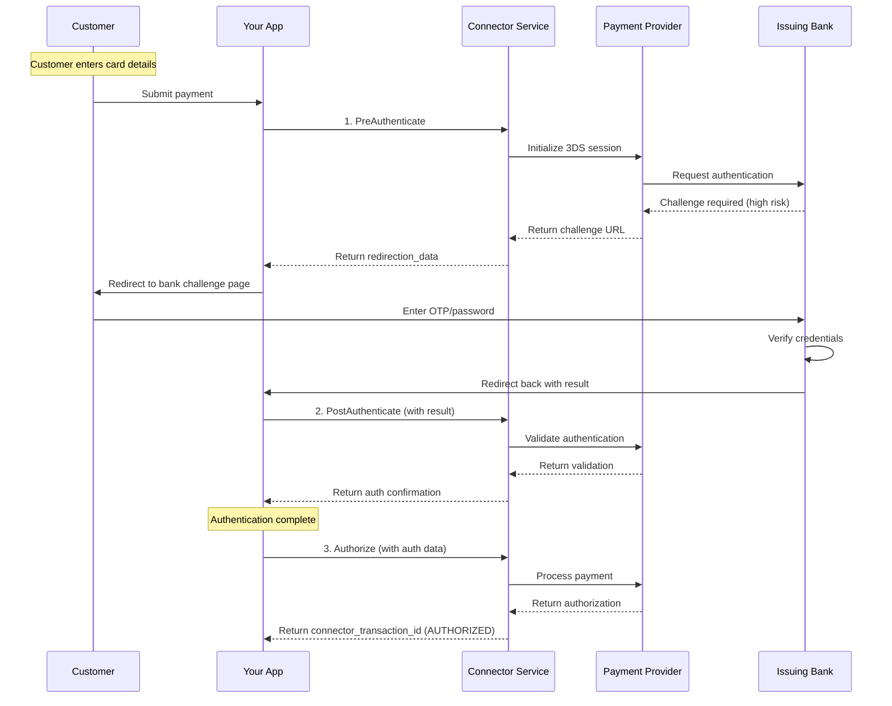

# Payment Method Authentication Service

<!--
---
title: Payment Method Authentication Service
description: Execute 3D Secure authentication flows for fraud prevention while balancing checkout friction
last_updated: 2026-03-05
generated_from: backend/grpc-api-types/proto/services.proto
auto_generated: false
reviewed_by: engineering
reviewed_at: 2026-03-05
approved: true
---
-->

## Overview

The Payment Method Authentication Service manages 3D Secure (3DS) authentication flows for card payments. It verifies cardholder identity through frictionless or challenge-based authentication to reduce fraud liability while maintaining a smooth checkout experience.

**Business Use Cases:**
- **Fraud prevention** - Verify cardholder identity for high-risk transactions
- **SCA compliance** - Meet Strong Customer Authentication requirements (EU)
- **Liability shift** - Transfer fraud liability to the issuing bank
- **Risk-based authentication** - Skip authentication for low-risk transactions

The service supports the complete 3DS flow: pre-authentication (device data collection), authentication (challenge or frictionless), and post-authentication (result validation).

## Operations

| Operation | Description | Use When |
|-----------|-------------|----------|
| [`PreAuthenticate`](./pre-authenticate.md) | Initiate 3DS flow before payment authorization. Collects device data and prepares authentication context for frictionless or challenge-based verification. | Starting a 3DS authentication flow |
| [`Authenticate`](./authenticate.md) | Execute 3DS challenge or frictionless verification. Authenticates customer via bank challenge or behind-the-scenes verification for fraud prevention. | Customer needs to complete 3DS challenge |
| [`PostAuthenticate`](./post-authenticate.md) | Validate authentication results with the issuing bank. Processes bank's authentication decision to determine if payment can proceed. | Verifying 3DS completion before payment |

## Common Patterns

### Frictionless 3DS Flow

Low-risk transactions pass authentication without customer interaction.

**Flow Explanation:**

1. **PreAuthenticate** - After the customer enters their card details, call this RPC to initiate 3DS. The connector sends device data, transaction amount, and merchant info to the issuing bank. For low-risk transactions (based on amount, device fingerprint, merchant history), the bank approves frictionlessly.

2. **Authorize payment** - If frictionless authentication succeeds, the response includes authentication data (ECI, CAVV values). Pass this to the Payment Service's `Authorize` RPC. The liability for fraud shifts to the issuing bank.

---

### Challenge-Based 3DS Flow

High-risk transactions require customer verification through bank challenge.

**Flow Explanation:**

1. **PreAuthenticate** - Initiate 3DS authentication. For high-risk transactions, the bank responds that a challenge is required. The response includes `redirection_data` with a URL to the bank's challenge page.

2. **Customer challenge** - Redirect the customer to the bank's challenge page where they enter an OTP sent to their phone, answer a security question, or provide a password. After verification, the bank redirects back to your app.

3. **PostAuthenticate** - After the customer returns from the challenge, call this RPC with the authentication result data. The connector validates the result with the bank and confirms authentication success.

4. **Authorize payment** - With successful 3DS authentication, call the Payment Service's `Authorize` RPC including the authentication data. The payment proceeds with liability protection.

---

## 3DS Decision Factors

Banks consider these factors for frictionless vs challenge:

| Factor | Low Risk (Frictionless) | High Risk (Challenge) |
|--------|------------------------|----------------------|
| **Transaction amount** | Small amounts | Large amounts |
| **Device fingerprint** | Known device | New/unknown device |
| **Merchant history** | Established merchant | New merchant |
| **Customer history** | Repeat customer | First-time customer |
| **Location** | Home country | Foreign country |
| **Time** | Normal hours | Unusual hours |

## Next Steps

- [Payment Service](../payment-service/README.md) - Process payments after 3DS
- [Merchant Authentication Service](../merchant-authentication-service/README.md) - Create authentication sessions
