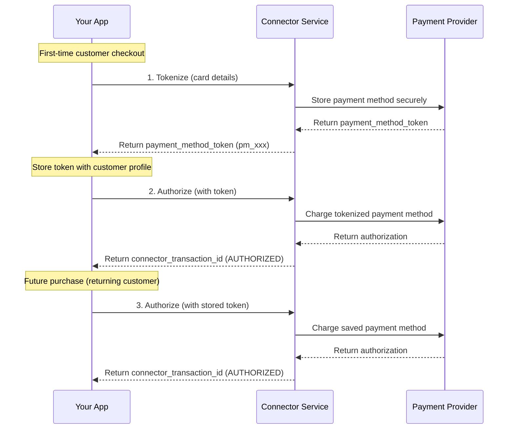
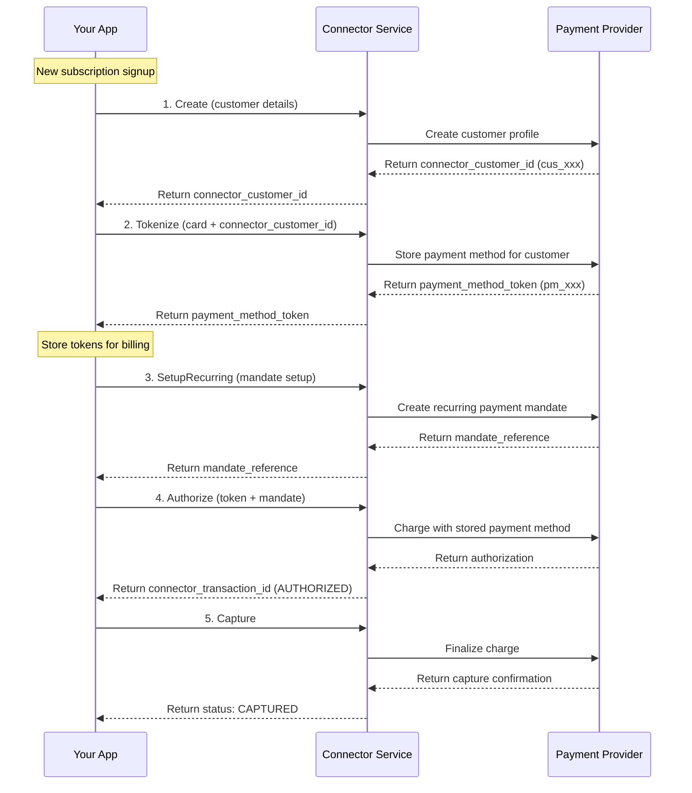

# Payment Method Service

<!--
---
title: Payment Method Service
description: Tokenize and securely store payment methods for one-click payments and recurring billing without PCI exposure
last_updated: 2026-03-05
generated_from: backend/grpc-api-types/proto/services.proto
auto_generated: false
reviewed_by: engineering
reviewed_at: 2026-03-05
approved: true
---
-->

## Overview

The Payment Method Service enables you to securely store and manage customer payment methods at payment processors. By tokenizing payment details, you can offer one-click checkout experiences and recurring billing without handling sensitive card data or maintaining PCI compliance overhead.

**Business Use Cases:**
- **One-click checkout** - Returning customers pay with saved payment methods without re-entering card details
- **Subscription billing** - Store payment methods for automated recurring charges
- **Mobile wallet integration** - Securely vault wallet tokens for future payments
- **Fraud reduction** - Tokenized payments reduce fraud liability and improve authorization rates

The service creates secure tokens at the underlying payment processor (Stripe, Adyen, etc.), allowing you to reference payment methods in future transactions without storing sensitive data in your systems.

## Operations

| Operation | Description | Use When |
|-----------|-------------|----------|
| [`Tokenize`](./tokenize.md) | Store payment method securely at the processor. Replaces raw card details with token for one-click payments and recurring billing. | First-time checkout, saving card for later, subscription setup |

## Common Patterns

### One-Click Checkout for Returning Customers

Save payment methods during first purchase to enable faster checkout for returning customers.

**Flow Explanation:**

1. **Tokenize payment method** - When a customer enters their payment details for the first time, call the `Tokenize` RPC. The payment processor securely stores the card details and returns a `payment_method_token` (e.g., Stripe's `pm_xxx`). Store this token in your customer database for future use.

2. **Authorize with token** - For the immediate purchase, call the Payment Service's `Authorize` RPC with the `payment_method_token`. This reserves funds on the customer's payment method. The response includes a `connector_transaction_id` and status `AUTHORIZED`.

3. **Future purchases** - For subsequent purchases, retrieve the stored `payment_method_token` from your database and call the Payment Service's `Authorize` RPC with it. The customer does not need to re-enter their payment details, enabling a one-click checkout experience.

**Benefits:**
- Faster checkout for returning customers (fewer steps, reduced friction)
- Reduced cart abandonment rates
- No PCI compliance overhead for stored payment data
- Consistent customer experience across devices

---

### Subscription Setup with Stored Payment Method

Combine Customer Service and Payment Method Service for seamless subscription onboarding.

**Flow Explanation:**

1. **Create customer** - First, call the Customer Service's `Create` RPC to create a customer profile at the payment processor. This returns a `connector_customer_id` that links all payment methods and transactions to the customer.

2. **Tokenize payment method** - Call the `Tokenize` RPC with the customer's payment details and the `connector_customer_id`. The payment processor securely stores the payment method and returns a `payment_method_token` linked to the customer.

3. **Setup recurring mandate** - Call the Payment Service's `SetupRecurring` RPC to create a payment mandate. This obtains customer consent for future recurring charges and returns a `mandate_reference`.

4. **Authorize initial payment** - Call the Payment Service's `Authorize` RPC with both the `payment_method_token` and `mandate_reference` to charge the initial subscription fee.

5. **Capture payment** - Call the Payment Service's `Capture` RPC to finalize the charge and transfer funds.

**Benefits:**
- Seamless subscription signup flow
- Stored payment credentials for all future billing
- Mandate-based recurring charges without customer interaction
- Unified customer profile across all payments

---

## Next Steps

- [Customer Service](../customer-service/README.md) - Create customer profiles for payment method association
- [Payment Service](../payment-service/README.md) - Process payments with tokenized methods
- [Recurring Payment Service](../recurring-payment-service/README.md) - Set up recurring billing with stored payment methods
