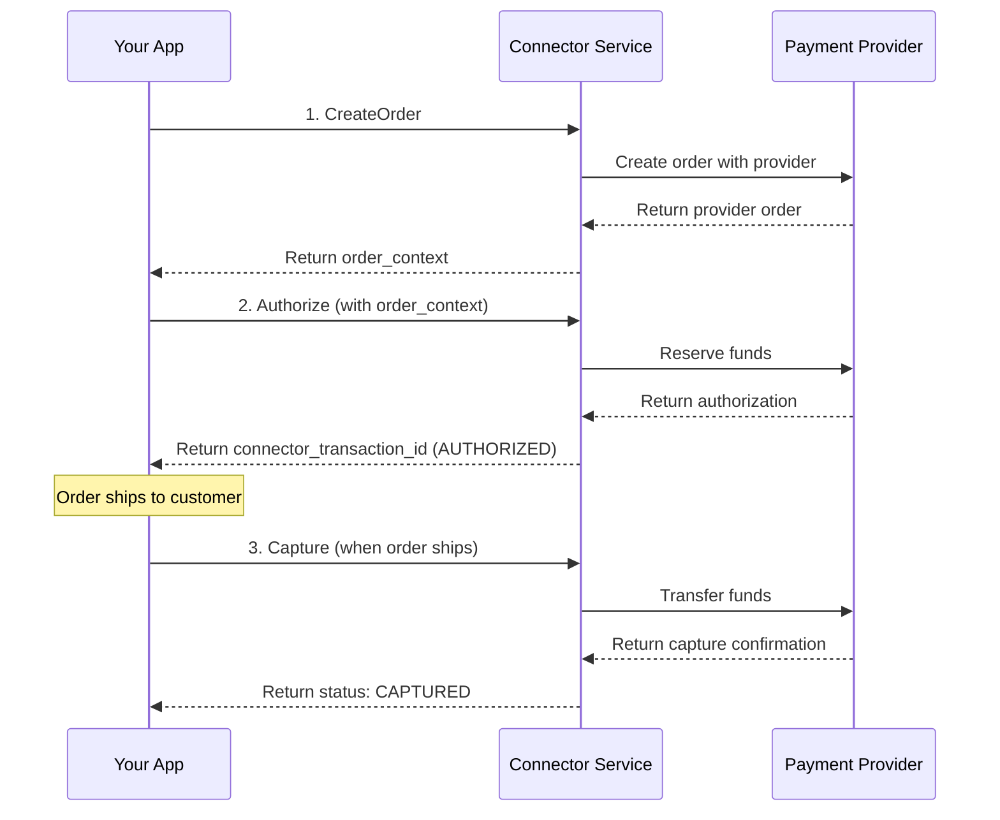
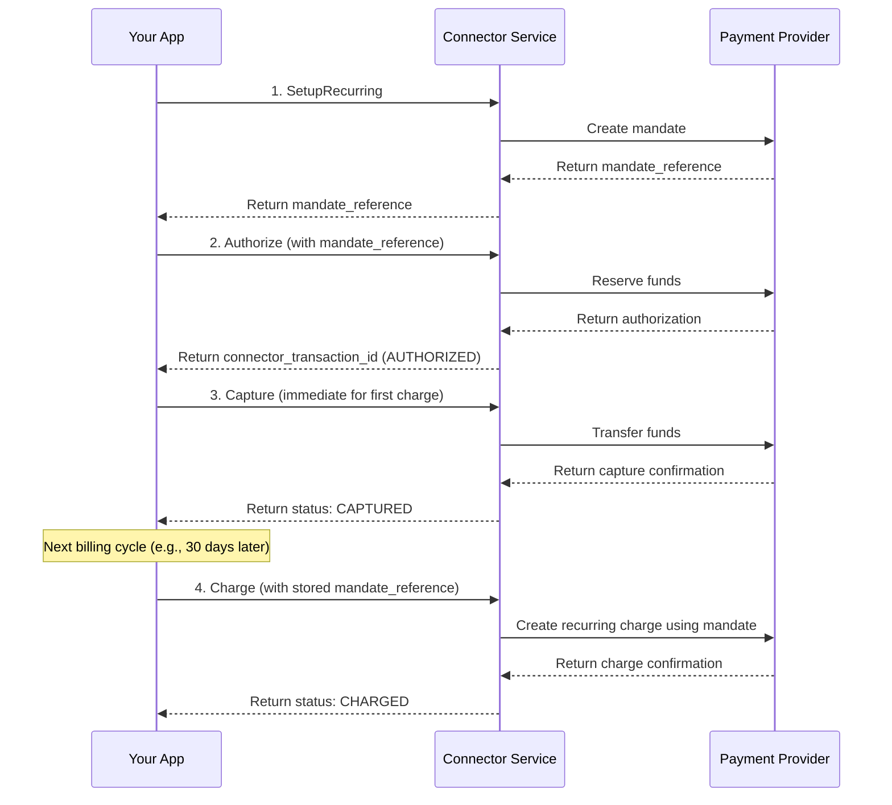
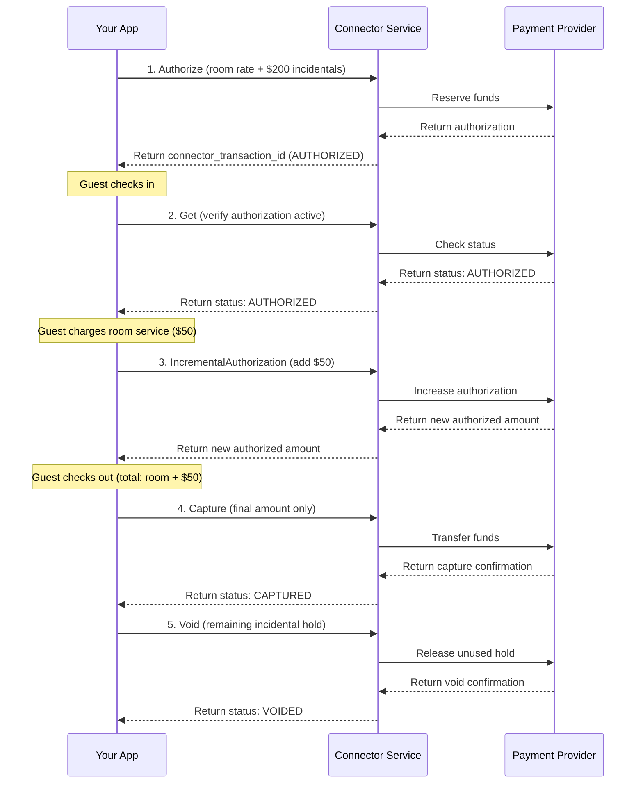

# Payment Service

<!--
---
title: Payment Service
description: Complete payment lifecycle management - authorize, capture, refund, and void payments across multiple connectors
last_updated: 2026-03-05
generated_from: backend/grpc-api-types/proto/services.proto
auto_generated: false
reviewed_by: engineering
reviewed_at: 2026-03-05
approved: true
---
-->

## Overview

The Payment Service provides comprehensive payment lifecycle management for digital businesses. It enables you to process payments across 100+ connectors through a unified gRPC API, handling everything from initial authorization to refunds and recurring payments.

**Business Use Cases:**
- **E-commerce checkout** - Authorize funds at purchase, capture when items ship
- **SaaS subscriptions** - Set up recurring payments with mandate management
- **Marketplace platforms** - Hold funds from buyers, release to sellers on fulfillment
- **Hotel/travel bookings** - Pre-authorize for incidentals, capture adjusted amounts
- **Digital goods delivery** - Immediate capture for instant-access products

The service supports both synchronous responses and asynchronous flows (3DS authentication, redirect-based payments), with state management for multi-step operations.

## Operations

| Operation | Description | Use When |
|-----------|-------------|----------|
| [`Authorize`](./authorize.md) | Authorize a payment amount on a payment method. This reserves funds without capturing them, essential for verifying availability before finalizing. | Two-step payment flow, verify funds before shipping |
| [`Capture`](./capture.md) | Finalize an authorized payment transaction. Transfers reserved funds from customer to merchant account, completing the payment lifecycle. | Order shipped/service delivered, ready to charge |
| [`Get`](./get.md) | Retrieve current payment status from the payment processor. Enables synchronization between your system and payment processors for accurate state tracking. | Check payment status, webhook recovery, pre-fulfillment verification |
| [`Void`](./void.md) | Cancel an authorized payment before capture. Releases held funds back to customer, typically used when orders are cancelled or abandoned. | Order cancelled before shipping, customer request |
| [`Reverse`](./reverse.md) | Reverse a captured payment before settlement. Recovers funds after capture but before bank settlement, used for corrections or cancellations. | Same-day cancellation, processing error correction |
| [`Refund`](./refund.md) | Initiate a refund to customer's payment method. Returns funds for returns, cancellations, or service adjustments after original payment. | Product returns, post-settlement cancellations |
| [`IncrementalAuthorization`](./incremental-authorization.md) | Increase authorized amount if still in authorized state. Allows adding charges to existing authorization for hospitality, tips, or incremental services. | Hotel incidentals, restaurant tips, add-on services |
| [`CreateOrder`](./create-order.md) | Initialize an order in the payment processor system. Sets up payment context before customer enters card details for improved authorization rates. | Pre-checkout setup, session initialization |
| [`VerifyRedirectResponse`](./verify-redirect-response.md) | Validate redirect-based payment responses. Confirms authenticity of redirect-based payment completions to prevent fraud and tampering. | 3DS completion, bank redirect verification |
| [`SetupRecurring`](./setup-recurring.md) | Setup a recurring payment instruction for future payments/debits. This could be for SaaS subscriptions, monthly bill payments, insurance payments and similar use cases. | Subscription setup, recurring billing |

## Common Patterns

### E-commerce Checkout Flow

Standard two-step payment flow for physical goods. Authorize at checkout, capture when shipped.

**Flow Explanation:**

1. **CreateOrder** - Initialize a payment order at the processor before collecting payment details. This sets up the payment context and returns an `order_context` that improves authorization rates by associating the eventual payment with this initial order.

2. **Authorize** - After the customer enters their payment details, call the `Authorize` RPC with the `order_context` from step 1. This reserves the funds on the customer's payment method without transferring them. The response includes a `connector_transaction_id` and status `AUTHORIZED`. The funds are now held but not yet charged.

3. **Capture** - Once the order is shipped, call the `Capture` RPC with the `connector_transaction_id` from step 2. This finalizes the transaction and transfers the reserved funds from the customer to your merchant account. The status changes to `CAPTURED`.

**Cancellation Path:**
If the customer cancels before shipping, call the `Void` RPC instead of `Capture` to release the held funds back to the customer.

---

### SaaS Subscription Setup

Set up recurring payments for subscription businesses. Authorize initial payment, set up mandate for future charges.

**Flow Explanation:**

1. **SetupRecurring** - Before the first charge, call the `SetupRecurring` RPC to create a payment mandate at the processor. A mandate is the customer's authorization for future recurring charges. The response includes a `mandate_reference` that represents this stored consent.

2. **Authorize** - For the initial subscription charge, call the `Authorize` RPC with the `mandate_reference` from step 1. This links the payment to the mandate and reserves the funds on the customer's payment method. The response includes a `connector_transaction_id` with status `AUTHORIZED`.

3. **Capture** - Since this is an immediate charge (not a delayed shipment), call the `Capture` RPC right after authorization. This transfers the reserved funds and completes the initial subscription payment. The status changes to `CAPTURED`.

4. **Charge (subsequent billing)** - For future billing cycles (e.g., monthly renewal), call the Recurring Payment Service's `Charge` RPC with the stored `mandate_reference`. This creates a new charge using the saved mandate without requiring the customer to re-enter payment details or be present. The processor returns a new `connector_transaction_id` with status `CHARGED` for the recurring payment.

---

### Hotel/Travel Booking with Incremental Charges

Pre-authorize for room plus incidentals, add charges during stay, capture final amount.

**Flow Explanation:**

1. **Authorize (initial hold)** - At booking or check-in, call the `Authorize` RPC with the room rate plus an additional amount for incidentals (e.g., $200). This reserves the total amount on the customer's card. The response includes a `connector_transaction_id` with status `AUTHORIZED`.

2. **Get (verify status)** - Before adding charges, call the `Get` RPC to verify the authorization is still active and hasn't expired or been cancelled. This returns the current status of the authorization.

3. **IncrementalAuthorization** - When the guest adds charges (e.g., room service for $50), call the `IncrementalAuthorization` RPC to increase the authorized amount. This ensures the final capture won't be declined for exceeding the original authorization.

4. **Capture (final amount)** - At checkout, call the `Capture` RPC with the actual final amount (room rate + room service charges). Only this amount is transferred from the customer. The status changes to `CAPTURED`.

5. **Void (unused hold)** - After capturing the final amount, call the `Void` RPC to release the remaining incidental hold that was authorized but not charged (the $200 incidental buffer minus any incidental charges). This returns the unused funds to the customer's available balance.

---

## Next Steps

- [Refund Service](../refund-service/README.md) - Process refunds and returns
- [Dispute Service](../dispute-service/README.md) - Handle chargebacks and disputes
- [Customer Service](../customer-service/README.md) - Manage customer payment methods
