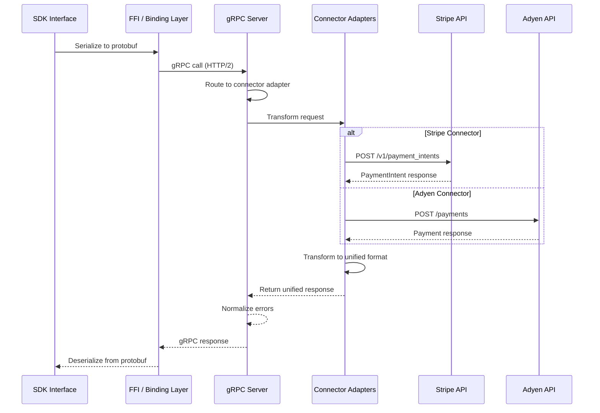

# Architecture Overview

<!--
---
title: Architecture Overview
description: How Connector Service library is architected for multi-language SDKs and unified payment processing
last_updated: 2026-03-03
generated_from: N/A
auto_generated: false
reviewed_by: engineering
reviewed_at: 2026-03-03
approved: true
---
-->

## Architecture Components

The Connector Service supports a three layered architecture, each solving a purpose 

```
┌─────────────────────────────────────────────────────────────────────────────┐
│                           SDK INTERFACE LAYER                               │
│  ┌───────────┐ ┌───────────┐ ┌───────────┐ ┌───────────┐ ┌───────────┐      │
│  │  Node.js  │ │  Python   │ │   Java    │ │   .NET    │ │    Go     │ ...  │
│  │    SDK    │ │    SDK    │ │    SDK    │ │    SDK    │ │    SDK    │      │
│  └─────┬─────┘ └─────┬─────┘ └─────┬─────┘ └─────┬─────┘ └─────┬─────┘      │
└────────┼─────────────┼─────────────┼─────────────┼─────────────┼────────────┘
         │             │             │             │             │
         ▼             ▼             ▼             ▼             ▼
┌──────────────────────────────────────────────────────────────────────────────┐
│                          FFI / BINDING LAYER                                 │
│  ┌────────────────────────────────────────────────────────────────────────┐  │
│  │  Native gRPC Clients (tonic, grpcio, grpc-dotnet, go-grpc, etc.)       │  │
│  │                                                                        │  │
│  │  • Protobuf serialization/deserialization                              │  │
│  │  • HTTP/2 connection management                                        │  │
│  │  • Streaming support                                                   │  │
│  └────────────────────────────────────────────────────────────────────────┘  │
└──────────────────────────────────────────────────────────────────────────────┘
                                    │
                                    ▼
┌────────────────────────────────────────────────────────────────────────────┐
│                                  CORE                                      │
│                                                                            │
│  ┌────────────────────────────────────┐    ┌────────────────────────────┐  │
│  │           gRPC Server              │    │    Connector Adapters      │  │
│  │                                    │    │    (100+ connectors)       │  │
│  │  ┌─────────┐ ┌─────────┐           │    │                            │  │
│  │  │ Payment │ │ Refund  │           │───▶│  ┌─────────┐  ┌─────────┐  │  │
│  │  │ Service │ │ Service │           │    │  │ Stripe  │  │  Adyen  │  │  │
│  │  └─────────┘ └─────────┘           │    │  │ Adapter │  │ Adapter │  │  │
│  │                                    │    │  └─────────┘  └─────────┘  │  │
│  │  ┌─────────┐ ┌─────────┐           │    │                            │  │
│  │  │ Dispute │ │  Event  │           │    │  ┌─────────┐  ┌─────────┐  │  │
│  │  │ Service │ │ Service │           │    │  │ PayPal  │  │   +     │  │  │
│  │  └─────────┘ └─────────┘           │    │  │ Adapter │  │  more   │  │  │
│  │                                    │    │  └─────────┘  └─────────┘  │  │
│  │  • Unified protobuf types          │    │                            │  │
│  │  • Request routing                 │    └──────────────┼─────────────┘  │
│  │  • Error normalization             │                   │                │
│  └────────────────────────────────────┘                   ▼                │
│                                                ┌─────────┐ ┌─────────┐     │
│                                                │ Stripe  │ │  Adyen  │     │
│                                                │   API   │ │   API   │     │
│                                                └─────────┘ └─────────┘     │
│                                                ┌─────────┐ ┌─────────┐     │
│                                                │ Stripe  │ │    +    │     │
│                                                │   API   │ │   more  │     │
│                                                └─────────┘ └─────────┘     │
└────────────────────────────────────────────────────────────────────────────┘
```

### Component Descriptions

| Component | Why It Exists | Problem It Solves | Technologies |
|-----------|---------------|-------------------|--------------|
| **SDK Interface** | Developers can think in their language's patterns whicle using the unified payments grammar provided by the library | You use `client.payments.authorize()` with idiomatic types in your codebase | Node.js, Python, Java, .NET, Go, Haskell |
| **FFI / Binding Layer** | Each language needs native-performance gRPC | Seamless transport without language bridges; handles serialization, HTTP/2, streaming | tonic, grpcio, grpc-dotnet, go-grpc |
| **gRPC Server** | Single source of truth for payment logic. Also offers freedom to use connector service as a separate microservice | One implementation of payment services serves all languages; unified errors, routing, types | Rust, tonic, protocol buffers |
| **Connector Adapters** | Each connector has unique APIs and formats | You use one `AuthorizeRequest`; the library maps to Stripe's `PaymentIntent` or Adyen's `payments` | Rust, 100+ connector implementations |

## Data Flow



## Connector Transformation

The core value: Connector Service transforms unified requests to connector-specific formats.

**Authorization Mapping:**

| Unified Field | Stripe | Adyen |
|---------------|--------|-------|
| `amount.currency` | `currency` | `amount.currency` |
| `amount.amount` | `amount` (cents) | `value` (cents) |
| `payment_method.card.card_number` | `payment_method[card][number]` | `paymentMethod[number]` |
| `connector_metadata` | `metadata` | `additionalData` |

This transformation happens server-side, so SDKs remain unchanged when adding new connectors.

## Connector Adapter Pattern

Each connector implements a standard interface:

```rust
trait ConnectorAdapter {
    async fn authorize(&self, request: AuthorizeRequest) -> Result<AuthorizeResponse>;
    async fn capture(&self, request: CaptureRequest) -> Result<CaptureResponse>;
    async fn void(&self, request: VoidRequest) -> Result<VoidResponse>;
    async fn refund(&self, request: RefundRequest) -> Result<RefundResponse>;
    // ... 20+ operations
}
```
Adding new connectors only need an adapter implementation. SDKs require zero changes.

## Summary

The architecture prioritizes:

1. **Consistency**: Same types, patterns, and errors across all connectors
2. **Extensibility**: Add connectors without SDK changes
3. **Performance**: gRPC interface provides significant advantage over REST APIs for high volume payment processing. The lirabry could also be used as microservice with 10x smaller paylos, faster serialization/ deserialization hops, reduced bannwidth consumption and optimized for concurrent requests on a single connection
4. **Developer Experience**: Idiomatic payments interface with multi language SDKs 

For developers integrating multiple payment providers, this means weeks of integration work becomes hours, and maintenance burden drops from O(N connectors) to O(1).
