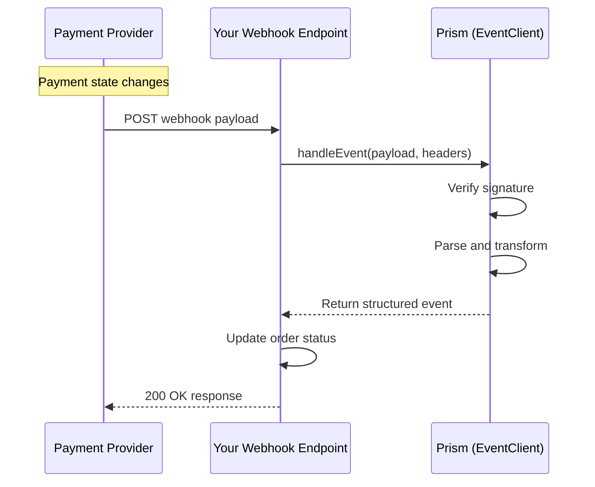

# Event Service Overview

## Overview

The Event Service processes inbound webhook notifications from payment processors using the Java SDK. Instead of polling for status updates, webhooks deliver real-time notifications when payment states change.

**Business Use Cases:**

* **Payment completion** - Receive instant notification when payments succeed
* **Failed payment handling** - Get notified of declines for retry logic
* **Refund tracking** - Update systems when refunds complete
* **Dispute alerts** - Immediate notification of new chargebacks

## Operations

| Operation                                                      | Description                                                                                   | Use When                                        |
| -------------------------------------------------------------- | --------------------------------------------------------------------------------------------- | ----------------------------------------------- |
| [`handleEvent`](prism/sdks/java/event-service/handle-event.md) | Process webhook from payment processor. Verifies and parses incoming connector notifications. | Receiving webhook POST from Stripe, Adyen, etc. |

## SDK Setup

```java
import com.hyperswitch.prism.EventClient;

EventClient eventClient = EventClient.builder()
    .connector("stripe")
    .apiKey("YOUR_API_KEY")
    .environment("SANDBOX")
    .build();
```

## Common Patterns

### Webhook Processing Flow



**Flow Explanation:**

1. **Provider sends** - When a payment updates, the provider sends a webhook to your endpoint.
2. **Verify and parse** - Pass the raw payload to `handleEvent` for verification and transformation.
3. **Process event** - Receive a structured event object with unified format.
4. **Update systems** - Update your database, fulfill orders, or trigger notifications.

## Webhook Security Example

```java
import com.hyperswitch.prism.EventClient;
import java.util.Map;
import java.util.HashMap;

// Spring Boot controller example
@RestController
public class WebhookController {

    private final EventClient eventClient;

    public WebhookController() {
        this.eventClient = EventClient.builder()
            .connector("stripe")
            .apiKey("YOUR_API_KEY")
            .build();
    }

    @PostMapping("/webhooks/payments")
    public ResponseEntity<String> handleWebhook(
            @RequestBody String payload,
            @RequestHeader Map<String, String> headers) {

        try {
            Map<String, Object> request = new HashMap<>();
            request.put("payload", payload);
            request.put("headers", headers);
            request.put("webhookSecret", "whsec_xxx");

            Map<String, Object> event = eventClient.handleEvent(request);

            if ("payment.captured".equals(event.get("type"))) {
                Map<String, Object> data = (Map<String, Object>) event.get("data");
                fulfillOrder((String) data.get("merchantTransactionId"));
            }

            return ResponseEntity.ok("OK");
        } catch (Exception e) {
            return ResponseEntity.badRequest().body("Error: " + e.getMessage());
        }
    }
}
```

## Next Steps

* [Payment Service](payment-service.md) - Handle payment webhooks
* [Refund Service](refund-service.md) - Process refund notifications
* [Dispute Service](dispute-service.md) - Handle dispute alerts
