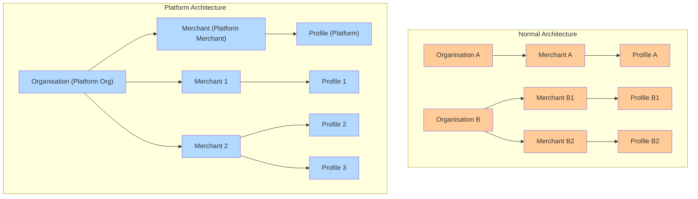

# Platform Org and Merchant Setup

## Platform Organization Setup & Workflow

### What is a Platform Organization?

A **Platform Organization** is a special type of organization in Hyperswitch designed for businesses who want to **manage and onboard multiple merchants under them** programmatically

Think of it as a “meta-organization” that can:

* Create and manage other **Merchant Accounts** under its umbrella
* Generate **API keys** not just for itself, but also for the merchants it creates
* **Use those merchant keys itself** to act on behalf of merchants — including **processing payments** and **connecting connectors**

This model is particularly useful for:

* **SaaS platforms** offering payments to their merchants
* **Marketplaces or aggregators** that need to onboard vendors as sub-merchants
* **Franchises or white-label operators** who want central control of multiple merchants

### Platform Org and Merchant Structure

#### **Explanation:**

* Platform Organisation hosts exactly one Platform Merchant with elevated privileges
* Sibling Merchants are standard merchant accounts managed by the Platform Merchant

### The Platform Organization Workflow

#### Step 1 — Request Platform Organization Setup

* A merchant who wants to operate as a platform must **contact Hyperswitch**
* Hyperswitch will **enable Platform Organization mode** for that merchant
* Once enabled, the merchant is now considered a **Platform Org** and has one **Platform Merchant** associated with it

#### Step 2 — Generate a Platform API Key

* Using the Hyperswitch Dashboard, the Platform Merchant generates a **Platform API Key**
  * Sandbox url for API Key page: [https://app.hyperswitch.io/dashboard/developer-api-keys](https://app.hyperswitch.io/dashboard/developer-api-keys)
* This key is **special**:
  * It authorizes access to create and manage new merchant accounts
  * It does **not** perform payment operations directly
* Think of this as the “key” for managing sub-merchants

#### Step 3 — Create New Merchants (Sibling-Merchants)

* Using the **Platform API Key**, the platform calls the `Merchant Account Create` API
  * API link: [https://api-reference.hyperswitch.io/v1/merchant-account/merchant-account--create](https://api-reference.hyperswitch.io/v1/merchant-account/merchant-account--create)
* Each call provisions a new **Merchant Account** under the platform’s umbrella
* These new merchants behave just like regular merchants in terms of profiles, transactions, routing, etc.
* Example: A SaaS platform might create one merchant for each of its customers

#### Step 4 — Generate API Keys for New Merchants

* Once a new merchant is created, the **Platform API Key** can be used to **generate merchant-specific API keys via** API Key - Create
  * API link: [https://api-reference.hyperswitch.io/v1/api-key/api-key--create](https://api-reference.hyperswitch.io/v1/api-key/api-key--create)
* These keys are scoped to that merchant only and are identical to regular api keys generated for a merchant account
* The platform can then securely hand over these keys to the merchant or use them internally on behalf of the merchant

#### Step 5 — Perform Payment Operations Using Merchant Keys

Once sibling merchants are created and their API keys generated, these keys become the **operational keys**. The Platform API Key cannot directly run payments or connector actions; it is only for management

**5.1 Connector Setup**

With the **Merchant API Key** of a sibling merchant, the platform can connect payment processors on behalf of that merchant:

* **API:** [Merchant Connector Account - Create](https://api-reference.hyperswitch.io/v1/merchant-connector-account/merchant-connector--create)
* **How it works:**
  * Platform generates a Merchant API Key for the sibling merchant
  * Using that key, the platform calls the above endpoint to add/configure connectors for that merchant
  * This ensures connectors are always scoped correctly to the merchant account

Important: In a **regular organization**, Org Admin or Merchant Admin can configure connectors manually via the **Dashboard**, or the merchant can use its **own API key** to configure them via API. In a **platform organization**, the platform does the same thing **programmatically** by using the sibling merchant’s API key

**5.2 Payments and Other Operations**

To process payments, refunds etc., the platform uses the sibling merchant’s API key:

* **API:** [Payments - Create](https://api-reference.hyperswitch.io/v1/payments/payments--create)
* **Other Payment APIs** work identically as they do for a regular merchant account
* **How it works:**
  * **Platform keeps an internal mapping of merchant accounts ↔ merchant API keys**
  * When processing a payment for a particular merchant, it uses the appropriate merchant API key

This ensures **isolation**: every payment is always tied to the correct merchant account, even if the platform is the one initiating it.

**5.3 Payments via the Platform Merchant Itself**

In addition to operating sibling merchants, the platform can also make payments **on its own account** (for example, if it needs to use its own connector account)

* In this case, the **Platform Merchant** (the one created when Platform Org was enabled) can:
  * Connect connectors to its own account either via API call or directly through the **Dashboard** (like any other merchant)
  * Use its own API keys to process payments as a normal merchant

### Difference Between Regular Organization and Platform Organization

<table><thead><tr><th>Aspect</th><th width="230">Regular Organization</th><th>Platform Organization</th></tr></thead><tbody><tr><td><strong>Who creates new merchants</strong></td><td><strong>Org admin</strong> must log in to the Hyperswitch Dashboard and manually create merchants.</td><td>All Regular Org capabilities <strong>+ Platform Merchant account</strong> (via Platform API Key) can programmatically create new merchants through APIs.</td></tr><tr><td><strong>Who generates API keys for merchants</strong></td><td><strong>Org admin</strong> uses the Dashboard to generate API keys for each merchant manually.</td><td>All Regular Org capabilities <strong>+ Platform Merchant account</strong> can use the <strong>Platform API Key</strong> to generate merchant API keys via APIs for sibling merchants.</td></tr><tr><td><strong>Connector setup</strong></td><td>
We have three valid paths:

<strong>A) Dashboard (Org Admin)</strong>: • Org Admin logs in → navigates to target Merchant → Connectors pages → adds/configures connectors <strong>manually</strong> 

<strong>B) Dashboard (Merchant Admin)</strong>: • Merchant Admin logs in → its own Merchant → Connectors pages →  adds/configures connector  <strong>manually</strong> 

<strong>C) API (Merchant)</strong>: • Use the Merchant’s own API key to hit connector endpoints <strong>programmatically</strong> for that merchant
</td><td>
All Regular Org connector options + <strong>platform-driven programmatic setup</strong> 

<strong>How Platform does it (critical rule)</strong>: • <strong>Generate a Merchant API Key</strong> for the target sibling merchant (using the Platform API Key) • Use that <strong>Merchant API Key</strong> to call connector endpoints for that merchant. • The Platform API Key itself cannot connect connectors; it’s a <strong>management key</strong> 

<strong>Also valid (same as regular):</strong> • Org/Merchant Admin can still do manual setup in Dashboard for their own merchant
</td></tr></tbody></table>

