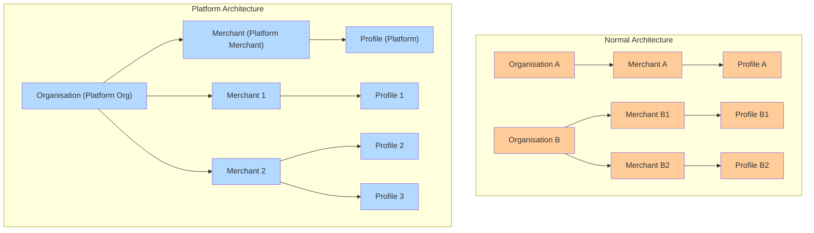

# Platform Org and Merchant Setup

## Platform Organization Setup & Workflow

### What is a Platform Organization?

A **Platform Organization** is a special type of organization in Hyperswitch designed for businesses who want to **manage and onboard multiple merchants under them** programmatically

Think of it as a “meta-organization” that can:

* Create and manage other **Merchant Accounts** under its umbrella
* Generate **API keys** not just for itself, but also for the merchants it creates
* Host exactly **one Platform Merchant Account** and can **create and manage multiple Merchant Accounts**, which can be either **Standard** or **Connected**.
* Support two operational modes:
  * The Platform Merchant can use **its own API key** to directly manage and operate Connected merchants
  * The Platform Merchant can maintain **merchant-specific API key mappings** to perform payments, connector configuration, and profile management for **both Connected and Standard merchants**, with correct merchant scoping.

#### Purpose of the Platform API Key

The Platform API Key is a privileged credential owned by the Platform Merchant that serves the following controlled purposes within a Platform Organization.

* It is used for **management operations**, such as creating merchant accounts (Standard or Connected), generating API keys, and managing platform-level configurations.
* In a **Connected merchant setup**, it can be used to initiate and execute operations on behalf of Connected merchants, including processing payments, configuring connectors, creating profiles, and performing other merchant-scoped operations.&#x20;

The Platform API Key cannot be used to perform payment or connector operations for Standard merchants, ensuring correct isolation and ownership boundaries.

This model is particularly useful for:

* **SaaS platforms** offering payments to their merchants
* **Marketplaces or aggregators** that need to onboard vendors as sub-merchants
* **Franchises or white-label operators** who want central control of multiple merchants

### Platform Org and Merchant Structure

<figure><figcaption></figcaption></figure>

<figure><figcaption></figcaption></figure>

### Merchant Classification in a Platform Organization

In a **Platform Organization**, every merchant account created under the org must be classified as either **Connected** or **Standard**. This classification is chosen by the **Platform Merchant** at creation time and determines how **Customers** and **Payment Methods** behave across the organization.

> Once a merchant is created as **Connected** or **Standard**, any classification changes must be requested through your **Admins.**

A Platform Organization consists of:

* Exactly **one Platform Merchant** (the privileged parent / control - plane merchant)
* Multiple merchant accounts, each configured as **Connected** or **Standard**

This classification controls resource-sharing boundaries:

* **Connected merchants** participate in **shared Customers and Payment Methods** across the platform’s shared scope.
* **Standard merchants** maintain **isolated Customers and Payment Methods**, even though they belong to the same Platform Organization.

#### Platform Merchant

The **Platform Merchant** is the privileged parent merchant within a Platform Organization.

* **Owns the shared resource scope** for **Customers** and **Payment Methods**
* Performs **management operations** across the platform (merchant creation, governance, and administration)
* Can **act on behalf of Connected merchants** (operational capabilities when acting for connected accounts)
* Does **not** replace a regular merchant - it is a **control-plane entity** with **optional operational capabilities** and it cannot process payments for itself.

#### Connected Merchants

**Connected merchants** participate in the shared resource model of the Platform Organization.

* **Share Customers and Payment Methods** with the Platform Merchant and other **Connected** merchants
* Execute payments using their **own merchant context** (clear merchant attribution)
* Can be operated in two modes:
  * **Direct (self-initiated):** Connected merchant performs operations using its own credentials
  * **On behalf (platform-initiated):** Platform Merchant performs operations **on behalf of** the connected merchant using the Platform API Key

**What this enables?**

* **Unified saved-payment-method experience** across business units (shared Customer/Payment Method scope)
* **Centralized orchestration** with clear ownership and attribution (platform acting on behalf when needed)

#### Standard Merchants

**Standard merchants** are fully isolated merchant accounts within the same Platform Organization, but **outside** the shared resource group.

#### Key characteristics

* Maintain **isolated Customers and Payment Methods**
* Do **not** participate in platform-level sharing
* The Platform Merchant **cannot act operationally** on their behalf beyond standard org-level management permissions
* Best suited when **contractual, regulatory, or data-boundary isolation** is required

#### Resource Behavior Summary

| Merchant Type | Customers                     | Payment Methods               | Platform can act on behalf?                                              |
| ------------- | ----------------------------- | ----------------------------- | ------------------------------------------------------------------------ |
| **Connected** | Shared across Connected group | Shared across Connected group | **Yes**                                                                  |
| **Standard**  | Isolated per merchant         | Isolated per merchant         | **No** (but it can create the merchant and generate/manage its API keys) |

***

### The Platform Organization Workflow

#### Step 1 - Request Platform Organization Setup

* A merchant who wants to operate as a platform must **contact Hyperswitch**
* Hyperswitch will **enable Platform Organization mode** for that merchant
* Once enabled, the merchant is now considered a **Platform Org** and has one **Platform Merchant** associated with it

#### Step 2 - Generate a Platform API Key

* Using the Hyperswitch Dashboard, the Platform Merchant generates a **Platform API Key**
  * Sandbox url for API Key page: [https://app.hyperswitch.io/dashboard/developer-api-keys](https://app.hyperswitch.io/dashboard/developer-api-keys)
* This key is **special**:
  * It authorizes access to create and manage new merchant accounts
  * It does not perform payment operations for **Standard** merchants—think of it as the “key” for managing merchant accounts
  * It **can** perform payment operations **on behalf of Connected merchants**.

#### Step 3 - Create New Merchants (Sibling-Merchants)

* Using the **Platform API Key**, the platform calls the `Merchant Account Create` API
  * API link: [https://api-reference.hyperswitch.io/v1/merchant-account/merchant-account--create](https://api-reference.hyperswitch.io/v1/merchant-account/merchant-account--create)
* Each call provisions a new **Merchant Account** under the platform’s umbrella
* These new merchants behave just like regular merchants in terms of profiles, transactions, routing, etc.
* Example: A SaaS platform might create one merchant for each of its customers

#### Step 4 - Generate API Keys for New Merchants

* Once a new merchant is created, the **Platform API Key** can be used to **generate merchant-specific API keys via** API Key - Create
  * API link: [https://api-reference.hyperswitch.io/v1/api-key/api-key--create](https://api-reference.hyperswitch.io/v1/api-key/api-key--create)
* These keys are scoped to that merchant only and are identical to regular api keys generated for a merchant account
* The platform can then securely hand over these keys to the merchant or use them internally on behalf of the merchant

#### Step 5 - Perform Payment Operations Using Merchant Keys

Once merchant accounts are created and their API keys are generated, those keys become the **operational keys** for that merchant account.

* **Standard merchant accounts:** All payment operations (payments, refunds) and connector actions **must** be performed using the **Standard merchant’s own API key**. The **Platform API Key** is limited to **management** (creating standard merchants and generating/managing their API keys).
* **Connected merchant accounts:** Operations can be performed either using the **Connected merchant’s own API key** or using the **Platform API Key acting on behalf of the Connected merchant** (including payments/refunds and connector configuration).

**5.1 Connector Setup**

With the **Merchant API Key** of a sibling merchant, the platform can connect payment processors on behalf of that merchant:

* **API:** [Merchant Connector Account - Create](https://api-reference.hyperswitch.io/v1/merchant-connector-account/merchant-connector--create)
* **How it works:**

A **Connected merchant** can connect/configure connectors in any of these ways:

* Using the **Connected merchant’s own API key**
* Via the **Dashboard** (with the Org Admin / Merchant Admin permissions)
* **Via the Platform Merchant**, where the platform uses the **Platform API key** to configure connectors **on behalf of** the Connected merchant

A **Standard merchant** can connect/configure connectors only in these ways:

* Using the **Standard merchant’s own API key**
* Via the **Dashboard** (with the Org Admin / Merchant Admin permissions)

> The **Platform API key cannot be used to configure connectors on behalf of Standard merchants**.

**5.2 Payments and Other Operations**

For payment operations (payments, refunds, captures, etc.), the **allowed key depends on the merchant type**.

* **API:** [Payments - Create](https://api-reference.hyperswitch.io/v1/payments/payments--create)
* **Other Payment APIs** work identically as they do for a regular merchant account
* **How it works:**
  * **Standard merchants**
    * The standard merchant must use the **their own merchant API key** to perform payment operations.
      * The **Platform API key cannot** be used to run payments/refunds on behalf of a Standard merchant.
    * **Connected merchants**
      * Payment operations can be performed either:
        * Using the **Connected merchant’s own API key**, **or**
        * Using the **Platform API key** **on behalf of** the Connected merchant.
  * The platform identifies which merchant account the operation is for (Standard vs Connected).
  * It then uses the correct credential for that merchant type:
    * **Standard → Standard merchant API key**
    * **Connected → Connected merchant API key OR Platform API key (on-behalf)**
  * This ensures every operation is always scoped to the **correct merchant account context**, even when initiated by the platform.

### Shared and Isolated Resource Behavior

<figure><figcaption></figcaption></figure>

_Connected merchants share Customers and Payment Methods. Standard merchants operate with isolated resources._

Within a Platform Organization:

* Customers are shared across Connected merchants.
* Payment Methods are shared across Connected merchants.
* Standard merchants maintain isolated Customers and Payment Methods.

All operational flows continue to use the respective Merchant API Keys. Resource sharing affects visibility and ownership within Connected merchants but does not change transaction scoping.

### Difference Between Standard Organization and Platform Organization

| Feature                 | Standard Organization                                                  | Platform Organization                                                                                                                                                            |
| ----------------------- | ---------------------------------------------------------------------- | -------------------------------------------------------------------------------------------------------------------------------------------------------------------------------- |
| Organization Structure  | Organization contains Standard Merchants that operate independently.   | Organization contains one Platform Merchant and one or more child merchants (Connected or Standard).                                                                             |
| Merchant Creation       | Org Admin creates merchants manually via Dashboard.                    | Platform Merchant uses the Platform API Key to programmatically create child merchants via API.                                                                                  |
| Merchant Classification | All merchants operate independently.                                   | Each child merchant is configured as Connected or Standard at creation time.                                                                                                     |
| Customer Scope          | Customers are scoped to a single merchant.                             | Customers are shared across Connected merchants. Standard merchants maintain isolated Customers.                                                                                 |
| Payment Method Scope    | Payment Methods are scoped to a single merchant.                       | Payment Methods are shared across Connected merchants. Standard merchants maintain isolated Payment Methods.                                                                     |
| API Key Generation      | Org Admin generates API keys manually.                                 | Platform Merchant generates Merchant API Keys programmatically for child merchants.                                                                                              |
| Connector Setup         | Merchant configures connectors via Dashboard or using its own API key. | Merchants can configure their own connectors using their API key, and the platform can configure connectors on behalf of **Connected** merchants using the **Platform API key**. |
| Payment Processing      | Merchant uses its own API key.                                         | Merchants can process payments using their API key, and the platform can process payments on behalf of **Connected** merchants using the **Platform API key**.                   |
| Merchant Type Changes   | Not applicable.                                                        | Merchant classification is set at creation, for any changes, contact your **Admins**.                                                                                            |

### Roadmap (Platform-Connected Setup)

* The current Platform-Connected setup supports **Payments** flows end-to-end.
* Support for additional operational flows - such as **Refunds** and **Disputes** - is planned and will be added in upcoming releases to expand the set of on-behalf capabilities for Connected merchants.
* For **Standard merchants** in a Platform Organization, all capabilities available to a **Standard merchant** in a standard (non-platform) organization are **already supported**.

