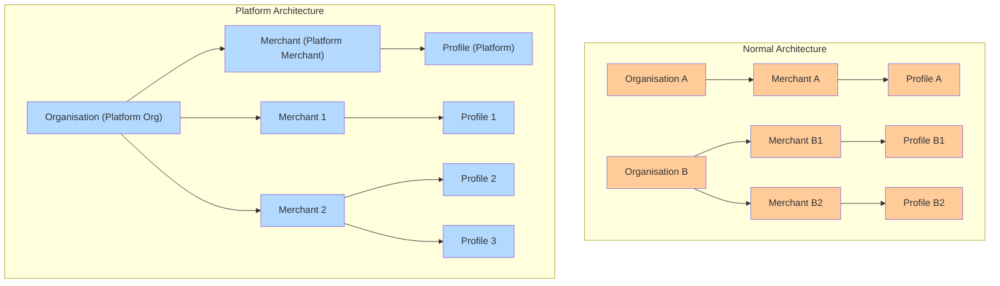

# Platform Org and Merchant Setup

## Platform Organization Setup & Workflow

### What is a Platform Organization?

A **Platform Organization** is a special type of organization in Hyperswitch designed for businesses who want to **manage and onboard multiple merchants under them** programmatically

Think of it as a “meta-organization” that can:

* Create and manage other **Merchant Accounts** under its umbrella
* Generate **API keys** not just for itself, but also for the merchants it creates
* **Use those merchant keys itself** to act on behalf of merchants — including **processing payments** and **connecting connectors**

The **Platform API Key** has a single, specific purpose:

* Management Only: It is used strictly to create sibling merchants and generate API keys for those sibling merchants.

> Important Distinction:
>
> * Platform API Key: A purely administrative key. It cannot be used for payment processing, refunds, or connector configuration (even for the Platform Merchant itself).
> * Sibling Merchant API Keys: Operational keys used to actually process payments and connect connectors.

This model is particularly useful for:

* **SaaS platforms** offering payments to their merchants
* **Marketplaces or aggregators** that need to onboard vendors as sub-merchants
* **Franchises or white-label operators** who want central control of multiple merchants

### Platform Org and Merchant Structure

<figure><figcaption></figcaption></figure>

* Platform Organisation hosts exactly one Platform Merchant with elevated privileges
* Sibling Merchants are standard merchant accounts managed by the Platform Merchant

### Merchant Classification in a Platform Organization

When a merchant is created under a Platform Organization, it must be configured as either:

* **Connected**
* **Standard**

This classification determines how Customers and Payment Methods behave within the organization.

* Connected merchants participate in shared Customer and Payment Method behavior.
* Standard merchants maintain isolated Customers and Payment Methods.

The Platform Merchant determines this classification during merchant creation.

Once configured, a merchant’s classification cannot be changed.

### The Platform Organization Workflow

#### Step 1 — Request Platform Organization Setup

* A merchant who wants to operate as a platform must **contact Hyperswitch**
* Hyperswitch will **enable Platform Organization mode** for that merchant
* Once enabled, the merchant is now considered a **Platform Org** and has one **Platform Merchant** associated with it

#### Step 2 — Generate a Platform API Key

* Using the Hyperswitch Dashboard, the Platform Merchant generates a **Platform API Key**
  * Sandbox url for API Key page: [https://app.hyperswitch.io/dashboard/developer-api-keys](https://app.hyperswitch.io/dashboard/developer-api-keys)
* This key is **special**:
  * It authorizes access to create and manage new merchant accounts
  * It does **not** perform payment operations directly
* Think of this as the “key” for managing sub-merchants

#### Step 3 — Create New Merchants (Sibling-Merchants)

* Using the **Platform API Key**, the platform calls the `Merchant Account Create` API
  * API link: [https://api-reference.hyperswitch.io/v1/merchant-account/merchant-account--create](https://api-reference.hyperswitch.io/v1/merchant-account/merchant-account--create)
* Each call provisions a new **Merchant Account** under the platform’s umbrella
* These new merchants behave just like regular merchants in terms of profiles, transactions, routing, etc.
* Example: A SaaS platform might create one merchant for each of its customers

#### Step 4 — Generate API Keys for New Merchants

* Once a new merchant is created, the **Platform API Key** can be used to **generate merchant-specific API keys via** API Key - Create
  * API link: [https://api-reference.hyperswitch.io/v1/api-key/api-key--create](https://api-reference.hyperswitch.io/v1/api-key/api-key--create)
* These keys are scoped to that merchant only and are identical to regular api keys generated for a merchant account
* The platform can then securely hand over these keys to the merchant or use them internally on behalf of the merchant

#### Step 5 — Perform Payment Operations Using Merchant Keys

Once sibling merchants are created and their API keys are generated, those keys become the **operational keys** for those merchants — meaning all payment operations (payments, refunds) and connector actions must be carried out with the sibling merchant’s own API key.

The **Platform API Key cannot directly perform payments or connector operations for sibling merchants**; its role there is only to create merchants and issue their keys.

**5.1 Connector Setup**

With the **Merchant API Key** of a sibling merchant, the platform can connect payment processors on behalf of that merchant:

* **API:** [Merchant Connector Account - Create](https://api-reference.hyperswitch.io/v1/merchant-connector-account/merchant-connector--create)
* **How it works:**
  * Platform generates a Merchant API Key for the sibling merchant
  * Using that key, the platform calls the above endpoint to add/configure connectors for that merchant
  * This ensures connectors are always scoped correctly to the merchant account

Important: In a **regular organization**, Org Admin or Merchant Admin can configure connectors manually via the **Dashboard**, or the merchant can use its **own API key** to configure them via API. In a **platform organization**, the platform does the same thing **programmatically** by using the sibling merchant’s API key

**5.2 Payments and Other Operations**

To process payments, refunds etc., the platform uses the sibling merchant’s API key:

* **API:** [Payments - Create](https://api-reference.hyperswitch.io/v1/payments/payments--create)
* **Other Payment APIs** work identically as they do for a regular merchant account
* **How it works:**
  * **Platform keeps an internal mapping of merchant accounts ↔ merchant API keys**
  * When processing a payment for a particular merchant, it uses the appropriate merchant API key

This ensures **isolation**: every payment is always tied to the correct merchant account, even if the platform is the one initiating it.

### Shared and Isolated Resource Behavior

<figure><figcaption></figcaption></figure>

_Connected merchants share Customers and Payment Methods. Standard merchants operate with isolated resources._

Within a Platform Organization:

* Customers are shared across Connected merchants.
* Payment Methods are shared across Connected merchants.
* Standard merchants maintain isolated Customers and Payment Methods.

All operational flows continue to use the respective Merchant API Keys. Resource sharing affects visibility and ownership within Connected merchants but does not change transaction scoping.

### Difference Between Regular Organization and Platform Organization

| Feature                 | Regular Organization                                                   | Platform Organization                                                                                        |
| ----------------------- | ---------------------------------------------------------------------- | ------------------------------------------------------------------------------------------------------------ |
| Organization Structure  | Organization contains merchants that operate independently.            | Organization contains one Platform Merchant and one or more child merchants (Connected or Standard).         |
| Merchant Creation       | Org Admin creates merchants manually via Dashboard.                    | Platform Merchant uses the Platform API Key to programmatically create child merchants via API.              |
| Merchant Classification | All merchants operate independently.                                   | Each child merchant is configured as Connected or Standard at creation time.                                 |
| Customer Scope          | Customers are scoped to a single merchant.                             | Customers are shared across Connected merchants. Standard merchants maintain isolated Customers.             |
| Payment Method Scope    | Payment Methods are scoped to a single merchant.                       | Payment Methods are shared across Connected merchants. Standard merchants maintain isolated Payment Methods. |
| API Key Generation      | Org Admin generates API keys manually.                                 | Platform Merchant generates Merchant API Keys programmatically for child merchants.                          |
| Connector Setup         | Merchant configures connectors via Dashboard or using its own API key. | Platform uses the specific Merchant API Key of a child merchant to configure connectors programmatically.    |
| Payment Processing      | Merchant uses its own API key.                                         | Platform uses the specific Merchant API Key of a child merchant to process payments on their behalf.         |
| Merchant Type Changes   | Not applicable.                                                        | Merchant classification cannot be changed after creation.                                                    |

Limitations

The following transitions are not supported:

* A merchant cannot be moved from Connected to Standard.
* A merchant cannot be moved from Standard to Connected.

Merchant classification is fixed after configuration.
