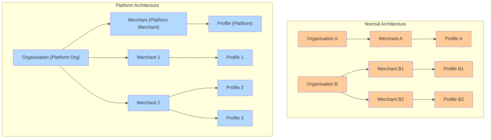

# Platform Org and Merchant Setup

A PlatformOrg is a specialized organization type containing exactly one Platform Merchant, which has elevated privileges across its entire organization:

* **Create Merchant Accounts**: Dynamically spin up new sibling merchant accounts via API.
* **Manage Credentials**: Generate, revoke, and rotate API keys for sibling merchants programmatically.
* **Full Visibility & Control**: Process payments, refunds, and other operations across all your sibling merchants by using API keys generated specifically for each merchant through your Platform Merchant account.

### &#x20;Platform Org and Merchant Structure

#### **Explanation:**

* PlatformOrg hosts exactly one Platform Merchant with elevated privileges.
* Sibling Merchants are standard merchant accounts managed by the Platform Merchant.

### Key Capabilities Comparison

| **Capability**                  | **Platform Merchant** | **Normal Org/Merchant** |
| ------------------------------- | --------------------- | ----------------------- |
| Merchant creation via API       | ✔                     | ✘(Dashboard only)       |
| Generate API keys for merchants | ✔                     | ✘ (Dashboard only)      |

### Typical API Workflows for Platform Merchant

1. **Create\_Platform**
   1. When you set up a new platform, an organization and its associated platform merchant account are automatically created.
   2. The platform merchant account holds elevated privileges for API-driven merchant management and operations.
2. **Generate Platform API Key (Dashboard Step)**
   1. Navigate to the[ Hyperswitch API Keys Dashboard](https://app.hyperswitch.io/dashboard/developer-api-keys).
   2. Click on "Create New API Key."
   3. Assign a name and description for your platform API key, then generate and securely store this key.
3. **Create\_Merchant**
   1. Using the Platform Merchant API key, you can dynamically create new merchant accounts within your platform.
   2. API link: [https://api-reference.hyperswitch.io/v1/merchant-account/merchant-account--create](https://api-reference.hyperswitch.io/v1/merchant-account/merchant-account--create)
4. **API\_keys**
   1. After creating merchant accounts, you can generate API keys specific to each merchant
   2. API link: [https://api-reference.hyperswitch.io/v1/api-key/api-key--create](https://api-reference.hyperswitch.io/v1/api-key/api-key--create)
5. **Mapping and Usage of API Keys**
   1. Maintain a secure internal mapping of generated API keys for each merchant account.
   2. Utilize these merchant-specific API keys to perform standard operations such as payments, refunds, etc. on behalf of each sub-merchant.

#### Merchant Account Operations ( using Platform merchant API Key)

* Create merchant accounts within the platform org
* List merchant accounts
* Retrieve a specific merchant account
* Update a merchant account

### **Use Cases**

1\. **Vertical SaaS:** Onboarding As a platform, you can automate merchant account creation and key management for new merchants via an S2S call using the hyperswitch platform merchant account API key from your own dashboard.

* Automated Merchant Onboarding: Real-time merchant account provisioning during user registration with automatic profile setup
* Dynamic Payment Configuration: Programmatically enable/disable payment gateways and configure routing rules per merchant
* Custom Dashboard Integration: Display transaction analytics and enable refund processing within your existing UI

2\. **Franchise Management:** Centralized control over multiple franchise outlets with individual autonomy. One franchise as a platform merchant, rest as merchant accounts.

* Multi-Location Management: Bulk merchant account (franchise) creation and management
* Hierarchical Access Control: Role-based permissions for individual franchise teams
* Real-time Monitoring: Payment monitoring, reconciliation, refund, and analytics across all franchises

3\. **White-label Payments:** Programmatically manage merchant accounts for various clients with branded payment solutions.

* Branded Payment Experience: White-label checkout pages with client branding and custom payment method presentation
* Multi-Tenant Architecture: Isolated environments with tenant-specific configurations and reporting per client
