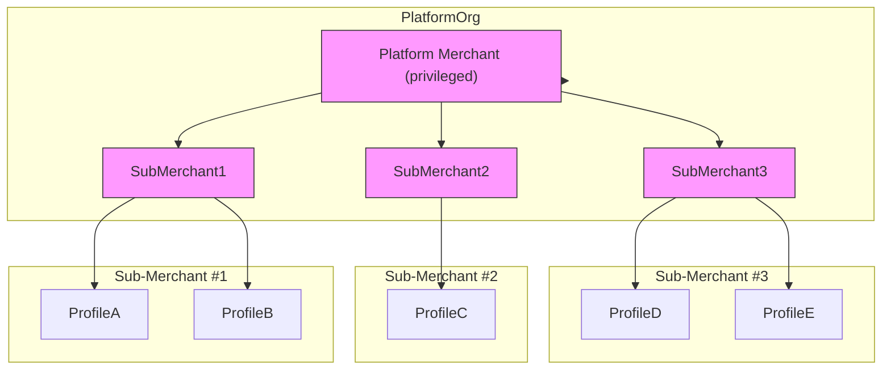

# Platform Org and Merchant Setup

The Platform Merchant model enables your organization to **auto-onboard sellers** by creating merchant accounts entirely through API—removing the need for manual signup. This approach streamlines the traditional merchant setup by automating key steps like application, underwriting, and credentials issuance, delivering **instant onboarding and frictionless seller experience**

#### Key benefits include:

* Auto-onboarding of sellers by creating merchant accounts via API
* Programmatic generation and rotation of API keys for each merchant
* Centralized tracking of merchant keys to manage payments, refunds, and settlements across sub-merchants

### &#x20;Platform Org and Merchant Structure

#### **Explanation:**

* PlatformOrg hosts exactly one Platform Merchant with elevated privileges.
* Sub‑Merchants are standard merchant accounts managed by the Platform Merchant.
* Profiles are transactional endpoints under each sub‑merchant.

### Platform Org vs. Normal Org Capabilities:

* Merchant creation via API: yes for Platform Merchant; no (dashboard only) for normal Org/Merchant.
* API key generation per merchant: yes for Platform Merchant; no (dashboard only) for normal Org/Merchant.

### API Workflows:

1. **Create Platform:**\
   When you provision a PlatformOrg, the Platform Merchant account is automatically created with elevated API permissions.
2. **Generate Platform API Key (Dashboard):**\
   Use the Hyperswitch API Keys interface. Click “Create New API Key,” enter name/description, generate and store the key securely.
3. **Create Sub‑Merchants (API):**\
   Use the Platform Merchant API key to call POST /v1/merchant-account/merchant-account--create and spin up merchant accounts.
4. **Generate Merchant-Specific API Keys:**\
   After sub‑merchant creation, call POST /v1/api-key/api-key--create to generate a key for that merchant.
5. **Manage Key Mappings and Operations:**\
   Maintain an internal mapping of each sub‑merchant to its API key. Use these keys to execute payments, refunds, and settlements on behalf of sub‑merchants.

#### Platform Merchant API Permissions:

* Create, list, retrieve, update merchant accounts
* Create, list, retrieve, update, revoke API keys for merchants
* Retrieve and update PlatformOrg details
* Access organization‑level analytics and metrics
