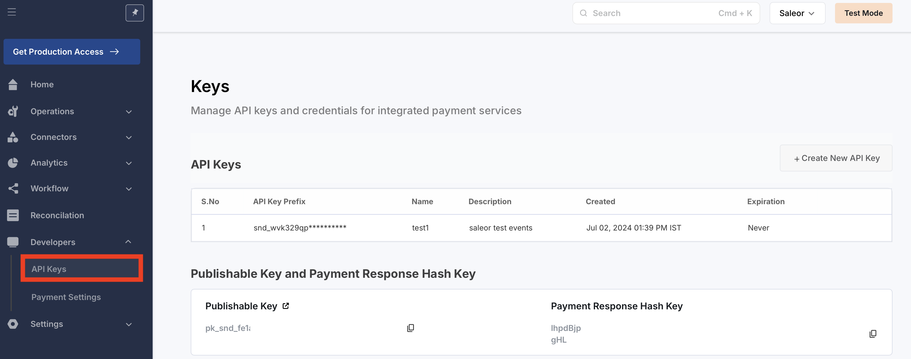
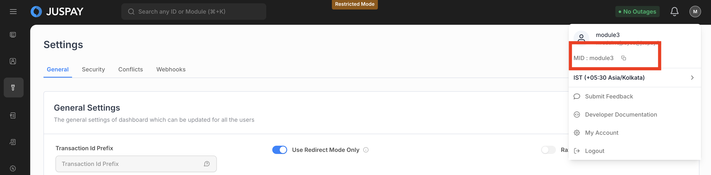
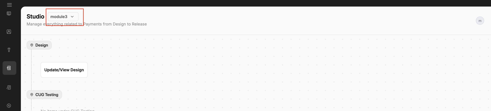

# Setup

Connects Juspay's Hyperswitch and Hypercheckout with Saleor, enabling merchants to process payments securely and efficiently within their Saleor storefront for both Indian and international customers.


This section covers the steps to setup Juspay payment app through saleor


### Prerequisites

#### 1. Sign up to payments dashboard

**1.1 Non Indian payments dashboard sign up**

[Sign up](https://app.hyperswitch.io/) to Hyperswitch dashboard and navigate to connectors tab to configure connector(s) and enable various Payment Methods.

> **Note:** While configuring connectors, please ensure that you also set up connector's webhook with hyperswitch.

**1.2 Indian payments dashboard sign up**

[Sign up](https://sandbox.portal.juspay.in/) to Hypercheckout dashboard and navigate to `Payments > PG Control Centre` to configure payment gateways and enable various Payment Methods.

> **Note:** While configuring payment gateways, please ensure that you also set up it's webhook with hypercheckout dashboard [refer](https://docs.juspay.in/resources/docs/common-resources/webhooks#Configuring-Webhooks).

Juspay Saleor app relies on these webhooks to update the payment status accurately and in real-time.

#### 2. Sign up to Saleor dashboard

Sign up to [Saleor](https://auth.saleor.io/realms/saleor-cloud/login-actions/registration?client_id=cloud-console\&tab_id=ZC70teubjvo), set up a new project, and tailor your store to meet your unique needs.

### 1. Setting up the Juspay App on your Saleor Dashboard

#### 1.1 Install the App

1. To access the Juspay Saleor Payment App, [click here](https://live.hyperswitch.io/saleor). You will be directed to a form where you can enter your Saleor API URL.

<figure><figcaption></figcaption></figure>

2. Input your Saleor API URL and click `Add to Saleor`. This action will start the installation process and display the installation page.
3. Finally, click on `Install App`, this will install the app in your dashboard

#### 1.2 Configure the App

**1.2.1 Configure for non Indian payments**

1. Open Hyperswitch App installed on your saleor dashboard.
2. Click on `Add new configuration`, which opens a popup to select non Indian payments. This will open a form to collect credentials.

* Enter a unique configuration name. This name will be used later to assign the configuration to Saleor channels.
* Enter your Hyperswitch API key. For instructions on how to create an API Key with Hyperswitch, refer to [this guide](https://docs.hyperswitch.io/hyperswitch-cloud/account-setup#user-content-create-an-api-key-1).
* Enter your Hyperswitch Publishable Key. You can find this key under the `Developers > API Keys` section of hyperswitch dasboard.
* Enter your Hyperswitch Payment Response Hash Key. You can find this key under the `Developers > API Keys` section of hyperswitch dasboard.

<figure><figcaption></figcaption></figure>

* Enter your Hyperswitch Profile ID. For more information on Profile ID, please refer to [this guide](https://docs.hyperswitch.io/features/account-management/multiple-accounts-and-profiles)

3. Click on `Save Configuration`
4. Once you save the configuration, You will be provided with a webhook URL, please update it in your [hyperswitch dashboard](https://docs.hyperswitch.io/hyperswitch-cloud/webhooks)

> **Note:** To customize, your payment page. Please contact [hyperswitch support](https://hyperswitch-io.slack.com/join/shared_invite/zt-2jqxmpsbm-WXUENx022HjNEy~Ark7Orw#/shared-invite/email)

**1.2.2 Configure for Indian payments**

1. Open Hyperswitch App installed on your saleor dashboard.
2. Click on `Add new configuration`, which opens a popup to select Indian payments. This will open a form to collect credentials.

* Enter a unique configuration name. This name will be used later to assign the configuration to Saleor channels.
* Enter your Hypercheckout API key. You can get API key in Hypercheckout dashboard under `Payments > Setting > Security`. For more instructions on how to create an API Key, refer to [this guide](https://docs.juspay.in/dashboard/docs/ec-operations/settings-module#Settings-Security).
*   Enter your Hypercheckout merchant id. You can find this by clicking on your account symbol in navbar.

    <figure><figcaption></figcaption></figure>
* Enter your username to receive webhooks. To get username visit `Payments > Setting > Webhooks`.
* Enter your password to receive webhooks. To get passowrd visit `Payments > Setting > Webhooks`.
*   Enter your Hypercheckout client id. To get client id you can visit studio from the sidebar `Payment Page > Studio`.

    <figure><figcaption></figcaption></figure>

3. Click on `Save Configuration`
4. Once you save the configuration, you will be provided with a webhook URL, Please update it in your [Hypercheckout dashboard](https://docs.juspay.in/hyper-checkout/android/base-sdk-integration/webhooks)

#### 1.3 Assign Channel to your configuration

For each channel, payments will be processed according to configurations assigned to it.

Now Hyperswitch Saleor App is configured to receive payments

### 2. Accept payments through Juspay Saleor App

#### Get available payment gateways

If you have configured Juspay in your Saleor dashboard, you will receive the Juspay App ID in the response

```
query {
  checkout(id: "saleor_checkout_id") {
    availablePaymentGateways {
      id
      name
    }
  }
}
```

Response

```
{
  "data": {
    "checkout": {
      "availablePaymentGateways": [
        {
          "id": "app.saleor.juspay-test",
          "name": "Juspay"
        }
      ]
    }
  }
}
```

#### Initialize the payment gateway

This call returns whether the payment is going through hyperswitch or hypercheckout.

```
mutation JuspaypaymentGatewayInitialize {
  paymentGatewayInitialize(id: "payment_gateway_id") {
    gatewayConfigs {
      data
      id
    }
  }
}
```

Response

```
{
  "data": {
    "paymentGatewayInitialize": {
      "gatewayConfigs": [
        {
          "data": {
            "orchestra": "HYPERSWITCH/HYPERCHECKOUT"
          },
          "id": "app.saleor.juspay-test"
        }
      ]
    }
  },
  "extensions": {
    "cost": {
      "requestedQueryCost": 0,
      "maximumAvailable": 50000
    }
  }
}
```

#### Initialize the transaction

To initialize the transaction with hyperswitch, one needs to create a transaction in Saleor by calling the transactionInitialize mutation.

```
mutation JuspayTransactionInitialize($data: JSON!) {
  transactionInitialize(
    id: "saleor_checkout_id"
    amount: 54.24
    paymentGateway: { id: "app.saleor.juspay-test", data: $data }
  ) {
    transactionEvent {
      pspReference
      amount {
        amount
        currency
      }
      type
    }
    data
    errors {
      field
      message
      code
    }
  }
}
```

You can pass additional fields while initiating the transaction through the $data JSON object. The additional fields you can pass include:

1. `customerId`: \[Optional String] The identifier for the customer
2. `authenticationType`: This is used for non Indian payments. Pass this parameter to force 3DS or non 3DS auth for this payment. Some connectors will still force 3DS auth even in case of passing 'no\_three\_ds' here and vice versa. Default value is 'no\_three\_ds' if not set Available options: `three_ds`, `no_three_ds`
3. `billingEmail`: \[Optional String] customer's billing email
4. `shippingEmail` : \[Optional String] customer's shipping email
5. `statementDescriptorName`: \[Optional String] This is used for non Indian payments. For non-card charges, you can use this value as the complete description that appears on your customers’ statements. Must contain at least one letter, maximum 22 characters
6. `statementDescriptorSuffix`: \[Optional String] This is used for non Indian payments. Provides information about a card payment that customers see on their statements. Concatenated with the prefix (shortened descriptor) or statement descriptor that’s set on the account to form the complete statement descriptor. Maximum 22 characters for the concatenated descriptor.
7. `description`: \[Optional String] A description for the payment
8. `returnUrl`: \[Optional String] The URL to which you want the user to be redirected after the completion of the payment operation (Mandatory Field for Payment Links),
9. `manualRetryAllowed`: \[Optional Boolean] This is used for non Indian payments. If true the payment can be retried with same or different payment method which means the confirm call can be made again.
10. `gatewayReferenceId`: \[Optional String] This is used for Indian payments. The id refers to the payment gateway reference id which you configured in hypercheckout dashboard. It becomes mandatory when multiple instances of the same gateway are configured. Sending this id will route the transaction via selected gateway.Refer [here](https://docs.juspay.in/resources/docs/common-resources/gateway-reference-id) for details.
11. `allowedPaymentMethods`: \[Optional JSON] This helps you to select which payment options you want to show on your payment page.
    * **Indian Payments**: This expects a json object to enable and disable payment options. For more info refer [here](https://docs.juspay.in/hyper-checkout/android/resources/payment-locking).
    * **Non-Indian Payments**: This expects a json array of enums to enable and disable payment options. For more info refer `allowed_payment_method_types` in [payments-create](https://api-reference.hyperswitch.io/api-reference/payments/payments--create).

**Example Response for Initializing a Non-Indian Transaction**

```
{
  "data": {
    "transactionInitialize": {
      "transactionEvent": {
        "pspReference": "pay_ezKjsngnqMCYbx0ke8PK",
        "amount": {
          "amount": 18,
          "currency": "USD"
        },
        "type": "CHARGE_ACTION_REQUIRED"
      },
      "data": {
        "paymentLinks": {
          "paymentLinkId": "payment_link_id",
          "web": "payment_link"
        },
        "sdkPayload": {
          "payload": {
            "clientSecret": "pay_exxxxxxxxxxx",
            "publishableKey": "pk_snd_xxxxxxx"
          }
        },
        "errors": []
      },
      "errors": [],
      "transaction": {
        "id": "VHJhbnNhY3Rxxxxxxxxxxxx,
        "token": "a795d869xxxxxxxx"
      }
    }
  },
  "extensions": {
    "cost": {
      "requestedQueryCost": 0,
      "maximumAvailable": 50000
    }
  }
}
```

Handle Response for Initializing Non-Indian Payment Transactions

* You can use `clientSecret` and `publishableKey` to invoke the [Hyperswitch SDK](https://docs.hyperswitch.io/learn-more/sdk-reference)\
  OR
* You can use the `paymentLinks.web` to redirect the customer to hyperswitch payment page. Additionally, this URL can also be embedded within an iframe

**Example Response for Initializing a Indian Transaction**

```
{
  "data": {
    "transactionInitialize": {
      "transactionEvent": {
        "pspReference": "8b2e87ac-xxxxx-xxxx-xxxx",
        "amount": {
          "amount": 200,
          "currency": "INR"
        },
        "type": "CHARGE_ACTION_REQUIRED"
      },
      "data": {
        "paymentLinks": {
          "web": "https://sandbox.assets.juspay.in/payment-page/order/ordeh_9b82xxxxxxxxxxx",
          "expiry": "2024-08-15T11:33:59Z"
        },
        "sdkPayload": {
          "requestId": "f2724dd953394f04bxxxxxxxxxxxxx",
          "service": "in.juspay.hyperpay",
          "payload": {
            "clientId": "xxxxxx",
            "amount": "200.0",
            "merchantId": "merchant_success",
            "clientAuthToken": "tkn_5f2c7edebf7143a7bfxxxxxxxxxxxxx",
            "clientAuthTokenExpiry": "2024-08-12T11:48:59Z",
            "environment": "sandbox",
            "lastName": "Doe",
            "action": "paymentPage",
            "returnUrl": "https://www.google.com/",
            "currency": "INR",
            "firstName": "Rayan",
            "customerEmail": "customer@example.com",
            "orderId": "8b2e87ac-a238-4d79-bedb-xxxxxxxxxxxxx"
          },
          "expiry": "2024-08-15T11:33:59Z"
        },
        "errors": []
      },
      "errors": [],
      "transaction": {
        "id": "VHJhbnNhY3Rpb25JdGVtOjUzYzdjNTFjLTY5NWYtxxxxxxxxxxxxx==",
        "token": "53c7c51c-695f-464d-b78d-xxxxxxxxxxxxx"
      }
    }
  },
  "extensions": {
    "cost": {
      "requestedQueryCost": 0,
      "maximumAvailable": 50000
    }
  }
}
```

Hanlde Response for Initializing Indian Payment Transactions

* You can use `sdkPayload` to invoke the [Hypercheckout SDK](https://docs.juspay.in/hyper-checkout/android/base-sdk-integration/initiating-sdk)\
  OR
* You can use the `paymentLinks.web` to redirect the customer to Hypercheckout payment page. Additionally, this URL can also be embedded within an iframe

#### Retrieve the transaction

The payment status will be automatically updated by the App in the backend upon Juspay receiving a webhook from the connector. Alternatively, you can call Saleor's Transaction Process mutation to retrieve the status of an initiated payment.

```
mutation JuspayTransactionProcess {
  transactionProcess(
    id: "saleor_transaction_id"
  ) {
    data
    errors {
      code
      field
      message
    }
    transaction {
      actions
    }
    transactionEvent {
      type
      pspReference
    }
  }
}
```

The Juspay Saleor App also supports additional flows such as payment capture, cancellation, and refunds. These actions can be triggered directly through the Saleor dashboard.

> Note: If you trigger refunds through the Hyperswitch/Hypercheckout dashboard instead of the Saleor dashboard, you will need to manually update the refund status in the Saleor dashboard.
