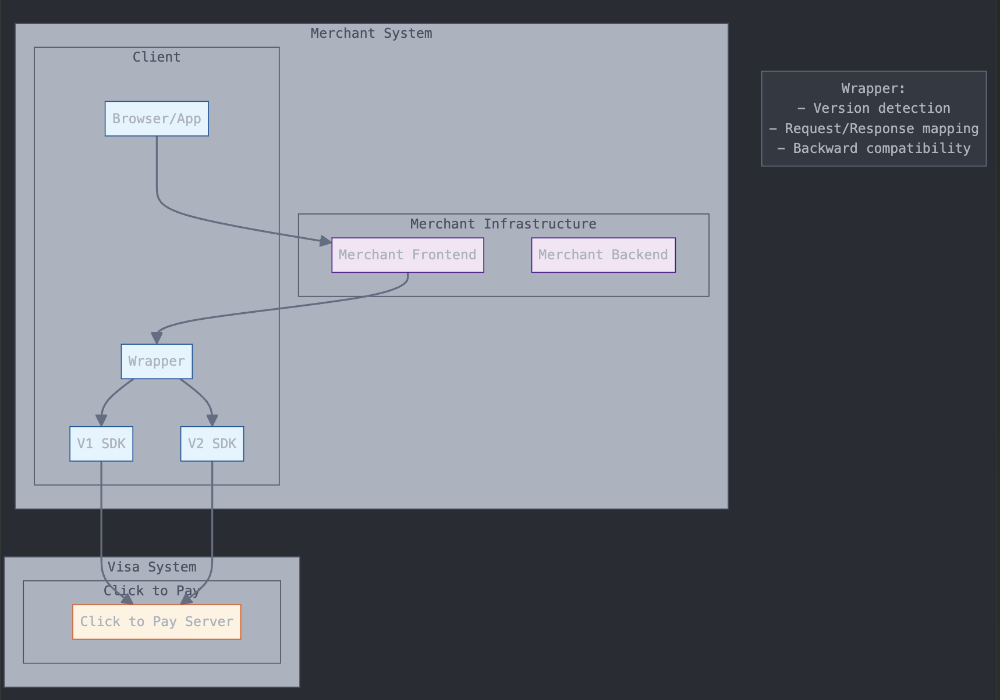

# Visa Click to Pay: V1 to V2 Migration

The evolution from Click to Pay V1 to V2 represents a fundamental shift in digital payment capabilities, addressing key merchant and consumer pain points while setting new standards for security and user experience. V2 introduces significant architectural improvements and feature enhancements that align with the industry's movement toward passwordless authentication and seamless checkout experiences. This transformation comes at a crucial time when digital commerce demands both frictionless transactions and robust security measures.

| **Feature Aspect**            | **V1**                                                                                                                                                                                                                                                                                                         | **V2**                                                                                                                                                                                                                                                                                                                                                                                                                                                                                                                          |
| ----------------------------- | -------------------------------------------------------------------------------------------------------------------------------------------------------------------------------------------------------------------------------------------------------------------------------------------------------------- | ------------------------------------------------------------------------------------------------------------------------------------------------------------------------------------------------------------------------------------------------------------------------------------------------------------------------------------------------------------------------------------------------------------------------------------------------------------------------------------------------------------------------------- |
| 🔐 **Security Features**      | ⛔️ card data handling, prone to fraud.                                                                                                                                                                                                                                                                         | ✅ tokenization and biometric authentication, meeting FIDO standards.                                                                                                                                                                                                                                                                                                                                                                                                                                                            |
| 🚀 **Speed of Payment**       | ⛔️ Requires multiple steps - OTPs are used for cardholder verification during online transactions, adding an extra layer of security but also introducing additional steps in the checkout process                                                                                                             | ✅ V2 integrates advanced authentication methods, such as biometrics and device recognition, reducing the reliance on OTPs. This shift enhances security while streamlining the user experience by minimizing interruptions during checkout.Biometric authentication reduces checkout time by 50%.                                                                                                                                                                                                                               |
|  🛜 **Integration**           | ⛔️ Separate APIs and infrastructure for different card networks.                                                                                                                                                                                                                                               | ✅ Unified integration across multiple card network                                                                                                                                                                                                                                                                                                                                                                                                                                                                              |
| 🙎🏻‍♂️ **User Experience**   | <p>⛔️ Authentication requires username/password login for:</p><ul><li>Initial service access</li><li>New device verification</li><li>Adding new cards</li><li>Accessing saved cards</li></ul><p>⛔️ Separate authentication needed across different devices</p><p><br>⛔️ No device recognition capabilities</p> | <p>✅  Hybrid authentication approach:</p><ul><li>Initial email/mobile verification still required</li><li>Optional biometric authentication for returning users</li><li>Payment passkey support being rolled out (not fully deployed)</li><li>Two-factor authentication for enhanced security<br></li></ul><p>✅  Device-specific recognition:</p><ul><li>"Remember me" option for trusted devices</li><li>Automatic recognition on returning to saved merchants</li><li>But requires initial setup per browser/device</li></ul> |
| 💳  **Push Provisioning**     | ⛔️ Not supported. Users cannot add their cards directly to Click to Pay from the issuer's app.                                                                                                                                                                                                                 | ✅ Supported. Issuers can enrol cardholders into Click to Pay directly from their banking app, streamlining the enrolment process.                                                                                                                                                                                                                                                                                                                                                                                               |
| **🌏 Global Market Adoption** | 🚧 Limited deployment and compatibility with some regions and merchants.                                                                                                                                                                                                                                       | ✅ Available in 35+  countries, supported by major card networks                                                                                                                                                                                                                                                                                                                                                                                                                                                                 |
| **🔁 Recurring Payments**     | 🚧 Limited support for saving credentials and managing recurring payments                                                                                                                                                                                                                                      | ✅ Built-in support for recurring payments and saved credentials                                                                                                                                                                                                                                                                                                                                                                                                                                                                 |

### **Seamless Migration with Hyperswitch** <a href="#ad1rqph0cmzm" id="ad1rqph0cmzm"></a>

The migration to V2 is powered by Hyperswitch's specialized wrapper solution, ensuring a frictionless transition that protects your existing integration while unlocking next-generation features. Our wrapper automatically handles version detection, request/response mapping, and backward compatibility - eliminating the risk of business disruption during migration.

This guide will help you migrate from Visa Click to Pay SDK V1 to V2 in less than 30 minutes. Our wrapper maintains backward compatibility while giving you access to V2's enhanced features.



### Integration Methods

Choose your integration path based on your business needs:

| Method                   | Best For                | Key Benefits                                                                    | Considerations        |
| ------------------------ | ----------------------- | ------------------------------------------------------------------------------- | --------------------- |
| **PSP Integration**      | Small-medium businesses | <p>• Fastest deployment<br>• Minimal dev effort<br>• PSP handles compliance</p> | Limited customization |
| **Acquirer Integration** | Established merchants   | <p>• Moderate effort<br>• Custom checkout<br>• Existing bank relation</p>       | Shared compliance     |
| **Direct Integration**   | Large enterprises       | <p>• Full control<br>• All features<br>• Direct Visa support</p>                | Requires PCI-DSS      |

Decision factors: Dev resources, time to market, customization needs, compliance capabilities

[View detailed comparison →](https://developer.visa.com/capabilities/visa-secure-remote-commerce/docs-integration-overview)

### Quick Start

#### Step 1: Install the Wrapper

```bash
npm install @visa/click-to-pay-wrapper
```

#### Step 2: Update Imports

```javascript
// Old V1 Import
import { VisaSRCI } from '@visa/click-to-pay-v1';

// New V2 Import
import { VisaClickToPayWrapper } from '@visa/click-to-pay-wrapper';
```

#### Step 3: Initialize the SDK

```javascript
// Old V1 Initialization
const visaCheckout = new VisaSRCI();
await visaCheckout.init({
    apikey: 'your_api_key',
    visaSrci: true
});

// New V2 Initialization
const visaCheckout = new VisaClickToPayWrapper({
    debug: true, // Optional: Enable debug logging
    apikey: 'your_api_key',
    srcInitiatorId: 'your_initiator_id',
    environment: 'production' // or 'sandbox' for testing
});
await visaCheckout.init();
```

#### Step 4: Update Configuration (if needed)

```javascript
// Optional: Configure additional features
await visaCheckout.init({
    apiKey: 'your_api_key',
    environment: 'production',
    features: {
        biometrics: true,
        quickCheckout: true
    },
    locale: 'en-US' // Optional: Set preferred locale
});
```

#### Step 5: Implement Event Handlers (Optional)

```javascript
// New event handling system
visaCheckout.on('checkout_started', (data) => {
    console.log('Checkout started:', data);
});

visaCheckout.on('payment_complete', (data) => {
    console.log('Payment complete:', data);
});

// Additional events available in V2
visaCheckout.on('authentication_required', (data) => {
    console.log('Authentication required:', data);
});

visaCheckout.on('biometric_prompt', (data) => {
    console.log('Biometric authentication prompted:', data);
});
```

#### Step 6: Update Checkout Implementation

```javascript
// Both V1 and V2 formats work with the wrapper
const checkoutResponse = await visaCheckout.checkout({
    amount: '100.00',
    currency: 'USD',
    merchantName: 'Test Store'
});
```

### New V2 Features

#### Device Authentication Support

Before enabling biometric authentication, verify device capabilities:

```javascript
// Check biometric availability
const checkBiometricSupport = async () => {
    const capabilities = await visaCheckout.checkDeviceCapabilities();
    if (capabilities.biometrics) {
        // Enable biometric flow
        await visaCheckout.enableBiometrics();
    } else {
        // Fallback authentication methods in order of preference:
        // 1. Device binding (Remember this device)
        // 2. OTP verification
        // 3. Password authentication
        await visaCheckout.enableFallbackAuth({
            preferDeviceBinding: true,
            allowOTP: true
        });
    }
};
```

#### Enable Biometric Authentication

```javascript
if (visaCheckout.version === 'v2') {
    try {
        await visaCheckout.enableBiometrics();
        console.log('Biometrics enabled successfully');
    } catch (error) {
        console.error('Biometrics setup failed:', error);
        // Fallback to traditional authentication
    }
}
```

#### Quick Checkout

```javascript
if (visaCheckout.version === 'v2') {
    try {
        const quickCheckoutResponse = await visaCheckout.quickCheckout(token);
        console.log('Quick checkout completed:', quickCheckoutResponse);
    } catch (error) {
        console.error('Quick checkout failed:', error);
        // Fallback to regular checkout
        const regularCheckoutResponse = await visaCheckout.checkout(options);
    }
}
```

#### Error Handling Guide

Common Error Scenarios:

```javascript
// Network and Connection Errors
NETWORK_ERROR: 'Connection failed during API call'
TIMEOUT_ERROR: 'Request timed out'
API_ERROR: 'API endpoint not responding'

// Authentication Errors
AUTH_INVALID: 'Invalid authentication credentials'
AUTH_EXPIRED: 'Authentication session expired'
BIOMETRIC_FAILED: 'Biometric authentication failed'

// Transaction Errors
CARD_DECLINED: 'Card was declined'
INSUFFICIENT_FUNDS: 'Insufficient funds'
RISK_DECLINE: 'Transaction declined due to risk assessment'
```

Error Handling Best Practices:

```javascript
try {
    const response = await visaCheckout.checkout(options);
    handleSuccess(response);
} catch (error) {
    switch(error.code) {
        case 'NETWORK_ERROR':
            await retryWithBackoff(3); // Retry up to 3 times
            break;
        case 'AUTH_EXPIRED':
            await refreshAuthSession();
            break;
        case 'BIOMETRIC_FAILED':
            await fallbackToOTP();
            break;
        // Add more specific error handling
    }
}
```


### Authentication Methods

V2 supports multiple authentication methods:

```javascript
// Configure authentication preferences
await visaCheckout.init({
    apiKey: 'your_api_key',
    environment: 'production',
    authentication: {
        preferBiometric: true, // Prefer biometric when available
        fallbackToPassword: true, // Allow password as fallback
        allowRememberMe: true // Enable "Remember Me" feature
    }
});

// Handle authentication events
visaCheckout.on('authentication_method_selected', (method) => {
    switch(method) {
        case 'biometric':
            console.log('User selected biometric authentication');
            break;
        case 'password':
            console.log('User selected password authentication');
            break;
        case 'otp':
            console.log('One-time password required');
            break;
    }
});
```

### Migration Checklist

* [ ] Install new wrapper package
* [ ] Update import statements
* [ ] Update initialization code
* [ ] Test existing V1 flows with wrapper
* [ ] Implement error handling
* [ ] Add V2 specific features (optional)
* [ ] Test in sandbox environment
* [ ] Deploy to production
* [ ] Enable new V2 features gradually
* [ ] Monitor error rates and user feedback
* [ ] Update documentation and support materials
* [ ] Train customer support team on new features

### Best Practices

1. Use the wrapper for gradual migration
2. Test both V1 and V2 flows in sandbox first
3. Enable new features progressively
4. Implement proper error handling
5. Monitor for any issues after deployment
6. Use feature detection for V2-specific features
7. Maintain fallback options for all new features
8. Test across different browsers and devices
9. Monitor performance metrics
10. Keep error handling and logging comprehensive

### Performance Considerations

#### Lazy Loading

```javascript
// Lazy load the SDK when needed
const loadSDK = async () => {
    if (!window.visaCheckout) {
        await import('@visa/click-to-pay-wrapper');
    }
    return window.visaCheckout;
};
```

#### Resource Optimization

```javascript
// Configure optimal resource loading
await visaCheckout.init({
    apiKey: 'your_api_key',
    environment: 'production',
    loading: {
        preload: ['essential'], // Preload essential components
        lazy: ['biometrics', 'analytics'], // Lazy load optional features
        timeout: 5000 // Set reasonable timeouts
    }
});
```

### Common Issues and Solutions

#### Configuration Format Mismatch

```javascript
// Solution: Use wrapper's normalizeConfig method
const config = visaCheckout.normalizeConfig(yourConfig);
```

#### Event Handling Differences

```javascript
// Solution: Use wrapper's unified event system
visaCheckout.on('checkout_started', handleCheckoutStarted);
```

#### Response Format Differences

```javascript
// Solution: Wrapper automatically handles conversion
const response = await visaCheckout.checkout(options);
```

#### Version Detection Issues

```javascript
// Solution: Explicitly check version compatibility
if (!visaCheckout.isFeatureSupported('biometrics')) {
    // Fallback to traditional authentication
}
```

#### Session Management

```javascript
// Solution: Implement proper session handling
visaCheckout.on('session_expired', async () => {
    await visaCheckout.refreshSession();
    // Retry the last operation
});
```

### Security Considerations

#### PCI Compliance

The wrapper maintains PCI compliance while handling sensitive data:

```javascript
// Configure secure data handling
await visaCheckout.init({
    apiKey: 'your_api_key',
    environment: 'production',
    security: {
        pciCompliant: true,
        tokenization: true,
        encryptPayload: true
    }
});
```

#### Data Protection

```javascript
// Enable additional security features
await visaCheckout.init({
    apiKey: 'your_api_key',
    environment: 'production',
    security: {
        validateOrigin: true,
        strictCSP: true,
        requireHTTPS: true
    }
});
```

### Testing Guide

#### Sandbox Testing

```javascript
// Initialize in sandbox mode
const visaCheckout = new VisaClickToPayWrapper({
    apikey: 'your_sandbox_api_key',
    environment: 'sandbox',
    debug: true
});

// Test card numbers
const testCards = {
    success: '4111111111111111',
    decline: '4000000000000002',
    error: '4000000000000069'
};
```

#### Error Simulation

```javascript
// Test error scenarios
await visaCheckout.simulateError('NETWORK_ERROR');
await visaCheckout.simulateError('AUTHENTICATION_FAILED');
await visaCheckout.simulateError('CARD_DECLINED');
```

#### Testing Recurring Payments

```javascript
// Test recurring payment setup
const recurringTest = async () => {
    // Initial charge
    const initial = await visaCheckout.checkout({
        amount: '10.00',
        currency: 'USD',
        recurring: true,
        recurringType: 'subscription'
    });

    // Subsequent charge
    const recurring = await visaCheckout.recurringCharge({
        originalTransactionId: initial.transactionId,
        amount: '10.00'
    });
};
```

### Monitoring and Analytics

#### Enable Analytics

```javascript
await visaCheckout.init({
    apiKey: 'your_api_key',
    environment: 'production',
    analytics: {
        enabled: true,
        captureErrors: true,
        capturePerformance: true
    }
});
```

#### Custom Event Tracking

```javascript
// Track custom events
visaCheckout.trackEvent({
    category: 'Checkout',
    action: 'Started',
    label: 'Quick Checkout Button',
    value: cartTotal
});
```

### Support and Resources

For additional support:

* Contact Visa support team at support@visa.com
* Visit our developer portal at https://developer.visa.com
* Join our developer community at https://community.visa.com

#### Documentation

* [API Reference](https://developer.visa.com/capabilities/visa-secure-remote-commerce/docs-js-reference-v2/init) - JavaScript SDK reference for implementing Click to Pay
* [Integration Overview](https://developer.visa.com/capabilities/visa-secure-remote-commerce/docs-integration-overview) - Comprehensive implementation guide and requirements
* [Merchant & PSP Guide](https://developer.visa.com/capabilities/visa-secure-remote-commerce/docs-merchants-psps) - Best practices and implementation paths for merchants and payment service providers


Remember to test thoroughly in the sandbox environment before deploying to production, and enable new features gradually to ensure a smooth transition for your users.
