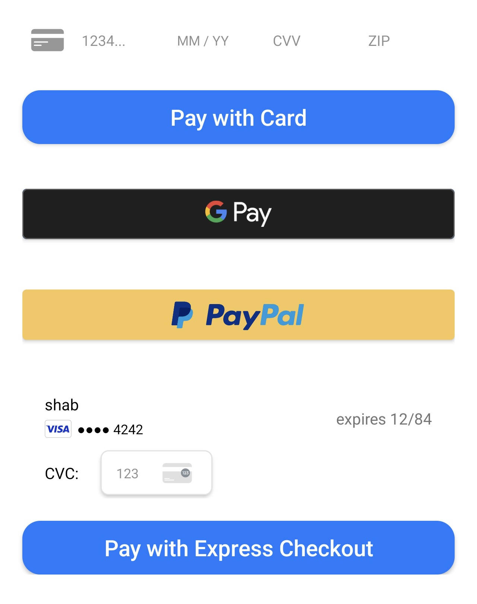

# Widgets

<div align="center"><figure><figcaption></figcaption></figure></div>

## Requirements

* Android 6.0 (API level 23) and above
* [Android Gradle Plugin](https://developer.android.com/studio/releases/gradle-plugin) 8.5+
* [Gradle](https://gradle.org/releases/) 8.8+
* [AndroidX](https://developer.android.com/jetpack/androidx/)

## 1. Setup the server

```js
$ npm install @juspay-tech/hyperswitch-node
```

Follow the [Server Setup](../../../web/server-setup.md) section.

## 2. Build checkout page on your app

### 2.1 Add the Buildscript Classpath

To start integrating the Hyperswitch SDK, add the following classpath to the `buildscript` block of your project-level `build.gradle` file:

<pre class="language-gradle"><code class="lang-gradle">buildscript {
    repositories {
        mavenCentral()
    }
    dependencies {
        classpath "io.hyperswitch:hyperswitch-gradle-plugin:<a data-footnote-ref href="#user-content-fn-1">$latest_version</a>"
    }
}
</code></pre>

### 2.1 Add the Buildscript Classpath

Add the following plugin to the `plugins` block of your app-level `build.gradle` file:

```gradle
plugins {
    // Apply Hyperswitch Plugin
    id 'io.hyperswitch.plugin'
}
```

### 2.3 Implement the HyperInterface

Next, implement the `HyperInterface` in your Activity. This involves extending `FragmentActivity` and implementing the `HyperInterface`:

```kotlin
class WidgetActivity : AppCompatActivity(), HyperInterface {
    // ...
}
```

### 2.5 Initialize Payment Configuration

Set up the SDK using your publishable key:

```kotlin
private fun initialiseSDK() {
    // Initialize Payment Configuration
    PaymentConfiguration.init(applicationContext, publishKey)
}
```


## 3. Implementation

Choose from list of available widgets to integrate:

1. [Card Element](card-element.md)
2. [Google Pay](google-pay.md)
3. [PayPal](paypal.md)
4. [Express Checkout](express-checkout.md)

### Final Step

Congratulations! You have successfully integrated Hyperswitch widgets into your app. This approach gives you granular control over each payment method and allows for custom UI/UX design while leveraging Hyperswitch's payment processing capabilities.

## Next step:


[payment-methods-setup](../../../../../payment-orchestration/quickstart/payment-methods-setup/)


[^1]: &#x20;[Get Latest Version](https://central.sonatype.com/artifact/io.hyperswitch/hyperswitch-gradle-plugin/versions)
