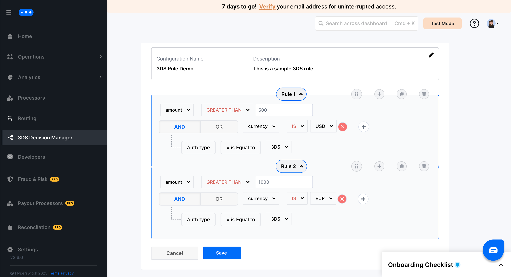
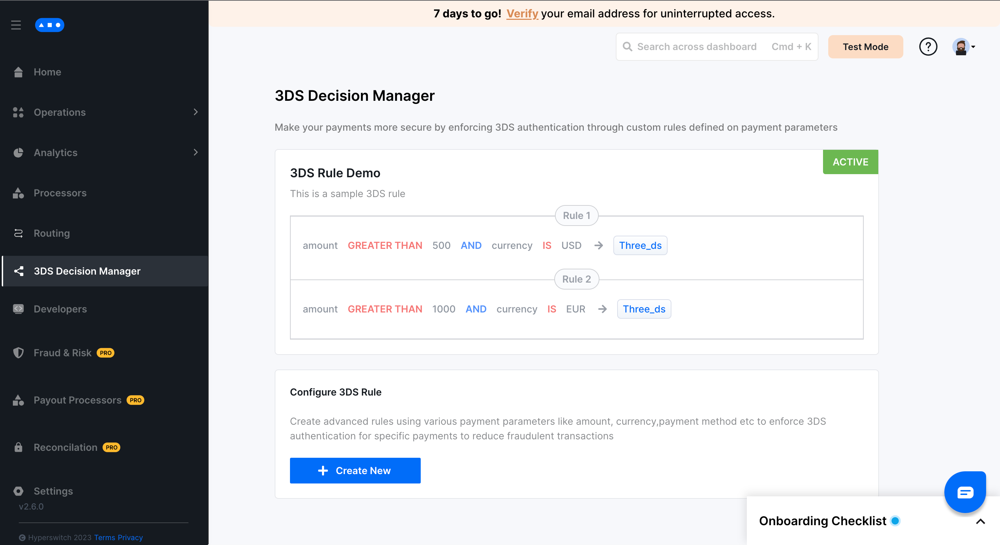

# Setting up 3DS Decision Manager

### Video Tutorial:



## Setup Steps:

**Step 1:** Go to 3DS Decision Manager tab on the Hyperswitch Control Center

**Step 2:** Click on create new rule&#x20;

<figure><figcaption></figcaption></figure>

**Step 3:** Save the rule name and description&#x20;

<figure><figcaption></figcaption></figure>

**Step 4:** Configure your desired rule by selecting the operators and values for the various fields&#x20;

<figure><figcaption></figcaption></figure>

**Step 5:** Add more rules using the plus icon on the top right of the current rule panel&#x20;

<figure><figcaption></figcaption></figure>

**Step 6:** Click save to configure and activate the rule&#x20;

<figure><figcaption></figcaption></figure>

**Step 7:** Your rule is now successfully configured and 3D Secure authentication would be enforced all payments conforming to this rule.


3DS decision manager supports only one active configuration at a time. Multiple rules can be combined into a single configuration as shown in the example.


## Next step&#x20;

To test the 3DS Decision Manager, after activating the rule, we can make a Test Payment using the [Hyperswitch Dashboard ](https://app.hyperswitch.io/sdk)

FAQs

#### What are some of the payment parameters that I can use to configure 3DS rules?

You can define rules using parameters such as:

* **Amount (amount):** Apply rules to specific transaction values or ranges.
* **Currency (currency):** Restrict rules to certain currencies.
* **Card Type/Network (card\_type/card\_network):** Define rules for debit, credit, or specific networks.
* **Billing Country (billing\_country):** Target transactions based on the customer's billing country.

#### How do I update the current configuration?

Click on Create New and configure a new rule that would replace the existing configuration

#### What happens if I set `authentication_type` as `three_ds` in `/payments` request?

3D Secure will be enforced and override the 3DS Decision Manager's decision

