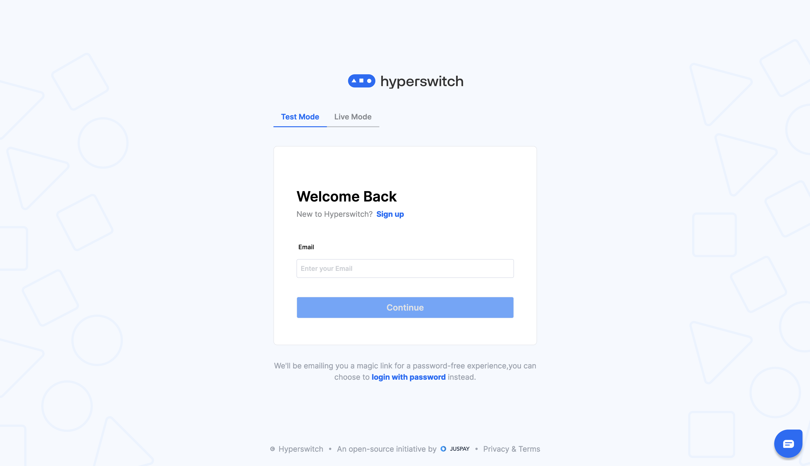

# 🛡️ Fraud & Risk Management


With this section you will get a good understanding of FRM, it's need, use cases, architecture and steps to integrate it in your system.


The Hyperswitch Fraud and Risk Management (FRM) platform offers a comprehensive Unified API designed to cater to your specific payment validation needs, effectively enhancing fraud protection within your payment ecosystem.

## Benefits

* **Processor-Agnostic Integration:** Single API connect lets you seamlessly connect with an FRM solution of choice.
* **Customized Fraud Strategies:** Enables users to adjust fraud prevention measures by allowing them to select between Pre-Auth and Post-Auth checks based on specific payment methods and connectors.
* **Unified Dashboard:** A consolidated interface that displays all flagged transactions, making decision-making on potential frauds a breeze.
* **Real-Time Alerts:** Immediate notifications are sent when potential fraudulent activity is detected, ensuring quick action and minimal losses.
* **Insightful Analytics:** Detailed reports on fraud patterns help inform decisions and strategy adjustments.

## Use cases

Below are few sample FRM use cases

* **Online Marketplaces:** Secure transactions on e-commerce platforms like Amazon or eBay, regardless of payment methods or processors. Benefit from chargeback guarantees, dispute resolution, account security, real-time fraud alerts, and streamlined fraud investigation tools.
* **High-Value Transactions:** Protect high value orders in luxury retail, or high-end custom services. Ensure payment validity, prevent chargebacks, optimize PSD2 compliance, reduce transaction friction, gain valuable fraud trend insights, and utilize predictive fraud analysis.

## Overview

You can enable the FRM solution of your choice with few clicks and very minimal code changes. Below are the two scenarios in which FRM can be activated through Hyperswitch.

## Prerequisite

* You should possess payment method information
* You will have to signup with an FRM solution provider and get the API keys

## Pre-Authorization Flow

In the PreAuth flow, the FRM solution is invoked before authorizing a payment with your payment processor. When a customer attempts to make a payment, the transaction details are sent to the FRM solution for analysis. The FRM solution assesses the risk associated with the transaction based on various parameters such as the customer's historical behaviour, transaction patterns, location, device information, and any other relevant data. It then provides a risk score or recommendation. Based on the risk score or recommendation, one can decide whether to proceed with the transaction, decline it, or take additional verification steps to ensure its legitimacy. The goal is to prevent potentially fraudulent transactions from being authorized in the first place.

* **Possible actions based on the status**
  * **Continue on Accept** : Continue with the transaction.
  * **Halt on Decline** : Mark the transaction as cancelled.

<figure><figcaption></figcaption></figure>

## Post-Authorization Flow

In the PostAuth flow, the FRM solution is called into action after the authorization has been completed by the payment processor. Once the transaction is authorized, the details are sent to the FRM solution for a second layer of validation. The FRM solution re-evaluates the transaction using the latest data available and cross-references it with historical patters and known fraud indicators. The PostAuth flow acts as a safety net to catch any suspicious or fraudulent transactions that might have slipped through during the PreAuth flow. If the FRM solution identifies a transaction as potentially fraudulent during the PostAuth flow, it is flagged for manual review. Manual review requires human intervention for either accepting or rejecting the payment. If accepted, the amount is captured by the payment processor. If rejected, the transaction is voided.

* **Possible actions based on the status**
  * **Continue on Accept** : Continue with the transaction.
  * **Halt on Decline** : Mark the transaction as cancelled.
  * **Approve / Decline on Review** :
    * Hold the txn in manual review state. Merchants can list and review such transactions.
    * If approved, payment is captured
    * If declined, payment is voided

**Note** : If the connector doesn’t support manual capture, Post-Authorization manual review should be avoided during configuration setup for the respective connector.

<figure><figcaption></figcaption></figure>

## Supported FRM Processors

| Processors           | Supported Flows                            | Supported Actions                                                    | Processor Features                                                                                                 |
| -------------------- | ------------------------------------------ | -------------------------------------------------------------------- | ------------------------------------------------------------------------------------------------------------------ |
| Signifyd / Riskified | <ul><li>PreAuth</li><li>PostAuth</li></ul> | <ul><li>Cancel Transactions</li><li>Flag for Manual Review</li></ul> | <ul><li>Guaranteed Fraud Protection</li><li>Complete Chargeback Protection</li><li>Auth Rate Conversions</li></ul> |

If your FRM processor of choice is not available in the above list, please put a new features request [here](https://github.com/juspay/hyperswitch/discussions/new?category=ideas-feature-requests).

## FRM status and decisions

FRM connectors generally provide a decision based on rules / data models along with a risk score associated with the transaction. Some integrations require providing the model to be used explicitly. For example, Signifyd can be configured to respond with only scores, or decision + scores, etc. Fraud detection can be done via below methods

* **Rules**: Uses static set of rules for deciding on the outcome
* **Scores**: Uses a range of number for associating risk with the transaction
* **Decisions/recommendations**: Uses ML data models for predicting and recommending the outcome
* **Chargeback guarantee**: Uses ML data models for responding with a binary outcome (Accept vs Decline)

Currently, HyperSwitch offers only a single way of integrating with the underlying FRM connector.

* **Signifyd** : Decision/Recommendation
* **Riskified** : chargeback guarantee

## How to get started?

**Step 1:** Log in to your [Hyperswitch account](https://app.hyperswitch.io/login).

<figure><figcaption></figcaption></figure>

**Step 2:** Navigate to the 'Fraud & Risk' tab and select the FRM processor you want to integrate.

<figure><figcaption></figcaption></figure>

**Step 3:** Configure payment methods and preferred actions for the enabled payment methods.

<figure><figcaption></figcaption></figure>

**Step 4:** Provide API credentials for the FRM processor.

<figure><figcaption></figcaption></figure>

**Step 5:** Once set up, head to the [API Docs](https://api-reference.hyperswitch.io/api-reference/payments/payments--create) to integrate the FRM API and start testing payments with fraud checks.


[test-a-payment.md](../../../hyperswitch-open-source/account-setup/test-a-payment.md)


## FAQs

* **What are the prerequisites for integrating with the Hyperswitch FRM platform?** Depending on the FRM processor of your choice, you may need to pass additional parameters regarding order fullfilment as a webhook to Hyperswitch. Please refer to the section here for more details.
* **Can I adjust my fraud prevention measures based on specific payment methods and connectors?** Yes, the Hyperswitch FRM platform allows you to customize your fraud prevention measures by selecting between pre-authorization and post-authorization checks for each payment method for a processor and the corresponding action to be taken.
