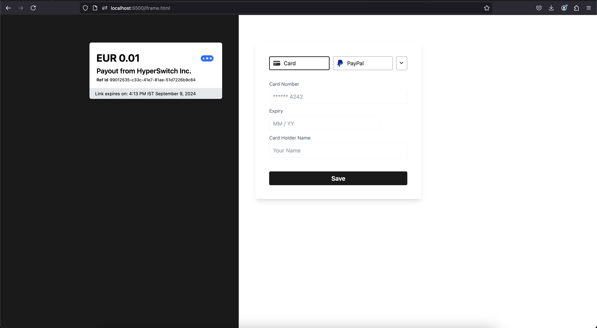
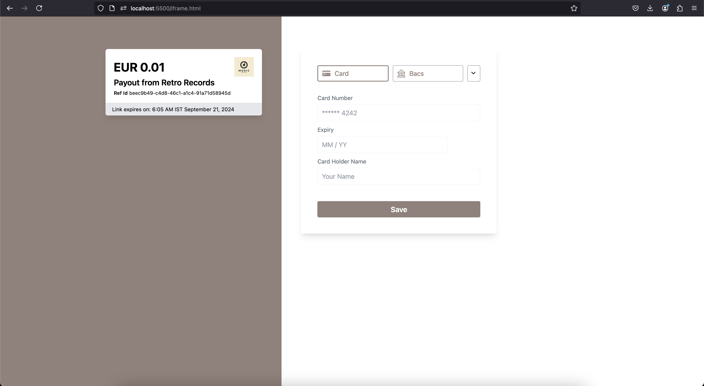
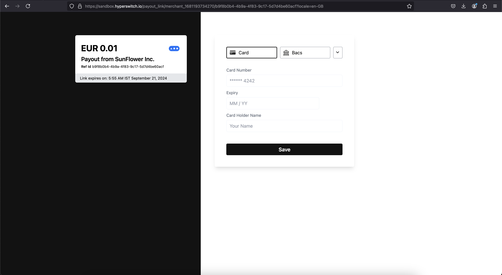

# 🔗 Payout Links

Introducing Payout Links - Make sending out money to beneficiaries, simple and easy. Improve customer / vendor / partner's experience by making instant payouts in their preferred mode of transaction with preferred processor.

## Use cases for Payout links

* Corporates - Pay marketing affiliates and reimburse employees.
* BFSI (Banking, Financial Services, and Insurance) - Settling insurance claims and paying DSA (Direct Selling Agents) incentives.
* Healthcare - Pay field agents, handle reimbursements, and issue refunds.
* Travel and Hospitality - Pay commissions to vendors, handle reimbursements and do refunds.
* Rental Business - Process Security Deposit Refunds for all rental business like car, housing, furniture and appliances.
* Online gaming - Distribute prize money to players.
* NGOs & Political Organisations - Reimburse field agents and volunteers.

## How to configure Payout links through Hyperswitch API?

### Prerequisites

* Create a Hyperswitch account via the [dashboard](https://app.hyperswitch.io/register) and create a profile ([read more](../../../features/payment-flows-and-management/account-management/multiple-accounts-and-profiles.md))
* Add a payout processor to your account

### Using Payout links

> Note: Domain name might vary based on the testing and production environment.

> Info: Payout links are secure by nature and should only be opened within an iframe of whitelisted domains in production. For ease of access, these links can be used in a test mode (for non production env) which removes the necessity of configuring whitelisted domains and loading these links within an iframe.

There are a couple of ways for using payout links.

* Creating default links
* Customizing UI of individual links
* Serving links from a custom domain
* **\[TEST MODE]** Opening non-iframed links

#### 1. Update [business profile](https://api-reference.hyperswitch.io/api-reference/business-profile/business-profile--update) with a default payout\_link\_config by passing the below object in the request body

```jsonc
"payout_link_config": {
  // (optional) Custom theme color for your payout link.
  // Can be any html color hex code.
  "theme": "#143F1E",

  // (optional) Custom logo for your company.
  // Can be any hosted image URL.
  "logo": "https://hyperswitch.io/favicon.ico",

  // (optional) Name of your company.
  "merchant_name": "HyperSwitch",

  // (required in production) A list of domain glob patterns.
  // This is used as validation when payout link render request is received, and also helps block XSS on client.
  "allowed_domains": ["http://localhost:8080"],

  // (only available in sandbox) Controls access to payout link.
  // This is used to control whether or not to validate the access to payout link.
  "payout_test_mode": false
}
```

> Note: It is recommended to set `payout_test_mode` to true for quickly testing the payout links. Alternatively, `test_mode` can be sent in the individual payout link's create request.

#### 2. Create a default payout link using [create payouts](https://api-reference.hyperswitch.io/api-reference/payouts/payouts--create) endpoint

> This creates a default payout link using the payout link config that was configured for the profile. In case payout config is not configured and not passed during create request, a default set of UI config is used.

* Set `payout_link` to true

```shell
curl --location 'https://sandbox.hyperswitch.io/payouts/create' \
--header 'Content-Type: application/json' \
--header 'Accept: application/json' \
--header 'api-key: YOUR_API_KEY' \
--data '{
    "amount": 100,
    "currency": "EUR",
    "customer_id": "cus_123",
    "name": "John Doe",
    "phone": "999999999",
    "email": "payout_customer@example.com",
    "phone_country_code": "+65",
    "description": "Its my first payout request",
    "billing": {
        "address": {
            "line1": "1467",
            "line2": "Harrison Street",
            "line3": "Harrison Street",
            "city": "San Fransico",
            "state": "CA",
            "zip": "94122",
            "country": "US",
            "first_name": "John",
            "last_name": "Doe"
        },
        "phone": {
            "number": "9000000001",
            "country_code": "+91"
        }
    },
    "payout_link" : true,
    "confirm": false,
    "session_expiry":2592000
}'
```

<figure><figcaption><p>Default payout link opened in an iframe hosted locally</p></figcaption></figure>

#### 3. Customizing a payout link during creation

> Each payout link can be configured inidividually during [payout creation](https://api-reference.hyperswitch.io/api-reference/payouts/payouts--create), by including the `payout_link_config` object. UI config and access control (test\_mode) can be specified during creation. However, `domain_name` is always configured at a profile level.

<pre class="language-markup"><code class="lang-markup">curl --location 'https://sandbox.hyperswitch.io/payouts/create' \
--header 'Content-Type: application/json' \
--header 'Accept: application/json' \
--header 'api-key: YOUR_API_KEY' \
--data '{
    "amount": 1130,
    "currency": "USD",
    "confirm": false,
    "customer_id": "cus_123",
    "return_url": "https://hyperswitch.io",
    "description": "Cashback from RetroRecords",
    "payout_link": true,
    "billing": {
        "address": {
            "line1": "1467",
            "line2": "Harrison Street",
            "line3": "Harrison Street",
            "city": "San Fransico",
            "state": "CA",
            "zip": "94122",
            "country": "US",
            "first_name": "John",
            "last_name": "Doe"
        },
        "phone": {
            "number": "9000000001",
            "country_code": "+91"
        }
    },
    "session_expiry": 2592000,
<strong>    "payout_link_config": {
</strong>        "logo": "https://img.freepik.com/premium-vector/music-vector-logo-illustration-design-template_593008-640.jpg?w=1480",
        "theme": "#92817A",
        "merchant_name": "Retro Records"
    }
}'
</code></pre>

<figure><figcaption><p>Customized payout link opened in an iframe hosted locally</p></figcaption></figure>

#### 4. Opening non-iframed links

> Note: This feature is available only in non-production environment. This essentially bypasses the server side and client side validations which are in place for making sure links are only opened within an iframe of a whitelisted domain.

> Note: This can be achieved by either setting this behaviour at the business profile level, or can be set in individual link create requests.

**Setting at business profile level**

* Update `payout_link_config` in [business profile](https://api-reference.hyperswitch.io/api-reference/business-profile/business-profile--update) to set `payout_test_mode`

```jsonc
"payout_link_config": {
  "payout_test_mode": true
}
```

* Any new payout links created for this business profile will be accessible through browser's new tab.

**Creating test links on demand**

* Set `test_mode` during payout link creation

<pre class="language-markup"><code class="lang-markup">curl --location 'https://sandbox.hyperswitch.io/payouts/create' \
--header 'Content-Type: application/json' \
--header 'Accept: application/json' \
--header 'api-key: YOUR_API_KEY' \
--data '{
    "amount": 1130,
    "currency": "USD",
    "confirm": false,
    "customer_id": "cus_123",
    "return_url": "https://hyperswitch.io",
    "description": "Rewards from HyperSwitch",
    "payout_link": true,
    "billing": {
        "address": {
            "line1": "1467",
            "line2": "Harrison Street",
            "line3": "Harrison Street",
            "city": "San Fransico",
            "state": "CA",
            "zip": "94122",
            "country": "US",
            "first_name": "John",
            "last_name": "Doe"
        },
        "phone": {
            "number": "9000000001",
            "country_code": "+91"
        }
    },
    "session_expiry": 2592000,
    "payout_link_config": {
<strong>        "test_mode": true
</strong>    }
}'
</code></pre>

<figure><figcaption><p>Payout link opened in a browser tab in test mode</p></figcaption></figure>

## FAQ

<details>

<summary>Can I create a payout link pointing to my custom domain?</summary>

Yes. Your custom domain can be included in the default payout\_link\_config object as part of the business profile update.

This involves adding CNAME records and TLS certificates which ends up being a slightly complex process. Please reach out to our [Support](https://join.slack.com/t/hyperswitch-io/shared\_invite/zt-2awm23agh-p\_G5xNpziv6yAiedTkkqLg) to test this feature out with your custom domain.

</details>

<details>

<summary>What are the benefits of using a Payout link?</summary>

Payout links simplify the process of sending money, eliminating the operational complexities of bank transfers or payouts. With just a few clicks, you can create a payout link. Once generated, we notify the recipient, who can redeem the money at their convenience.

</details>

<details>

<summary>How long is the Payout link valid for?</summary>

The payout link is valid for 15 minutes by default. However you can increase the validity to upto 3 months (7890000) by passing the time in seconds in `session_expiry` in the create payout link call.

</details>

<details>

<summary>How can I send Payout links via Emails?</summary>

Hyperswitch supports generation of the payout link. We are not integrated with any email servers. You'll need to have a mail server integration at your end and ingest the payout links to the emails being sent.

</details>
