> Payment Links can only be configured via APIs. Configurations through HyperSwitch dashboard is under progress, we will update this section once it's available!

# Available configurations

## UI configurations

Payment link UI can be configured at a business profile and the same configuration will be used when payment links are created for that profile. This UI can be configured during payment links creation as well, doing this overrides any configuration that was set in the business profile.


```
{
    theme: String, /// Primary color for the payment link
    logo: String, /// Logo displayed in the details section
    seller_name: String, /// Merchant's name in the details section
    transaction_details: Vec<PaymentLinkTransactionDetails>, /// Dynamic details related to merchant to be rendered in details section
    background_image: PaymentLinkBackgroundImageConfig, /// Configurations for the background image for details section
    details_layout: api_enums::PaymentLinkDetailsLayout, /// Custom layout for details section
    sdk_layout: String, /// Custom layout for the payment widget
    display_sdk_only: bool, /// Display only the payment widget
    enabled_saved_payment_method: bool, /// Render option to save the payment method for payment widget (works only in secure payment links)
    hide_card_nickname_field: bool, /// Hide card nickname field in payment widget
    show_card_form_by_default: bool, /// Show card form by default in payment widget
}
```


#### Primary color

Primary color the payment link can be configured using `theme` field in the config. This is represented using a hex value.

Example: #2167AE

<figure>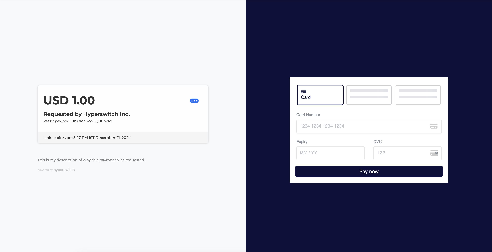<figcaption>Primary theme</figcaption></figure>

#### Merchant logo

A custom logo can be used in the details section of the payment links. This is a URL.

Example: https://hyperswitch.io/favicon.ico

<figure>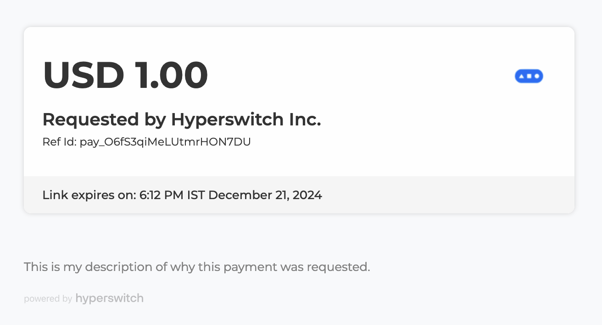<figcaption>Primary theme</figcaption></figure>

#### Merchant name

A custom display name that can be rendered in the details section of the payment links.

Example: HyperSwitch Inc.

<figure><figcaption>Custom seller name</figcaption></figure>

#### Dynamic details

A list of key-value pair for rendering details in the details section of payment links. This is an array of key-value pair. There is optional customization offered for each entry in the list.

Note: This list is rendered in the same order. `position` can be used to specify the position of the entry in the list.

Example: 
```
[
    {
        "key": "Business Country",
        "value": "Germany" 
    },
    {
        "key": "Policy Number",
        "value": "938478327648",
        "ui_configuration": {
            "is_key_bold": false,
            "is_value_bold": false,
            "position": 2
        }
    }
]
```


<figure>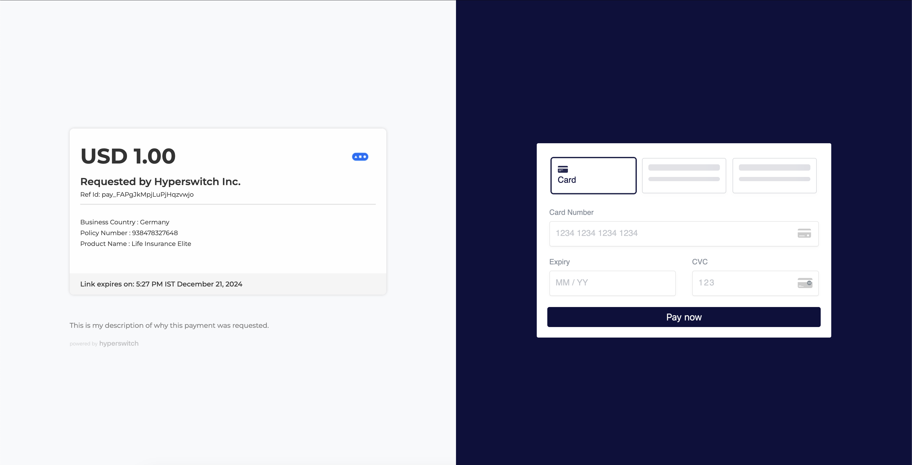<figcaption>Dynamic details</figcaption></figure>

#### Background image

This section offers options for configuring a custom background image in the details section.

Example: 
```
{
  "url": "https://img.freepik.com/free-photo/abstract-blue-geometric-shapes-background_24972-1841.jpg",
  "position": "bottom",
  "size": "cover"
}
```


`url` represents a link to the image which will be rendered in the background. This image can be positioned and sized using `position` and `size` in this config.

For available options, refer to API reference.

<figure>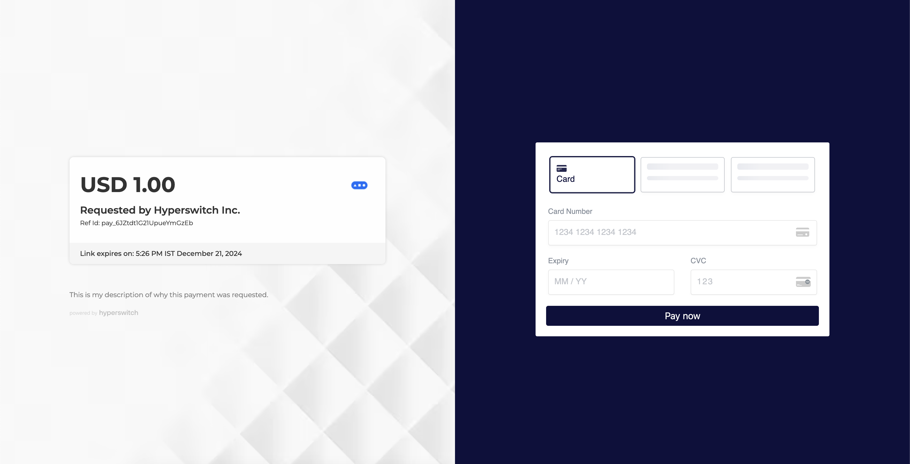<figcaption>Background image</figcaption></figure>

#### Details section layout

Configure layout for details section of the payment links. A layout can be selected from the below numbered options -

Example: layout2

<figure>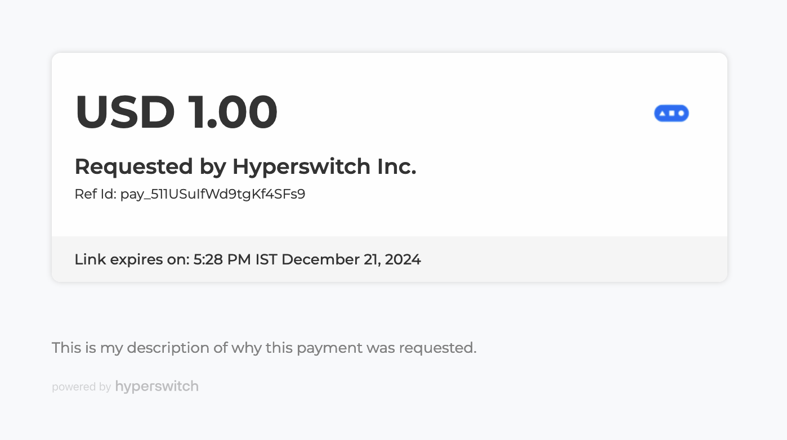<figcaption>Default layout</figcaption></figure>

<figure>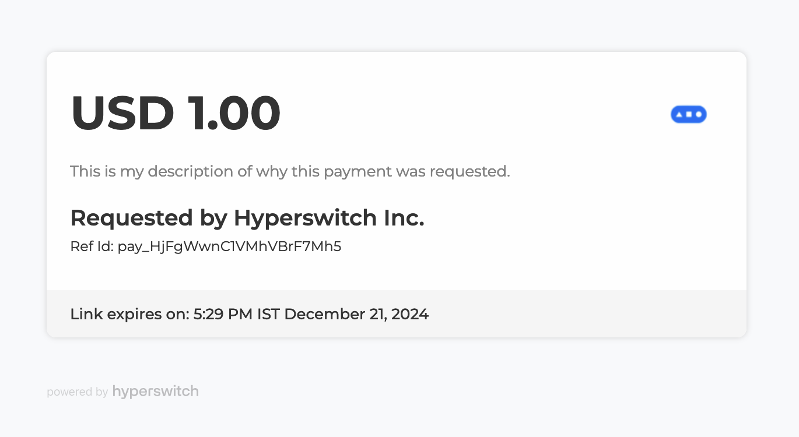<figcaption>Layout 2</figcaption></figure>

Please reach out to our [Support](https://join.slack.com/t/hyperswitch-io/shared\_invite/zt-1k6cz4lee-SAJzhz6bjmpp4jZCDOtOIg) for adding any custom layouts needed for this.

#### SDK layout

Configure layout for the payment widget of the payment links. For a list of available options, refer to this section - [SDK layouts](explore-hyperswitch/merchant-controls/integration-guide/web/customization.md#id-1.-layouts).

Example: accordion

<figure>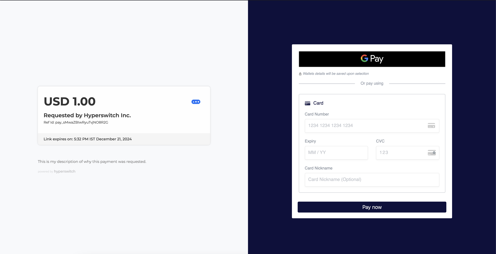<figcaption>SDK accordion layout</figcaption></figure>

#### Render only payment widget

A boolean value for rendering only the payment widget of the payment links. `false` by default.

<figure>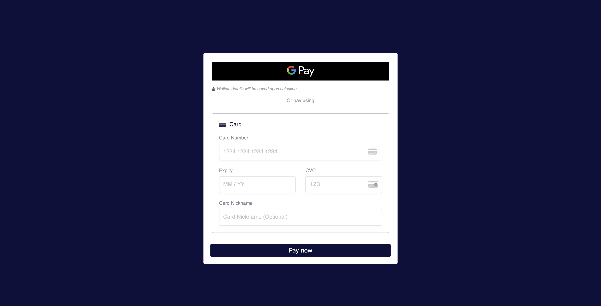<figcaption>Render only the payment widget</figcaption></figure>

#### Saved payment methods

A boolean value for rendering saved payment methods for a customer and also to render a checkbox for saving new payment methods in the payment widget. This can only be rendered in secure payment links.

<figure>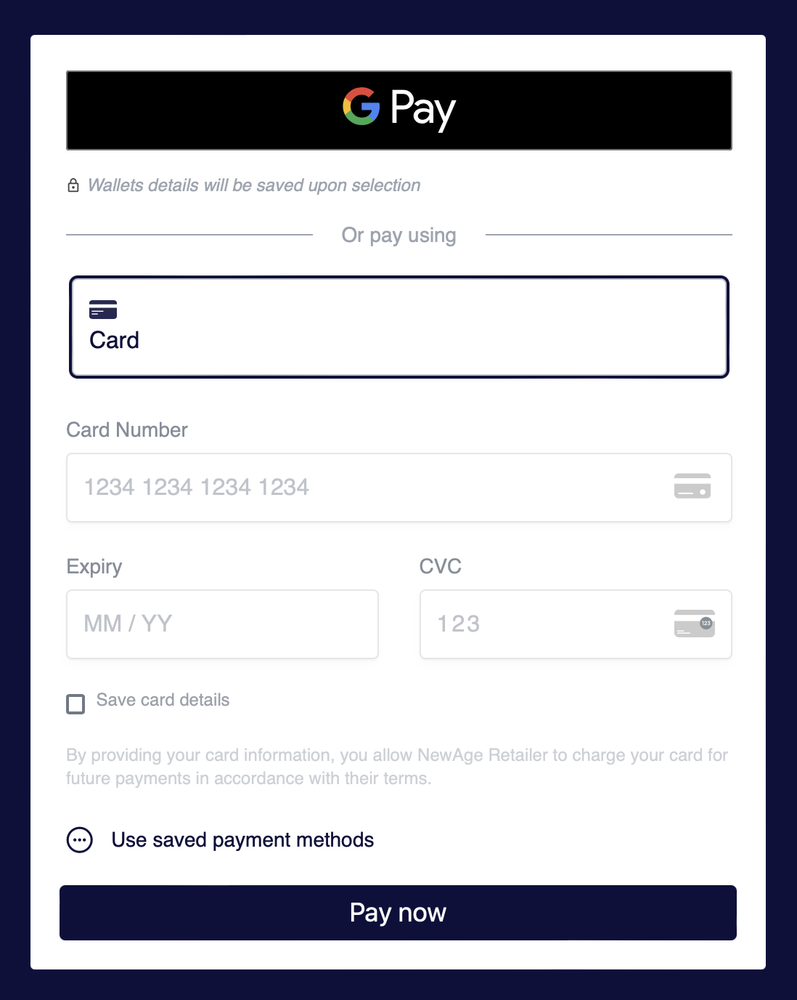<figcaption>Save payment method checkbox</figcaption></figure>

<figure>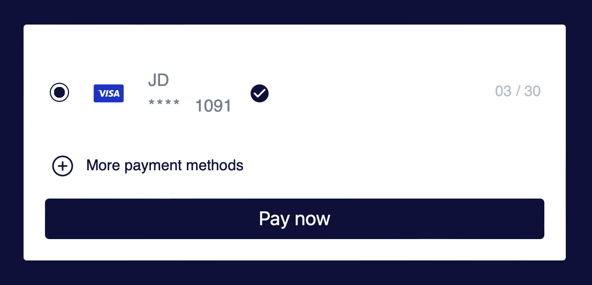<figcaption>Saved payment methods</figcaption></figure>

#### Hide card nickname input

A boolean value for toggling visibility of the card nickname input in the payment widget.

<figure>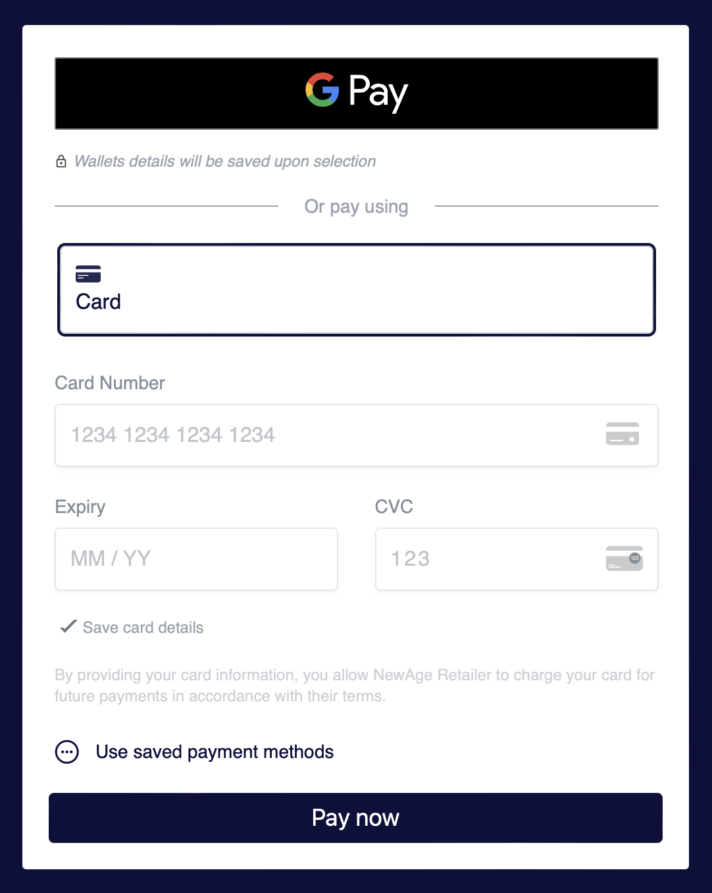<figcaption>Hidden card nickname field when card is requested to be saved</figcaption></figure>

<figure>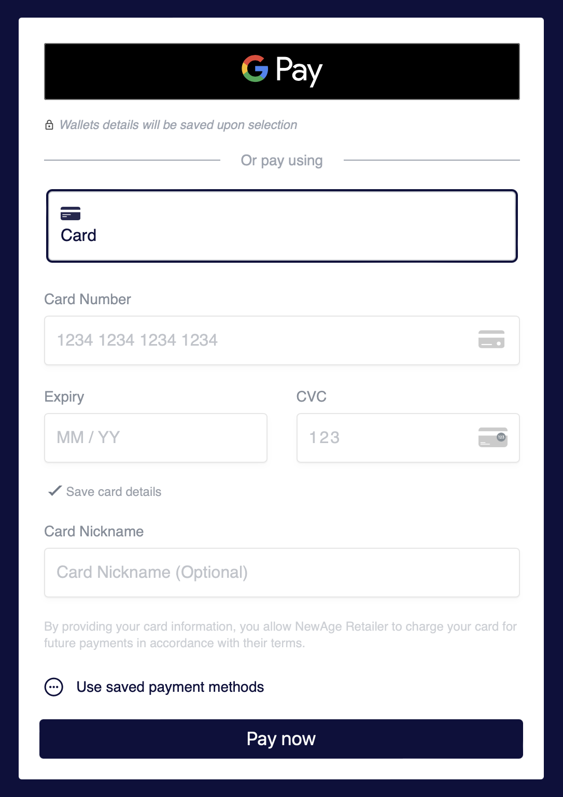<figcaption>Visible card nickname field when card is requested to be saved</figcaption></figure>

#### Show card form by default

A boolean value for controlling the first rendered form in the payment widget. Enabling this renders the form for card payment method when payment link is opened.

## Other configurations

These configurations can only be made at business profile level and cannot be overridden during payment links creation.


```
{
    domain_name: String, /// Custom domain name to be used for hosting the link
    business_specific_configs: HashMap<String, PaymentLinkConfigRequest>, /// List of UI configs for multi theme setup
    allowed_domains: HashSet<String>, /// A list of allowed domains (glob patterns) where secure links can be embedded in
    branding_visibility: bool, /// Toggle for HyperSwitch branding visibility
}
```


#### Domain name

A custom domain name that can be used for provisioning payment links.

Note: custom domains must be enabled before setting the custom domain name. Refer to this section for setting up custom domain names - [custom domain name for payment links](explore-hyperswitch/payment-flows-and-management/quickstart/payment-link/setup-custom-domain.md).

#### Multiple style IDs

This is for configuring multiple styles. This is a key value pair where key represents the style ID and value is the UI configurations which were mentioned above. These configs are set in profile and later consumed during payment link creation.

Example: 
```
{
    "style1": {
        "theme": "#3B845E",
        "logo": "https://hyperswitch.io/favicon.ico",
        "seller_name": "HyperSwitch Inc.",
        "display_sdk_only": true
    },
    "style2": {
        "theme": "#B202FF",
        "logo": "https://i.pinimg.com/736x/4d/83/5c/4d835ca8aafbbb15f84d07d926fda473.jpg",
        "seller_name": "Shopping Store",
        "enabled_saved_payment_method": true
    }
}
```


Style IDs are used during payment link creation, which can be specified using `payment_link_config_id` in the create request.

#### Allowed domains

This is a list of glob patterns which represents the domains where payment links can be embedded in an iframe. This is used only when secure links are used. More info on secure links [here](explore-hyperswitch/payment-flows-and-management/quickstart/payment-link/secure-payment-links.md).

Example: `["localhost:5500", "my.custom.domain.com"]`

#### Branding visibility

A boolean value for toggling the visibility of HyperSwitch branding in the payment links.

<figure>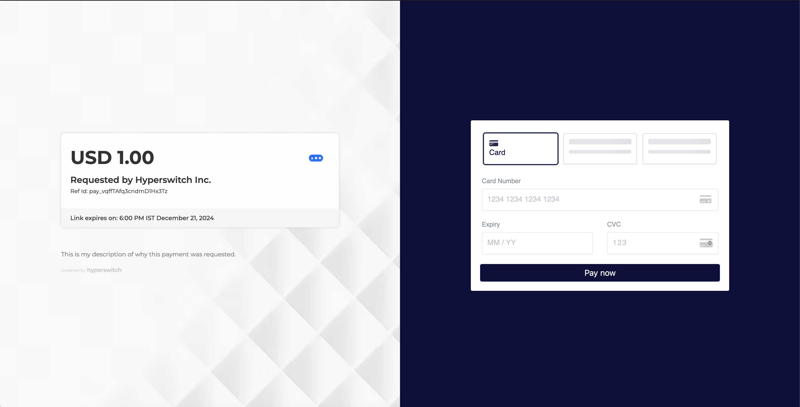<figcaption>Visible branding (default behaviour)</figcaption></figure>

<figure>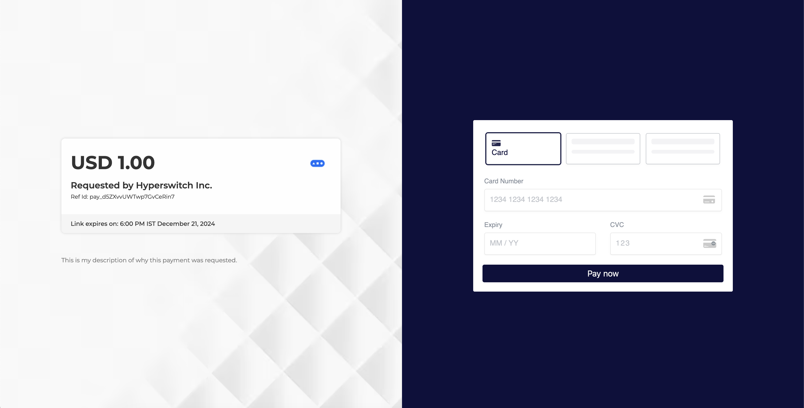<figcaption>Hidden branding</figcaption></figure>


# Configure Payment links in business profile

Payment link config can be configured at business profile level which will be used when creating payment links. Every payment is tied to a business profile, hence the same configs will be used for a given payment link.

Refer to API reference for updating business profile [here](https://api-reference.hyperswitch.io/api-reference/business-profile/business-profile--update#response-payment-link-config).


```
curl --location '{{BASE_URL}}/account/{{MERCHANT_ID}}/business_profile/{{PROFILE_ID}}' \
    --header 'Content-Type: application/json' \
    --header 'api-key: {{ADMIN_API_KEY}}' \
    '{
        "payment_link_config": {
            "theme": "#4E6ADD",
            "logo": "https://hyperswitch.io/favicon.ico",
            "seller_name": "HyperSwitch Inc.",
            "sdk_layout": "accordion",
            "display_sdk_only": true,
            "enabled_saved_payment_method": true,
            "hide_card_nickname_field": true,
            "show_card_form_by_default": true,
            "transaction_details": [
                {
                    "key": "Policy Number",
                    "value": "297472368473924",
                    "ui_configuration": {
                        "position": 5,
                        "is_key_bold": true,
                        "is_value_bold": true
                    }
                }
            ],
            "business_specific_configs": {
                "style1": {
                    "theme": "#3B845E",
                    "logo": "https://hyperswitch.io/favicon.ico",
                    "seller_name": "HyperSwitch Inc.",
                    "display_sdk_only": true
                },
                "style2": {
                    "theme": "#B202FF",
                    "logo": "https://i.pinimg.com/736x/4d/83/5c/4d835ca8aafbbb15f84d07d926fda473.jpg",
                    "seller_name": "Shopping Store",
                    "enabled_saved_payment_method": true
                }
            },
            "allowed_domains": [
                "localhost:5500"
            ],
            "domain_name": "my.custom.domain.com",
            "branding_visibility": false
        }
    }'
```


## Next step:


[Create Payment links](./create.md)

