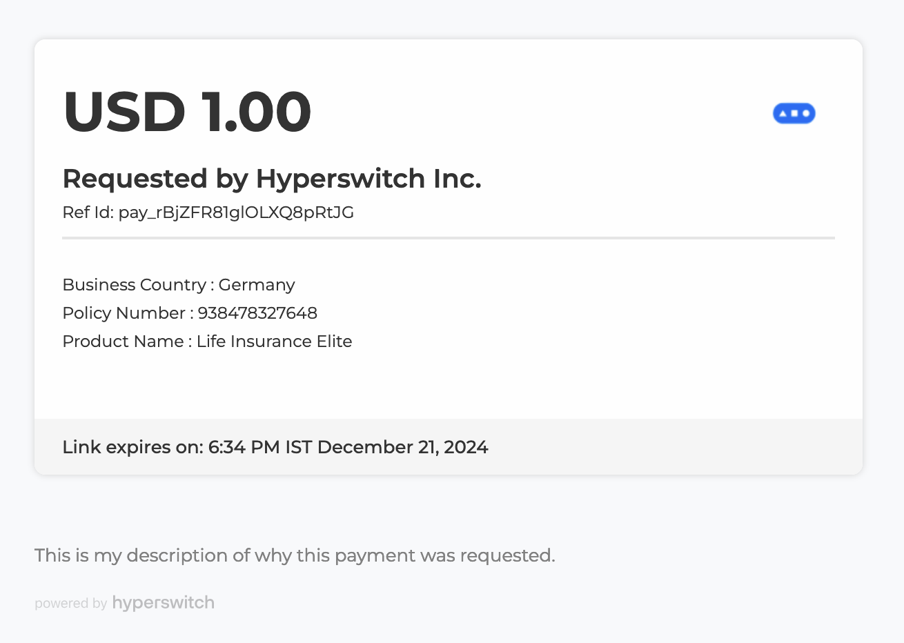
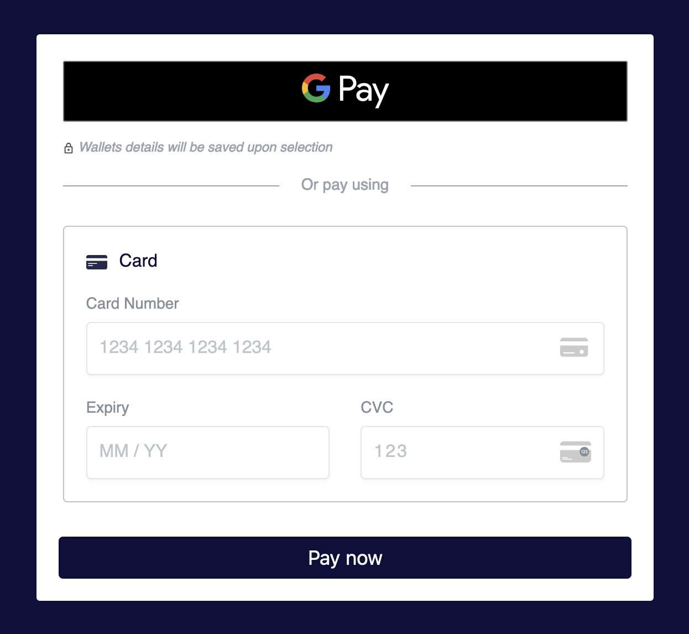

> **Note:** Payment Links can currently only be configured via APIs. Configuration through the HyperSwitch dashboard is under development, and this section will be updated once it is available.

# Available configurations

## UI configurations

Payment link UI can be configured at a business profile level and the same configuration will be used when payment links are created for that profile. This UI can be configured during payment links creation as well, doing this overrides any configuration that was set in the business profile.


```
{
    theme: String, /// Primary color for the payment link
    logo: String, /// Logo displayed in the details section
    seller_name: String, /// Merchant's name in the details section
    transaction_details: Vec<PaymentLinkTransactionDetails>, /// Dynamic details related to merchant to be rendered in details section
    background_image: PaymentLinkBackgroundImageConfig, /// Configurations for the background image for details section
    details_layout: api_enums::PaymentLinkDetailsLayout, /// Custom layout for details section
    sdk_layout: String, /// Custom layout for the payment widget
    display_sdk_only: bool, /// Display only the payment widget
    enabled_saved_payment_method: bool, /// Render option to save the payment method for payment widget (works only in secure payment links)
    hide_card_nickname_field: bool, /// Hide card nickname field in payment widget
    show_card_form_by_default: bool, /// Show card form by default in payment widget
    payment_button_text: String, /// Custom text to be rendered on the SDK pay button
}
```


### Primary color

The primary color of the payment link UI can be set using the `theme` field in the configuration. This color is represented as a hex value.

Example: **#2167AE**

<figure><figcaption>Primary theme</figcaption></figure>

### Merchant logo

You can display a custom logo in the details section of the payment links by providing a URL.

Example: https://hyperswitch.io/favicon.ico

<figure><figcaption>Primary theme</figcaption></figure>

### Merchant name

Customize the display name shown in the details section of the payment links.

Example: **HyperSwitch Inc.**

<figure><figcaption>Custom seller name</figcaption></figure>

### Dynamic details

Include a list of key-value pairs in the details section of payment links. This list can be customized with optional configurations for each entry.

> **Note:** The list is displayed in the specified order. Use the position attribute to control the sequence of entries.

Example: 
```
[
    {
        "key": "Business Country",
        "value": "Germany" 
    },
    {
        "key": "Policy Number",
        "value": "938478327648",
        "ui_configuration": {
            "is_key_bold": false,
            "is_value_bold": false,
            "position": 2
        }
    },
    {
        "key": "Product Name",
        "value": "Life Insurance Elite"
    }
]
```


<figure><figcaption>Dynamic details</figcaption></figure>

### Background image

Customize the details section with a background image.

Example: 
```
{
  "url": "https://img.freepik.com/free-photo/abstract-blue-geometric-shapes-background_24972-1841.jpg",
  "position": "bottom",
  "size": "cover"
}
```


The url specifies the image source, while position and size define its placement and scaling.

For available options, refer to the API reference **[here](https://api-reference.hyperswitch.io/api-reference/payments/payments--create#body-payment-link-config-background-image)**.

<figure><figcaption>Background image</figcaption></figure>

### Details section layout

Choose a layout for the details section of the payment links.

<figure><figcaption>Default layout</figcaption></figure>

<figure><figcaption>Layout 2</figcaption></figure>

Please reach out to our **[Support](https://join.slack.com/t/hyperswitch-io/shared_invite/zt-2wpd0of0y-j61LQxcOsUEAeNMgFnSmxg)** for adding any custom layouts needed for this.

### SDK layout

Configure layout for the payment widget of the payment links. For a list of available options, refer to this section - **[SDK layouts](explore-hyperswitch/merchant-controls/integration-guide/web/customization.md#id-1.-layouts)**.

<figure><figcaption>Accordion layout</figcaption></figure>

### Render only payment widget

Set a boolean value to render only the payment widget in the payment links. Defaults to false.

<figure><figcaption>Render only the payment widget</figcaption></figure>

### Saved payment methods

Enable rendering of saved payment methods and allow customers to save new ones in the payment widget. This is available only for secure payment links.

<figure><figcaption>Save payment method checkbox</figcaption></figure>

<figure><figcaption>Saved payment methods</figcaption></figure>

### Hide card nickname input

Toggle the visibility of the card nickname input field in the payment widget.

<figure><figcaption>Hidden card nickname field when card is requested to be saved</figcaption></figure>

<figure><figcaption>Visible card nickname field when card is requested to be saved</figcaption></figure>

### Show card form by default

Set a boolean value to control the default form rendered in the payment widget. Enabling this shows the card payment form by default when a payment link is opened.

### Payment button text

Customize the text displayed on the "Pay Now" button in the payment widget.

<figure><figcaption>Custom text for payment widget's button</figcaption></figure>

## Other configurations

These configurations can only be made at business profile level and cannot be overridden during payment links creation.


```
{
    domain_name: String, /// Custom domain name to be used for hosting the link
    business_specific_configs: HashMap<String, PaymentLinkConfigRequest>, /// List of UI configs for multi theme setup
    allowed_domains: HashSet<String>, /// A list of allowed domains (glob patterns) where secure links can be embedded in
    branding_visibility: bool, /// Toggle for HyperSwitch branding visibility
}
```


### Domain name

A custom domain for hosting payment links.

> **Note:** custom domains must be enabled before setting the custom domain name. Refer to this section for setting up custom domain names - [custom domain name for payment links](explore-hyperswitch/payment-flows-and-management/quickstart/payment-link/setup-custom-domain.md).

### Multiple style IDs

This is for configuring multiple styles. This is a key value pair where key represents the style ID and value is the UI configurations which were mentioned above.

Example: 
```
{
    "style1": {
        "theme": "#3B845E",
        "logo": "https://hyperswitch.io/favicon.ico",
        "seller_name": "HyperSwitch Inc.",
        "display_sdk_only": true
    },
    "style2": {
        "theme": "#B202FF",
        "logo": "https://i.pinimg.com/736x/4d/83/5c/4d835ca8aafbbb15f84d07d926fda473.jpg",
        "seller_name": "Shopping Store",
        "enabled_saved_payment_method": true
    }
}
```


Style IDs are used during payment link creation, which can be specified using `payment_link_config_id` in the create request.

### Allowed domains

This is a list of trusted domains where payment links can be embedded in an iframe. This is used only for secure payment links. More info on secure links [here](explore-hyperswitch/payment-flows-and-management/quickstart/payment-link/secure-payment-links.md).

Example: `["localhost:5500", "my.custom.domain.com"]`

### Branding visibility

A boolean value for toggling the visibility of HyperSwitch branding in the payment links.

<figure><figcaption>Visible branding (default behaviour)</figcaption></figure>

<figure><figcaption>Hidden branding</figcaption></figure>


# Configure Payment links in business profile

Use the API to configure payment link settings at the business profile level. These settings are automatically applied to any payment link created for the associated profile.

Refer to API reference for updating business profile [here](https://api-reference.hyperswitch.io/api-reference/business-profile/business-profile--update#response-payment-link-config).


```
curl --location '{{BASE_URL}}/account/{{MERCHANT_ID}}/business_profile/{{PROFILE_ID}}' \
    --header 'Content-Type: application/json' \
    --header 'api-key: {{ADMIN_API_KEY}}' \
    '{
        "payment_link_config": {
            "theme": "#4E6ADD",
            "logo": "https://hyperswitch.io/favicon.ico",
            "seller_name": "HyperSwitch Inc.",
            "sdk_layout": "accordion",
            "display_sdk_only": true,
            "enabled_saved_payment_method": true,
            "hide_card_nickname_field": true,
            "show_card_form_by_default": true,
            "payment_button_text": "Proceed to Payment!",
            "transaction_details": [
                {
                    "key": "Policy Number",
                    "value": "297472368473924",
                    "ui_configuration": {
                        "position": 5,
                        "is_key_bold": true,
                        "is_value_bold": true
                    }
                }
            ],
            "business_specific_configs": {
                "style1": {
                    "theme": "#3B845E",
                    "logo": "https://hyperswitch.io/favicon.ico",
                    "seller_name": "HyperSwitch Inc.",
                    "display_sdk_only": true
                },
                "style2": {
                    "theme": "#B202FF",
                    "logo": "https://i.pinimg.com/736x/4d/83/5c/4d835ca8aafbbb15f84d07d926fda473.jpg",
                    "seller_name": "Shopping Store",
                    "enabled_saved_payment_method": true
                }
            },
            "allowed_domains": [
                "localhost:5500"
            ],
            "domain_name": "my.custom.domain.com",
            "branding_visibility": false
        }
    }'
```


# List of defaults for the payment link UI config


```
{
    theme: "#212E46",
    logo: "https://live.hyperswitch.io/payment-link-assets/Merchant_placeholder.png",
    seller_name: "merchant_name", /// merchant name configured during account creation with HyperSwitch,
    transaction_details: null,
    background_image: null,
    details_layout: "layout1",
    sdk_layout: "tabs",
    display_sdk_only: false,
    enabled_saved_payment_method: false,
    hide_card_nickname_field: false,
    show_card_form_by_default: true,
    payment_button_text: "Pay Now", /// This text is available in the requested locale
}
```


## Next step:


[Create Payment links](./create.md)

