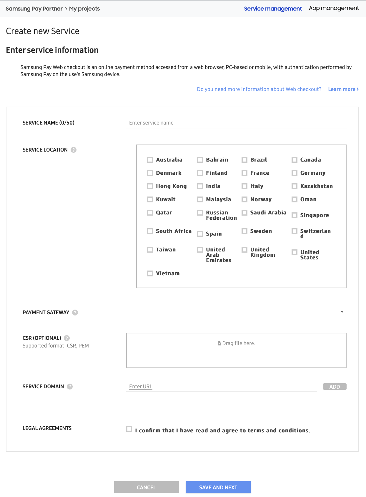
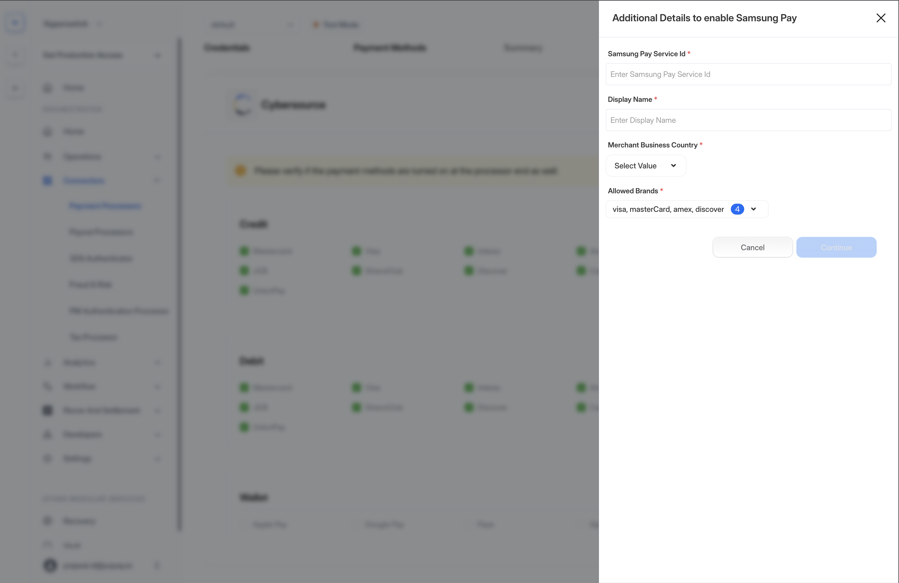

# Samsung Pay

Samsung Pay is a secure and convenient payment solution that allows customers to make payments using their Samsung devices. By adding credit, debit, or loyalty cards to the Samsung Pay app, users can complete transactions with a tap on NFC-enabled terminals or even on older magnetic stripe terminals using MST (Magnetic Secure Transmission) technology.

Available in countries like the US, Canada, China (Transit only), Spain, UK, Singapore, Australia, Brazil, Russia, Malaysia, UAE, Sweden, Switzerland, Italy, and South Africa, Samsung Pay offers a seamless experience. It also includes multiple layers of security, such as tokenization and biometric authentication, making it a highly secure payment option.

Samsung Pay works only on supported Samsung devices. You can find the list of supported devices [here](https://www.samsung.com/my/samsung-pay/supported-devices/?srsltid=AfmBOoos-CYJiqjZ6eAFWxdZqQt81Np6hITzwZzYvbm0npr3ZmBbFSvZ)

## **Prerequisites**

Samsung Pay requires an Samsung Developer Account. You can [Sign Up](https://developer.samsung.com/pay/native/partner-onbarding.html#Sign-up%2FSign-in) following this.

_Please feel free to reach out to Hyperswitch support if you are stuck at any stage when integrating and testing Samsung Pay._

## **Create Samsung pay Web Online Payment Service**

To create a new service, follow the steps below:

1. Go to My Projects > Service Management, then click `CREATE NEW SERVICE`.

<figure><figcaption></figcaption></figure>

2. Enter the new `SERVICE NAME`.
3. Select your `SERVICE COUNTRY`.
4. Choose your `PAYMENT GATEWAY` from the list of supported payment gateways.
5. Upload the .csr file you received from your processor.
6. In the `SERVICE DOMAIN` field, enter your merchant_domain and click the `ADD` button. If there are multiple merchant domains, add them one after the other.
7. Verify the details you've entered, check the `LEGAL AGREEMENTS` box, and click `SAVE AND NEXT`.

## **Configuring Samsung Pay on Hyperswitch**

To configure Samsung Pay on Hyperswitch, follow the steps below -

1. Log in to [Hyperswitch dashboard](https://app.hyperswitch.io/)
2. In the Connectors tab, select your processor
3. Under Payment Methods, click on Samsung Pay in the Wallet section.
4. Login to your [Samsung Pay Developer account](https://pay.samsung.com/developer) go to My Projects > Service management, and click on the service you would like to configure.
5. Copy the `SERVICE ID` and configure it as the `Samsung Pay Service Id` on Hyperswitch dashboard.

<figure><figcaption></figcaption></figure>

6. The `Display Name` should be your merchant name, which you want to present to customers when they make a Samsung Pay payment on your platform.
7. Select your business country
8. Select the card brands you want to allow customer to use when making Samsung Pay payments.

 Make sure that the Samsung Pay service is in the `Approved` state before configuring it on the Hyperswitch dashboard. If it is not, the Samsung Pay button will not be displayed during the payment process. 
