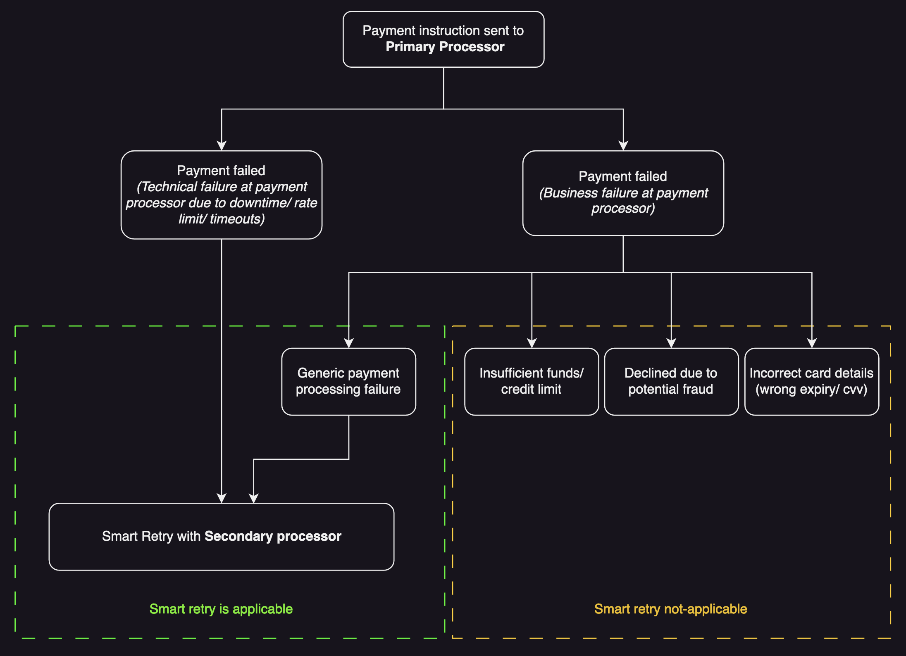

# Smart Retries

Smart retry is a Hyperswitch feature to improve the payment success rates in a multi-processor setup. If the payment fails through the primary processor due to specific reasons, the payment will be retried with an alternative payment processor to increase the chances of making the payment successful.

There are two possible types of payment retry flows:

**Smart Retries:** These retries are applicable where a user action is not required (after entering the card information) to complete a payment. Below are some example scenarios:

* Scenario 1: If the payment is a non-3DS card transaction and the payment is declined by the primary processor due to technical or business failures, it will be retried.
* Scenario 2: If the payment is a _3DS card transaction_ and the payment is declined by the primary processor due to a _technical failure_, the payment _will be retried_.
* Scenario 3: If the payment is a _3DS card transaction_ and the payment is declined by the primary processor due to a _business failure_, the payment _will not be retried_.

**User Consent-based Retries:** These retries are applicable for payment flows that need an additional level of user authentication (example: Apple Pay, Google Pay, 3DS cards, bank transfers).Such payment flows need an additional authentication from the user. Hence smart retries are not possible for such scenarios.

**Note:** Currently, Hyperswitch supports Smart retries as an out-of-the-box capability. In order to enable user consent based retry for payment failures, you can create a fresh payment and re-trigger the Hyperswitch checkout.

## Supported Payment processors

Hyperswitch supports the following primary processors for automatic retries.

* Adyen
* Stripe
* Bluesnap
* Checkout.com
* Deutsche Bank
* Fiuu
* Novalnet
* Trustpay
* Worldpay

In case you wish more primary processors to be covered for automatic retry, please submit a feature request [here](https://github.com/juspay/hyperswitch/discussions/new?category=ideas-feature-requests).

## How does it work?

Smart retry will be attempted whenever the payment fails through the Primary Processor for card transactions.

Primary processor is a first choice of payment processor for the particular transaction. This is evaluated based on the smart routing rules configured in the Hyperswitch dashboard’s routing module.

The flow looks like below.

<figure><figcaption></figcaption></figure>

## How to enable Smart Retries?

**Step 1:** Ensure that you have enabled the pecking order of payment processors on the Hyperswitch dashboard. You can access the settings from Routing > Default fallback > Manage.

<figure><figcaption></figcaption></figure>

**Step 2:** Drop a request to hyperswitch@juspay.in with the below information.

* Confirmation to enable automatic retry
* Maximum number of payment retry attempts (It is recommended to start with 1 retry attempt. However we can support more retry attempts based on the number of processors)

## FAQs

### What is a primary processor?

Primary processor is the first choice of processor for the particular transaction to be processed. This is evaluated based on the smart routing rules configured in the Hyperswitch dashboard’s routing module.

### Why can I not enable Automatic Retry from the Hyperswitch dashboard?

For reconciliation purposes, some merchants prefer having the same payment\_id being passed to both Hyperswitch and the Payment Processors. Smart retry would not be feasible if such a use case exists. Hence, Smart retry is as an additional configuration that can be enabled only by contacting our support (hyperswitch@juspay.in).

Since Smart retry involves multiple payment attempts for a single payment\_id, Hyperswitch appends the attempt number to the payment\_id that the merchant sends to Hyperswitch before passing it on to the processors.

For example, if the merchant had sent pay\_abcd145efg, then Hyperswitch will send the following payment\_id to the processors during each attempt:

* Payment attempt 1: pay\_abcd145efg\_1
* Payment attempt 2: pay\_abcd145efg\_2
* Payment attempt 3: pay\_abcd145efg\_3

### What will the user experience look like during Smart Retry?

The user experience will not be different from a regular checkout experience, since all retry attempts will happen silently in the background. However, there is a possibility of the user receiving multiple payment attempt notifications / sms from the card issuing bank due to the card payment being attempted for more than once.

### What is the difference between fallback and smart retry?

Fallback is a pecking order of all the configured processors which is used to route traffic standalone or when other smart routing rules are not applicable for the particular transaction. You can reorder the list with simple drag and drop from the Routing > Default fallback > Manage section in the dashboard.

Smart retry is a feature to improve the chances of success of a payment by silently retrying with an alternative processor.
