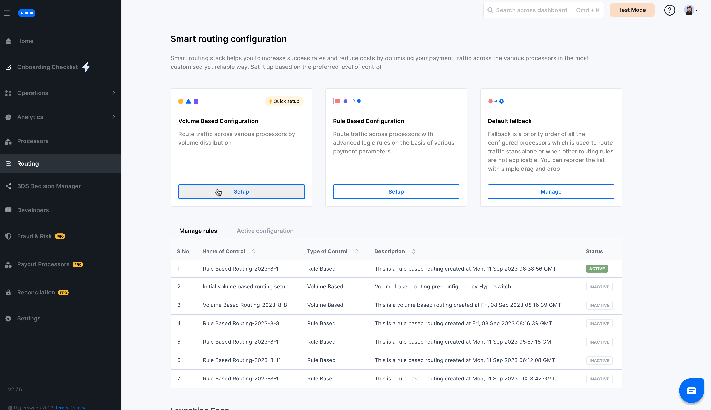
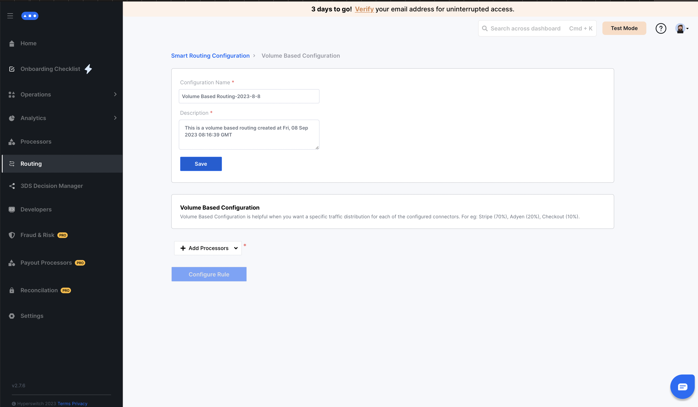
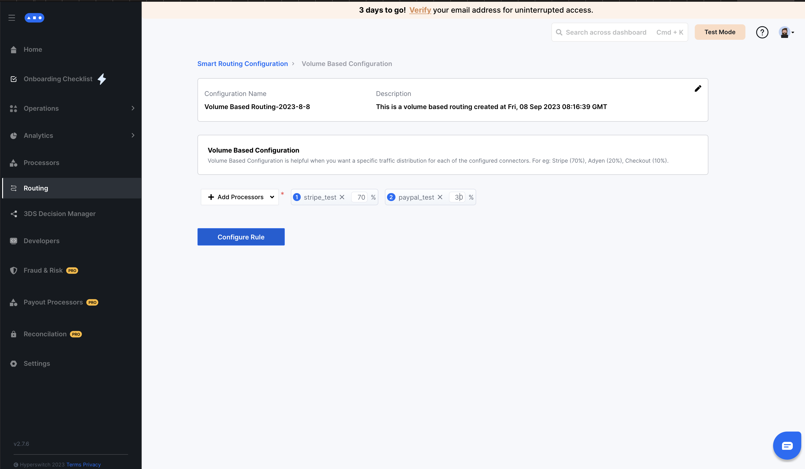
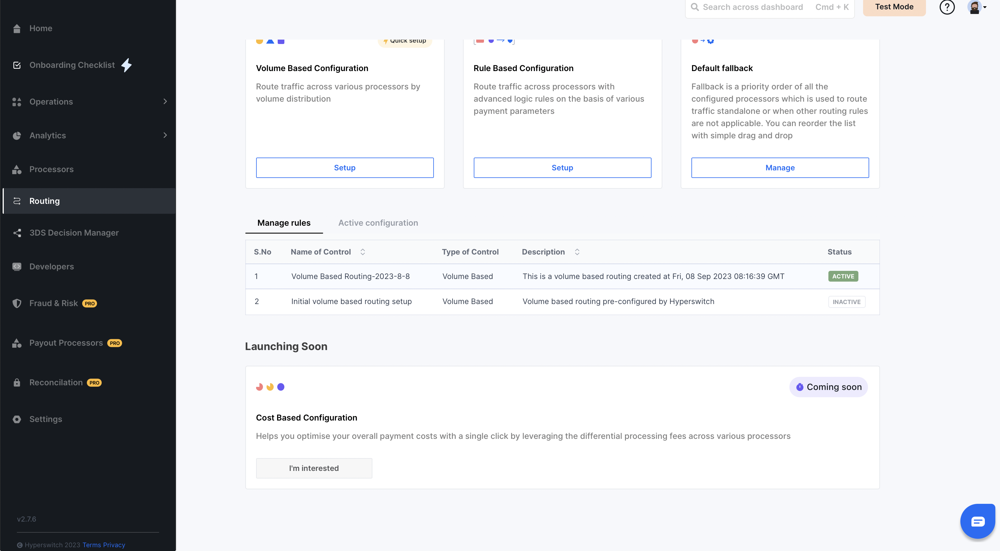

# Volume Based Routing


This section will guide you on how to setup Volume based routing using the Hyperswitch Control Center




## Steps to configure Volume Based Configuration in Smart Router:

_**Step 1:**_ Click on `Setup` for Volume Based Configuration

<figure><figcaption></figcaption></figure>

_**Step 2:**_ Save the name and description

<figure><figcaption></figcaption></figure>

_**Step 3:**_ Configure your desired Volume distribution among multiple payment processors using percentages

<figure><figcaption></figcaption></figure>

_**Step 4:**_ In the popup, select the appropriate action based on whether you want to simply `save the rule`, or `save and also activate` it for all payments henceforth

<figure><figcaption></figcaption></figure>

_**Step 5:**_ You can view your active routing algorithm as well as all previously configured algorithms on the [Hyperswitch Dashboard](https://app.hyperswitch.io/routing)

<figure><figcaption></figcaption></figure>

