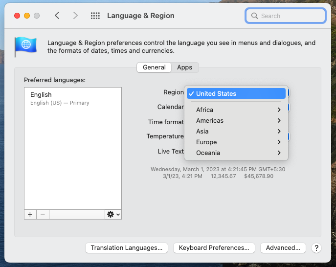

# Test Credentials


This section gives you an overview of how to you can make test transactions for the payment methods you have enabled


## Testing Cards across different Connectors

You might have configured multiple connectors on the Hyperswitch Dashboard. If you wish to ensure sanity of connector configuration, you can target and test the particular connector.

**Step 1**: Log on to Hyperswitch Dashboard

**Step 2**: Goto Smart Router > Simple Configuration

**Step 3**: Add all the Gateways you wish to test and set highest priority to your target Gateway

**Step 4**: Go to Home > Preview Checkout, to open the Unified Checkout (this will be a refelection of payment experience which your customer will get)

**Step 5**: Enter card details as per the table below. Please note that test credentials varies across each connector.

### Test Cards for popular connectors

Simulate a successful test card payment with the following credentials

| Connector       | Card Number      | MM/YY | CVV | Reference - More Test Credentials                                                                           |
| --------------- | ---------------- | ----- | --- | ----------------------------------------------------------------------------------------------------------- |
| Adyen           | 4000020000000000 | 03/30 | 737 | [Click here](https://docs.adyen.com/development-resources/testing/test-card-numbers)                        |
| Bluesnap        | 6011000180331112 | 02/26 | 123 | [Click here](https://developers.bluesnap.com/reference/test-credit-cards)                                   |
| Authorize.net   | 4242424242424242 | 12/25 | 100 | [Click here](https://developer.authorize.net/hello_world/testing_guide.html)                                |
| Braintree       | 4111111111111111 | 12/25 | 100 | [Click here](https://developer.paypal.com/braintree/docs/reference/general/testing/php#credit-card-numbers) |
| Checkout        | 4242424242424242 | 12/25 | 100 | [Click here](https://www.checkout.com/docs/testing/test-cards)                                              |
| Fiserv          | 4005550000000019 | 02/35 | 123 | -                                                                                                           |
| Global Payments | 4263970000005262 | 12/25 | 100 | [Click here](https://developer.globalpay.com/resources/test-card-numbers)                                   |
| Nuvei           | 4444333322221111 | 12/25 | 123 | [Click here](https://helpdesk.nuvei.com/doku.php?id=developer:integration_docs:testing-guide)               |
| Stripe          | 4242424242424242 | 12/25 | 100 | [Click here](https://stripe.com/docs/testing#cards)                                                         |
| Worldline       | 4012000033330026 | 12/25 | 123 | [Click here](https://epayments.developer-ingenico.com/documentation/testcases/detail/visa)                  |

**Dummy Connector test cards**

* Different flows are available for dummy connector transactions, determined by the card number.
* For dummy connector cards, both the expiration date and CVV can be any future date and three-digit number, respectively.
* Dummy connectors only support payments and refunds.
* Payments made with dummy connectors expire after 2 days. Refunds will not be possible for expired payments.

**Non 3DS flows**

* Success
  * 4111111111111111
  * 4242424242424242
  * 5555555555554444
  * 38000000000006
  * 378282246310005
  * 6011111111111117
* Card declined
  * 5105105105105100
  * 4000000000000002
* Insufficient funds
  * 4000000000009995
* Lost card
  * 4000000000009987
* Stolen card
  * 4000000000009979

**3DS flows**

* Success
  * 4000003800000446

### Payment Methods Testing

In order to test payment methods like Klarna, Googlepay - follow the below instructions

#### Klarna - Direct integration test credentials

Simulate a successful payment with the following credentials

**United States**

```
Phone number: +1310668331
OTP: 123456 (Random 6-digit different from 999999)
```

**United Kingdom**

```
Phone number: +4408082580300
OTP: 123456 (Random 6-digit different from 999999)
```

For testing mmore scenarios, please refer [Klarna - Sample customer data](https://docs.klarna.com/resources/test-environment/sample-customer-data/)

#### Googlepay - Test credentials

Inorder to test Googlepay, you will have to use your Gmail account and join [Google's test user group](https://groups.google.com/g/googlepay-test-mode-stub-data).

You will land on Google's page which says "Congratulations! You now have access to our test suite! No further action is required."

Ensure that you are logged in to your Gmail account, hit the Googlepay option. You will automatically get all test cards on your user journey.

#### ApplePay - Test credentials

In order to test ApplePay, you will need to follow these steps written in [ApplePay sandbox tesing docs](https://developer.apple.com/apple-pay/sandbox-testing/).

Apple Pay provides test cards from various card companies and supported regions as well. To pay you can use TouchID on the Macbook or your iPhone. These devices should be configured in your apple account.

**Unable to test Applepay successfully?**

1. Applepay sandbox testing is supported only if you are located in any of these [15 countries](https://developer.apple.com/apple-pay/sandbox-testing/).
2. Your Safari browser automatically detects your location from your System Preferences.
3. If you are not located in the supported countried, but still wish to test Applepay, please change your Region using Mac System preferences > Language & Region > choose any of the 15 supported countries.&#x20;

<figure><figcaption></figcaption></figure>
