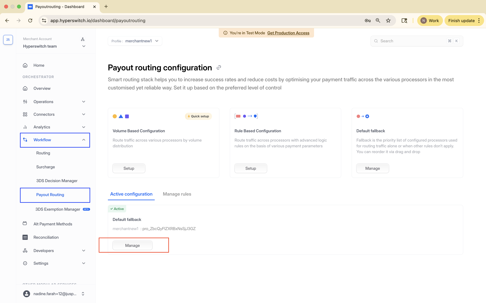

# Least Cost Routing

## Get started with Least Cost Routing

Least Cost Routing (LCR) enables merchants to minimize transaction costs by dynamically selecting the most cost-efficient debit network for each transaction. The Hyperswitch routing engine evaluates parameters like network fees, interchange rates, ticket size, issuer type, and more to automatically route transactions through the cheapest network in real time.

## Pre-requisites for enabling Least Cost Routing

To get started with LCR in Hyperswitch, ensure the following setup is complete:

_**Step 1:**_ Configure [connectors](least-cost-routing.md#connectors) supporting transactions through local networks&#x20;

_**Step 2:**_ Enable Debit Card Support

_**Step 3:**_ Enable one or more [local debit networks](least-cost-routing.md#networks) in both connector and Hyperswitch dashboards\

## Steps to configure Least Cost Routing in Smart Router:

_**Step 1:**_ Configure Prerequisites \
Ensure that connectors supporting transactions through local networks are set up with local networks enabled

_**Step 2:**_ Navigate to `Workflow` -> `Payout Routing`.  Under `Active configuration` Click on `Manage` for configuring Least Cost Routing:

<figure><figcaption></figcaption></figure>

_**Step 3:**_ A popup will guide you to confirm the three prerequisites (connector setup, debit card enablement, local networks configuration). Click on `Enable`  to activate LCR

<figure><figcaption></figcaption></figure>

_**Step 4:**_ Once enabled, you can view Least Cost Routing as your active routing algorithm along with all previously configured algorithms on the [Hyperswitch Dashboard](https://app.hyperswitch.io/routing)

<figure><figcaption></figcaption></figure>

## Supported Configuration for Least Cost Routing

#### Geographies:&#x20;

* US

#### Connectors:

* Adyen

#### Networks

* Star
* Pulse
* NYCE
* Accel

#### Payment Methods

* Cards

#### Payment Flows

* Payments (No-3DS)
* Refunds
* Retries

## Future Scope

Hyperswitch is continuously evolving its Least Cost Routing capabilities. Here’s what’s coming next:-&#x20;

#### **Configurable Debit Routing Rule Engine**

Define your own custom routing logic for debit transactions based on attributes like issuer, amount, geography, and more — giving you deeper control over cost optimization\
\
**Support for More Connectors and Payment Methods**

Expansion beyond Adyen to additional processors, as well as broader support for payment methods beyond card-based flows (like wallets etc.)\
\
**Integration with Your BIN Data Source**

Plug in your proprietary or third-party BIN data to enhance network identification, especially for wallet-based payments and custom routing needs.

\
