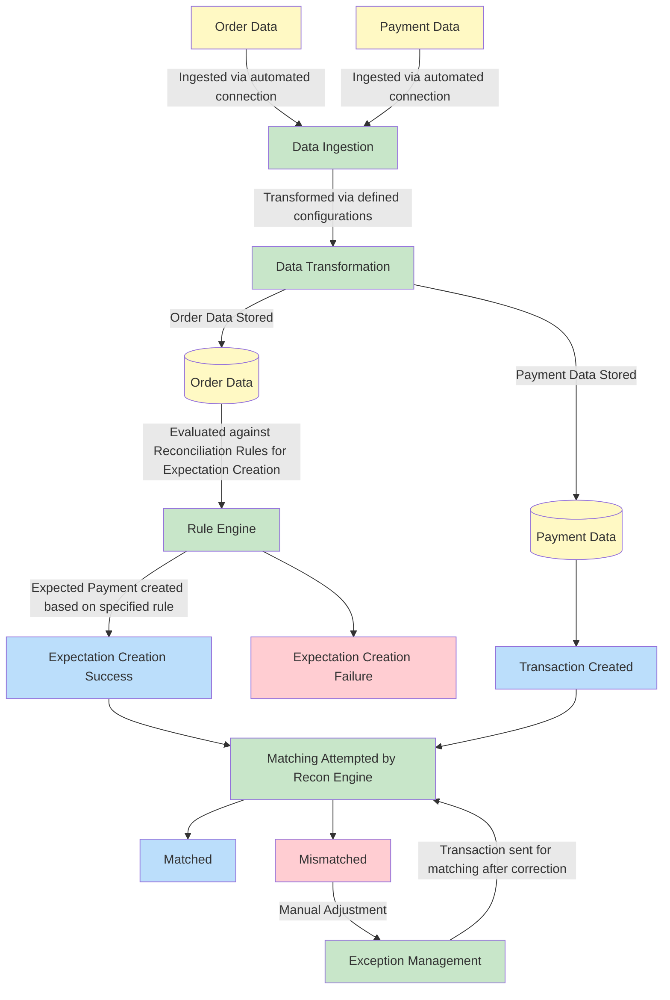

# Example: E Commerce

#### E-commerce Three-Way Reconciliation

Three-way reconciliation is the process of verifying the flow of money across three independent systems to ensure financial accuracy. For a typical e-commerce business, this involves reconciling data from:

* **Order Management System (OMS)**: Your system of record for customer orders and fulfillment
* **Payment Service Provider (PSP)**: The service that processes payments and handles settlements
* **Bank**: Your financial institution where actual cash deposits are made

We solve this complex problem by breaking it down into two interconnected reconciliation processes: **Order → PSP** and **PSP → Bank**. This approach ensures every step of the payment journey is tracked and validated.

### The Reconciliation Flow: A Step-by-Step Guide

The reconciliation engine follows a structured process to automatically match and validate transactions across all three systems.

#### **Step 1: Account Setup**

First, we establish the accounts that represent the source and destination of funds in your ledger. This ensures that every transaction is categorized correctly from the start.

**Account Structure:**

* **Orders Account (Credit type)**: Tracks customer order values and is the source of funds for the entire flow
* **PSP Settlement Account (Debit type)**: An asset account that tracks the funds being held by your payment processor before they are deposited
* **Bank Account (Debit type)**: An asset account that tracks the actual cash received in your bank

**Configuration:**

* `Orders Account`: `account_type: Credit, currency: USD`
* `PSP Settlement Account`: `account_type: Debit, currency: USD`
* `Bank Account`: `account_type: Debit, currency: USD`

#### **Step 2: Reconciliation Rules Configuration**

The core of our reconciliation engine is the rule-based architecture. Rules define exactly how transactions should be matched and what conditions must be met for a successful reconciliation.

**Rule 1: Order-to-PSP Matching**

* **Purpose**: Match customer orders from your OMS with the corresponding payments recorded by your PSP.
* **Rule Settings**:
  * **Name**: "Order to PSP Reconciliation"
  * **Priority**: `1` (This rule is evaluated first)
  * **When to Apply (Filter)**: Transaction type equals "customer\_order"
  * **How to Find Match (Identifier)**: Use `order_id` to find the PSP transaction with the same `original_reference`
  * **What to Verify (Match Rules)**:
    * `Order amount = PSP gross amount`
    * `Order currency = PSP currency`
    * `Order ID = PSP original reference`

**Rule 2: PSP-to-Bank Matching**

* **Purpose**: Match the net settlements from your PSP with the actual deposits that appear in your bank statement.
* **Rule Settings**:
  * **Name**: "PSP to Bank Settlement"
  * **Priority**: `1`
  * **When to Apply (Filter)**: Transaction type equals "psp\_settlement"
  * **How to Find Match (Identifier)**: Use `settlement_batch_id` to find the bank transaction with the same `batch_reference`
  * **What to Verify (Match Rules)**:
    * `PSP net amount = Bank deposit amount`
    * `PSP currency = Bank currency`
    * `Settlement date = Bank value date`

#### **Step 3: The Transaction Journey**

This is a sample journey of a single customer order moving through the system, with each state transition being handled by the reconciliation engine

1. **Order Ingestion (OMS)**: A new order arrives (`order_id=12345, amount $100`)
   * The engine ingests this as a **Staging Entry** (Status: PENDING)
2. **Rule 1 Application**: The engine evaluates the staging entry and applies Rule 1
   * An **Expectation** is created for the PSP (`Order→PSP, EXPECTED`) for `$100`
3. **PSP Webhook Ingestion**: The PSP sends a payment confirmation (`gross_amount: 100, net_amount: 95, fee: 5, original_reference: 12345`)
   * The engine finds the matching `EXPECTED` entry from the OMS order
   * The **Expectation** is marked as **POSTED** and a new **Expectation** for the bank (`PSP→Bank, EXPECTED`) for `$95` is created
4. **Bank File Ingestion**: The daily bank file arrives (`amount: 95, batch_reference: "BATCH-456", value_date: 2024-01-15`)
   * The engine applies Rule 2, finds the matching `EXPECTED` entry from the PSP
   * The **Expectation** is marked as **POSTED**. The entire three-way flow is now **RECONCILED / CLOSED**
