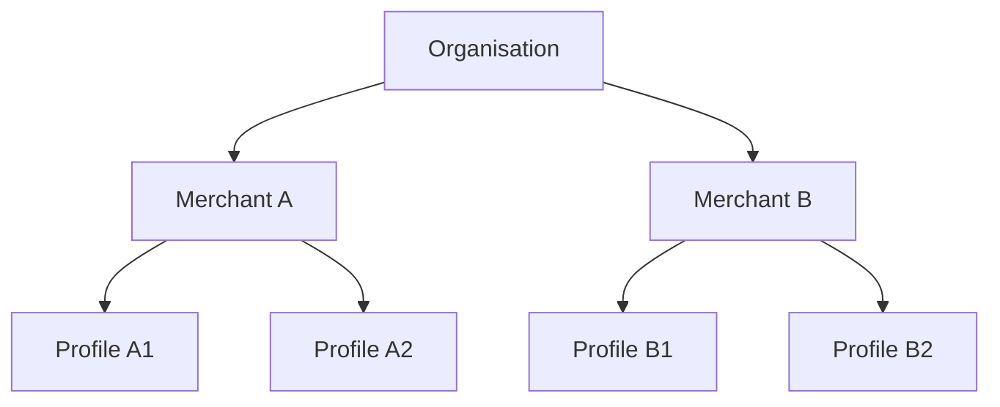
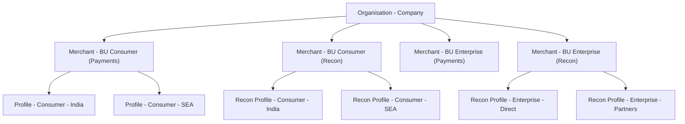
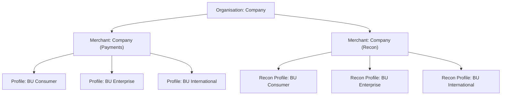
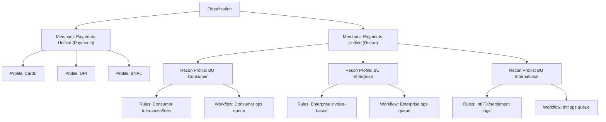
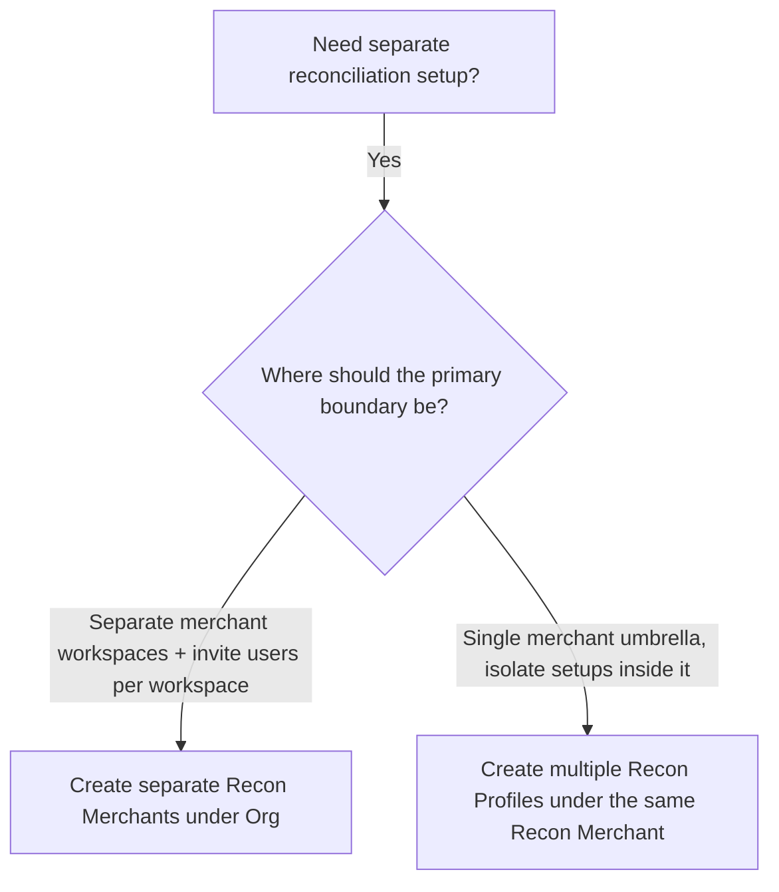

# Merchant & Profile Mapping in Recon

### Mapping Hyperswitch Org/Merchant/Profile to Recon

Hyperswitch is designed as a multi-tenant platform with a clear hierarchy:

* **Organisation (Org)**: Top-level container for your company/platform.\
  This is the parent boundary for all merchants, products, and users
* **Merchant**: A configurable account inside an organisation.\
  Merchants are used to represent **how you want to group configuration + operations + access**, for example by business unit, brand, geography, channel, team ownership
* **Profile**: A sub-unit under a merchant that can also act as an **independent configuration + operations boundary**\
  Profiles are used when you want **multiple isolated setups under the same merchant**, without creating additional merchants

Recon uses the same hierarchy so existing Hyperswitch users can adopt Recon without changing how they already think about structuring accounts and access

#### Core principle: **“Recon can be segmented at both Merchant and Profile levels — choose the level based on how you want to group configuration and user access.”**

In Recon:

1. **A Merchant account is the level at which the Recon product is enabled/mapped** (Recon is available under a Merchant within an Org)
2. **Isolation of reconciliation logic, rules, and setup can be achieved at either:**
   * **Merchant level** (by enabling Recon for multiple merchants / using multiple Recon merchants under the Org), or
   * **Profile level** (by creating multiple Recon profiles under the same Recon merchant)

So it’s not “merchant = boundary, profile = isolation”.\
It’s: **both can isolate** — the choice depends on what boundary you want for:

* **Configuration ownership** (who owns and manages setup)
* **User invites / access scope** (who you invite where, and what they can see/manage)

### What can be isolated (Merchant and Profile)

Whether you isolate via **separate merchants** or via **profiles**, Recon can isolate:

* reconciliation rules & matching logic
* tolerances (fees, rounding, FX differences)
* ingestion configuration (connectors, file formats, mappings)
* operational configuration (who sees/resolves what, exception ownership)

#### What differs when choosing Merchant vs Profile

The practical difference is mostly about:

* **Where you want the primary workspace boundary**
* **How you want to invite users and scope their access**
* **How closely you want to mirror your existing Hyperswitch structure**
* **Whether you want multiple “merchant workspaces” or one merchant umbrella with multiple isolated profiles**

### Two common setups, and how they map to Recon

#### Setup A: One Org, multiple Merchants (merchant-per-Business Unit) + Recon merchant adjacent

This setup is preferred when you want **separate merchant workspaces per Business Unit/segment**, primarily to control:

* **How users are invited** (Business Unit-level teams invited to their own merchant workspace)
* **How operational views are separated** (exceptions/reports owned and viewed per Business Unit)
* **How configs evolve independently** (each Business Unit can change rules/mappings/workflows without impacting others)

**Important:** This is not necessarily about legal entities.\
It’s about **workspace separation and access boundaries**.

#### Hyperswitch example

* Org = “Company”
* Merchant A = “BU: Consumer”
* Merchant B = “BU: Enterprise”
* Merchant C = “BU: International”

#### Recon mapping

Use the same structure:

* Each Business Unit gets its own **Payments merchant** and its own **Recon merchant**, both under the same Org (adjacent)
* Each Recon merchant can still have multiple profiles for deeper segmentation if needed

#### When Setup A is the best fit

Choose “merchant-per-Business-Unit” if you want:

* invite and manage users at a **merchant workspace** boundary
* separate Business Unit teams owning reconciliation independently
* lower risk of cross-team interference (each Business Unit isolated at merchant scope)

### **Setup B: One Org, one Payments merchant, business units as Profiles + Recon merchant adjacent**

This setup is preferred when you want:

* a shared Payments merchant workspace (simpler merchant management)
* but still want isolated reconciliation setups per **business unit** / segment using profiles
* finer segmentation without creating many merchants

Again, this is not a weaker isolation model — profiles still isolate rules, workflows, ingestion configuration, and operational ownership\
It’s simply isolation within a single merchant umbrella

**Hyperswitch example**

* **Org** = “Company”
* **Merchant** = “Company (Payments)”
* **Profiles**:
  * “Business unit: Consumer”
  * “Business unit: Enterprise”
  * “Business unit: International”

**Recon mapping**

* Keep one Payments merchant with multiple profiles
* Create one Recon merchant adjacent under the Org
* Create multiple Recon profiles under the Recon merchant for **business unit**-level isolation

#### When Setup B is the best fit

Choose “single merchant + multiple profiles” if you want:

* one shared umbrella for merchant management
* isolation of recon setup inside that umbrella using profiles
* simpler merchant sprawl management (fewer merchants)
* separation where it matters (rules, logic, workflows, ops ownership) at profile level

#### **Scenario C: Payments under one merchant, reconciliation separated (Recon profiles) + Recon merchant under Org**

This keeps the “payments unified” setup intact, while enabling **business unit**-level isolation in reconciliation

A common real-world driver here is:

* payments operations want one consolidated merchant for processing
* finance/ops teams want reconciliation separated by **business unit** / team / channel

## Practical guidance: how to decide Merchant vs Profile in Recon

#### Create separate Recon Merchants under the Org when you want:

* **merchant-level workspace boundaries** for teams
* to invite users and scope access per merchant workspace
* independent configuration lifecycle per segment (fewer coupling points)

#### Create multiple Recon Profiles under the same Recon Merchant when you want:

* one shared merchant umbrella, but multiple isolated recon setups
* profile-level separation for rules, workflows, ingestion, and ops ownership
* to avoid creating too many merchants while still getting isolation

### Decision diagram

