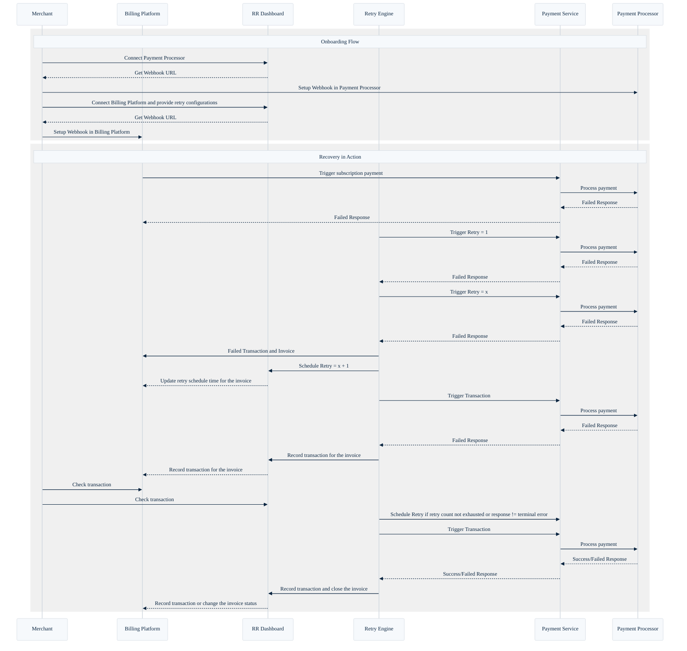

# Juspay Hyperswitch Revenue Recovery

Revenue Recovery module of Juspay Hyperswitch is designed to act as a failsafe for recurring payments. It seamlessly integrates with merchants' existing subscription management systems and performs intelligent retries to recover failed transactions. With minimal effort from merchants, Revenue Recovery delivers an uplift in authorization rates, helping businesses reduce churn, recover lost revenue, and maximize customer lifetime value.

## Why is Revenue Recovery Important?

For subscription-based businesses, involuntary churn from failed recurring payments can significantly impact revenue. Payment failures may result from insufficient funds, fraud checks, or issuer restrictions. A simple dunning setup is not effective in retrieving these failed payments. Revenue recovery's Intelligent retry engine analyzes 20+ transaction parameters to find best retry strategy to recover the given payment.

## Benefits for SaaS Businesses

1. **Reduced Passive Churn**: Intelligent retries ensure payments succeed on subsequent attempts, decreasing subscription cancellations.
2. **Seamless Integration**: Easily integrate with existing billing platforms or custom systems without reengineering the payment architecture.
3. **Data-Driven Recovery**: Leverage insights from transaction parameters like decline codes and issuer behaviors to tailor retry strategies.

## How Does Revenue Recovery Work?

### Integration

Merchants can configure Revenue Recovery entirely through the dashboard without writing any code. This configuration can be completed using the following three steps.
1. **Step 1:** Provide credentials for payment processors and set up our webhooks with these processors.
2. **Step 2:** Provide credentials for the subscription platform used and set up our webhook within this platform.
3. **Step 3:** Configure the recovery plan (retry budget, start retry after etc.)

### Recovery in action

Once the setup is complete, Revenue Recovery automatically begins monitoring transactions via webhook. When a failed transaction is detected, the system evaluates over 20 parameters to intelligently schedule a retry, aiming to recover the payment. These transactions are then recorded back into the subscription platform to avoid subscription cancellations.

## Key Features

* **Retry Optimization**:
  * Reduces time between retries, enhancing recovery speed.
* **Error Code Management**:
  * Maps issuer-specific decline codes to identify root causes.
  * Adapts retry strategies based on error categories (e.g., insufficient funds, fraud etc).
* **Integration with Existing Workflows**:
  * Enhances recovery rates without disrupting current dunning setups.
  * Supports integration with billing platforms for automation of payment recovery.
