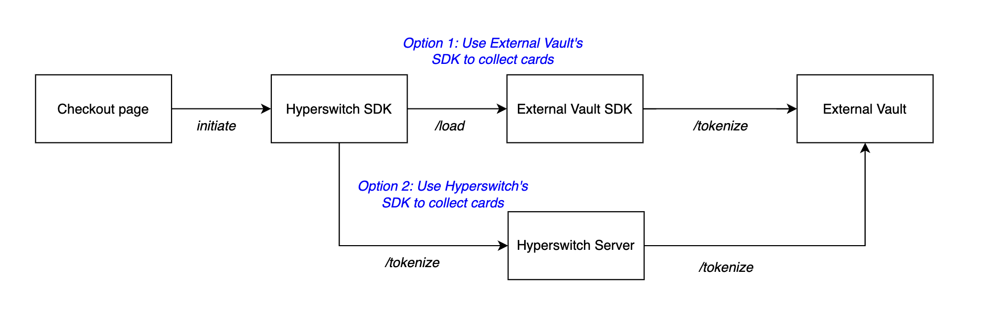
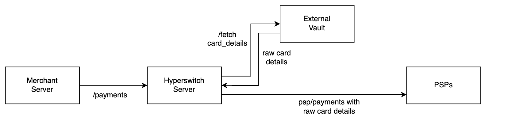

# Connect External Vaults to Hyperswitch Orchestration

### Introduction 

Merchants need flexible, secure, and scalable ways to store and manage sensitive customer data. But traditional vaulting systems come with limitations:

* **Vendor Lock-In:** Tied to specific PSPs, making it hard to switch or optimize routing.
* **Heavy Compliance Burden:** PCI DSS and GDPR requirements add cost and operational overhead.
* **Complex Integrations:** Migrating data or enabling new payment methods can be slow and risky.
* **Limited APM Support:** Most vaults are built for cards, not modern methods like wallets, BNPL, or bank transfers.

These issues impact merchants’ ability to scale, experiment, and deliver a seamless payment experience.

### Modular Vaulting in Hyperswitch

Hyperswitch addresses the challenges with traditional vaults through Modular Vaulting: a flexible, merchant-centric approach to payment data infrastructure that emphasizes control, interoperability, and security.

**Modular Vaulting** is a key component of Juspay’s payment system, offering merchants the flexibility to either use Hyperswitch’s built-in PCI-compliant vault with advanced tokenization and security features or connect to any third party vault provider. This flexibility enables businesses to start simple and scale confidently without re-architecting their entire system.

### Modular Vaulting Options 

Hyperswitch supports both an integrated vault as well as external vaults for merchants using Hyperswitch as their payments orchestration solution in both self-hosted and Juspay-hosted deployment modes.

### Integrated Vaults 

| **Challenges Addressed:** _PCI Compliance challenges, Integration Complexities and Data Migration Challenges_ |
| ------------------------------------------------------------------------------------------------------------- |

Hyperswitch’s Payments Orchestration comes bundled with an integrated vault in both Merchant Self-Hosted as well as Juspay Hosted versions. In both cases, merchants don’t need to enable any additional configurations to use these vaults.

In case of Self-Hosted integration vault, merchants would have to manage the PCI compliance strategy in-house while outsourcing PCI compliance to Juspay while using Juspay Hosted Vault.

### External Vaults 

Juspay’s Modular Payments architecture enables merchants to connect to external vaults. These external vaults could either be:

1. Third party vaults such as VGS, Voltage, Hashicorp, etc. in case of both Self-deployed and SaaS orchestration
2. Juspay Hosted Vault service in case of Self deployed Orchestration

### External Vaults - Juspay Hosted Vault 

| **Challenges Addressed:** _PCI Compliance challenges, Integration Complexities and Data Migration Challenges_ |
| ------------------------------------------------------------------------------------------------------------- |

Merchants using Hyperswitch’s Self Hosted Payments Orchestration solution have an option of outsourcing their PCI compliance to Juspay by opting to use Juspay’s Hosted Vault instead of the integrated vault.

You can read more about Juspay’s Hosted Vault’s capabilities [here](https://docs.hyperswitch.io/about-hyperswitch/payments-modules/vault).

#### Integrating Juspay Hosted Vault in your Self-hosted Hyperswitch Orchestration setup 

Reach out to us on our [Community Slack channel](https://inviter.co/hyperswitch-slack) or Email us (biz@hyperswitch.io) to enable this feature.

### External Vaults - Third Party Vaulting 

| **Challenges Addressed:** _Vendor Lock-in & Limited Portability, Integration Complexities and Data Migration Challenges_ |
| ------------------------------------------------------------------------------------------------------------------------ |

Through Hyperswitch, Merchants can deploy no-code connections to external vault providers such as VGS, HashiCorp, and Voltage, leveraging their SDKs to collect and tokenize cards. This ensures flexibility in vault selection while maintaining compliance, security, and seamless token management across multiple payment processors.

Also supports features such as:

* **Flexible Network Tokenization:** Merchants can configure Network Tokenization through either Juspay as TSP or use the External Vault as TSP, ensuring flexibility and control over token provisioning
* **Proxy Payments through External Vaults:** Support for processing payments through Proxy layers to ensure PCI compliance
* **Card Forwarding & Receiving**\
  To seamlessly transfer tokenized data across third-party endpoints, enabling effortless PSP migration

#### Supported Third Party Vaults  

Currently, we support connecting VGS as a third party external vault to your Hyperswitch Payments Orchestration setup. In case you have a need to connect to other external vaults, reach out to us (biz@hyperswitch.io) and we can add support for them in 2-3 weeks.

#### Integrating Third Party Vaults 

Reach out to us on our [Community Slack channel](https://inviter.co/hyperswitch-slack) or Email us (biz@hyperswitch.io) to enable this feature.

### **SDK Options for External Vaults**

In case of using External vaults, merchants also have the option to choose which SDK to use to collect payment method details from their customers.

<em><strong>Flexible External Vaulting with Choice of Vault SDK or Hyperswitch SDKs for Card Collection</strong></em>

1. **External Vault SDK:** The External Vault SDK is loaded on top of Hyperswitch Unified checkout SDK. Cards are collected by External Vault SDK and tokenized directly at External Vaults. This way, the card details do not pass through the Hyperswitch server

When processing payments via PSPs, the Hyperswitch server uses the proxy payments flow of external vaults to send vault tokens in the payment request. These tokens are replaced with raw card data by the external vault before the request is forwarded to the PSP.

<figure><figcaption></figcaption></figure>

<em><strong>Proxy payments after after collecting card details through External Vault SDK</strong></em>

Juspay Hosted Vault service also supports a proxy payments flow when configured as an external vault. \[[Learn about this here](hyperswitch-vault-pass-through-proxy-payments.md)]

2. **Hyperswitch Unified Checkout SDK:** Cards are collected by Hyperswitch Unified Checkout SDK, sent to Hyperswitch Server which then tokenizes them at External Vaults.

When processing payments through PSPs, the Hyperswitch server retrieves raw card details from the vault using vault tokens, and then sends the complete payment request to the PSP.

<em><strong>Direct payments using raw card details after collecting card details through Hyperswitch Unified Checkout SDK</strong></em>

