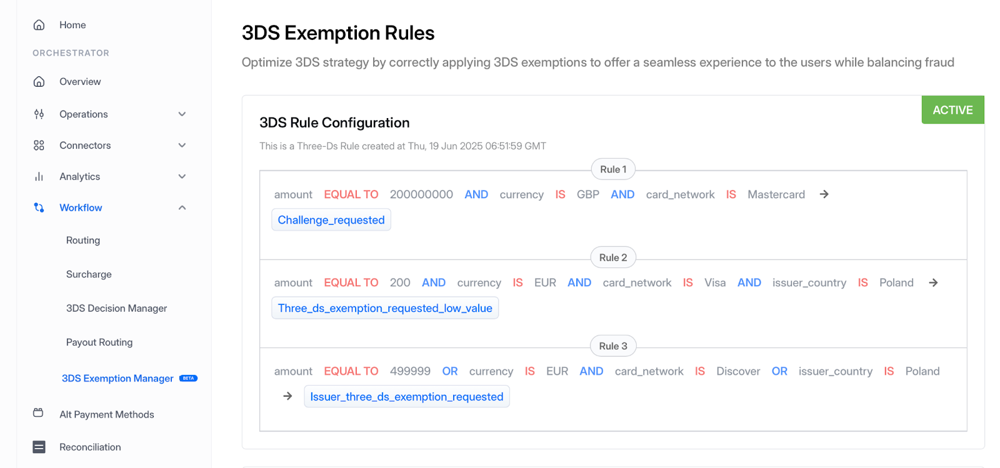

# 3DS Intelligence Engine

The **Juspay 3DS Intelligence Engine** is an advanced, data-driven decisioning system that enables merchants to optimize their authentication workflows. The 3DS intelligence engine performs a multi-faceted analysis of historical and real-time data, including authentication results, authorization outcomes, fraud signals, and chargeback information to determine the best route for each authentication request.

Some merchants have rich insights into authentication performance on their platforms. The Intelligence Engine leverages these insights by allowing merchant-defined rules and using advanced machine learning models to determine the best strategy for each transaction. It can recommend whether to use 3DS or not, and if using 3DS, whether to request an acquirer exemption (in EEA region). It also suggests the optimal acquirer to improve the chances of acquirer exemption approval. In markets where network tokens underperform compared to FPAN and vice versa, the engine identifies these trends and advises on the best rails to initiate the transaction.

The 3DS Intelligence Service is compatible with any 3DS provider and abstracting data to enable smart exemption decisions.

<details>

<summary>What are SCA Exemptions</summary>

In the world of 3DS powered transactions there exists concepts of **Exemptions** and **Challenges.** To know more about it, see this [blog](https://hyperswitch.io/blog/simplifying-acquirer-exemptions-in-PSD2-markets).

</details>

For merchants, managing 3DS authentications is a delicate balancing act. Too many exemptions can expose them to fraud and increase the risk of issuer distrust, while too many challenges introduce friction that hurts conversion. This becomes an important focal point of striking the right balance between security and user experience.

But one more complexity emerges after authentication. Even when a transaction is successfully authenticated, whether through exemption or challenge, it can still be declined at the authorization stage. This disconnect introduces a hidden cost: customers may face friction or gain a false sense of completion, only to have their payment fail. These post-authentication declines can quietly chip away at both revenue and customer trust. In this context, it's not just fraud rates or conversion rates that matter most—it's the **authorization rate** that determines whether a transaction leads to a successful sale. It becomes the true control variable that merchants must protect when designing their exemption and challenge strategies.

### Merchant Benefits

* **Balance user experience with fraud**: A merchant's 3DS exemption strategy should prioritize a holistic user experience, not just fraud prevention. The 3DS Intelligence engine analyzes various factors like customer behavior and device details to optimize authentication success while managing fraud and authorization failures.
* **Define custom rules to suit your business**: Merchants know their business best. Using their own insights, they can override 3DS Intelligence decisions by setting custom rules. The control center supports granular configuration across 22 parameters spanning payments, customer, acquirer, issuer, and more.
  * Some of the examples of these rules are:
    * If Issuer Country = "France" and Issuer = "HSBC" and Amount > 200 €, then ThreeDS Preference = "No Preference"
    * If Customer Device Screen Size = 150px\*200px or Customer Device Platform = "Android" and Card Network = "Visa", then ThreeDS Preference = "ThreeDS Exemption Requested" and ThreeDS Exemption Type Preference = "TRA"
    * If BIN range in between 400000 and 420000 and Customer Device = "Gaming Console" then ThreeDS Preference = "Challenge Requested"

<figure><figcaption></figcaption></figure>


*   **Advanced Analytics for Continuous Optimization:** As regulations, issuer behavior, and customer expectations evolve, merchants can analyze trends, refine rules, and boost approval rates. The Hyperswitch Control Center offers detailed insights into user journeys, exemption lifecycles, and top failure reasons, with the 3DS engine continuously learning and optimizing based on new data. \*

    ```
    <figure><figcaption><p>The Authentication Analytics page showing various metrics</p></figcaption></figure>
    ```

    \*

    ```
    <figure><figcaption><p>The Exemption Analytics page to guide the merchant with their exemption strategy</p></figcaption></figure>
    ```
* **Factor in authorization, fraud and chargeback data**: The engine allows merchants to integrate their authorization, fraud, and chargeback data, enabling more accurate, tailored decisions by combining global insights with merchant-specific context on customers, acquirers, and risk patterns.
* **3DS Provider Agnostic Engine** - The 3DS intelligence engine works with any 3DS provider. The merchant does not have to change their 3DS providers in order to benefit from the 3DS Intelligence engine.
* **Modularly usable** - The 3DS intelligence engine is a stand alone product that can be modularly used by the merchants. They can choose to plug in their 3DS provider to this engine to further optimize the authentication decision.

### The 3DS Intelligence Flow

<figure><figcaption></figcaption></figure>

The above flow diagram represents how the 3DS Intelligence Engine makes the exemption decision and how it is integrated in the transaction lifecycle. The steps involved are:

1\. Merchant sends Authentication Request to the 3DS Intelligence Engine.

2\. 3DS Intelligence Engine connects with the 3DS Server to collect real-time authentication data and augments it with other data.

3\. The 3DS Intelligence model runs and decides whether or not to request an exemption.

4\. Based on the decision in step 3, 3DS authentication is initiated with the 3DS Server.

5\. After 3DS Authentication (with or without exemption), the result is fed back to the 3DS Intelligence Engine.

6\. Merchant receives the authentication result.

7\. Merchant initiates and completes authorization with the preferred acquirer.

8\. Merchant sends the final payment result to the 3DS Intelligence Engine.

### Configuration of Custom Rules on Dashboard

#### How to configure Custom Rules for Exemptions?

A merchant has to first configure the 3DS Exemptions Rules in the [Hyperswitch Dashboard](https://app.hyperswitch.io/dashboard/home) by navigating to **Control Center (Dashboard) -> Workflow -> 3DS Exemption Rules.** Custom rules can be defined as per the merchant's own business requirements. The rules can be defined across 22 different parameters like Issuer Country, Customer Device Platform, Card Network, Acquirer providing a wide range of flexibility.

After configuring and saving the rules, merchants can test out our 3DS Intelligence Engine in the [demo playground](https://demostore3ds.netlify.app/) by running mock transactions and seeing the 3DS authentication results as defined by them.

This process is shown in the video below for further clarity.

{% embed url="https://files.gitbook.com/v0/b/gitbook-x-prod.appspot.com/o/spaces%2Fkf7BGdsPkCw9nalhAIlE%2Fuploads%2FXQTcHTQiPDVDzf12tlVj%2F3DS%20Demo.mp4?alt=media&token=3614e6bd-6980-4c9b-82ab-fccbcc8ea532" %}
A demo showcasing the Custom Defined Exemption rules

