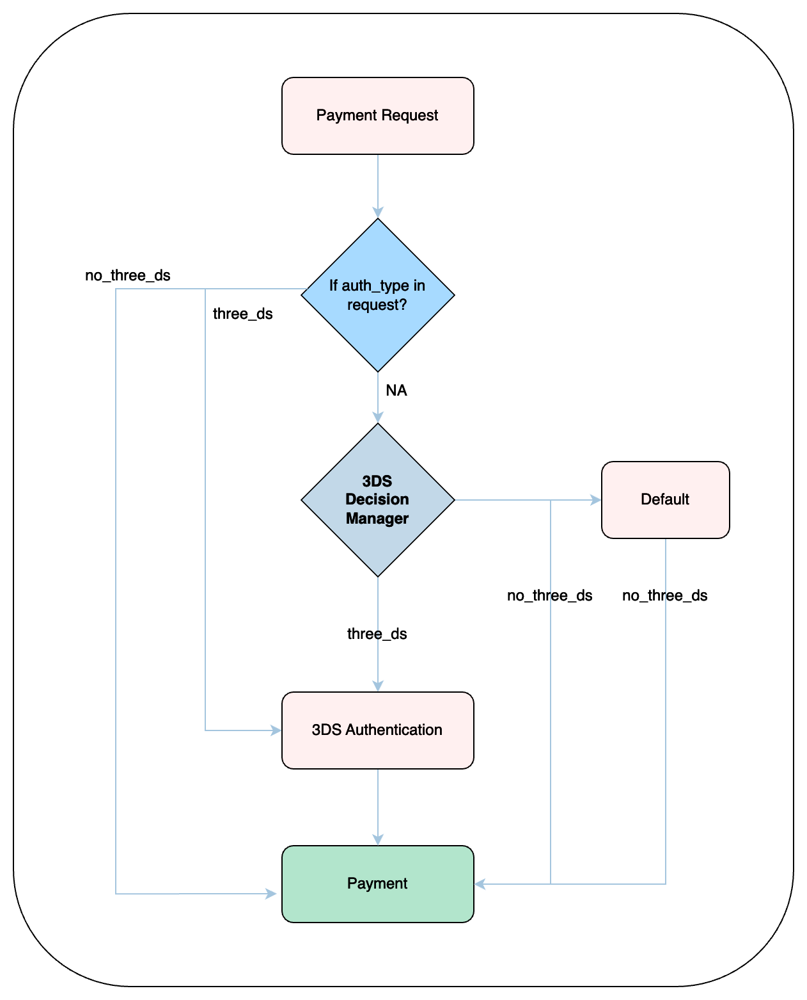

# 3DS Decision Manager


[3DS intelligence engine](./) is the latest upgrade to our 3DS workflows. Please refer to that section henceforth


### Benefits of Using the 3DS Decision Manager:

* Fraud Reduction: Enforce 3DS on high-risk transactions to mitigate fraudulent activities.
* Enhanced Compliance: Meet regulatory requirements for Strong Customer Authentication (SCA) in regions like the EEA.
* Improved Customer Experience: Apply 3DS only when necessary, minimizing friction during checkout for low-risk transactions.

Hyperswitch 3DS Decision Manager allows the merchant to configure advanced rules using various payment parameters such as amount, currency etc., to enforce 3D Secure authentication for card payments to reduce fraudulent transactions.



### 3DS Decision Flow:

Hyperswitch integrates with multiple payment processors, enabling seamless 3D Secure authentication.

<figure><figcaption>
3DS Decision Flow
</figcaption></figure>

The 3DS Decision Manager in the Hyperswitch Control Center provides merchants with a rule-based interface to enforce authentication selectively.

For example: If you wish to enforce 3DS for transactions over $100, you can define a rule that automatically sets `authentication_type` as `three_ds` for such transactions. Payments meeting this rule will trigger 3DS authentication.

<figure><figcaption></figcaption></figure>


* Rules set in the **3DS Decision Manager** can be overridden if an explicit value is passed in the `/payments` request using the `authentication_type` parameter. ([API Reference](https://api-reference.hyperswitch.io/v1/payments/payments--create#body-authentication-type))
* Some processors may mandate 3DS regardless of your configuration.

