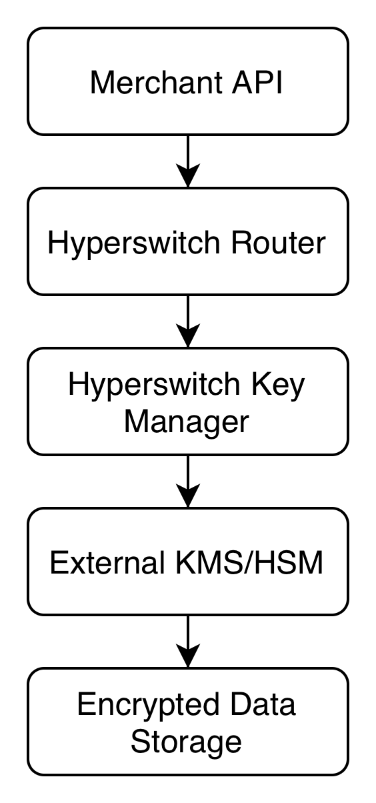

# Activating FRM in Hyperswitch

You can enable the FRM solution of your choice with few clicks and very minimal code changes. Below are the two scenarios for activating FRM within Hyperswitch.

#### Prerequisites

Before activation, ensure the following:

1. **Payment Method Information:** Required for configuration.
2. **FRM Solution Signup:** Obtain API keys from your selected FRM provider.

### Pre-Authorization Flow

The Pre-Auth flow is executed **before payment authorization** and is available for all payment methods. When a customer initiates a payment, transaction details are analyzed by the FRM solution to assess risk using parameters like historical behavior, location, transaction patterns, and device data.

1. **Goal:** Prevent fraudulent transactions before authorization.
2. **Steps:**
   1. Transaction details are sent to the FRM solution for analysis.
   2. Based on the FRM risk score or recommendation, below actions are taken:
      * **Continue on Accept:** Proceed with the transaction.
      * **Halt on Decline:** Mark the transaction as cancelled.
3. The merchant can influence the outcome of FRM by making changes on their dashboard, so that the FRM risk score or recommendation reflects their Risk appetite.    &#x20;

### Post-Authorization Flow

The Post-Auth flow occurs **after payment authorization** by the processor and is only available for Card payment methods. It serves as a second validation layer, analyzing the transaction using updated and historical data to detect potential fraud.

* **Goal:** Act as a safety net for suspicious transactions.
* **Steps:**
  1. Post-authorization details are sent to the FRM solution.
  2. Transactions flagged as fraudulent are queued for manual review with a status "Requires Merchant Action" on Hyperswitch.
  3. Merchants review on FRM dashboard and decide next steps on that transaction. Hyperswitch consumes the webhooks from the FRM to:
     * **Continue on Accept:** Continue with the transaction.
     * **Halt on Decline:** Mark the transaction as cancelled.
     * **Approve/Decline on Review:**
       * Hold the transaction in **manual review state**. Merchants can list and review such transactions.
       * **If approved:** Capture the payment.
       * **If declined:** Void the payment.


If the connector doesn’t support manual capture, Post-Authorization manual review should be avoided during configuration setup for the respective connector.


<figure><figcaption></figcaption></figure>

## FRM status and decisions

<figure><figcaption></figcaption></figure>

FRM connectors generally provide a decision based on rules or data models along with a risk score associated with the transaction. Some integrations require providing the model to be used explicitly. For example, Signifyd can be configured to respond with only scores or decision + scores, etc.

Fraud detection can be done via the below methods:

1. **Rules:** Uses a static set of rules for deciding on the outcome.
2. **Scores:** Uses a range of numbers for associating risk with the transaction.
3. **Decisions/Recommendations:** Uses ML data models for predicting and recommending the outcome. This flow is supported by Hyperswitch
4. **Chargeback Guarantee:** Uses ML data models for responding with a binary outcome (Accept vs Decline). This flow is supported by Hyperswitch

Currently, Hyperswitch offers the below integrations with the underlying FRM connector:

* **Signifyd:** Decision/Recommendation.
* **Riskified:** Chargeback guarantee.

## How to Get Started with Hyperswitch FRM Integration

1.  **Log in to Your Hyperswitch Account**

    * Access your [Hyperswitch account](https://app.hyperswitch.io/login).

    <figure><figcaption></figcaption></figure>
2. **Navigate to the 'Fraud & Risk' Tab**
   * Select the Fraud and Risk Management (FRM) processor you want to integrate.
3. **Configure Payment Methods and Actions**
   * Set up the payment methods and define preferred actions for each enabled payment method.
4. **Provide API Credentials**
   * Enter the API credentials for the selected FRM processor.
5. **Integrate and Test**
   * Access the [API Documentation](https://api-reference.hyperswitch.io/api-reference/payments/payments--create) to integrate the FRM API.
   * Start testing payments with fraud checks to ensure the setup works as expected.


[test-a-payment.md](../../../hyperswitch-open-source/account-setup/test-a-payment.md)


FAQs

**What are the prerequisites for integrating with the Hyperswitch FRM platform?**

Depending on your chosen FRM processor, you may need to pass additional parameters, such as order fulfillment data, via a webhook to Hyperswitch. Refer to the relevant documentation for detailed instructions.

**Can I adjust fraud prevention measures based on specific payment methods and connectors?**

Yes, the Hyperswitch FRM platform allows customization of fraud prevention strategies. You can configure pre-authorization and post-authorization checks for individual payment methods and processors, along with their corresponding actions.

