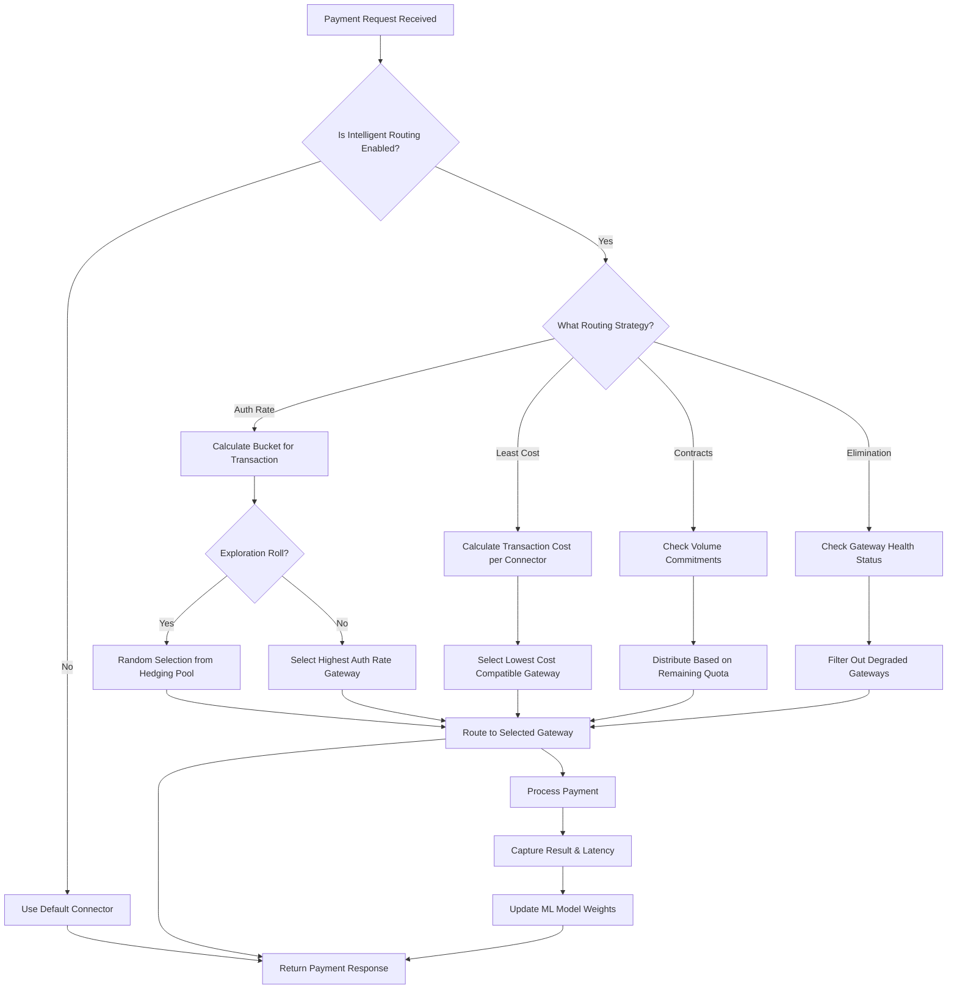

# Intelligent Routing

The Hyperswitch Intelligent Routing module augments your payment processing by dynamically switching between processors in real-time for every transaction to optimally maximise first attempt auth rates and minimise processing cost.

## Quick Start

Get started with Intelligent Routing in under 10 minutes:

### Prerequisites

- Active Hyperswitch account with API key
- At least two payment processors (connectors) configured
- Access to the Hyperswitch Control Center or API credentials

### Step 1: Verify Connector Setup

Ensure you have multiple connectors configured:

```bash
curl --location 'https://api.hyperswitch.io/account/merchant_12345/connectors' \
--header 'Accept: application/json' \
--header 'api-key: your_api_key'
```

Expected response: At least 2 active connectors with `status: "active"`.

### Step 2: Enable Intelligent Routing

Navigate to **Control Center → Routing → Intelligent Routing** and toggle the feature ON, or use the API:

```bash
curl --location 'https://api.hyperswitch.io/routing/intelligent' \
--header 'Content-Type: application/json' \
--header 'api-key: your_api_key' \
--data '{
  "routing_type": "auth_rate_based",
  "enabled": true,
  "default_fallback": "least_cost"
}'
```

### Step 3: Test Your Configuration

Send a test payment and verify routing is active:

```bash
curl --location 'https://api.hyperswitch.io/payments' \
--header 'Content-Type: application/json' \
--header 'api-key: your_api_key' \
--data '{
  "amount": 1000,
  "currency": "USD",
  "customer_id": "cust_test_001",
  "routing": {
    "type": "intelligent",
    "strategy": "auth_rate_based"
  },
  "payment_method": "card",
  "payment_method_type": "credit"
}'
```

### Step 4: Monitor Results

Check the routing decision in the payment response:

```json
{
  "payment_id": "pay_abc123",
  "status": "succeeded",
  "routing_decision": {
    "strategy": "auth_rate_based",
    "selected_connector": "stripe",
    "reason": "highest_auth_rate_for_visa",
    "confidence_score": 0.94
  }
}
```

---

## Types of Intelligent Routing

Hyperswitch supports four intelligent routing strategies:

| Strategy | Best For | Primary Metric | Complexity |
|----------|----------|----------------|------------|
| **Auth Rate Based** | Maximizing success rates | Authorization rate (%) | Medium |
| **Least Cost** | Minimizing fees | Transaction cost | Low |
| **Elimination** | Handling outages | Error rate / downtime | Low |
| **Contracts-Based** | Meeting volume commitments | Volume distribution | High (BETA) |

### Auth Rate Based Routing

Uses real-time success rates and ML-driven optimisation to route transactions to the best-performing gateway.

The Auth Rates for the payments are tracked at a granular level of payment parameters like payment method, payment method type, amount, currency, authentication type, card network etc.

#### The Multi-Armed Bandit Model

The Auth Rate Based Routing uses a **Multi-Armed Bandit (MAB)** problem with Delayed Feedback, where each Gateway is an "arm" with fluctuating success rates and varying latency for success and failure. The approach used to solve this problem is driven by **explore-exploit** strategy.

**Exploration:** We continuously evaluate all gateways by sending a small percentage of traffic to ensure up-to-date performance data.

**Exploitation:** We continuously route most traffic to the best-performing Gateway to maximise the overall success rate.

#### Bucket Sizes and Hedging Percentage

The sensitivity of the system can be tweaked by configuring settings such as **Bucket Sizes**, **Parameters to be considered**, and **Hedging Percentage**.

##### Bucket Sizes

Bucket sizes define how transactions are grouped for statistical analysis. Smaller buckets provide more granular routing but require more data to become statistically significant.

| Bucket Size | Description | Recommended Use Case |
|-------------|-------------|---------------------|
| **Small** | Groups by [Card Network, Currency, Amount Range] | High-volume merchants (1000+ daily transactions) |
| **Medium** | Groups by [Card Network, Currency] | Medium-volume merchants (100-1000 daily transactions) |
| **Large** | Groups by [Card Network only] | Low-volume merchants (<100 daily transactions) |

**Configuration Example:**

```json
{
  "auth_rate_routing": {
    "bucket_configuration": {
      "type": "medium",
      "parameters": ["card_network", "currency", "amount_bucket"]
    }
  }
}
```

##### Hedging Percentage

The hedging percentage decides the exploration factor of the model. It represents the percentage of traffic that is randomly distributed across all available gateways to gather performance data, rather than being routed to the currently best-performing gateway.

| Hedging % | Exploration | Recommended Scenario |
|-----------|-------------|---------------------|
| **5%** | Low | Stable gateway performance, mature routing setup |
| **10%** | Medium (Default) | Balanced exploration and exploitation |
| **15%** | High | New gateway integrations, fluctuating performance |
| **20%+** | Very High | Testing phase, new market entry |

**Note:** Higher hedging percentages may temporarily reduce overall authorization rates as more traffic is sent to sub-optimal gateways for data collection.

#### Auth Rate Routing Deep Dive

##### Decision Flow



##### Model Update Frequency

The Auth Rate model updates in real-time with the following characteristics:

| Update Type | Frequency | Description |
|-------------|-----------|-------------|
| **Immediate** | Per-transaction | Success/failure recorded instantly |
| **Weight Update** | Every 50 transactions | Gateway weights recalculated |
| **Bucket Refresh** | Every 5 minutes | Statistical aggregates updated |
| **Full Model Retrain** | Daily | Complete optimization sweep |

##### Delayed Feedback Handling

In payment processing, feedback (success/failure) can arrive seconds to minutes after the routing decision. The MAB model handles this through:

1. **Pending Queue:** Tracks transactions awaiting outcome
2. **Time-Decayed Weighting:** Recent outcomes weighted more heavily
3. **Confidence Intervals:** Accounts for uncertainty in delayed responses

### Least Cost Routing

Picks the least cost network for every transaction based on the availability of **card network routing** (the network logos printed on the back of physical cards, such as Visa, Mastercard, Amex) and processor compatibility.

#### Cost Calculation Methodology

The total cost per transaction is calculated as:

```
Total Cost = Interchange Fee + Network Fee + Processor Fee + Additional Fees
```

Where:
- **Interchange Fee:** Set by card networks (typically 1.4% - 2.4% + fixed amount)
- **Network Fee:** Card network assessment fees (typically 0.1% - 0.15%)
- **Processor Fee:** Gateway-specific markup
- **Additional Fees:** Cross-border, 3DS, risk scoring, etc.

**Configuration Example:**

```json
{
  "least_cost_routing": {
    "enabled": true,
    "cost_threshold_percent": 0.5,
    "exclude_connectors_with_surcharge": true,
    "preferred_networks": ["visa", "mastercard"]
  }
}
```

### Elimination Routing

Tracks acute incidents such as downtimes and technical errors to de-prioritise gateways. This is used as a **final check** after other routing logics are applied.

#### Threshold Definitions

| Metric | Threshold | Action |
|--------|-----------|--------|
| **Error Rate** | > 30% in 5-minute window | Temporary elimination (10 min) |
| **Timeout Rate** | > 20% in 5-minute window | Temporary elimination (15 min) |
| **Hard Decline Spike** | > 50% increase vs baseline | Flag for review |
| **Complete Outage** | 100% failure for 2+ minutes | Immediate elimination |

#### Recovery Process

1. **Automatic Recovery:** Gateways are gradually re-introduced after elimination period
2. **Health Check Validation:** API health checks must pass before re-enabling
3. **Progressive Traffic:** Traffic increases from 1% → 10% → 50% → 100%

### Contracts-Based Routing (BETA)

Distributes payments across processors to meet contractual volume commitments.

#### BETA Limitations

⚠️ **This feature is in BETA. The following limitations apply:**

| Limitation | Description | Workaround |
|------------|-------------|------------|
| **Volume Commitment Format** | Only supports monthly volume commitments | Set up multiple monthly entries for quarterly agreements |
| **Overage Handling** | No automatic overage detection or alerts | Monitor via dashboard and adjust manually |
| **Real-time Balancing** | Updates every 15 minutes, not truly real-time | Use Auth Rate routing for time-sensitive payments |
| **Multi-currency** | Volume tracked in primary currency only | Set up separate contracts per currency |
| **Rollback** | Cannot automatically revert over-committed volumes | Manual intervention required |

#### Configuration Example

```json
{
  "contracts_based_routing": {
    "enabled": true,
    "contracts": [
      {
        "connector": "stripe",
        "monthly_commitment": 1000000,
        "currency": "USD",
        "overage_tolerance_percent": 5
      },
      {
        "connector": "adyen",
        "monthly_commitment": 500000,
        "currency": "USD",
        "overage_tolerance_percent": 10
      }
    ],
    "rebalancing_interval_minutes": 15,
    "priority": "meet_commitment_first"
  }
}
```

---

## Configuration Reference

### API Endpoints

#### Get Current Routing Configuration

```http
GET /routing/intelligent
Authorization: Bearer {api_key}
```

**Response:**

```json
{
  "merchant_id": "merchant_12345",
  "enabled": true,
  "default_strategy": "auth_rate_based",
  "strategies": {
    "auth_rate_based": {
      "enabled": true,
      "bucket_type": "medium",
      "hedging_percentage": 10,
      "parameters": ["card_network", "currency", "amount_bucket"]
    },
    "least_cost": {
      "enabled": true,
      "cost_threshold_percent": 0.5
    },
    "elimination": {
      "enabled": true,
      "auto_recovery": true
    },
    "contracts_based": {
      "enabled": false,
      "beta_feature": true
    }
  },
  "priority_order": ["contracts_based", "auth_rate_based", "least_cost", "elimination"]
}
```

#### Update Routing Configuration

```http
POST /routing/intelligent
Content-Type: application/json
Authorization: Bearer {api_key}
```

**Request Body:**

```json
{
  "enabled": true,
  "default_strategy": "auth_rate_based",
  "strategies": {
    "auth_rate_based": {
      "enabled": true,
      "bucket_type": "medium",
      "hedging_percentage": 10
    },
    "least_cost": {
      "enabled": true,
      "cost_threshold_percent": 0.5
    }
  }
}
```

#### Get Routing Decision for Payment

```http
POST /routing/evaluate
Content-Type: application/json
Authorization: Bearer {api_key}
```

**Request Body:**

```json
{
  "amount": 10000,
  "currency": "USD",
  "payment_method": "card",
  "card_network": "visa",
  "customer_id": "cust_123"
}
```

**Response:**

```json
{
  "selected_connector": "stripe",
  "strategy": "auth_rate_based",
  "reason": "highest_auth_rate_for_visa_usd",
  "confidence": 0.94,
  "alternatives": [
    {"connector": "adyen", "confidence": 0.89},
    {"connector": "checkout", "confidence": 0.82}
  ]
}
```

### Required Permissions/Scopes

| Endpoint | Required Scope | Description |
|----------|----------------|-------------|
| `GET /routing/intelligent` | `routing:read` | View routing configuration |
| `POST /routing/intelligent` | `routing:write` | Modify routing configuration |
| `POST /routing/evaluate` | `routing:read` | Preview routing decision |
| `GET /routing/analytics` | `analytics:read` | View routing performance data |

---

## Monitoring and Observability

### Key Metrics to Track

#### Per Routing Strategy

| Metric | Description | Target | Alert Threshold |
|--------|-------------|--------|-----------------|
| **Auth Rate** | % of successful authorizations | > 85% | < 80% |
| **Routing Efficiency** | % of payments routed optimally | > 90% | < 85% |
| **Exploration Ratio** | % of traffic in hedging pool | 10% | > 20% or < 5% |
| **Model Latency** | Time to make routing decision | < 50ms | > 100ms |
| **Gateway Switch Rate** | % of payments switching gateways | < 15% | > 25% |

#### Per Gateway

| Metric | Description | Alert Threshold |
|--------|-------------|-----------------|
| **Success Rate** | Authorization success % | < 70% |
| **Error Rate** | Technical failure % | > 10% |
| **Timeout Rate** | Request timeout % | > 5% |
| **Latency P95** | 95th percentile response time | > 3s |
| **Volume Share** | % of total routed traffic | Sudden ±20% change |

### Dashboards

Access the Intelligent Routing dashboard at **Control Center → Analytics → Routing Performance**.

#### Available Views

1. **Overview:** High-level routing performance across all strategies
2. **Gateway Comparison:** Side-by-side gateway performance metrics
3. **Bucket Analysis:** Deep dive into bucket-level auth rates
4. **Model Health:** Exploration/exploitation balance and model confidence
5. **Cost Analysis:** Breakdown of processing costs by gateway

### Webhook Events

Subscribe to routing-related events:

```json
{
  "webhook_url": "https://your-domain.com/webhooks/hyperswitch",
  "events": [
    "routing.decision_made",
    "routing.gateway_eliminated",
    "routing.model_updated",
    "routing.threshold_breached"
  ]
}
```

#### Event Payload Examples

**routing.decision_made:**

```json
{
  "event_type": "routing.decision_made",
  "timestamp": "2024-01-15T10:30:00Z",
  "data": {
    "payment_id": "pay_abc123",
    "selected_connector": "stripe",
    "strategy": "auth_rate_based",
    "bucket_id": "visa_usd_medium",
    "confidence_score": 0.94,
    "alternatives_considered": ["adyen", "checkout"]
  }
}
```

**routing.gateway_eliminated:**

```json
{
  "event_type": "routing.gateway_eliminated",
  "timestamp": "2024-01-15T10:35:00Z",
  "data": {
    "connector": "adyen",
    "reason": "high_error_rate",
    "threshold_breached": 0.35,
    "elimination_duration_minutes": 10,
    "auto_recovery_enabled": true
  }
}
```

### Logging

Enable detailed routing logs for debugging:

```json
{
  "logging": {
    "routing_decisions": "verbose",
    "model_updates": "info",
    "bucket_calculations": "debug"
  }
}
```

---

## Troubleshooting Guide

### Common Issues

#### Issue: All Payments Routing to Single Gateway

**Symptoms:**
- 100% of traffic going to one connector despite multiple being configured
- No exploration traffic observed

**Possible Causes & Solutions:**

| Cause | Solution |
|-------|----------|
| Hedging percentage set to 0% | Update configuration to 5-15% |
| Other gateways eliminated | Check elimination status in dashboard |
| Auth rate data stale | Wait for model update or force refresh |
| Bucket configuration too restrictive | Increase bucket size |

**Diagnostic Commands:**

```bash
# Check gateway status
curl --location 'https://api.hyperswitch.io/routing/gateways/status' \
--header 'api-key: your_api_key'

# Check model state for specific bucket
curl --location 'https://api.hyperswitch.io/routing/model?bucket=visa_usd' \
--header 'api-key: your_api_key'
```

#### Issue: Lower Auth Rate Than Expected

**Symptoms:**
- Authorization rates below baseline
- Model appears to make poor routing decisions

**Possible Causes & Solutions:**

| Cause | Solution |
|-------|----------|
| Insufficient data volume | Wait for 100+ transactions per bucket |
| Hedging percentage too high | Reduce to 5-10% |
| Incorrect bucket configuration | Match bucket size to transaction volume |
| External factors (network issues) | Check gateway health independently |

#### Issue: Routing Latency Too High

**Symptoms:**
- Payment processing delayed
- Routing decision timeout errors

**Possible Causes & Solutions:**

| Cause | Solution |
|-------|----------|
| Complex bucket calculations | Simplify bucket parameters |
| Too many gateways evaluated | Limit to top 3-5 connectors |
| Model cache miss | Enable persistent model caching |

#### Issue: Contracts-Based Routing Over-Committing

**Symptoms:**
- Volume exceeding contractual commitments
- Unexpected overage charges

**Solutions:**
1. Reduce the `overage_tolerance_percent` in configuration
2. Enable alerts at 80% of commitment
3. Manually adjust traffic distribution via dashboard
4. Contact support to adjust commitment tracking

### Error Codes

| Error Code | Description | Resolution |
|------------|-------------|------------|
| `ROUTING_001` | No eligible gateways found | Check connector status and elimination rules |
| `ROUTING_002` | Model update failed | Retry or contact support |
| `ROUTING_003` | Invalid bucket configuration | Review and correct bucket parameters |
| `ROUTING_004` | Hedging percentage out of range | Set value between 0-50 |
| `ROUTING_005` | Contracts configuration invalid | Verify commitment values are positive |
| `ROUTING_006` | Routing decision timeout | Simplify configuration or reduce gateways |

### Debug Mode

Enable debug mode for detailed routing logs:

```bash
# Enable for single payment
curl --location 'https://api.hyperswitch.io/payments' \
--header 'Content-Type: application/json' \
--header 'api-key: your_api_key' \
--data '{
  "amount": 1000,
  "currency": "USD",
  "routing_debug": true
}'
```

This adds a `routing_debug` object to the response with:
- All gateways evaluated
- Score for each gateway
- Bucket assignment
- Model version used

### Support Escalation

If issues persist:

1. **Gather diagnostics:**
   ```bash
   # Export routing configuration
   curl --location 'https://api.hyperswitch.io/routing/intelligent/export' \
   --header 'api-key: your_api_key' > routing_config.json
   ```

2. **Capture recent decisions:**
   ```bash
   # Get last 100 routing decisions
   curl --location 'https://api.hyperswitch.io/routing/decisions?limit=100' \
   --header 'api-key: your_api_key' > routing_decisions.json
   ```

3. **Contact support** with:
   - Merchant ID
   - Time range of issue
   - Exported configuration
   - Sample payment IDs affected

---

## Architecture Diagram

<figure><figcaption><p>Intelligent Routing Architecture Overview</p></figcaption></figure>

### Component Labels

| Component | Description |
|-----------|-------------|
| **Payment Request** | Incoming transaction to be routed |
| **Router Engine** | Core decision-making service |
| **MAB Model** | Multi-Armed Bandit algorithm implementation |
| **Bucket Calculator** | Assigns transactions to statistical buckets |
| **Gateway Health Monitor** | Tracks gateway availability and performance |
| **Cost Calculator** | Computes processing costs per gateway |
| **Contracts Manager** | Tracks and enforces volume commitments |
| **Feedback Loop** | Captures outcomes to update models |

---

## Self Deployment

<table data-view="cards"><thead><tr><th></th><th data-hidden data-card-cover data-type="files"></th><th data-hidden data-card-target data-type="content-ref"></th></tr></thead><tbody><tr><td>Self Deploy the Routing Engine</td><td><a href="../../../.gitbook/assets/image (157).png">image (157).png</a></td><td><a href="self-deployment-guide.md">self-deployment-guide.md</a></td></tr><tr><td>Using Auth Rate based Routing for Hyperswitch</td><td><a href="../../../.gitbook/assets/tryHyperswitch.jpg">tryHyperswitch.jpg</a></td><td><a href="auth-rate-based-routing.md">auth-rate-based-routing.md</a></td></tr></tbody></table>

---

## FAQ

**Q: How long does it take for the model to learn optimal routing?**

A: For medium bucket size with 10% hedging, expect 100-200 transactions per bucket for initial optimization. Full convergence typically occurs within 24-48 hours of normal transaction volume.

**Q: Can I use multiple routing strategies together?**

A: Yes. Configure priority order in your settings. Common patterns: Contracts-Based (priority 1) → Auth Rate (priority 2) → Elimination (final check).

**Q: What happens if all gateways are eliminated?**

A: The system falls back to the default connector configured in your merchant settings. You can also configure a secondary fallback.

**Q: How do I exclude a specific gateway from intelligent routing?**

A: Set the gateway status to `manual_only` or configure a 0% weight in the routing configuration.

**Q: Is there additional cost for using Intelligent Routing?**

A: Intelligent Routing is included in standard Hyperswitch pricing. No additional per-transaction fees apply.

---

## Related Documentation

- [Self Deployment Guide](self-deployment-guide.md)
- [Auth Rate Based Routing Deep Dive](auth-rate-based-routing.md)
- [Connector Configuration](../connectors/README.md)
- [Payment Methods](../payment-suite-1/payment-method-card/README.md)
- [Webhooks Configuration](../../webhooks.md)
