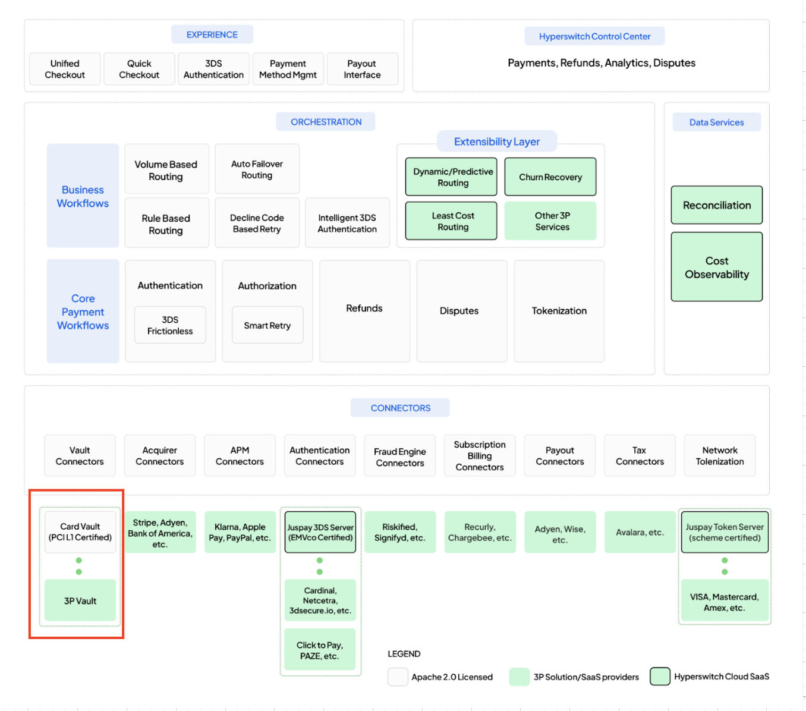

# Vault

Hyperswitch offers flexible vault deployment options to suit different merchant PCI profiles and hosting preferences. Whether you’re self-hosting Hyperswitch with your own PCI setup or leveraging the fully managed SaaS orchestration layer, Hyperswitch’s modular vault architecture adapts seamlessly to your compliance boundary.\
\
This section outlines the various Vault Flavors supported by Hyperswitch - covering self-hosted and SaaS environments, in-house and outsourced PCI models, and integrations with Juspay-hosted or third-party vaults such as VGS and Tokenex. Each model includes sequence diagrams, supported feature sets, and references to relevant configuration guides.

### Vault Architecture & Deployment Models

<table data-header-hidden><thead><tr><th width="152.29901123046875">Merchant Profile</th><th>Hosting Type</th><th>Vault Option</th><th>PCI Responsibility</th><th>Example Use Case</th></tr></thead><tbody><tr><td><strong>Merchant Profile</strong></td><td><strong>Hosting Type</strong></td><td><strong>Vault Option</strong></td><td><strong>PCI Responsibility</strong></td><td><strong>Example Use Case</strong></td></tr><tr><td><a href="saas-orchestration-with-juspay-vault.md">SaaS orchestration + Juspay vault</a></td><td>Juspay hosts Hyperswitch orchestration</td><td>Juspay hosted vault</td><td>PCI handled by Juspay</td><td>Enterprise or mid-scale merchants using Hyperswitch SaaS</td></tr><tr><td><a href="saas-orchestration-with-third-party-vault.md">SaaS orchestration + third-party vault</a></td><td>Juspay hosts Hyperswitch orchestration</td><td>Third-party vault or vault + SDK</td><td>PCI shared with external vault provider</td><td>Merchants already invested in external token vaults</td></tr><tr><td><a href="self-hosted-and-in-house-pci.md">Self-hosted &#x26; in-house PCI</a></td><td>Merchant hosts Hyperswitch orchestration</td><td>Native vault within self deployed Hyperswitch</td><td>Merchant manages PCI DSS compliance</td><td>Large enterprise merchants with full PCI scope</td></tr><tr><td>Self-hosted &#x26; outsourced PCI <em>(similar to SaaS with 3rd party vault)</em></td><td>Merchant hosts Hyperswitch orchestration</td><td>Juspay hosted vault + SDK or third-party vault + SDK (VGS, Tokenex) </td><td>PCI outsourced to third-party provider</td><td>Merchants who want control over orchestration but offload PCI</td></tr><tr><td><a href="../../../about-hyperswitch/payment-suite-1/payment-method-card/proxy.md">Vaulting &#x26; outsourced PCI</a></td><td>-</td><td>Juspay hosted vault + SDK</td><td>PCI handled by Juspay</td><td>Merchants looking for unified token vault with Proxy API</td></tr></tbody></table>

### Modular vaulting in Hyperswitch

Modular Vaulting is a key component of Juspay’s payment system, offering merchants the flexibility to either use Hyperswitch’s built-in PCI-compliant vault with advanced tokenization and security features or connect to any third party vault provider. This flexibility enables businesses to start simple and scale confidently without re-architecting their entire system.

