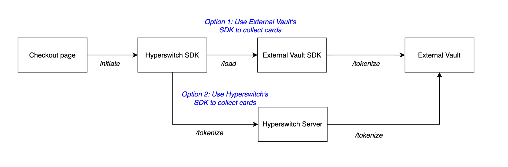

# Connect External Vaults to Hyperswitch Orchestration

### Modular Vaulting in Hyperswitch

Hyperswitch addresses the challenges with traditional vaults through Modular Vaulting: a flexible, merchant-centric approach to payment data infrastructure that emphasizes control, interoperability, and security.

Modular Vaulting is a key component of Juspay’s payment system, offering merchants the flexibility to either use Hyperswitch’s built-in PCI-compliant vault with advanced tokenization and security features or connect to any third party vault provider. This flexibility enables businesses to start simple and scale confidently without re-architecting their entire system.

### Modular Vaulting Options 

Hyperswitch supports both an integrated vault as well as external vaults for merchants using Hyperswitch as their payments orchestration solution in both self-hosted and Juspay-hosted deployment modes.

### Integrated Vault 

Hyperswitch’s Payments Orchestration comes bundled with an integrated vault in both Merchant Self-Hosted as well as Juspay Hosted versions. In both cases, merchants don’t need to enable any additional configurations to use the Vault. It addresses PCI Compliance challenges, Integration Complexities and Data Migration Challenges

### External Vault 

Juspay’s Modular Payments architecture enables merchants to connect to [external vault](https://juspay.io/integrations). This external vault could either be:

1. [Juspay Hosted Vault + SDK](../../../about-hyperswitch/payment-suite-1/payment-method-card/proxy.md) as a standalone solution
2. Third party vaults such as VGS, Tokenex, Voltage, Hashicorp, etc. in case of both SaaS and Self-deployed orchestration

#### Juspay Hosted Vault 

Merchants can outsource their PCI compliance to Juspay by opting to use [Juspay’s Hosted Vault + SDK ](../../../about-hyperswitch/payment-suite-1/payment-method-card/proxy.md)as a standalone solution.

#### Third Party Vault 

Through Hyperswitch, Merchants can add [external vault providers](https://juspay.io/integrations) such as VGS, HashiCorp, and Voltage, leveraging their SDKs to collect and tokenize cards. This ensures flexibility in vault selection while maintaining compliance, security, and seamless token management across multiple payment processors. Additionally, we also support other extended features vai an external vault such as:

* Network Tokenization - Merchants can configure Network Tokenization through either Juspay as TSP or use the External Vault as TSP, ensuring flexibility and control over token provisioning
* Proxy Payments through External Vaults - Support for processing payments through Proxy layers to ensure PCI compliance
* Card Forwarding & Receiving - To seamlessly transfer tokenized data across third-party endpoints, enabling effortless PSP migration

**SDK Options for Third Party Vault**

In case of using External vaults, merchants also have the option to choose which SDK to use to collect payment method details from their customers.

<em>Flexible External Vaulting with Choice of Vault SDK or Hyperswitch SDKs for Card Collection</em> 

1. Hyperswitch Unified Checkout SDK - Cards are collected via the Hyperswitch Unified Checkout SDK and sent to the Hyperswitch server, which tokenizes them in an external vault. When processing payments, the Hyperswitch server retrieves the raw card details using the vault token and forwards the complete payment request to the PSP.
2. External Vault SDK - The External Vault SDK can be loaded on the Hyperswitch Unified Checkout SDK or independently. Cards are captured and tokenized directly in the external vault, bypassing  Hyperswitch server. For payments, the Hyperswitch server sends vault tokens via the vault’s proxy flow, and the external vault de-tokenizes and forwards the request to the PSP.
